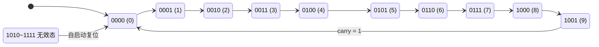
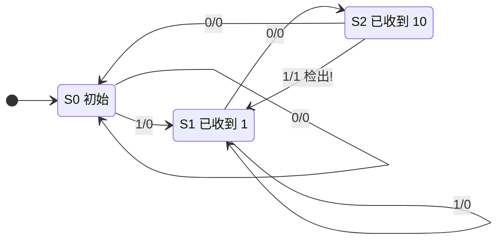
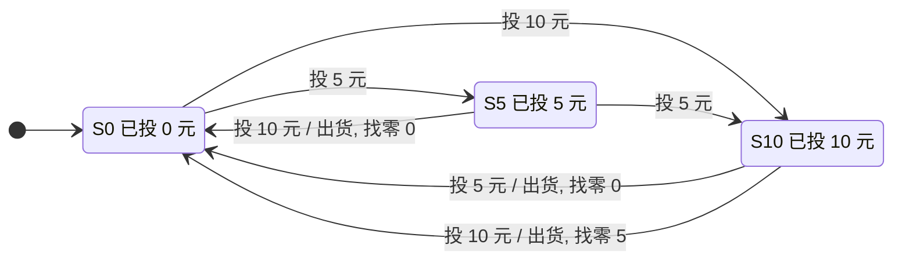
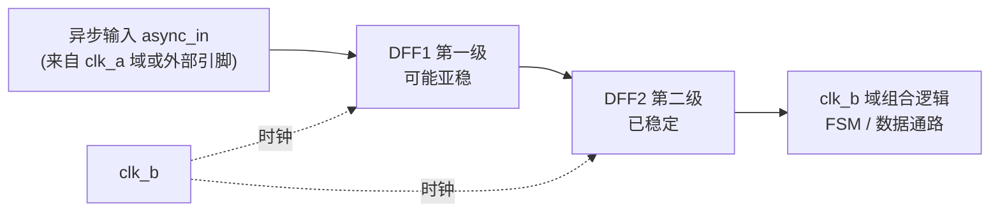
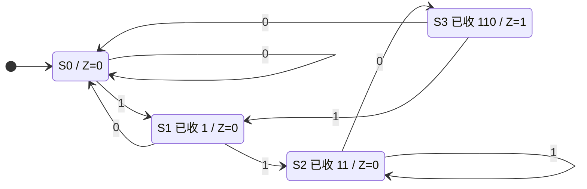

# 数字电子技术

> 从 0 和 1 出发，理解一切数字系统（CPU、GPU、AI 加速器）的硬件基石：逻辑门、组合电路、时序电路与状态机。

## 0. AI 时代为什么还要学数电

很多同学会问：大模型都能写代码了，为什么还要学数字电子技术？答案很直接——AI 的一切计算最终都发生在数字电路上。GPU 里数以万计的乘加单元（MAC）、Google TPU 中的脉动阵列、各类 NPU 里的加法树与移位器，本质上都是本课程要讲的加法器、寄存器、多路选择器和有限状态机的规模化组合。

理解数电，你才能回答这些 AI 时代的核心问题：为什么 INT8 量化能让推理快几倍（更窄的数据通路意味着更小的加法器与更低的功耗）？为什么访存比计算更耗能（SRAM/DRAM 的电路结构决定了读写代价）？为什么 FPGA 能做低延迟推理（可编程逻辑块本质是查找表 LUT，而 LUT 就是一块小 ROM）？时钟频率为什么上不去（触发器建立/保持时间与组合逻辑延迟共同决定了关键路径）？

此外，AI 正在反过来改造芯片设计：谷歌用强化学习做芯片布局布线，大模型辅助生成 Verilog 代码。要驾驭这些工具、判断其输出是否正确，你必须先懂数字电路的基本原理。数电是软件世界与物理世界的接口层——学懂它，向下能看穿硬件，向上能优化软件。这门课不是"造轮子"，而是给你一副看透计算本质的 X 光眼镜。

## 1. 数制与编码

### 知识要点

| 主题 | 要点 |
| --- | --- |
| 进位计数制 | 二进制、八进制、十进制、十六进制及相互转换 |
| 二进制算术 | 加减乘除、溢出概念 |
| 有符号数 | 原码、反码、补码；补码统一了加减法 |
| BCD 码 | 8421 码，用 4 位二进制表示 1 位十进制数 |
| 格雷码 | 相邻码字只有 1 位不同，避免计数瞬间毛刺 |
| 校验编码 | 奇偶校验位、汉明码的基本思想 |

### 关键概念精讲

**为什么用二进制**：电路只需区分两个状态（高电平/低电平），抗干扰强、易于实现，且与逻辑代数天然对应。

**进制转换**：整数部分"除基取余、逆序排列"，小数部分"乘基取整、顺序排列"。十六进制是二进制的紧凑写法，1 位十六进制对应 4 位二进制。

**补码（two's complement）**：n 位补码系统中，负数 `-x` 表示为 `2^n - x`。补码的价值在于把减法变成加法：`A - B = A + (-B 的补码)`，硬件只需一套加法器。n 位补码表示范围是 `-2^(n-1) ~ 2^(n-1)-1`，注意正负不对称。求补码口诀：按位取反再加 1。

**溢出判断**：两个同号数相加结果变号即溢出。硬件用"最高位进位与次高位进位异或"判断：`OF = C(n) XOR C(n-1)`。

**格雷码**：二进制转格雷码公式为 `G(i) = B(i+1) XOR B(i)`（最高位不变）。计数器从 0111 跳到 1000 时若用普通二进制，4 位同时翻转，翻转不同步会产生瞬间错误码（毛刺）；格雷码每次只变 1 位，从根本上消除该问题，广泛用于旋转编码器和异步 FIFO 的跨时钟域地址传递。

**BCD 码**：用 4 位二进制编码 0~9，如 `0101 1001` 表示十进制 59。优点是与十进制显示（数码管）转换方便，缺点是编码效率低（4 位只用 10/16）。

### 案例代码：进制转换与补码、格雷码工具

```python
# number_codec.py —— 数制与编码演示（仅标准库）

def to_twos_complement(x: int, bits: int = 8) -> str:
    """返回 x 的 n 位补码二进制串"""
    lo, hi = -(1 << (bits - 1)), (1 << (bits - 1)) - 1
    if not lo <= x <= hi:
        raise ValueError(f"{x} 超出 {bits} 位补码范围 [{lo}, {hi}]")
    return format(x & ((1 << bits) - 1), f"0{bits}b")

def from_twos_complement(s: str) -> int:
    """n 位补码二进制串还原为有符号整数"""
    bits = len(s)
    v = int(s, 2)
    return v - (1 << bits) if s[0] == "1" else v

def bin_to_gray(b: int) -> int:
    return b ^ (b >> 1)

def gray_to_bin(g: int) -> int:
    b = 0
    while g:
        b ^= g
        g >>= 1
    return b

if __name__ == "__main__":
    for x in (13, -13, 127, -128):
        s = to_twos_complement(x, 8)
        print(f"{x:>5} 的 8 位补码 = {s}，还原 = {from_twos_complement(s)}")
    print("\n二进制 <-> 格雷码（0~7）:")
    for i in range(8):
        g = bin_to_gray(i)
        print(f"bin {i:03b} -> gray {g:03b} -> bin {gray_to_bin(g):03b}")
```

运行后可验证：`-13` 的 8 位补码是 `11110011`；格雷码相邻两行仅 1 位不同。

## 2. 逻辑代数与化简

### 知识要点

- 三种基本运算：与（`·`）、或（`+`）、非（`'`）；复合运算：与非、或非、异或、同或。
- 基本定律：交换律、结合律、分配律（注意 `A + B·C = (A+B)·(A+C)` 在逻辑代数中成立）。
- 重要定理：吸收律 `A + A·B = A`；德摩根定律 `(A·B)' = A' + B'`，`(A+B)' = A'·B'`。
- 两种标准形式：最小项之和（SOP）、最大项之积（POS）。
- 化简方法：公式法、卡诺图法（≤5 变量）、Quine-McCluskey 算法（可编程，任意变量数）。

### 关键概念精讲

**最小项**：n 个变量的一个"与"项，每个变量以原变量或反变量形式恰好出现一次。n 变量共有 `2^n` 个最小项，记作 `m0 ~ m(2^n - 1)`。任何逻辑函数都能唯一表示为最小项之和，这就是真值表与表达式的桥梁。

**卡诺图**：把真值表按格雷码顺序排成二维方格，几何相邻等价于逻辑相邻（只差一个变量）。圈 `2^k` 个相邻的 1 即可消去 k 个变量。圈法三原则：圈要尽量大（消去变量多）、圈的个数尽量少（与项少）、每个圈至少含一个未被其他圈覆盖的 1。无关项（don't care，记作 d 或 x）可按需当 1 或 0 用，帮助画更大的圈。

下图展示了三变量多数表决函数 `Y = A·B + B·C + A·C`（最小项 m3、m5、m6、m7）的卡诺图。注意列标号按格雷码顺序 `00 → 01 → 11 → 10` 排列，这样左右相邻的两格只差一个变量；三个圈各覆盖 2 个 1，每个圈消去 1 个变量，得到三个二变量与项。

<svg viewBox="0 0 680 250" width="100%" role="img" aria-label="三变量卡诺图与圈法">
  <text x="10" y="22" fill="var(--text)" font-size="14" font-weight="bold">三变量卡诺图：Y = A·B + B·C + A·C</text>
  <text x="255" y="48" fill="var(--muted)" font-size="13" text-anchor="middle">BC</text>
  <text x="96" y="62" fill="var(--muted)" font-size="13" text-anchor="end">A</text>
  <g fill="var(--text)" font-size="13" text-anchor="middle"><text x="155" y="66">00</text><text x="225" y="66">01</text><text x="295" y="66">11</text><text x="365" y="66">10</text></g>
  <g fill="var(--text)" font-size="13" text-anchor="end"><text x="108" y="105">0</text><text x="108" y="155">1</text></g>
  <g stroke="var(--text)" fill="var(--panel)" stroke-width="1.2">
    <rect x="120" y="75" width="70" height="50"/><rect x="190" y="75" width="70" height="50"/><rect x="260" y="75" width="70" height="50"/><rect x="330" y="75" width="70" height="50"/>
    <rect x="120" y="125" width="70" height="50"/><rect x="190" y="125" width="70" height="50"/><rect x="260" y="125" width="70" height="50"/><rect x="330" y="125" width="70" height="50"/>
  </g>
  <g fill="var(--text)" font-size="15" text-anchor="middle">
    <text x="155" y="106">0</text><text x="225" y="106">0</text><text x="295" y="106">1</text><text x="365" y="106">0</text>
    <text x="155" y="156">0</text><text x="225" y="156">1</text><text x="295" y="156">1</text><text x="365" y="156">1</text>
  </g>
  <g fill="var(--muted)" font-size="10" text-anchor="middle">
    <text x="155" y="90">m0</text><text x="225" y="90">m1</text><text x="295" y="90">m3</text><text x="365" y="90">m2</text>
    <text x="155" y="140">m4</text><text x="225" y="140">m5</text><text x="295" y="140">m7</text><text x="365" y="140">m6</text>
  </g>
  <rect x="265" y="79" width="60" height="92" rx="22" fill="none" stroke="var(--accent)" stroke-width="2.5"/>
  <rect x="196" y="129" width="128" height="34" rx="16" fill="none" stroke="var(--accent2)" stroke-width="2.5" stroke-dasharray="6 4"/>
  <rect x="268" y="135" width="126" height="34" rx="16" fill="none" stroke="var(--text)" stroke-width="2" stroke-dasharray="2 3"/>
  <g font-size="12.5">
    <line x1="425" y1="86" x2="455" y2="86" stroke="var(--accent)" stroke-width="2.5"/>
    <text x="463" y="90" fill="var(--text)">m3+m7 → B·C（消去 A）</text>
    <line x1="425" y1="116" x2="455" y2="116" stroke="var(--accent2)" stroke-width="2.5" stroke-dasharray="6 4"/>
    <text x="463" y="120" fill="var(--text)">m5+m7 → A·C（消去 B）</text>
    <line x1="425" y1="146" x2="455" y2="146" stroke="var(--text)" stroke-width="2" stroke-dasharray="2 3"/>
    <text x="463" y="150" fill="var(--text)">m6+m7 → A·B（消去 C）</text>
  </g>
  <text x="10" y="215" fill="var(--muted)" font-size="12.5">注：m7 被三个圈重复覆盖是允许的；但每个圈都必须含有一个别人没盖到的 1，否则该圈冗余。</text>
</svg>

**Quine-McCluskey 算法**：卡诺图的表格化、算法化版本，分两步：(1) 反复合并只差一位的项，得到全部素蕴含项（prime implicant）；(2) 用素蕴含项覆盖表选出必要素蕴含项，再补齐覆盖。EDA 工具中逻辑综合的化简思想即源于此（工业界用其启发式改进版 Espresso）。

**化简的工程意义**：更少的与项和字面量意味着更少的门、更短的延迟、更低的功耗。在 AI 加速器动辄上亿门的规模下，综合工具自动完成的化简直接决定芯片的 PPA（性能、功耗、面积）。

### 案例代码：真值表生成器 + Quine-McCluskey 简版

```python
# logic_sim.py —— 真值表生成 + QM 化简（仅标准库）
from itertools import product

def truth_table(func, n):
    """打印 n 变量逻辑函数的真值表，返回最小项编号列表"""
    names = [chr(ord('A') + i) for i in range(n)]
    print(" ".join(names) + " | Y")
    minterms = []
    for idx, bits in enumerate(product((0, 1), repeat=n)):
        y = func(*bits)
        print(" ".join(map(str, bits)) + f" | {int(y)}")
        if y:
            minterms.append(idx)
    return minterms

def qm_simplify(minterms, n):
    """Quine-McCluskey 简版：返回素蕴含项的字符串形式（'-'表示消去的变量）"""
    terms = {format(m, f"0{n}b") for m in minterms}
    primes = set()
    while terms:
        merged, used = set(), set()
        term_list = sorted(terms)
        for i in range(len(term_list)):
            for j in range(i + 1, len(term_list)):
                a, b = term_list[i], term_list[j]
                diff = [k for k in range(n) if a[k] != b[k]]
                if len(diff) == 1 and a[diff[0]] != '-' and b[diff[0]] != '-':
                    merged.add(a[:diff[0]] + '-' + a[diff[0]+1:])
                    used.update((a, b))
        primes |= terms - used
        terms = merged
    return sorted(primes)

def to_expr(implicant):
    """把 '1-0' 这类蕴含项转成 A·C' 形式"""
    out = []
    for i, c in enumerate(implicant):
        v = chr(ord('A') + i)
        if c == '1':
            out.append(v)
        elif c == '0':
            out.append(v + "'")
    return "·".join(out) if out else "1"

if __name__ == "__main__":
    # 示例：三变量多数表决函数 Y = AB + BC + AC
    f = lambda a, b, c: (a & b) | (b & c) | (a & c)
    ms = truth_table(f, 3)
    print("最小项:", ms)                       # [3, 5, 6, 7]
    primes = qm_simplify(ms, 3)
    print("化简结果: Y = " + " + ".join(to_expr(p) for p in primes))
```

对三变量多数表决函数，程序输出 `Y = B·C + A·C + A·B`，与卡诺图手工化简结果一致。

## 3. 逻辑门电路

### 知识要点

| 门 | 表达式 | 记忆要点 |
| --- | --- | --- |
| 与 AND | `Y = A·B` | 有 0 出 0 |
| 或 OR | `Y = A+B` | 有 1 出 1 |
| 非 NOT | `Y = A'` | 取反 |
| 与非 NAND | `Y = (A·B)'` | 通用门，可实现任意逻辑 |
| 或非 NOR | `Y = (A+B)'` | 通用门 |
| 异或 XOR | `Y = A XOR B` | 不同为 1，加法器核心 |

- TTL：双极型晶体管工艺，速度快但功耗大，经典 74 系列。
- CMOS：互补 MOS 管，静态功耗近乎为零，是现代芯片的绝对主流。
- 关键电气参数：电平标准（VOH/VOL/VIH/VIL）、噪声容限、扇出、传输延迟 tpd。

### 关键概念精讲

**CMOS 反相器**：PMOS 在上拉网络、NMOS 在下拉网络，任意稳态时总有一管截止，几乎无静态电流。动态功耗公式 `P = C·V^2·f`——这解释了芯片降压降频省电的原理，也解释了 AI 芯片为何追求低电压近阈值计算。

**为什么 NAND 是通用门**：`NOT A = (A·A)'`；`A·B = ((A·B)')'`；由德摩根定律，或运算也可用与非搭出。CMOS 工艺中 NAND 比 NOR 速度更快（NMOS 串联优于 PMOS 串联），所以标准单元库以 NAND 为主力。

**三态门与总线**：输出有 0、1、高阻态（Z）三种状态。高阻态相当于断开，允许多个器件分时共享一条总线，是计算机总线结构的电路基础。

**传输延迟与关键路径**：信号穿过一个门需要皮秒~纳秒级时间。多级门串联的最长路径称为关键路径，决定了电路能跑多快。芯片时序优化的本质就是缩短关键路径。

**噪声容限**：`NMH = VOH(min) - VIH(min)`，`NML = VIL(max) - VOL(max)`。容限越大，抗干扰越强。不同电平标准（5V TTL 与 3.3V CMOS）互连时必须核对电平兼容性。

### 案例代码：带传输延迟的门级仿真

```python
# gate_delay.py —— 事件驱动的门级延迟仿真（仅标准库）
import heapq

class Simulator:
    """极简事件驱动仿真器：演示 A' 与 A 相与产生毛刺（冒险）"""
    def __init__(self):
        self.time = 0
        self.events = []          # (时刻, 信号名, 新值)
        self.values = {}
        self.watch = []

    def schedule(self, t, sig, val):
        heapq.heappush(self.events, (t, sig, val))

    def run(self, gates):
        while self.events:
            t, sig, val = heapq.heappop(self.events)
            if self.values.get(sig) == val:
                continue
            self.time = t
            self.values[sig] = val
            self.watch.append((t, sig, val))
            for out, func, inputs, delay in gates:
                if sig in inputs:
                    ins = [self.values.get(i, 0) for i in inputs]
                    self.schedule(t + delay, out, func(*ins))

if __name__ == "__main__":
    # 电路：NOTA = A'（延迟1）; Y = A · NOTA（延迟1）
    # 理论上 Y 恒为 0，但 A 上升沿后 1ns 内 A=1 且 NOTA 还是 1 -> 毛刺
    gates = [
        ("NOTA", lambda a: 1 - a, ["A"], 1),
        ("Y", lambda a, na: a & na, ["A", "NOTA"], 1),
    ]
    sim = Simulator()
    sim.values = {"A": 0, "NOTA": 1, "Y": 0}
    sim.schedule(10, "A", 1)      # t=10 时 A 从 0 跳 1
    sim.run(gates)
    for t, s, v in sim.watch:
        print(f"t={t:>2}  {s} -> {v}")
```

输出显示 `Y` 在 t=11 短暂变为 1、t=12 回到 0——这就是竞争冒险产生的毛刺，说明"逻辑上恒为 0"的电路在物理上并不安全，时序电路必须靠时钟同步来屏蔽毛刺。

## 4. 组合逻辑电路

### 知识要点

- 定义：输出只取决于当前输入，无记忆。分析步骤：写表达式 → 化简 → 列真值表 → 说明功能。
- 常用模块：
  - 编码器：`2^n` 路输入压缩为 n 位编码；优先编码器（如 74148）解决多输入同时有效。
  - 译码器：n 位编码展开为 `2^n` 路输出（如 74138 3-8 译码器）；可实现任意最小项组合。
  - 数据选择器（MUX）：按地址从多路输入中选一路输出；`2^n` 选 1 的 MUX 可直接实现任意 n+1 变量函数。
  - 加法器：半加器、全加器、行波进位加法器、超前进位加法器（CLA）。
  - 数值比较器：输出大于/等于/小于三种结果。
- 竞争与冒险：输入信号经不同路径到达，路径延迟差导致输出毛刺；消除方法有增加冗余项、加滤波电容、用时钟同步（最常用）。

### 关键概念精讲

**全加器**：三个一位输入（A、B、进位 Cin），两个输出：`S = A XOR B XOR Cin`，`Cout = A·B + (A XOR B)·Cin`。它是一切算术电路的原子单元。

下图展示了全加器的门级连接关系：两级异或链产生和位 S，两个与门加一个或门产生进位 Cout。注意从 Cin 到 Cout 只经过 "与门 → 或门" 两级，这条短路径正是行波进位加法器逐级传播的通道，也是超前进位优化的着眼点。

<svg viewBox="0 0 680 320" width="100%" role="img" aria-label="全加器门级电路示意">
  <text x="10" y="20" fill="var(--text)" font-size="14" font-weight="bold">全加器门级结构（S = A⊕B⊕Cin，Cout = A·B + (A⊕B)·Cin）</text>
  <g stroke="var(--text)" stroke-width="1.6" fill="none">
    <line x1="45" y1="60" x2="130" y2="60"/><line x1="45" y1="100" x2="130" y2="100"/><line x1="45" y1="255" x2="70" y2="255"/>
    <line x1="70" y1="60" x2="70" y2="255"/><line x1="70" y1="255" x2="130" y2="255"/>
    <line x1="95" y1="100" x2="95" y2="285"/><line x1="95" y1="285" x2="130" y2="285"/>
    <line x1="45" y1="230" x2="245" y2="230"/><line x1="245" y1="230" x2="245" y2="115"/><line x1="245" y1="115" x2="300" y2="115"/>
    <line x1="215" y1="230" x2="215" y2="200"/><line x1="215" y1="200" x2="300" y2="200"/>
    <line x1="200" y1="80" x2="230" y2="80"/><line x1="230" y1="85" x2="300" y2="85"/>
    <line x1="230" y1="80" x2="230" y2="170"/><line x1="230" y1="170" x2="300" y2="170"/>
    <line x1="370" y1="100" x2="640" y2="100"/>
    <line x1="370" y1="185" x2="420" y2="185"/><line x1="420" y1="185" x2="420" y2="225"/><line x1="420" y1="225" x2="470" y2="225"/>
    <line x1="200" y1="270" x2="430" y2="270"/><line x1="430" y1="270" x2="430" y2="255"/><line x1="430" y1="255" x2="470" y2="255"/>
    <line x1="540" y1="240" x2="640" y2="240"/>
  </g>
  <g fill="var(--panel)" stroke="var(--accent)" stroke-width="2">
    <rect x="130" y="50" width="70" height="60" rx="10"/><rect x="130" y="240" width="70" height="60" rx="10"/>
    <rect x="300" y="70" width="70" height="60" rx="10"/><rect x="300" y="155" width="70" height="60" rx="10"/><rect x="470" y="195" width="70" height="60" rx="10"/>
  </g>
  <g fill="var(--accent)" font-size="14" font-weight="bold" text-anchor="middle">
    <text x="165" y="86">XOR1</text><text x="165" y="276">AND2</text><text x="335" y="106">XOR2</text><text x="335" y="191">AND1</text><text x="505" y="231">OR</text>
  </g>
  <g fill="var(--text)" font-size="14">
    <text x="18" y="65">A</text><text x="18" y="105">B</text><text x="18" y="235">Cin</text><text x="648" y="105">S</text><text x="648" y="245">Cout</text>
  </g>
  <g fill="var(--accent2)" font-size="11.5"><text x="208" y="72">P = A⊕B</text><text x="208" y="264">G = A·B</text></g>
  <g fill="var(--text)"><circle cx="70" cy="60" r="3.5"/><circle cx="95" cy="100" r="3.5"/><circle cx="230" cy="80" r="3.5"/><circle cx="215" cy="230" r="3.5"/></g>
  <text x="10" y="312" fill="var(--muted)" font-size="12.5">P（传播）与 G（产生）这两个中间信号被超前进位加法器直接复用：C(i+1) = G(i) + P(i)·C(i)。</text>
</svg>

**行波进位 vs 超前进位**：n 位行波进位加法器的进位逐级传播，延迟正比于 n；超前进位加法器用 `G = A·B`（产生）与 `P = A XOR B`（传播）并行算出各级进位 `C(i+1) = G(i) + P(i)·C(i)` 的展开式，把延迟从 O(n) 降到 O(log n)。GPU 张量核心中的大位宽加法树离不开这类结构。

**MUX 实现逻辑函数**：把函数真值表的输出列直接接到 MUX 数据端，输入变量接地址端——这正是 FPGA 查找表（LUT）的原理：一个 4 输入 LUT 就是 16 选 1 的 MUX 加 16 位配置存储。

**译码器的另一个身份**：3-8 译码器输出的就是 3 变量的全部 8 个最小项（低有效时为最大项），故"译码器 + 与非门"可实现任意 3 变量函数组。

### 案例代码：4 位加法器（Verilog，可综合 + testbench）

```verilog
// adder.v —— 4 位行波进位加法器 + testbench
// 编译运行：iverilog -o adder_sim adder.v && vvp adder_sim

module full_adder(input a, b, cin, output sum, cout);
    assign sum  = a ^ b ^ cin;
    assign cout = (a & b) | ((a ^ b) & cin);
endmodule

module adder4(input [3:0] a, b, input cin,
              output [3:0] sum, output cout);
    wire [2:0] c;
    full_adder fa0(a[0], b[0], cin,  sum[0], c[0]);
    full_adder fa1(a[1], b[1], c[0], sum[1], c[1]);
    full_adder fa2(a[2], b[2], c[1], sum[2], c[2]);
    full_adder fa3(a[3], b[3], c[2], sum[3], cout);
endmodule

module adder4_tb;
    reg  [3:0] a, b;
    reg        cin;
    wire [3:0] sum;
    wire       cout;
    integer i, j, errors;

    adder4 dut(.a(a), .b(b), .cin(cin), .sum(sum), .cout(cout));

    initial begin
        errors = 0;
        cin = 0;
        for (i = 0; i < 16; i = i + 1)
            for (j = 0; j < 16; j = j + 1) begin
                a = i; b = j; #10;
                if ({cout, sum} !== i + j) begin
                    errors = errors + 1;
                    $display("FAIL: %0d + %0d = %0d (期望 %0d)",
                             i, j, {cout, sum}, i + j);
                end
            end
        if (errors == 0)
            $display("PASS: 全部 256 组加法测试通过");
        $finish;
    end
endmodule
```

testbench 穷举 16×16 全部输入组合并自动比对，这种"穷举 + 自检"是小规模模块验证的标准做法。

## 5. 锁存器与触发器

### 知识要点

| 器件 | 触发方式 | 特性方程 | 典型用途 |
| --- | --- | --- | --- |
| SR 锁存器 | 电平直接控制 | 置位/复位，禁止 S=R=1（与非型为 0） | 开关消抖 |
| D 锁存器 | 电平使能 | 使能期间 Q 跟随 D（透明） | 总线暂存 |
| D 触发器 | 时钟边沿 | `Q* = D` | 寄存器、流水线 |
| JK 触发器 | 时钟边沿 | `Q* = J·Q' + K'·Q` | 通用，可当 D/T 用 |
| T 触发器 | 时钟边沿 | `Q* = T XOR Q` | 分频、计数 |

- 锁存器电平敏感（透明期输入直通），触发器边沿敏感（一个时钟沿只采样一次）。
- 时序参数：建立时间 tsu（数据须在时钟沿前稳定）、保持时间 th（沿后须保持）、时钟到输出延迟 tcq。
- 违反建立/保持时间可能进入亚稳态：输出在 0/1 之间悬置不定，需同步器（两级 D 触发器）化解。

下图展示了上升沿 D 触发器的典型时序波形。三条波形自上而下为 CLK、D、Q：Q 只在 CLK 上升沿"拍照"一次，沿与沿之间 D 怎么变都与 Q 无关（第 2 个周期中 D 在时钟高电平期间变化，Q 岿然不动）。图中标出了第 3 个上升沿附近的建立时间窗口 tsu 与保持时间窗口 th——数据必须在这段"禁区"内保持稳定，否则触发器可能进入亚稳态。

<svg viewBox="0 0 680 300" width="100%" role="img" aria-label="D触发器时序波形与建立保持时间">
  <text x="10" y="20" fill="var(--text)" font-size="14" font-weight="bold">D 触发器时序波形：边沿采样与 tsu / th 窗口</text>
  <g fill="var(--muted)" font-size="13" text-anchor="end"><text x="56" y="85">CLK</text><text x="56" y="185">D</text><text x="56" y="265">Q</text></g>
  <g stroke="var(--border)" stroke-width="1" stroke-dasharray="3 4">
    <line x1="70" y1="55" x2="70" y2="285"/><line x1="210" y1="55" x2="210" y2="285"/><line x1="350" y1="55" x2="350" y2="285"/><line x1="490" y1="55" x2="490" y2="285"/>
  </g>
  <path d="M 30 100 L 70 100 L 70 60 L 140 60 L 140 100 L 210 100 L 210 60 L 280 60 L 280 100
           L 350 100 L 350 60 L 420 60 L 420 100 L 490 100 L 490 60 L 560 60 L 560 100 L 640 100"
        fill="none" stroke="var(--accent)" stroke-width="2.2"/>
  <path d="M 30 200 L 45 200 L 45 160 L 170 160 L 170 200 L 300 200 L 300 160 L 640 160"
        fill="none" stroke="var(--text)" stroke-width="2.2"/>
  <path d="M 30 280 L 70 280 L 70 240 L 210 240 L 210 280 L 350 280 L 350 240 L 640 240"
        fill="none" stroke="var(--accent2)" stroke-width="2.2"/>
  <g stroke="var(--accent)" stroke-width="1.4" fill="var(--accent)">
    <polygon points="70,52 66,44 74,44"/><polygon points="210,52 206,44 214,44"/><polygon points="350,52 346,44 354,44"/><polygon points="490,52 486,44 494,44"/>
  </g>
  <rect x="300" y="132" width="50" height="88" fill="var(--accent2)" opacity="0.12"/><rect x="350" y="132" width="30" height="88" fill="var(--accent)" opacity="0.12"/>
  <g stroke="var(--text)" stroke-width="1.2">
    <line x1="302" y1="126" x2="348" y2="126"/><line x1="352" y1="126" x2="378" y2="126"/>
    <line x1="300" y1="120" x2="300" y2="132"/><line x1="350" y1="118" x2="350" y2="132"/><line x1="380" y1="120" x2="380" y2="132"/>
  </g>
  <text x="325" y="118" fill="var(--accent2)" font-size="12" text-anchor="middle">tsu</text>
  <text x="367" y="118" fill="var(--accent)" font-size="12" text-anchor="middle">th</text>
  <text x="150" y="222" fill="var(--muted)" font-size="11.5" text-anchor="middle">D 在时钟高电平期间变化 → Q 不受影响</text>
  <text x="10" y="296" fill="var(--muted)" font-size="12.5">采样点：↑ 处 Q 取 D 的值。tsu + th 这段阴影区就是"数据禁止变化窗口"，STA 检查的正是它。</text>
</svg>

### 关键概念精讲

**为什么需要边沿触发**：电平敏感的锁存器在使能期间输入直通，若反馈路径存在会导致"空翻"（一个时钟周期内多次翻转）。主从结构或边沿触发把采样窗口压缩到时钟沿附近，保证每周期状态只更新一次——这是同步时序设计的根基。

**D 触发器是数字系统的记忆原子**：CPU 中的通用寄存器、流水线级间寄存器、AI 加速器脉动阵列中缓存部分和的寄存器，全部由 D 触发器构成。一颗现代 GPU 中触发器数量以亿计。

**最高时钟频率**：`Tclk >= tcq + t组合逻辑 + tsu`。想提高频率，要么用更快的工艺（减小 tcq/tsu），要么切短组合逻辑（流水线化）。深度学习加速器普遍采用深流水线正是这个原因。

**亚稳态与跨时钟域**：异步信号（按键、外部传感器）不满足建立保持约束，触发器可能输出中间电平并震荡。工程解法是打两拍（两级 DFF 同步器），让亚稳态在第一级内自行衰减。

### 案例代码：用类模拟 D 触发器

```python
# dff_sim.py —— D 触发器行为模拟（仅标准库）

class DFlipFlop:
    """上升沿触发 D 触发器，支持异步复位"""
    def __init__(self):
        self.q = 0
        self._last_clk = 0

    def update(self, clk: int, d: int, rst_n: int = 1) -> int:
        if rst_n == 0:                       # 异步复位，低有效
            self.q = 0
        elif self._last_clk == 0 and clk == 1:   # 检测上升沿
            self.q = d
        self._last_clk = clk
        return self.q

if __name__ == "__main__":
    ff = DFlipFlop()
    d_seq = [1, 1, 0, 1, 0, 0, 1, 1]         # 每个时钟周期的 D 输入
    print("clk沿 | D | Q")
    for cycle, d in enumerate(d_seq):
        ff.update(0, d)                       # 时钟低电平期间 D 变化不影响 Q
        q = ff.update(1, d)                   # 上升沿采样
        print(f"  {cycle}   | {d} | {q}")
```

运行可见 Q 总是等于本周期上升沿采到的 D 值，时钟低电平期间修改 D 不会影响输出——这正是"边沿采样"和电平透明锁存器的本质区别。

## 6. 时序逻辑分析与设计

### 知识要点

- 时序电路 = 组合逻辑 + 存储元件（触发器），输出取决于当前输入和历史状态。
- 分析步骤：写驱动方程 → 代入特性方程得状态方程 → 列状态转换表 → 画状态图 → 说明功能。
- 同步 vs 异步：同步时序电路所有触发器共用一个时钟，设计简单、时序可控，是绝对主流。
- 寄存器与移位寄存器：并行/串行存取；移位寄存器可做串并转换、序列产生（74194 双向移位）。
- 计数器：
  - 按进制：二进制、十进制（模 10）、任意模 M。
  - 按结构：异步（行波）计数器结构简单但逐级延迟；同步计数器所有位同时翻转。
  - 集成计数器（74160/74161）用预置数法或复位法改接成任意模。

### 关键概念精讲

**模 M 计数器设计要领**：以模 10 为例，用 4 位状态 0000~1001 循环，计到 1001 时下一拍回 0000。剩余 6 个无效状态必须验证能自动返回有效循环（自启动），否则电路可能因上电随机态而卡死。

下图展示了模 10（BCD）计数器的状态转移环。10 个有效状态首尾相接构成一个环，从 1001 回到 0000 的那一拍同时给出进位 `carry=1`；右侧的无效状态 1010~1111 在本设计中都被强制拉回 0000，这就是"自启动"保证。



**分频**：模 M 计数器的进位输出频率是时钟的 1/M；T 触发器串联每级除 2。数字系统里的时钟管理（如 PLL 之后的分频链）就建立在计数器之上。

**移位寄存器的 AI 联系**：TPU 脉动阵列的数据像波浪一样逐拍流过乘加单元，靠的就是移位寄存器链；CNN 加速器的行缓存（line buffer）也是移位寄存器结构。

**环形与扭环计数器**：移位寄存器首尾相接得环形计数器（每状态仅 1 位为 1，可直接当节拍发生器）；取反馈反相则得扭环（Johnson）计数器，模值为 2n 且相邻状态只差一位。

### 案例代码 1：4 位同步计数器模拟（Python）

```python
# counter_sim.py —— 用 DFF 类搭 4 位同步二进制计数器（仅标准库）

class Counter4:
    """4 位同步二进制计数器：下一状态 = 当前状态 + 1（组合逻辑），上升沿写入"""
    def __init__(self):
        self.q = 0                # 4 位状态

    def clock(self, en: int = 1, rst_n: int = 1) -> int:
        if rst_n == 0:
            self.q = 0
        elif en:
            self.q = (self.q + 1) & 0xF    # 模 16 回绕
        return self.q

if __name__ == "__main__":
    cnt = Counter4()
    print("cycle | Q(bin) | Q(dec)")
    for cycle in range(20):
        q = cnt.clock()
        print(f"{cycle:>5} | {q:04b}   | {q}")
```

运行 20 拍可看到计数值 1→15 后回绕到 0，验证模 16 循环。

### 案例代码 2：模 10 计数器（Verilog，可综合 + testbench）

```verilog
// counter_tb.v —— 模 10（BCD）计数器 + testbench
// 编译运行：iverilog -o counter_sim counter_tb.v && vvp counter_sim

module counter_mod10(
    input        clk,
    input        rst_n,    // 异步复位，低有效
    input        en,
    output reg [3:0] q,
    output       carry     // 计到 9 时进位输出
);
    assign carry = en & (q == 4'd9);
    always @(posedge clk or negedge rst_n) begin
        if (!rst_n)
            q <= 4'd0;
        else if (en)
            q <= (q == 4'd9) ? 4'd0 : q + 4'd1;
    end
endmodule

module counter_tb;
    reg clk, rst_n, en;
    wire [3:0] q;
    wire carry;
    integer i;

    counter_mod10 dut(.clk(clk), .rst_n(rst_n), .en(en),
                      .q(q), .carry(carry));

    always #5 clk = ~clk;              // 100MHz 等效：周期 10 个时间单位

    initial begin
        clk = 0; rst_n = 0; en = 0;
        #12 rst_n = 1; en = 1;         // 释放复位后开始计数
        for (i = 0; i < 25; i = i + 1) begin
            @(posedge clk); #1;
            $display("cycle=%0d q=%0d carry=%b", i, q, carry);
        end
        if (q == 4'd5)
            $display("PASS: 25 拍后 q=5，模 10 循环正确");
        else
            $display("FAIL: q=%0d", q);
        $finish;
    end
endmodule
```

25 个时钟后计数值应为 `25 mod 10 = 5`，testbench 自动判定；`carry` 在 q=9 时拉高一拍，可级联出模 100 计数器。

## 7. 有限状态机

### 知识要点

- 有限状态机（FSM）是时序电路设计的通用模型：状态集合 + 输入 + 输出 + 状态转移函数。
- Moore 型：输出只由当前状态决定，输出与时钟同步、无毛刺，但响应慢一拍。
- Mealy 型：输出由状态和当前输入共同决定，响应快一拍，但输出可能随输入抖动。
- 设计流程：定义状态并画状态图 → 状态化简（合并等价状态） → 状态编码（二进制/格雷/独热） → 求激励与输出方程 → 电路实现与验证。
- 独热编码（one-hot）：每个状态一个触发器，译码逻辑最简、速度快，FPGA 首选；二进制编码触发器最省。

### 关键概念精讲

**FSM 无处不在**：CPU 控制器本质是一个大 FSM（取指→译码→执行）；UART、SPI、I2C 等接口协议控制器是 FSM；AI 加速器中调度 DMA 搬运、启动矩阵运算、回写结果的控制通路也是 FSM。数据通路负责"算"，FSM 负责"指挥"。

**序列检测器设计示例（检测 101，可重叠）**：状态 S0（初始）、S1（收到 1）、S2（收到 10）。在 S2 再收到 1 时输出 1，并回到 S1（末尾的 1 可作为下一次匹配的开头，即"可重叠"检测）。这个三状态 Moore/Mealy 对比是理解两类 FSM 差异的最佳例子。

下图展示了该 Mealy 型序列检测器的状态转移图，边上的标注格式为 `输入/输出`。注意 `S2 --1/1--> S1` 这条边：输出 1 的同时状态落回 S1 而不是 S0，正是"可重叠"的关键——输入 `10101` 会检出 2 次而不是 1 次。



若改成 Moore 型，需要额外增加一个状态 S3（表示"刚检出 101"），输出只挂在 S3 上。代价是多一个状态、响应延迟一拍，收益是输出与时钟严格同步、天然无毛刺。

**状态化简与编码的权衡**：等价状态合并可减少触发器数；但现代设计中可读性优先，综合工具会自动重编码。手写 RTL 推荐"三段式"FSM：状态寄存器、次态组合逻辑、输出逻辑分开写，清晰且不易出错。

**亚稳态提醒**：FSM 的输入若来自异步域，必须先同步再进 FSM，否则不同触发器可能采到不一致的输入，状态直接跑飞。

### 案例代码：自动售货机 FSM（Python）

下图展示了这台售货机的状态转移图（商品 15 元，只收 5 元与 10 元硬币）。状态名即"已投入金额"，一旦累计达到或超过 15 元就出货并回到 S0，其中 `S10 + 10元` 这条边需要找零 5 元。



```python
# fsm_vending.py —— 自动售货机 Moore 状态机（仅标准库）
# 商品 15 元，接受投币 5 元 / 10 元，支持找零

class VendingMachine:
    """状态 = 已投金额（0/5/10），Moore 输出由状态决定"""
    STATES = (0, 5, 10)

    def __init__(self):
        self.state = 0

    def insert(self, coin: int):
        """投入一枚硬币，返回 (是否出货, 找零金额)"""
        if coin not in (5, 10):
            raise ValueError("只接受 5 元或 10 元硬币")
        total = self.state + coin
        if total >= 15:
            change = total - 15
            self.state = 0                 # 出货后回到初始状态
            return True, change
        self.state = total
        return False, 0

if __name__ == "__main__":
    vm = VendingMachine()
    coin_seq = [5, 5, 5, 10, 10, 5, 10]
    for coin in coin_seq:
        prev = vm.state
        dispense, change = vm.insert(coin)
        print(f"状态 {prev:>2} --投{coin}元--> 状态 {vm.state:>2} "
              f"| 出货={'是' if dispense else '否'} 找零={change}")
```

运行结果演示了完整的状态转移：三枚 5 元出货不找零；`10+10` 出货找零 5 元。把 `STATES` 与转移逻辑写成状态转换表，即可直接翻译成 Verilog 三段式 FSM。

## 8. 存储器与可编程逻辑

### 知识要点

| 器件 | 易失性 | 特点 | 典型场景 |
| --- | --- | --- | --- |
| ROM/Flash | 非易失 | 只读/块擦写 | 固件、模型权重固化 |
| SRAM | 易失 | 6 管单元，快、贵 | 片上缓存、AI 芯片权重缓存 |
| DRAM | 易失 | 1 管 1 电容，需刷新，密度高 | 主存、显存（GDDR/HBM）|
| PLA/PAL/GAL | 非易失 | 与或阵列可编程 | 早期胶合逻辑 |
| CPLD | 非易失 | 乘积项结构，上电即用 | 小规模控制 |
| FPGA | 多为易失 | LUT + 触发器 + 布线可编程 | 原型验证、低延迟推理 |

- 存储容量 = 字数 × 位宽，如 `1K × 8` 表示 1024 个 8 位字，需 10 根地址线。
- 扩展方法：位扩展（并联加宽数据）、字扩展（译码器选片加深地址）。

### 关键概念精讲

**ROM 实现逻辑函数**：地址线当输入变量，数据线当输出，把真值表直接烧进存储阵列——查表法。n 输入函数需要 `2^n` 个存储位。FPGA 的 LUT 就是一块 `2^k × 1` 的小 RAM，加载比特流即"烧写真值表"，这是"FPGA 可实现任意逻辑"的根本原因。

**SRAM vs DRAM**：SRAM 用 6 管交叉耦合反相器保持数据，读写快但面积大；DRAM 用电容存电荷，密度高但需周期性刷新且访问慢。存储层次（寄存器→SRAM 缓存→DRAM 主存→Flash）就是在速度与容量之间做梯度折中。

**AI 与存储墙**：大模型推理的瓶颈常在把权重从 DRAM/HBM 搬到片上，而非计算本身——访问 DRAM 的能耗约是一次乘加的百倍以上。于是有了 HBM 3D 堆叠、更大的片上 SRAM（如 Groq/Cerebras 方案）以及存内计算（Compute-in-Memory）等架构创新。理解存储电路，才能理解这些架构为什么这样演进。

**FPGA 开发流程**：RTL（Verilog/VHDL）→ 综合 → 布局布线 → 生成比特流 → 下载。相比 ASIC 流片，FPGA 牺牲了频率与功耗换来"小时级"的迭代速度，是硬件领域的"解释执行"。

### 案例代码：用 ROM 查表实现 7 段数码管译码器

```python
# rom_decoder.py —— ROM 查表法实现 BCD 转 7 段码（仅标准库）
# 段顺序 gfedcba，共阴极：1 点亮

SEG_ROM = [    # 地址 = BCD 数字 0~9，内容 = 7 位段码
    0b0111111, 0b0000110, 0b1011011, 0b1001111, 0b1100110,
    0b1101101, 0b1111101, 0b0000111, 0b1111111, 0b1101111,
]

def render(code: int) -> list:
    """把 7 位段码画成 3 行 ASCII 数码管"""
    a, b, c, d, e, f, g = (code >> i & 1 for i in range(7))
    return [
        " _ " if a else "   ",
        ("|" if f else " ") + ("_" if g else " ") + ("|" if b else " "),
        ("|" if e else " ") + ("_" if d else " ") + ("|" if c else " "),
    ]

if __name__ == "__main__":
    rows = ["", "", ""]
    for digit in range(10):
        block = render(SEG_ROM[digit])
        for i in range(3):
            rows[i] += block[i] + "  "
    print("\n".join(rows))
```

运行后终端显示 0~9 的 ASCII 数码管图形。硬件里这就是一块 `16 × 7` 的 ROM（或 74LS48 译码器），软件里它是查找表——查表法是软硬件通用的空间换时间思想。

## 9. 脉冲波形的产生与整形

### 知识要点

- 555 定时器：内部由两个电压比较器（阈值 `2/3 VCC` 与 `1/3 VCC`）、一个 SR 锁存器和一个放电管组成。
- 三种经典接法：
  - 多谐振荡器（无稳态）：自激方波发生器，无需外部触发。
  - 单稳态触发器：触发一次输出一个固定宽度脉冲，宽度 `tw = 1.1·R·C`，用于定时与消抖。
  - 施密特触发器（用比较器双阈值）：把缓慢/含噪的信号整形成陡峭方波。
- 多谐振荡器参数：`T1(高) = 0.7·(R1+R2)·C`，`T2(低) = 0.7·R2·C`，`f = 1.44 / ((R1+2·R2)·C)`。
- 施密特触发器核心是回差电压（滞回）：上行阈值 VT+ 与下行阈值 VT- 不同，抗噪声抖动。

下图展示了 555 多谐振荡器的两条关键波形：上面是电容电压 Vc 在 `1/3 VCC` 与 `2/3 VCC` 两条阈值线之间的充放电轨迹，下面是对应的输出方波 OUT。充电经过 `R1 + R2`、放电只经过 `R2`，所以充电段 T1 总是比放电段 T2 长——这就是该电路占空比恒大于 50% 的几何解释。

<svg viewBox="0 0 680 300" width="100%" role="img" aria-label="555多谐振荡器电容电压与输出波形">
  <text x="10" y="20" fill="var(--text)" font-size="14" font-weight="bold">555 多谐振荡器：电容充放电与输出方波</text>
  <g stroke="var(--border)" stroke-width="1.2"><line x1="60" y1="40" x2="60" y2="175"/><line x1="60" y1="175" x2="650" y2="175"/></g>
  <g stroke="var(--accent2)" stroke-width="1.2" stroke-dasharray="5 4"><line x1="60" y1="80" x2="650" y2="80"/><line x1="60" y1="135" x2="650" y2="135"/></g>
  <g fill="var(--accent2)" font-size="11.5"><text x="600" y="75">2/3 VCC</text><text x="600" y="130">1/3 VCC</text></g>
  <text x="52" y="52" fill="var(--muted)" font-size="12.5" text-anchor="end">Vc</text>
  <text x="52" y="230" fill="var(--muted)" font-size="12.5" text-anchor="end">OUT</text>
  <path d="M 60 135 Q 120 88 170 80 Q 205 122 230 135 Q 290 88 340 80 Q 375 122 400 135
           Q 460 88 510 80 Q 545 122 570 135 Q 615 100 650 90"
        fill="none" stroke="var(--text)" stroke-width="2.2"/>
  <path d="M 60 210 L 170 210 L 170 255 L 230 255 L 230 210 L 340 210 L 340 255 L 400 255
           L 400 210 L 510 210 L 510 255 L 570 255 L 570 210 L 650 210"
        fill="none" stroke="var(--accent)" stroke-width="2.4"/>
  <g stroke="var(--text)" stroke-width="1.1" stroke-dasharray="2 3">
    <line x1="170" y1="80" x2="170" y2="255"/><line x1="230" y1="135" x2="230" y2="255"/><line x1="340" y1="80" x2="340" y2="255"/>
  </g>
  <g stroke="var(--accent)" stroke-width="1.3">
    <line x1="62" y1="278" x2="168" y2="278"/><line x1="172" y1="278" x2="228" y2="278"/>
    <line x1="60" y1="272" x2="60" y2="284"/><line x1="170" y1="272" x2="170" y2="284"/><line x1="230" y1="272" x2="230" y2="284"/>
  </g>
  <text x="115" y="273" fill="var(--accent)" font-size="12" text-anchor="middle">T1 = 0.7(R1+R2)C</text>
  <text x="200" y="273" fill="var(--accent)" font-size="12" text-anchor="middle">T2 = 0.7·R2·C</text>
  <text x="290" y="230" fill="var(--muted)" font-size="11.5">充电 → OUT 高；放电 → OUT 低</text>
</svg>

### 关键概念精讲

**为什么数字系统需要"整形"**：实际信号边沿缓慢、带毛刺，直接送入时钟端会造成多次误触发。施密特触发器的滞回特性保证信号只在跨越两个不同阈值时才翻转，噪声在回差范围内被完全忽略——按键消抖、传感器信号调理都靠它。

**555 的教学价值**：它把模拟（RC 充放电、比较器）与数字（SR 锁存器）连接在一起，是理解"模拟世界如何产生数字节拍"的最佳器件。现代芯片内部的环形振荡器、PLL 时钟合成本质上仍是"充放电 + 阈值判决"思想的精密版。

**晶振与时钟质量**：实际系统的主时钟来自石英晶体振荡器（ppm 级精度），555 的 RC 振荡精度只有百分之几，只适合对频率不敏感的场合。时钟抖动（jitter）会侵蚀触发器的时序裕量，高速设计必须关注。

### 案例代码：555 多谐振荡器参数计算与波形模拟

```python
# ne555_calc.py —— 555 多谐振荡器频率计算 + ASCII 波形（仅标准库）
import math

def astable(r1: float, r2: float, c: float):
    """返回 (频率Hz, 高电平时间s, 低电平时间s, 占空比)"""
    t_high = math.log(2) * (r1 + r2) * c      # ln2 ≈ 0.693
    t_low = math.log(2) * r2 * c
    period = t_high + t_low
    return 1 / period, t_high, t_low, t_high / period

if __name__ == "__main__":
    r1, r2, c = 1e3, 10e3, 100e-9             # 1kΩ, 10kΩ, 100nF
    f, th, tl, duty = astable(r1, r2, c)
    print(f"R1=1kΩ R2=10kΩ C=100nF")
    print(f"频率 = {f:.1f} Hz, 高电平 {th*1e6:.1f} us, "
          f"低电平 {tl*1e6:.1f} us, 占空比 {duty:.1%}")
    # 用 40 个字符画一个周期的方波
    n_high = round(40 * duty)
    wave = "#" * n_high + "_" * (40 - n_high)
    print("一个周期波形: " + wave)
```

计算结果约 990 Hz、占空比 52.4%。注意该电路占空比恒大于 50%，要得到 50% 方波可在 R2 上并联二极管或用输出再接一级 T 触发器二分频。

## 扩展知识点

本节把三个最有工程价值的方向展开成正式小节：**脉动阵列的数字实现**（AI 加速器的算力核心）、**异步电路与亚稳态**（跨时钟域 bug 的根源）、**低功耗设计与时钟门控**（决定芯片能效比的关键）。其余方向保留为清单，作为进一步学习与本讲义未来扩展的入口。

### 扩展一：脉动阵列的数字实现

**为什么需要脉动阵列**。一个 `N×N` 矩阵乘法要做 `N^3` 次乘加。如果每次乘加都从片外 DRAM 取一次操作数，能耗会比计算本身高两个数量级（一次 32 位 DRAM 访问约 640 pJ，一次 8 位乘加不到 0.5 pJ）。脉动阵列（systolic array）的核心思想是：**让数据在处理单元（PE）之间像脉搏一样逐拍流动，一个数据一旦从存储器读出，就在阵列内被复用 N 次再丢弃**。这正是 Google TPU v1 用 `256×256` 的 8 位 MAC 阵列打败同期 GPU 能效比的原因。

**PE 的电路构成**。每个 PE 只有三样东西，全部是本讲义讲过的模块：

- 一个乘法器 + 一个加法器（组合逻辑），构成 MAC（multiply-accumulate）。
- 一个部分和寄存器 `acc`（D 触发器组），存本 PE 累加到现在的结果。
- 两个流水寄存器 `a_reg`、`b_reg`（D 触发器组），把本拍收到的数据在下一拍传给右边和下边的邻居。

PE 之间只有**最近邻短连线**，没有长距离总线，也没有全局广播。这一点至关重要：连线短意味着寄生电容小、延迟低，阵列可以跑很高的频率，而且规模翻倍时时序不会恶化——这是脉动阵列可以做到几万个 PE 的物理基础。

下图展示了一个 `3×3` 输出驻留（output-stationary）脉动阵列。矩阵 A 的各行从左边界注入、逐拍向右流；矩阵 B 的各列从上边界注入、逐拍向下流；两股数据在 PE(i,j) 相遇时做一次乘加，结果留在本地寄存器里。注意左侧和顶部输入端标注的**斜切延迟**（skew）：第 i 行数据要比第 0 行晚 i 拍进入，这样才能保证 A 与 B 的元素在正确的时刻碰面。

<svg viewBox="0 0 680 340" width="100%" role="img" aria-label="3x3输出驻留脉动阵列结构">
  <text x="10" y="20" fill="var(--text)" font-size="14" font-weight="bold">3×3 输出驻留脉动阵列：A 向右流，B 向下流，部分和驻留在 PE 内</text>
  <g fill="var(--panel)" stroke="var(--accent)" stroke-width="2">
    <rect x="180" y="95" width="86" height="56" rx="8"/><rect x="310" y="95" width="86" height="56" rx="8"/><rect x="440" y="95" width="86" height="56" rx="8"/>
    <rect x="180" y="175" width="86" height="56" rx="8"/><rect x="310" y="175" width="86" height="56" rx="8"/><rect x="440" y="175" width="86" height="56" rx="8"/>
    <rect x="180" y="255" width="86" height="56" rx="8"/><rect x="310" y="255" width="86" height="56" rx="8"/><rect x="440" y="255" width="86" height="56" rx="8"/>
  </g>
  <g fill="var(--accent)" font-size="12.5" font-weight="bold" text-anchor="middle">
    <text x="223" y="120">PE(0,0)</text><text x="353" y="120">PE(0,1)</text><text x="483" y="120">PE(0,2)</text>
    <text x="223" y="200">PE(1,0)</text><text x="353" y="200">PE(1,1)</text><text x="483" y="200">PE(1,2)</text>
    <text x="223" y="280">PE(2,0)</text><text x="353" y="280">PE(2,1)</text><text x="483" y="280">PE(2,2)</text>
  </g>
  <g fill="var(--muted)" font-size="10.5" text-anchor="middle">
    <text x="223" y="139">acc += a·b</text><text x="353" y="139">acc += a·b</text><text x="483" y="139">acc += a·b</text>
    <text x="223" y="219">acc += a·b</text><text x="353" y="219">acc += a·b</text><text x="483" y="219">acc += a·b</text>
    <text x="223" y="299">acc += a·b</text><text x="353" y="299">acc += a·b</text><text x="483" y="299">acc += a·b</text>
  </g>
  <defs><marker id="ar" markerWidth="8" markerHeight="8" refX="7" refY="3" orient="auto"><path d="M0,0 L7,3 L0,6 z" fill="var(--text)"/></marker></defs>
  <g stroke="var(--text)" stroke-width="1.6" marker-end="url(#ar)">
    <line x1="266" y1="123" x2="308" y2="123"/><line x1="396" y1="123" x2="438" y2="123"/><line x1="526" y1="123" x2="556" y2="123"/>
    <line x1="266" y1="203" x2="308" y2="203"/><line x1="396" y1="203" x2="438" y2="203"/><line x1="526" y1="203" x2="556" y2="203"/>
    <line x1="266" y1="283" x2="308" y2="283"/><line x1="396" y1="283" x2="438" y2="283"/><line x1="526" y1="283" x2="556" y2="283"/>
    <line x1="223" y1="151" x2="223" y2="173"/><line x1="353" y1="151" x2="353" y2="173"/><line x1="483" y1="151" x2="483" y2="173"/>
    <line x1="223" y1="231" x2="223" y2="253"/><line x1="353" y1="231" x2="353" y2="253"/><line x1="483" y1="231" x2="483" y2="253"/>
    <line x1="223" y1="311" x2="223" y2="330"/><line x1="353" y1="311" x2="353" y2="330"/><line x1="483" y1="311" x2="483" y2="330"/>
    <line x1="140" y1="123" x2="178" y2="123"/><line x1="140" y1="203" x2="178" y2="203"/><line x1="140" y1="283" x2="178" y2="283"/>
    <line x1="223" y1="70" x2="223" y2="93"/><line x1="353" y1="70" x2="353" y2="93"/><line x1="483" y1="70" x2="483" y2="93"/>
  </g>
  <g fill="var(--accent2)" font-size="11.5" text-anchor="end"><text x="136" y="119">A 第0行 (延迟0拍)</text><text x="136" y="199">A 第1行 (延迟1拍)</text><text x="136" y="279">A 第2行 (延迟2拍)</text></g>
  <g fill="var(--accent2)" font-size="11.5" text-anchor="middle"><text x="223" y="62">B 第0列</text><text x="353" y="62">B 第1列(延迟1)</text><text x="483" y="62">B 第2列(延迟2)</text></g>
  <text x="10" y="336" fill="var(--muted)" font-size="12">PE 之间只有最近邻短连线，无全局广播总线——这是阵列能做到几万个 PE 且频率不掉的物理原因。</text>
</svg>

**时序推导**。设 PE(i,j) 在第 t 拍收到的 A 元素是 `A[i][t-i-j]`、B 元素是 `B[t-i-j][j]`——两个下标恰好相同，所以每一拍乘加的都是正确配对的项，累加 K 拍后 `acc[i][j]` 就等于 `sum_p A[i][p]·B[p][j]`。整个 `N×N` 阵列算完 `N×K` 与 `K×N` 的乘法共需 `2N + K - 1` 拍，其中 `2N - 1` 拍是填充（fill）和排空（drain）的开销。这解释了一个重要的工程结论：**阵列越大，K 就必须越长，利用率才不至于崩塌**——这正是 TPU 在小 batch 推理时利用率低下的根本原因。

下面的程序是一个逐拍（cycle-accurate）的脉动阵列模型，完全按 RTL 的方式写：先算组合逻辑输入，再在"时钟沿"统一更新所有寄存器。

```python
# systolic_pe.py —— 输出驻留型脉动阵列的逐拍 RTL 级模拟（仅标准库）
import random

def systolic_matmul(A, B, trace=False):
    """用 n×m 的 PE 网格计算 A(n×k) · B(k×m)，逐拍模拟寄存器行为。
    A 从左边界逐行注入向右流，B 从上边界逐列注入向下流，
    第 i 行延迟 i 拍、第 j 列延迟 j 拍（斜切 skew），
    使 PE(i,j) 在第 t 拍同时看到 A[i][t-i-j] 与 B[t-i-j][j]。"""
    n, k, m = len(A), len(B), len(B[0])
    acc   = [[0] * m for _ in range(n)]    # 部分和寄存器
    a_reg = [[0] * m for _ in range(n)]    # 横向流水寄存器
    b_reg = [[0] * m for _ in range(n)]    # 纵向流水寄存器

    for t in range(n + m + k - 1):
        # ---- 组合逻辑：算出本拍每个 PE 的输入 ----
        a_in = [[0] * m for _ in range(n)]
        b_in = [[0] * m for _ in range(n)]
        for i in range(n):
            for j in range(m):
                if j == 0:                          # 左边界：外部注入
                    idx = t - i
                    a_in[i][j] = A[i][idx] if 0 <= idx < k else 0
                else:                               # 内部：取左邻居寄存器
                    a_in[i][j] = a_reg[i][j - 1]
                if i == 0:                          # 上边界：外部注入
                    idx = t - j
                    b_in[i][j] = B[idx][j] if 0 <= idx < k else 0
                else:                               # 内部：取上邻居寄存器
                    b_in[i][j] = b_reg[i - 1][j]
        # ---- 时钟上升沿：所有 PE 同时乘加并锁存流水值 ----
        for i in range(n):
            for j in range(m):
                acc[i][j] += a_in[i][j] * b_in[i][j]
        a_reg, b_reg = a_in, b_in
        if trace:
            busy = sum(1 for i in range(n) for j in range(m)
                       if a_in[i][j] and b_in[i][j])
            print(f"  t={t:>2}  活跃 PE={busy}/{n*m}  acc[0][0]={acc[0][0]}")
    return acc

def naive_matmul(A, B):
    n, k, m = len(A), len(B), len(B[0])
    return [[sum(A[i][p] * B[p][j] for p in range(k)) for j in range(m)]
            for i in range(n)]

if __name__ == "__main__":
    A = [[1, 2, 3], [4, 5, 6], [7, 8, 9]]
    B = [[1, 0, 2], [0, 1, 3], [4, 5, 0]]
    print("3x3 阵列逐拍执行（注意波前推进：活跃 PE 先增后减）")
    out = systolic_matmul(A, B, trace=True)
    assert out == naive_matmul(A, B)
    random.seed(0)
    for _ in range(200):                      # 随机对拍
        n, k, m = (random.randint(1, 5) for _ in range(3))
        A = [[random.randint(-9, 9) for _ in range(k)] for _ in range(n)]
        B = [[random.randint(-9, 9) for _ in range(m)] for _ in range(k)]
        assert systolic_matmul(A, B) == naive_matmul(A, B)
    print("PASS: 200 组随机矩阵对拍全部一致\n")
    print("阵列规模 | K   | 总拍数 | MAC 利用率")
    for size, kk in ((4, 4), (4, 64), (16, 16), (16, 256), (128, 256)):
        cycles = 2 * size + kk - 1
        print(f"{size:>3}x{size:<3}  | {kk:>3} | {cycles:>6} | {kk/cycles:>8.1%}")
```

运行结果中最值得琢磨的是最后那张利用率表：`4×4` 阵列配 K=4 时利用率只有 36%，K 增到 64 就升到 90%；而 `128×128` 阵列即使 K=256 也只有 50%。**大阵列 + 小矩阵 = 大量 PE 在空转**，这就是为什么 LLM 推理的 decode 阶段（每次只算一个 token，等效 batch=1）在 TPU/GPU 上算力利用率常常不到 5%——瓶颈从来不在乘法器不够多。

### 扩展二：异步电路与亚稳态

**亚稳态是怎么来的**。D 触发器本质是两个反相器交叉耦合成的双稳态电路，就像一个山谷—山峰—山谷的势能曲线：0 和 1 是两个稳定的谷底，中间是不稳定的峰顶。正常情况下时钟沿到来时输入已经稳定，触发器直接滚进某个谷底。但如果数据恰好在 `tsu/th` 窗口内跳变，触发器就可能被推到峰顶附近——此时输出既不是 0 也不是 1，而是停在中间电平缓慢滑动，滑向哪边完全随机。这个状态叫**亚稳态（metastability）**。

下图展示了亚稳态的典型波形：数据 D 恰好在时钟上升沿处翻转，违反了建立时间约束，导致 Q 在中间电平震荡一段时间（决断时间 tMET）后才随机落定到 1。

<svg viewBox="0 0 680 310" width="100%" role="img" aria-label="亚稳态波形">
  <text x="10" y="20" fill="var(--text)" font-size="14" font-weight="bold">亚稳态：D 在时钟沿处跳变，Q 悬置震荡后随机落定</text>
  <g fill="var(--muted)" font-size="13" text-anchor="end"><text x="56" y="85">CLK</text><text x="56" y="165">D</text><text x="56" y="245">Q</text></g>
  <g stroke="var(--border)" stroke-width="1" stroke-dasharray="3 4">
    <line x1="110" y1="50" x2="110" y2="285"/><line x1="290" y1="50" x2="290" y2="285"/><line x1="470" y1="50" x2="470" y2="285"/>
  </g>
  <rect x="290" y="205" width="120" height="70" fill="var(--accent2)" opacity="0.13"/>
  <path d="M 30 100 L 110 100 L 110 60 L 200 60 L 200 100 L 290 100 L 290 60 L 380 60 L 380 100
           L 470 100 L 470 60 L 560 60 L 560 100 L 640 100"
        fill="none" stroke="var(--accent)" stroke-width="2.2"/>
  <path d="M 30 180 L 288 180 L 292 140 L 640 140"
        fill="none" stroke="var(--text)" stroke-width="2.2"/>
  <path d="M 30 260 L 290 260 L 290 242 L 302 232 L 314 250 L 326 234 L 338 247 L 350 237
           L 362 244 L 374 239 L 386 242 L 398 240 L 410 220 L 640 220"
        fill="none" stroke="var(--accent2)" stroke-width="2.2"/>
  <g stroke="var(--accent)" fill="var(--accent)"><polygon points="110,52 106,44 114,44"/><polygon points="290,52 286,44 294,44"/><polygon points="470,52 466,44 474,44"/></g>
  <text x="350" y="200" fill="var(--accent2)" font-size="12" text-anchor="middle">决断时间 tMET（不确定）</text>
  <text x="300" y="132" fill="var(--text)" font-size="11.5">D 恰在沿上跳变 → 违反 tsu</text>
  <text x="510" y="214" fill="var(--muted)" font-size="11.5">最终落定为 1（也可能是 0）</text>
  <text x="10" y="303" fill="var(--muted)" font-size="12">危险不在于"采错值"（异步信号本来就无所谓采到哪一拍），而在于中间电平会让下游多个门做出不一致的判断。</text>
</svg>

**为什么亚稳态比"采错值"可怕得多**。对一个异步按键，采到这一拍还是下一拍其实无所谓。真正的问题是：中间电平送到下游后，不同的门（阈值略有差异）可能得出不同结论——同一个信号，一个分支认为是 1、另一个认为是 0，FSM 就会跳进一个非法状态，整个系统跑飞。所以处理原则是：**异步信号进入本时钟域时，必须而且只能有一个采样点**，采样后立刻打两拍再分发。

**MTBF 公式与同步器级数**。亚稳态无法消灭，只能把它出现的概率压到工程可接受的水平：

`MTBF = exp(t_resolve / tau) / (T0 · f_clk · f_data)`

其中 `t_resolve` 是留给亚稳态自行衰减的时间（一级同步器约等于 `Tclk - tsu`），`tau` 是触发器的解析时间常数（先进工艺 10~30 ps，慢速工艺角可到 100 ps）。关键在于分子是**指数**：多给一级同步器，`t_resolve` 增加一个完整时钟周期，MTBF 就翻好几个数量级。这就是"打两拍"这条工业界铁律的量化依据。

下图展示了标准的两级同步器结构，它是所有 CDC（跨时钟域）设计的基本积木：



注意两条铁规则：（1）FF1 的输出**只能**接 FF2，绝不能再分叉给别的逻辑，否则等于把亚稳态广播出去；（2）同步器只能同步**单比特电平信号**，多比特总线必须用格雷码指针（相邻状态只变 1 位，最坏情况只错一位且仍是合法值）或握手协议，这正是异步 FIFO 的设计要点。

**异步电路与 GALS**。彻底的异步电路（如 Muller C 元件构成的握手流水线）没有全局时钟，靠"请求—应答"信号推进，天然没有时钟树功耗和时钟偏斜问题，且速度自适应（快的模块不必等慢的）。但异步电路的设计与验证工具链远不如同步电路成熟，工业界的折中方案是 **GALS（全局异步局部同步）**：芯片内部划分成多个同步时钟岛，岛与岛之间用异步 FIFO 或握手互连。现代 SoC 动辄几十个时钟域，本质上都是 GALS。

```python
# metastability.py —— 亚稳态 MTBF 计算 + 同步器蒙特卡洛验证（仅标准库）
import math, random

def mtbf(t_resolve, f_clk, f_data, tau=100e-12, t0=20e-12):
    """MTBF = exp(t_resolve / tau) / (T0 * f_clk * f_data)，单位秒。
    分子是指数项：多一级同步器 → MTBF 指数级改善。"""
    return math.exp(t_resolve / tau) / (t0 * f_clk * f_data)

def human(seconds):
    for unit, div in (("秒", 1), ("分", 60), ("时", 3600),
                      ("天", 86400), ("年", 365 * 86400)):
        if seconds < div * 1000 or unit == "年":
            return f"{seconds / div:.3g} {unit}"
    return f"{seconds:.3g} 秒"

def monte_carlo(cycles, f_clk, f_data, aperture, stages, tau, seed=0):
    """异步跳变落进孔径窗口即产生亚稳态，
    再按 exp(-t/tau) 判断它能否在 stages 级内衰减掉。"""
    rng = random.Random(seed)
    t_clk = 1.0 / f_clk
    p_toggle = min(1.0, f_data / f_clk)
    hits = escapes = 0
    for _ in range(cycles):
        if rng.random() >= p_toggle:
            continue
        if rng.random() * t_clk >= aperture:   # 落在安全区，正常采样
            continue
        hits += 1
        if rng.random() < math.exp(-(stages * t_clk) / tau):
            escapes += 1
    return hits, escapes

if __name__ == "__main__":
    F_CLK, F_DATA, TSU, TAU = 1e9, 1e6, 0.1e-9, 100e-12
    t_clk = 1 / F_CLK
    print(f"时钟 1 GHz，异步事件 1 MHz，tau = {TAU*1e12:.0f} ps（慢角）")
    print("同步级数 | 可用衰减时间 | MTBF")
    for stages in (1, 2, 3):
        t_res = stages * t_clk - TSU
        print(f"   {stages}     | {t_res*1e9:>8.2f} ns  | "
              f"{human(mtbf(t_res, F_CLK, F_DATA, TAU)):>12}")
    print()
    print("蒙特卡洛（200 万拍，玩具参数：孔径=5%周期，tau=25%周期）：")
    print("同步级数 | 落入孔径次数 | 残留亚稳态(危险)次数")
    for stages in (1, 2, 3):
        hits, esc = monte_carlo(2_000_000, F_CLK, 100e6,
                                0.05 * t_clk, stages, 0.25 * t_clk)
        print(f"   {stages}     | {hits:>10}   | {esc:>12}")
```

运行结果非常有说服力：1 GHz、慢速工艺角下，**一级同步器的 MTBF 只有 0.4 秒**——芯片开机不到一秒就会出错；加到两级变成约 2.5 小时；三级则超过 6 年。蒙特卡洛部分（参数刻意放大以便统计）也显示：落入孔径窗口的次数与级数无关（那由物理接口决定），但真正产生危害的残留亚稳态次数随级数从 213 → 5 → 0 骤降。

### 扩展三：低功耗设计与时钟门控

**功耗从哪里来**。CMOS 电路的总功耗由两部分组成：

`P_total = alpha · C · V^2 · f + I_leak · V`

前一项是**动态功耗**（充放电负载电容），其中 `alpha` 是活动因子（一个时钟周期内该节点翻转的平均次数）；后一项是**静态漏电功耗**，在 28 nm 以下工艺已能占到总功耗的 30% 以上。四个可优化的旋钮对应四类技术：

| 旋钮 | 技术 | 典型收益 | 代价 |
| --- | --- | --- | --- |
| 降 `alpha` | 时钟门控、操作数隔离 | 动态功耗降 20%~50% | 少量面积、时序约束变复杂 |
| 降 `C` | 工艺微缩、缩短连线、降位宽（INT8） | 与位宽近似成正比 | 精度损失 |
| 降 `V` | 多电压域、近阈值计算 | 平方关系，收益最大 | 频率下降、需电平转换器 |
| 降 `f` | DVFS 动态调频 | 线性 | 性能下降 |
| 关电源 | 电源门控（power gating） | 漏电近乎归零 | 唤醒延迟、状态需保存 |

**为什么时钟门控收益这么大**。时钟是芯片里唯一每拍必翻转的信号（`alpha = 1`，其余数据节点通常只有 0.1~0.3），而时钟树要驱动全芯片几亿个触发器的时钟引脚，负载电容极大。实测中时钟网络往往吃掉整颗芯片动态功耗的 20%~40%。而寄存器其实大部分时候并不需要更新——AI 加速器里权重寄存器一旦载入就几百拍不变。把不需要更新的那些寄存器的时钟"掐掉"，就是**时钟门控**。

**ICG 单元为什么必须带锁存器**。最朴素的做法是 `gclk = clk & en`。但如果 `en` 在时钟高电平期间抬起或落下，与门就会削出一个**宽度不足的窄脉冲**——这个脉冲可能宽到足以触发部分触发器、又窄到不满足另一些触发器的最小脉宽要求，造成灾难性的部分更新。标准单元库里的 ICG（Integrated Clock Gating）单元因此在与门前加了一个**低电平透明锁存器**：`en` 只在时钟低电平期间被采纳，等时钟升起来时使能值早已稳定，输出永远是完整脉冲。

下图展示了两种实现的波形对比，注意"裸与门"那一行在 EN 抬起处削出的窄脉冲：

<svg viewBox="0 0 680 430" width="100%" role="img" aria-label="时钟门控波形对比">
  <text x="10" y="20" fill="var(--text)" font-size="14" font-weight="bold">时钟门控：裸与门产生窄脉冲，ICG（带锁存器）输出完整时钟</text>
  <g fill="var(--muted)" font-size="12.5" text-anchor="end">
    <text x="56" y="72">CLK</text><text x="56" y="147">EN</text><text x="56" y="222">EN 锁存后</text><text x="56" y="297">裸与门 gclk</text><text x="56" y="372">ICG gclk</text>
  </g>
  <rect x="296" y="268" width="28" height="50" fill="var(--accent2)" opacity="0.18"/><rect x="436" y="268" width="38" height="50" fill="var(--accent2)" opacity="0.18"/>
  <path d="M 60 85 H 120 V 50 H 160 V 85 H 200 V 50 H 240 V 85 H 280 V 50 H 320 V 85 H 360 V 50
           H 400 V 85 H 440 V 50 H 480 V 85 H 520 V 50 H 560 V 85 H 630"
        fill="none" stroke="var(--accent)" stroke-width="2.2"/>
  <path d="M 60 160 H 300 V 125 H 470 V 160 H 630" fill="none" stroke="var(--text)" stroke-width="2.2"/>
  <path d="M 60 235 H 320 V 200 H 480 V 235 H 630" fill="none" stroke="var(--text)" stroke-width="2.2" stroke-dasharray="6 3"/>
  <path d="M 60 310 H 300 V 275 H 320 V 310 H 360 V 275 H 400 V 310 H 440 V 275 H 470 V 310 H 630"
        fill="none" stroke="var(--accent2)" stroke-width="2.2"/>
  <path d="M 60 385 H 360 V 350 H 400 V 385 H 440 V 350 H 480 V 385 H 630"
        fill="none" stroke="var(--accent)" stroke-width="2.2"/>
  <g stroke="var(--accent2)" stroke-width="1.2" stroke-dasharray="3 3"><line x1="300" y1="120" x2="300" y2="320"/><line x1="470" y1="120" x2="470" y2="320"/></g>
  <text x="310" y="264" fill="var(--accent2)" font-size="11.5" text-anchor="middle">窄脉冲!</text>
  <text x="455" y="264" fill="var(--accent2)" font-size="11.5" text-anchor="middle">被截断</text>
  <text x="330" y="418" fill="var(--muted)" font-size="12" text-anchor="middle">EN 在时钟高电平期间变化 → 只有 ICG 能保证输出是完整时钟脉冲</text>
</svg>

**RTL 里怎么写**。绝大多数情况下你不需要手工例化 ICG，只要把使能条件写在 always 块里，综合工具会自动推断并插入 ICG 单元：

`always @(posedge clk) if (en) q <= d;`

工具会把它变成"时钟被 en 门控的无条件寄存器"。反例是 `q <= en ? d : q;`——功能等价，但有些工具不会推断门控，反而综合出一个 2 选 1 MUX，时钟照常翻转，白白浪费功耗。**写 RTL 的方式直接影响功耗**，这是数字设计中"代码即电路"最典型的体现。

```python
# clock_gating.py —— 时钟门控波形验证 + 功耗账本（仅标准库）
import random

def gate_clock(clk_seq, en_seq, use_latch):
    """use_latch=False：gclk = clk & en（错误做法，会削出窄脉冲）
       use_latch=True ：ICG 单元，低电平透明锁存器先把 en 稳住"""
    gclk, latched = [], 0
    for clk, en in zip(clk_seq, en_seq):
        if not (use_latch and clk == 1):   # 时钟高电平时锁存器关闭
            latched = en
        gclk.append(clk & (latched if use_latch else en))
    return gclk

def ascii_wave(name, seq):
    return f"{name:>8} |" + "".join("^" if v else "_" for v in seq) + "|"

def count_edges(seq):
    return sum(1 for a, b in zip(seq, seq[1:]) if a == 0 and b == 1)

def dynamic_power(c_load, vdd, freq, activity):
    return activity * c_load * vdd ** 2 * freq      # P = alpha·C·V^2·f

if __name__ == "__main__":
    clk = [0, 0, 1, 1] * 7                  # 每周期采 4 点：低,低,高,高
    en = [0] * 11 + [1] * 9 + [0] * (len(clk) - 20)   # EN 在高电平中间跳变
    print("时钟门控波形对比（^ = 高，_ = 低，每周期 4 个采样点）")
    print(ascii_wave("CLK", clk))
    print(ascii_wave("EN", en))
    naive, icg = gate_clock(clk, en, False), gate_clock(clk, en, True)
    print(ascii_wave("裸与门", naive))
    print(ascii_wave("ICG", icg))
    print(f"裸与门 {count_edges(naive)} 个上升沿，ICG {count_edges(icg)} 个——"
          f"多出来的那个就是窄脉冲。\n")

    random.seed(7)
    N_REG, WIDTH, FREQ, VDD = 64, 32, 1e9, 0.9
    C_FF, C_CLK_LEAF = 8e-15, 4e-15
    duty = sum(1 for _ in range(100000) if random.random() < 0.15) / 100000
    p_clk_free = dynamic_power(N_REG * WIDTH * C_CLK_LEAF, VDD, FREQ, 1.0)
    p_clk_gated = p_clk_free * duty
    p_data = dynamic_power(N_REG * WIDTH * C_FF, VDD, FREQ, duty * 0.5)
    print(f"64 x 32bit 寄存器堆 @ 1GHz / {VDD}V，实际写活动率 {duty:.1%}")
    print("方案                     | 时钟网络   | 数据翻转   | 合计")
    for name, pc, scale in (("无门控", p_clk_free, 1.0),
                            ("时钟门控", p_clk_gated, 1.0),
                            ("门控+DVFS 0.7V/500MHz", p_clk_gated,
                             (0.7 / VDD) ** 2 * 0.5)):
        print(f"{name:<25}| {pc*scale*1e3:>7.3f} mW | "
              f"{p_data*scale*1e3:>7.3f} mW | {(pc+p_data)*scale*1e3:>7.3f} mW")
```

运行结果显示：在写活动率仅 15% 的寄存器堆上，只加时钟门控就把动态功耗从 7.6 mW 降到 2.0 mW（省 74%）；再叠加 DVFS（电压降到 0.7 V、频率减半），总功耗降到 0.6 mW，节省超过 90%。**这就是为什么手机 SoC 能在几瓦的功耗预算内跑出 TOPS 级算力**——不是算得更快，而是绝大部分时间让绝大部分电路彻底闲着。

### 其他扩展方向清单

以下方向供学有余力的同学继续深入，也是本讲义未来的扩展入口：

- **静态时序分析（STA）**：不跑仿真、纯拓扑地检查所有路径的建立/保持裕量，是芯片签核（sign-off）的关键步骤。
- **高层次综合（HLS）**：用 C/C++ 描述算法自动生成 RTL，大幅提高 AI 加速器的开发效率。
- **存内计算（CIM）**：在 SRAM/RRAM 阵列内部直接完成乘加，攻克"存储墙"，是 AI 芯片的前沿方向。
- **异步 FIFO 与 CDC 全套方案**：格雷码读写指针、空满判断、双时钟 RAM——工业界 bug 高发区，扩展二只讲了单比特同步器。
- **SystemVerilog 与 UVM 验证**：现代芯片验证方法学，验证工程师与设计工程师人数比可达 2:1。
- **形式化验证**：用数学方法证明电路性质（等价性检查、模型检查），AI 辅助的形式化工具正快速发展。
- **AI for EDA**：强化学习做布局布线（如 AlphaChip）、大模型生成与审查 RTL 代码，芯片设计自动化的新范式。

## 练习与思考题

**第 1 题** 将十进制数 `-45` 分别写出 8 位原码、反码、补码；再把补码结果转为十六进制。若两个 8 位补码数 `01100100 + 00101100` 相加，判断是否溢出并说明判断依据。

<details markdown="1">
<summary>参考答案</summary>

先写出 `45` 的 8 位二进制：`45 = 32 + 8 + 4 + 1 = 00101101`。

| 表示法 | 结果 | 规则 |
| --- | --- | --- |
| 原码 | `10101101` | 符号位置 1，数值位不变 |
| 反码 | `11010010` | 符号位不变，数值位逐位取反 |
| 补码 | `11010011` | 反码加 1；也可直接算 `256 - 45 = 211 = 0xD3` |

补码转十六进制：`1101 0011` → `0xD3`。两种算法互相验证是好习惯：`2^8 - 45 = 211`，`211 = 13×16 + 3 = 0xD3`，一致。

**溢出判断**：`01100100` = +100，`00101100` = +44，逐位相加得 `10010000`。

- 从结果看：两个正数相加得到符号位为 1 的负数（`10010000` 补码值为 -112），**溢出**。
- 从进位看：进入最高位的进位 `C7 = 1`，从最高位输出的进位 `C8 = 0`，`OF = C8 XOR C7 = 1`，**溢出**。
- 从范围看：真实和为 144，超出 8 位补码上限 127。

三种判据结论一致。硬件实际采用第二种（一个异或门即可），因为它不需要额外比较逻辑。

</details>

**第 2 题** 用德摩根定律和吸收律化简 `Y = (A + B')' + A'·B·C + A'·B`，写出每一步依据；再画出 3 变量卡诺图验证结果。

<details markdown="1">
<summary>参考答案</summary>

逐步化简：

1. `(A + B')' = A'·(B')' = A'·B` —— 德摩根定律 `(X+Y)' = X'·Y'`，再用双重否定 `(B')' = B`。
2. 代回得 `Y = A'·B + A'·B·C + A'·B`。
3. `A'·B + A'·B·C = A'·B` —— 吸收律 `X + X·Y = X`（令 `X = A'·B`，`Y = C`）。
4. `A'·B + A'·B = A'·B` —— 幂等律 `X + X = X`。

所以 `Y = A'·B`。

**卡诺图验证**：`A'·B` 对应 A=0、B=1 的一整行，即最小项 m2（A B C = 0 1 0）与 m3（0 1 1）。

| A＼BC | 00 | 01 | 11 | 10 |
| --- | --- | --- | --- | --- |
| **0** | 0 | 0 | 1 | 1 |
| **1** | 0 | 0 | 0 | 0 |

两个 1 在几何上相邻，圈成一个 2 格圈消去变量 C，得 `A'·B`，与公式法结果一致。注意原式三项其实都落在同一行内（`(A+B')'` 给出 m2+m3，`A'BC` 给出 m3，`A'B` 给出 m2+m3），完全重叠，这正是可以大幅化简的信号。

</details>

**第 3 题** 只用二输入与非门实现异或功能 `Y = A XOR B`，画出电路结构（用文字描述连接关系即可），并说明最少需要几个与非门。

<details markdown="1">
<summary>参考答案</summary>

**最少 4 个**二输入与非门。连接关系：

- N1：输入 A、B，输出 `n1 = (A·B)'`
- N2：输入 A、n1，输出 `n2 = (A·n1)'`
- N3：输入 B、n1，输出 `n3 = (B·n1)'`
- N4：输入 n2、n3，输出 `Y = (n2·n3)'`

**推导验证**：

`n2 = (A·(A·B)')' = A' + A·B = A' + B`（用了 `X + X'·Y = X + Y`）

`n3 = (B·(A·B)')' = B' + A`

`Y = (n2·n3)' = ((A'+B)·(A'... )` 展开 `(A'+B)(B'+A) = A'B' + A'A + BB' + AB = A'B' + AB`，这是同或；再取反得 `Y = A·B' + A'·B = A XOR B`。

**为什么是 4 个而不是 5 个**：直觉做法是 `A XOR B = A·B' + A'·B`，需要两个非门（各 1 个 NAND）、两个与门（各 2 个 NAND）、一个或门（3 个 NAND），共 9 个。上面的 4 门解法妙在让 N1 的输出 `(A·B)'` 被 N2、N3 共享复用，一次生成、两处使用——**中间信号复用是门级优化最常用的手段**，超前进位加法器复用 P/G 信号是同一个思路。

</details>

**第 4 题** 设计一个 4 位格雷码计数器的状态转移表（0 → 1 → 3 → 2 → 6 → …），说明它相比普通二进制计数器在跨时钟域场景下的优势。

<details markdown="1">
<summary>参考答案</summary>

4 位反射格雷码的完整循环（共 16 态，第 16 拍回到起点）：

| 拍 | 状态 | 等效十进制 | 拍 | 状态 | 等效十进制 |
| --- | --- | --- | --- | --- | --- |
| 0 | 0000 | 0 | 8 | 1100 | 12 |
| 1 | 0001 | 1 | 9 | 1101 | 13 |
| 2 | 0011 | 3 | 10 | 1111 | 15 |
| 3 | 0010 | 2 | 11 | 1110 | 14 |
| 4 | 0110 | 6 | 12 | 1010 | 10 |
| 5 | 0111 | 7 | 13 | 1011 | 11 |
| 6 | 0101 | 5 | 14 | 1001 | 9 |
| 7 | 0100 | 4 | 15 | 1000 | 8 |

生成方法：不必手工记忆，用 `G = B XOR (B >> 1)` 把二进制计数值 0~15 逐个转换即可（讲义第 1 节的 `bin_to_gray` 函数）。注意最后一个状态 `1000` 回到 `0000` 也只变 1 位——这个"首尾也相邻"的循环性质是格雷码能用于计数器的关键。

**跨时钟域优势**：假设用普通二进制计数，从 `0111` 跳到 `1000` 时 4 位同时翻转。接收端时钟若恰好在这个跳变瞬间采样，由于各位到达时间有偏差，可能采到 `1111`、`0000`、`1010` 等**任意一个错误值**，而这些值与 7、8 都毫不相干。

格雷码每拍只有 1 位变化，接收端最坏情况就是那一位采到了旧值或新值，结果**要么是变化前的计数值、要么是变化后的计数值，一定是一个合法且相邻的数**。指针最多"慢一拍"，绝不会跳到不相干的位置。这正是异步 FIFO 用格雷码传递读写指针的原因：空/满判断可能保守一拍（把满判成不满会出错，所以实际是往"保守"方向偏——判满偏早、判空偏早），但绝不会误判成可以越界读写。

</details>

**第 5 题** 用 D 触发器设计"检测串行输入中出现 110 序列（不可重叠）"的 Moore 状态机：画状态图、列状态转换表、完成状态编码，并写出各触发器的激励方程。

<details markdown="1">
<summary>参考答案</summary>

**状态定义**（Moore 型，输出只看状态）：

- S0：初始/无有效前缀
- S1：已收到 `1`
- S2：已收到 `11`
- S3：已收到 `110`，输出 `Z = 1`

**状态图**：



注意 `S1 --0--> S0`（`10` 没有任何有用前缀）和 `S2 --1--> S2`（`111` 的末尾 `11` 仍是有效前缀）。而 S3 出去的两条边是**不可重叠**的体现：检出后从零开始，`110` 的末尾 `0` 不能再当作下一次匹配的素材。

**状态转换表与编码**（取 `S0=00, S1=01, S2=11, S3=10`，格雷码顺序，相邻状态只翻 1 位，可降低翻转功耗）：

| 现态 Q1Q0 | x=0 次态 | x=1 次态 | 输出 Z |
| --- | --- | --- | --- |
| S0 = 00 | 00 | 01 | 0 |
| S1 = 01 | 00 | 11 | 0 |
| S2 = 11 | 10 | 11 | 0 |
| S3 = 10 | 00 | 01 | 1 |

**激励方程**（D 触发器的特性方程是 `Q* = D`，所以次态列直接就是 D 的表达式）：

- `D1 = Q1·Q0 + Q0·x = Q0·(Q1 + x)` —— 检查四行：只有现态含 `Q0=1` 且（`Q1=1` 或 `x=1`）时次态高位为 1。
- `D0 = x` —— 观察次态低位列，恒等于输入 x，一根线即可，无需任何门。
- `Z = Q1·Q0'`

这个设计只用 2 个 D 触发器、1 个与门 + 1 个或门（或 1 个与或门）+ 1 个与非/与门，非常经济。若改用独热编码需要 4 个触发器，但次态逻辑更简单，在 FPGA 上通常更快。

</details>

**第 6 题** 某同步时序电路时钟频率 500 MHz，触发器 `tcq = 0.3 ns`、`tsu = 0.2 ns`，问两级触发器之间组合逻辑的最大允许延迟是多少？若要提频到 1 GHz，给出两种可行的电路级改进思路。

<details markdown="1">
<summary>参考答案</summary>

**建立时间约束**：`Tclk >= tcq + t_comb + tsu`，即 `t_comb <= Tclk - tcq - tsu`。

- 500 MHz → `Tclk = 1 / 500e6 = 2 ns`，`t_comb(max) = 2 - 0.3 - 0.2 = 1.5 ns`
- 1 GHz → `Tclk = 1 ns`，`t_comb(max) = 1 - 0.3 - 0.2 = 0.5 ns`

即组合逻辑预算被压缩到原来的三分之一。（严格的工业公式还要减去时钟不确定度：`t_comb <= Tclk - tcq - tsu - t_skew - t_jitter`，本题按理想时钟处理。）

**两种电路级改进思路**：

1. **流水线化（pipelining）**：在关键路径中间插入一级寄存器，把 1.5 ns 的组合逻辑切成两段各约 0.75 ns，每段都满足 0.5 ns 的预算就再切一次。代价是数据吞吐率不变但**延迟增加一拍**，且面积、时钟树功耗上升。深度学习加速器普遍采用十几级到几十级流水线，正是为了把频率推上去。
2. **改造逻辑结构缩短关键路径**：
   - 用**树形结构替代链式结构**——比如把行波进位加法器换成超前进位或 Kogge-Stone 加法器，延迟从 `O(n)` 降到 `O(log n)`；把串行累加换成加法树。
   - 做 **retiming（寄存器重定时）**：在不改变功能的前提下把寄存器沿组合路径前后挪动，平衡各级延迟，消除"一级特别长、一级特别短"的失衡。
   - 物理层面：关键路径上换用高驱动能力/低阈值电压（LVT）标准单元、增大驱动尺寸、插入缓冲器减少长线 RC 延迟。代价是功耗和漏电上升。

补充：还要同时检查**保持时间约束** `t_comb(min) >= th - tcq`。提频不会让保持时间违例变严重（它与 Tclk 无关），但流水线化后新插入的短路径可能违例，需要插延迟单元修补。

</details>

**第 7 题** 编程题：扩展本讲义的 `logic_sim.py`，为 `qm_simplify` 增加无关项（don't care）支持——函数签名改为 `qm_simplify(minterms, dontcares, n)`，无关项参与合并但不要求被覆盖。用 BCD 转格雷码（输入 10~15 为无关项）验证你的实现。

<details markdown="1">
<summary>参考答案</summary>

**解题思路**：Quine-McCluskey 分两步，无关项在两步中扮演的角色完全不同。

1. **求素蕴含项**：无关项和最小项**一视同仁**地参与合并，这样才能圈出更大的圈（这正是无关项的价值所在）。
2. **覆盖选择**：覆盖表的行**只列真正的最小项**，无关项不需要被覆盖。先挑必要素蕴含项（某个最小项只被唯一一个素蕴含项覆盖），再对剩余最小项贪心补齐。

原版代码只做了第 1 步，所以本题的核心增量是加一个覆盖选择环节。

```python
# logic_sim_dc.py —— 带无关项的 Quine-McCluskey 化简（仅标准库）

def qm_simplify(minterms, dontcares, n):
    """无关项参与合并，但不要求被覆盖。返回选中的素蕴含项列表。"""
    # ---- 第 1 步：无关项一起参与合并，求全部素蕴含项 ----
    terms = {format(m, f"0{n}b") for m in set(minterms) | set(dontcares)}
    primes = set()
    while terms:
        merged, used = set(), set()
        tl = sorted(terms)
        for i in range(len(tl)):
            for j in range(i + 1, len(tl)):
                a, b = tl[i], tl[j]
                diff = [k for k in range(n) if a[k] != b[k]]
                if len(diff) == 1 and a[diff[0]] != '-' and b[diff[0]] != '-':
                    merged.add(a[:diff[0]] + '-' + a[diff[0] + 1:])
                    used.update((a, b))
        primes |= terms - used          # 没能再合并的就是素蕴含项
        terms = merged

    # ---- 第 2 步：覆盖表只放真最小项，无关项不参与覆盖 ----
    def covers(p, m):
        s = format(m, f"0{n}b")
        return all(c == '-' or c == s[k] for k, c in enumerate(p))

    need = sorted(set(minterms))
    chosen = set()
    for m in need:                       # 必要素蕴含项：只有唯一选择的
        ps = [p for p in primes if covers(p, m)]
        if len(ps) == 1:
            chosen.add(ps[0])
    rest = [m for m in need if not any(covers(p, m) for p in chosen)]
    while rest:                          # 贪心补齐：每次选覆盖最多的
        best = max(primes - chosen,
                   key=lambda p: (sum(covers(p, m) for m in rest),
                                  p.count('-')))
        chosen.add(best)
        rest = [m for m in rest if not covers(best, m)]
    return sorted(chosen)

def to_expr(imp):
    out = []
    for i, c in enumerate(imp):
        v = chr(ord('A') + i)
        if c == '1':
            out.append(v)
        elif c == '0':
            out.append(v + "'")
    return "·".join(out) if out else "1"

if __name__ == "__main__":
    # BCD(A B C D，A 为最高位) 转格雷码，10~15 是无关项
    dc = list(range(10, 16))
    for bit in range(4):                 # 分别化简 G3..G0 四个输出
        ms = [b for b in range(10) if ((b ^ (b >> 1)) >> bit) & 1]
        prim = qm_simplify(ms, dc, 4)
        print(f"G{bit}: 最小项={ms}")
        print(f"     化简 = " + " + ".join(to_expr(p) for p in prim))
        for v in range(10):              # 自检：与 B^(B>>1) 逐个比对
            s = format(v, "04b")
            got = int(any(all(c == '-' or c == s[k]
                              for k, c in enumerate(p)) for p in prim))
            assert got == ((v ^ (v >> 1)) >> bit) & 1
    print("PASS: 4 位输出在 0~9 上全部与 B^(B>>1) 一致")
```

**运行结果与解读**：

```text
G0: 化简 = C'·D + C·D'      （即 C XOR D）
G1: 化简 = B'·C + B·C'      （即 B XOR C）
G2: 化简 = B + A            （注意不是 A XOR B！）
G3: 化简 = A
```

最值得玩味的是 `G2 = A + B`。理论公式是 `G2 = A XOR B`，但在 0~9 范围内 `A=1` 时 `B` 恒为 0（10~15 才会同时出现 `A=1, B=1`），所以 `A·B` 这一项落在无关项区域，工具就大方地把它当 1 用，把异或门省成了一个或门。**这就是无关项的实际价值：用不可能出现的输入换取更简单的电路。** 如果你不告诉综合工具 10~15 不会出现，它就必须老老实实综合出一个异或门。

</details>

**第 8 题** 编程题：仿照 `fsm_vending.py`，用 Python 实现一个可重叠检测 `1011` 序列的 Mealy 状态机类，提供 `step(bit) -> int` 方法；再用随机 0/1 序列与朴素字符串匹配法对拍验证 1000 次。

<details markdown="1">
<summary>参考答案</summary>

**解题思路**：4 个状态分别表示"已匹配的最长前缀"：S0（空）、S1（`1`）、S10（`10`）、S101（`101`）。关键是想清楚每个状态遇到"不匹配"的输入时应该退到哪里——退到**当前已读串的最长后缀且仍是模式前缀**的那个状态（这就是 KMP 的失配函数思想，FSM 与字符串匹配在此完全等价）：

- `S1` 收到 `1`：串尾是 `11`，最长可用前缀还是 `1` → 留在 S1。
- `S10` 收到 `0`：串尾是 `100`，没有任何可用前缀 → 回 S0。
- `S101` 收到 `0`：串尾是 `1010`，其后缀 `10` 是模式前缀 → 退到 S10（不是 S0！）。
- `S101` 收到 `1`：完成匹配，**输出 1**；串尾 `1011` 的后缀 `1` 仍是模式前缀 → 退到 S1，这就是"可重叠"。

Mealy 的输出挂在边上（`S101 --1/1--> S1`），所以检出与输入同拍出现，比 Moore 快一拍。

```python
# fsm_1011.py —— 可重叠检测 1011 的 Mealy 状态机（仅标准库）
import random

class Mealy1011:
    """可重叠检测 1011。状态含义 = 已匹配的最长前缀。"""
    S0, S1, S10, S101 = 0, 1, 2, 3
    # (现态, 输入) -> (次态, 输出)
    TABLE = {
        (S0,   0): (S0,   0), (S0,   1): (S1,   0),
        (S1,   0): (S10,  0), (S1,   1): (S1,   0),
        (S10,  0): (S0,   0), (S10,  1): (S101, 0),
        (S101, 0): (S10,  0), (S101, 1): (S1,   1),   # 检出并重叠
    }

    def __init__(self):
        self.state = self.S0

    def reset(self):
        self.state = self.S0

    def step(self, bit: int) -> int:
        self.state, out = self.TABLE[(self.state, bit)]
        return out

def naive_count(bits):
    """朴素字符串匹配作为参考模型（允许重叠）"""
    s = "".join(map(str, bits))
    return sum(1 for i in range(len(s) - 3) if s[i:i + 4] == "1011")

if __name__ == "__main__":
    fsm, seq = Mealy1011(), [1, 0, 1, 1, 0, 1, 1]
    print("输入 1011011 的逐拍输出:", [fsm.step(b) for b in seq])
    print("朴素法检出次数:", naive_count(seq))

    random.seed(42)
    for _ in range(1000):                       # 随机对拍 1000 次
        bits = [random.randint(0, 1) for _ in range(random.randint(4, 40))]
        fsm = Mealy1011()
        assert sum(fsm.step(b) for b in bits) == naive_count(bits), bits
    print("PASS: 1000 组随机序列与朴素匹配结果完全一致")
```

运行输出：`1011011` 的逐拍输出为 `[0, 0, 0, 1, 0, 0, 1]`，共检出 2 次（位置 0 和位置 3，两次共享了中间的 `1`），1000 组随机对拍全部通过。

**延伸思考**：如果改成**不可重叠**检测，只需把 `(S101, 1)` 的次态从 `S1` 改成 `S0`，其余完全不变——一个表项之差。这正是用状态转换表描述 FSM 的好处：**功能修改被局部化成一处数据改动，而不是散落在若干 if-else 里**。翻译成 Verilog 时，这张 `TABLE` 直接对应三段式 FSM 中的"次态组合逻辑"那一段。

</details>

## 参考资料

- 阎石.《数字电子技术基础》（第 6 版）. 高等教育出版社 —— 国内最经典教材，覆盖本讲义全部主题。
- 康华光.《电子技术基础：数字部分》（第 7 版）. 高等教育出版社。
- David Money Harris, Sarah L. Harris.《数字设计和计算机体系结构》（Digital Design and Computer Architecture）—— 从门电路一路讲到处理器，衔接计算机组成。
- M. Morris Mano.《Digital Design》—— 英文经典入门教材，习题丰富。
- Clifford E. Cummings 的 FSM 与 CDC 系列论文（SNUG 会议）—— 工业界 Verilog 编码规范事实标准。
- HDLBits（hdlbits.01xz.net）—— 免费在线 Verilog 练习平台，即时仿真判题。
- Icarus Verilog（iverilog）与 GTKWave —— 开源仿真器与波形查看器，本讲义 Verilog 示例均可用其运行。
- Jouppi et al., "In-Datacenter Performance Analysis of a Tensor Processing Unit", ISCA 2017 —— TPU 论文，理解脉动阵列与数电知识的工业级应用。
