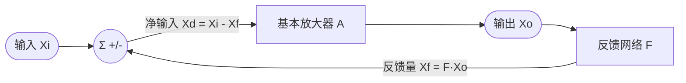
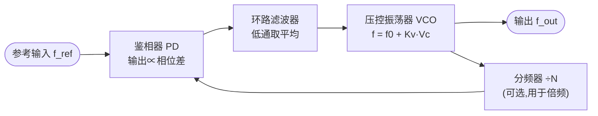

# 模拟电子技术

> 真实世界是连续的，计算世界是离散的——模拟电子技术就是这两个世界之间那道必须亲手搭建的桥。

## 0. AI 时代为什么还要学模电

有人问：模型都跑在 GPU 上了，还学什么二极管三极管？因为**所有进入 AI 系统的数据，第一步都要穿过模拟电路**。摄像头光电二极管产生纳安级电流，麦克风输出毫伏级电压，温度、压力、心电、加速度传感器全是微弱且带噪的模拟信号，必须先经前置放大、抗混叠滤波、共模抑制，才轮到 ADC 采样。前端信噪比丢掉的信息，后面再大的模型也补不回来——**模型的上限由传感器前端决定**。

更有意思的是第三条线：**算力本身正在回归模拟**。"存内计算"（Compute-in-Memory）把矩阵乘加映射成物理定律——用欧姆定律做乘法、基尔霍夫电流定律做加法，一次操作完成一整行点积，能效比数字方案高 1~2 个数量级。忆阻器阵列、神经形态芯片（Intel Loihi、IBM TrueNorth）、模拟 AI 加速器（Mythic、ADI）都建立在这套逻辑上，设计它们恰恰需要失调、噪声、非线性、温漂这些最"模电"的功底。所以模电不是历史包袱，而是 AI 系统里**最靠近物理世界、也最难被自动化替代**的一层。

---

## 1. 半导体基础与 PN 结

### 知识要点

| 概念 | 要点 |
|------|------|
| 本征半导体 | 纯净硅/锗，电子空穴成对出现，浓度随温度指数上升 |
| N 型 / P 型 | 掺五价→多子是电子；掺三价→多子是空穴 |
| 两种电流 | 漂移（电场驱动）、扩散（浓度梯度驱动） |
| PN 结 | 扩散→留下不可动离子→内电场→动态平衡；硅内建电位约 `0.6~0.8 V` |
| 单向导电 | 正偏电流指数增长；反偏只剩极小反向饱和电流 `Is` |
| 温度效应 | 温度每升 `10℃`，`Is` 约翻倍；正向压降温度系数约 `-2 mV/℃` |

### 关键概念精讲

**PN 结伏安特性（肖克利方程）**

```
I = Is·(exp(V/(n·VT)) - 1)
```

`Is`（硅小信号管约 `1e-12~1e-14 A`）、`n`（发射系数 `1~2`）、`VT = kT/q`（室温约 `26 mV`）。两个直接推论：

1. **60 mV 定律**：电压每增加约 `60 mV`（精确 `2.3·n·VT`），电流增大 10 倍。正向压降"钉"在 0.7 V，是因为电流变化几个数量级、电压才变零点几伏——正是钳位、对数放大器的物理基础。
2. **小信号电阻**：工作点附近微分得 `rd = n·VT/I ≈ 26mV/I(mA)`（欧姆）。这是"**大信号非线性 → 小信号线性**"的桥梁，也是所有小信号模型的思想源头：**先直流定工作点，再在工作点附近线性化**。

**为什么必须数值求解**：只要电路里有一个二极管，KCL 就变成超越方程 `(Vs-V)/R = Is·(exp(V/(n·VT))-1)`，无解析解，必须用牛顿迭代 `V(k+1)=V(k)-f(V(k))/f'(V(k))`——SPICE 内部做的就是这件事。

下图是二极管完整伏安特性：正向要越过约 0.5 V 的"死区"才明显导通，之后电流指数上升；反向只有极小的 `Is`，直到击穿电压 `Vbr` 处电流陡增（齐纳管就工作在这一段）。

<svg viewBox="0 0 600 260" role="img" aria-label="二极管伏安特性曲线">
  <line x1="40" y1="185" x2="575" y2="185" stroke="var(--text)" stroke-width="1.5"/>
  <polygon points="575,185 565,181 565,189" fill="var(--text)"/>
  <line x1="330" y1="15" x2="330" y2="250" stroke="var(--text)" stroke-width="1.5"/>
  <polygon points="330,15 326,25 334,25" fill="var(--text)"/>
  <text x="560" y="205" fill="var(--text)" font-size="13">V</text>
  <text x="340" y="28" fill="var(--text)" font-size="13">I</text>
  <text x="318" y="200" fill="var(--text)" font-size="12">0</text>
  <polyline points="330,185 360,184.5 390,183.5 410,180 424,173 434,160 442,138 449,105 455,62 459,30"
            fill="none" stroke="var(--accent)" stroke-width="2.5"/>
  <polyline points="330,185 280,185.6 220,186 160,186.4 120,187 112,196 106,220 102,245"
            fill="none" stroke="var(--accent)" stroke-width="2.5"/>
  <line x1="418" y1="185" x2="418" y2="178" stroke="var(--text)" stroke-width="1"/>
  <text x="404" y="176" fill="var(--text)" font-size="12">0.5V</text>
  <line x1="440" y1="185" x2="440" y2="145" stroke="var(--text)" stroke-width="1" stroke-dasharray="3,3"/>
  <text x="440" y="200" fill="var(--text)" font-size="12">0.7V</text>
  <line x1="115" y1="185" x2="115" y2="178" stroke="var(--text)" stroke-width="1"/>
  <text x="88" y="174" fill="var(--text)" font-size="12">-Vbr</text>
  <text x="338" y="215" fill="var(--text)" font-size="12">死区(&lt;0.5V 几乎不导通)</text>
  <text x="455" y="80" fill="var(--text)" font-size="12">正向导通(指数上升)</text>
  <text x="60" y="230" fill="var(--text)" font-size="12">反向击穿(齐纳区)</text>
  <text x="180" y="172" fill="var(--text)" font-size="12">反向饱和电流 -Is(极小)</text>
</svg>

### 案例代码：二极管工作点求解

```python
import math
VT = 1.380649e-23*300.15/1.602176634e-19   # 热电压 kT/q ≈ 25.9 mV
IS, N = 1e-12, 1.0
def di(v): return IS*(math.exp(min(v/(N*VT),200))-1.0)
def dg(v): return IS/(N*VT)*math.exp(min(v/(N*VT),200))
def solve(vs,r,v0=0.6,tol=1e-12):
    v=v0
    for _ in range(100):
        f=(vs-v)/r-di(v); dv=-f/(-1/r-dg(v))
        dv=math.copysign(min(abs(dv),0.1),dv); v+=dv
        if abs(dv)<tol: break
    return v,di(v)
for vs in [1.0,12.0]:
    vd,i=solve(vs,1000.0); ia=max((vs-0.7)/1000,0)
    print(f"Vs={vs:4.1f} Vd={vd:.5f} Id={i*1e3:.5f}mA 0.7V模型={ia*1e3:.5f}mA 误差={abs(ia-i)/i*100:.2f}%")
```

输出：

```
Vs= 1.0 Vd=0.51717 Id=0.48283mA 0.7V模型=0.30000mA 误差=37.87%
Vs=12.0 Vd=0.59895 Id=11.40105mA 0.7V模型=11.30000mA 误差=0.89%
```

接近导通压降时必须老实算；电源电压远大于 0.7 V 时工程近似完全够用。完整版（含 I-V 表、温度扫描）见 `code/02-analog/diode_iv.py`。

---

## 2. 二极管及其应用

### 知识要点

| 应用 | 原理 | 关键公式 |
|------|------|----------|
| 半波整流 | 只让半个周期通过 | `Vo(avg)=0.45·Vi(rms)` |
| 全波/桥式 | 两个半周期都利用 | `Vo(avg)=0.9·Vi(rms)` |
| 电容滤波 | 充电填平波谷 | `Vpp≈Io/(f·C)`，全波 `f` 取 `2·f_line` |
| 限幅/钳位 | 超过阈值钳位 / 电容移电平 | 输出限于 `±(VD+Vref)` |
| 齐纳稳压 | 反向击穿区压降稳定 | 工作于 `Iz(min)~Iz(max)` |
| 检波 | 提取调幅包络 | `RC` 介于载波与包络周期之间 |

**常用选型**：硅整流 1N4007（0.7~1.1 V，工频）；肖特基 1N5819（0.2~0.4 V，开关电源）；齐纳（2.4~200 V 反向，基准）；快恢复 UF4007（ns 级，续流）；LED（1.8~3.4 V，电光转换）。

### 关键概念精讲

**整流+滤波的定量设计**：二极管只在输入高于电容电压的短暂时刻导通充电，其余时间电容独自供电。设负载电流 `Io` 近似恒定、放电时间约周期 `T`：`Q=Io·T=C·Vpp => Vpp≈Io/(f·C)`。三约束：纹波决定 `C` 下限；`C` 越大导通角越窄、峰值电流越大（校核 `IFSM`）；半波整流反向耐压 `2·Vp`，桥式 `Vp`。

**齐纳稳压不等式**：电路 `Vin—Rs—(稳压管∥RL)—GND`，联立极端条件得 `Rs` 区间：
```
输入最低+负载最重: (Vin_min-Vz)/Rs - Vz/RL_min >= Iz_min
输入最高+负载最轻: (Vin_max-Vz)/Rs - Vz/RL_max <= Iz_max
```
齐纳简单但效率低、负载弱，正经电源要用第 9 章串联稳压或开关电源。

### 案例代码：整流滤波时域仿真

```python
import math
def rect_sim(vp=12.0,f=50.0,c=470e-6,rl=1000.0,isat=1e-9,n=1.6,nc=4,st=2000):
    vt,dt=0.02585,1.0/(f*st); vo=t=0.0; vmin,vmax=1e9,-1e9; acc,cnt=0.0,0
    while t<nc/f:
        vd=vp*math.sin(2*math.pi*f*t)-vo
        id_=isat*(math.exp(min(vd/(n*vt),200))-1) if vd>0 else 0.0
        vo+=(id_-vo/rl)/c*dt; t+=dt
        if t>(nc-1)/f: vmin,vmax=min(vmin,vo),max(vmax,vo); acc,cnt=acc+vo,cnt+1
    return acc/cnt, vmax-vmin
for cap in [100e-6,470e-6,1000e-6]:
    avg,rip=rect_sim(c=cap)
    print(f"C={cap*1e6:6.0f}uF  Vo={avg:6.3f}V  Vpp={rip:6.3f}V  估算={(avg/1000.0)/(50.0*cap):6.3f}V")
```

输出：

```
C=   100uF  Vo=10.393V  Vpp= 1.849V  估算= 2.079V
C=   470uF  Vo=11.049V  Vpp= 0.438V  估算= 0.470V
C=  1000uF  Vo=11.135V  Vpp= 0.209V  估算= 0.223V
```

工程估算 `Vpp≈Io/(f·C)` 误差在 10% 内且偏保守——好的工程近似就该这样。

---

## 3. 双极型晶体管 BJT

### 知识要点

| 项目 | 内容 |
|------|------|
| 结构 | NPN/PNP，基区极薄且掺杂低 |
| 电流关系 | `IE=IB+IC`，`IC=β·IB`，`α=β/(1+β)` |
| 工作区 | 放大：发结正偏集结反偏；饱和：两结正偏；截止：两结反偏 |
| 三种组态 | 共射 CE、共集 CC（射随）、共基 CB |
| 小信号 | `gm=IC/VT`，`rbe=(1+β)·VT/IE≈β/gm`，`ro=VA/IC` |
| 极限参数 | `ICM`、`V(BR)CEO`、`PCM` |

### 关键概念精讲

**两步走范式（务必形成肌肉记忆）**：①直流分析（定 Q 点）——电容开路、电感短路，求 `ICQ`、`VCEQ`，判工作区；②交流分析（算指标）——电源短路到地、耦合/旁路电容短路，用小信号模型求增益阻抗。纽带是 `gm=ICQ/VT`——**Q 点决定小信号参数，小信号参数决定增益**。

**为什么必须分压式偏置**：`β` 极不可靠（同型号 50~300，且随温升）。固定偏置下 `ICQ=β·(VCC-VBE)/Rb` 正比于 `β`，完全失控。射极电阻 `Re` 构成**直流负反馈**：`IC↑→VE↑→VBE↓→IB↓→IC回落`，当 `(1+β)Re>>Rth` 时 `ICQ≈(Vth-VBE)/Re`，`β` 被消掉：

| β | 分压偏置 ICQ(mA) | 固定偏置 ICQ(mA) |
|---|---|---|
| 50 | 1.4407 | 1.2021 |
| 100 | 1.5596 | 2.4043 |
| 300 | 1.6505 | 7.2128 |
| **相对变化** | **13.3%** | **156.2%** |

**三种组态**：CE 增益大（几十~几百）、反相、主放大级；CC 增益≈1、输入阻抗高、缓冲/输出级；CB 增益大、输入阻抗低、高频射频前端。共射公式 `Av=-β(Rc∥RL)/(rbe+(1+β)Re_ub)`：未旁路射极电阻 `Re_ub` 引入交流负反馈，把增益从 -150 压到 -21，换来线性度与稳定性——这是第 6 章负反馈的先声。

**图解 Q 点**：把输出回路 KVL `VCE=VCC-IC·(Rc+Re)` 画成一条**直流负载线**，叠加在晶体管输出特性曲线族上，与 `IB=IBQ` 那条曲线的交点就是静态工作点 Q。Q 太靠上（近饱和）正半周削顶，太靠下（近截止）负半周削底——**Q 点选在负载线中部附近，动态范围最大**。下图对应本章例题（`VCC=12V`、`Rc+Re=4.3k`、`ICQ≈1.56mA`、`VCEQ≈5.28V`）：

<svg viewBox="0 0 600 280" role="img" aria-label="BJT输出特性曲线族与直流负载线">
  <line x1="70" y1="230" x2="575" y2="230" stroke="var(--text)" stroke-width="1.5"/>
  <polygon points="575,230 565,226 565,234" fill="var(--text)"/>
  <line x1="70" y1="20" x2="70" y2="245" stroke="var(--text)" stroke-width="1.5"/>
  <polygon points="70,20 66,30 74,30" fill="var(--text)"/>
  <text x="545" y="250" fill="var(--text)" font-size="13">VCE/V</text>
  <text x="78" y="30" fill="var(--text)" font-size="13">IC/mA</text>
  <polyline points="70,230 77,212 83,204 92,201 550,195" fill="none" stroke="var(--text)" stroke-width="1.5" opacity="0.75"/>
  <polyline points="70,230 78,182 85,172 94,170 550,162" fill="none" stroke="var(--text)" stroke-width="1.5" opacity="0.75"/>
  <polyline points="70,230 79,150 87,139 97,136 550,127" fill="none" stroke="var(--text)" stroke-width="1.5" opacity="0.75"/>
  <polyline points="70,230 80,120 89,109 100,106 550,96" fill="none" stroke="var(--text)" stroke-width="1.5" opacity="0.75"/>
  <polyline points="70,230 82,92 92,79 104,76 550,64" fill="none" stroke="var(--text)" stroke-width="1.5" opacity="0.75"/>
  <text x="553" y="199" fill="var(--text)" font-size="11">IB=5uA</text>
  <text x="553" y="166" fill="var(--text)" font-size="11">10uA</text>
  <text x="553" y="131" fill="var(--text)" font-size="11">15.6uA</text>
  <text x="553" y="100" fill="var(--text)" font-size="11">20uA</text>
  <text x="553" y="68" fill="var(--text)" font-size="11">25uA</text>
  <polyline points="70,63 550,230" fill="none" stroke="var(--accent)" stroke-width="2.5"/>
  <text x="90" y="55" fill="var(--accent)" font-size="12">直流负载线 IC=(VCC-VCE)/(Rc+Re)</text>
  <circle cx="281" cy="136" r="5" fill="var(--accent)"/>
  <text x="292" y="128" fill="var(--text)" font-size="13">Q (5.28V, 1.56mA)</text>
  <line x1="281" y1="136" x2="281" y2="230" stroke="var(--text)" stroke-width="1" stroke-dasharray="4,3"/>
  <line x1="70" y1="136" x2="281" y2="136" stroke="var(--text)" stroke-width="1" stroke-dasharray="4,3"/>
  <text x="264" y="246" fill="var(--text)" font-size="12">5.28</text>
  <text x="34" y="140" fill="var(--text)" font-size="12">1.56</text>
  <text x="527" y="246" fill="var(--text)" font-size="12">12</text>
  <text x="100" y="255" fill="var(--text)" font-size="11">左端陡升段=饱和区</text>
  <text x="380" y="220" fill="var(--text)" font-size="11">横轴附近=截止区</text>
</svg>

### 案例代码：BJT 静态工作点与增益

```python
VT=0.02585
class BJTAmp:
    def __init__(self,vcc=12.0,r1=40e3,r2=10e3,rc=3.3e3,re=1e3,beta=100.0,rl=None,re_ub=0.0):
        self.vcc,self.r1,self.r2,self.rc,self.re,self.beta,self.rl,self.re_ub=vcc,r1,r2,rc,re,beta,rl,re_ub
    def q_point(self,vbe=0.7):
        vth=self.vcc*self.r2/(self.r1+self.r2); rth=self.r1*self.r2/(self.r1+self.r2)
        ib=(vth-vbe)/(rth+(self.beta+1)*self.re); ic=self.beta*ib; ie=(self.beta+1)*ib
        vce=self.vcc-ic*self.rc-ie*self.re
        return {"ICQ":ic,"IE":ie,"VCEQ":vce,"region":"放大区" if vce>0.3 and ib>0 else "饱和/截止区"}
    def gain_ce(self):
        q=self.q_point(); rbe=(self.beta+1)*VT/q["IE"]
        rc=self.rc if self.rl is None else self.rc*self.rl/(self.rc+self.rl)
        av=-self.beta*rc/(rbe+(self.beta+1)*self.re_ub)
        rb=self.r1*self.r2/(self.r1+self.r2); rin=rb*(rbe+(self.beta+1)*self.re_ub)/(rb+rbe+(self.beta+1)*self.re_ub)
        return {"Av":av,"rbe":rbe,"gm":q["ICQ"]/VT,"Rin":rin}
amp=BJTAmp(rl=10e3); q,g=amp.q_point(),amp.gain_ce()
print(f"ICQ={q['ICQ']*1e3:.4f}mA VCEQ={q['VCEQ']:.4f}V {q['region']}")
print(f"gm={g['gm']*1e3:.2f}mS rbe={g['rbe']:.1f}Ω Av={g['Av']:.2f}\n射极电阻不旁路(交流负反馈)的影响:")
for re in [0,100,500]:
    r=BJTAmp(rl=10e3,re_ub=re).gain_ce()
    print(f"  Re_ub={re:3d}Ω -> Av={r['Av']:8.2f}, Rin={r['Rin']/1e3:.2f}kΩ")
```

输出：

```
ICQ=1.5596mA VCEQ=5.2780V 放大区
gm=60.33mS rbe=1657.4Ω Av=-149.70

射极电阻不旁路(交流负反馈)的影响:
  Re_ub=  0Ω -> Av= -149.70, Rin=1.37kΩ
  Re_ub=100Ω -> Av=  -21.10, Rin=4.76kΩ
  Re_ub=500Ω -> Av=   -4.76, Rin=6.94kΩ
```

完整版（温漂、β离散、三组态对比）见 `code/02-analog/bjt_bias.py`。

---

## 4. 场效应管 MOSFET

### 知识要点

| 项目 | 内容 |
|------|------|
| 分类 | JFET；MOSFET（增强/耗尽，N/P 沟道） |
| 控制方式 | **电压控制电流**，栅极几乎不取电流 |
| 三工作区 | 截止 `VGS<Vth`、可变电阻 `VDS<Vov`、饱和 `VDS≥Vov` |
| 饱和电流 | `ID=0.5·kn·(VGS-Vth)²·(1+λ·VDS)` |
| 跨导 | `gm=kn·Vov=2·ID/Vov=sqrt(2·kn·ID)` |
| 优点 | 输入阻抗极高、噪声低、易集成、可做压控电阻 |

### 关键概念精讲

**BJT 与 MOSFET 本质差异**：BJT 指数关系、MOS 平方关系。指数函数的对数导数是常数 `1/VT≈1/26mV`，平方函数是 `2/Vov`（`Vov` 通常几百 mV~1V），所以**同 1 mA 电流下 BJT 跨导（≈38.7 mS）远高于 MOS（1~5 mS）**——这正是高精度前端偏爱 BJT/BiCMOS、大规模集成必用 CMOS 的原因。

**偏置方程**：栅极无电流，`VG` 由分压定；联立 `VG-VGS-ID·Rs=0` 与饱和式，令 `x=Vov` 得 `0.5·kn·Rs·x²+x+(Vth-VG)=0`，取正根，再回代校验 `VDS≥Vov` 才在饱和区。

**MOS 作压控电阻**：可变电阻区 `ID≈kn·Vov·VDS`，即 `Rds≈1/(kn·Vov)`——用于模拟开关、AGC、可编程滤波。在存内计算中，MOS/忆阻器电导 `G` 直接存权重，`I=V·G` 多路电流在一条位线上自然求和，一次完成整行向量乘加。

### 案例代码：MOSFET 共源放大器

```python
import math
class MOSAmp:
    def __init__(self,vdd=12.0,r1=2e6,r2=1e6,rd=4.7e3,rs=1e3,kn=2e-3,vth=1.5,lam=0.01,rl=None):
        self.vdd,self.r1,self.r2,self.rd,self.rs,self.kn,self.vth,self.lam,self.rl=vdd,r1,r2,rd,rs,kn,vth,lam,rl
    def q_point(self):
        vg=self.vdd*self.r2/(self.r1+self.r2)
        a,c=0.5*self.kn*self.rs,self.vth-vg; disc=1-4*a*c
        if disc<0: return {"region":"截止区","ID":0.0}
        vov=(-1+math.sqrt(disc))/(2*a)
        if vov<=0: return {"region":"截止区(栅压不足)","ID":0.0}
        idc=0.5*self.kn*vov*vov; vds=self.vdd-idc*(self.rd+self.rs)
        ro=1/(self.lam*idc) if idc>0 else float('inf')
        return {"VG":vg,"VGS":vov+self.vth,"Vov":vov,"ID":idc,"VDS":vds,
                "region":"饱和区(放大)" if vds>=vov else "线性区需减小Rd!","gm":self.kn*vov,"ro":ro}
    def gain(self):
        q=self.q_point(); rd=self.rd if self.rl is None else self.rd*self.rl/(self.rd+self.rl)
        rd=rd*q["ro"]/(rd+q["ro"]); return -q["gm"]*rd,q
av,q=MOSAmp(rl=47e3).gain()
print(f"VG={q['VG']:.3f}V VGS={q['VGS']:.3f}V Vov={q['Vov']:.3f}V")
print(f"ID={q['ID']*1e3:.4f}mA VDS={q['VDS']:.3f}V [{q['region']}]")
print(f"gm={q['gm']*1e3:.3f}mS Av={av:.3f} ({20*math.log10(abs(av)):.2f}dB)\n同1mA跨导对比: BJT={1e-3/0.02585*1e3:.2f}mS",end="")
for kn in [0.5e-3,2e-3]:
    vov=math.sqrt(2*1e-3/kn); print(f"  MOS(kn={kn*1e3:.1f}m)={kn*vov*1e3:5.2f}mS",end="")
print()
```

输出：

```
VG=4.000V VGS=2.658V Vov=1.158V
ID=1.3417mA VDS=4.352V [饱和区(放大)]
gm=2.317mS Av=-9.362 (19.43dB)

同1mA跨导对比: BJT=38.68mS  MOS(kn=0.5m)= 1.00mS  MOS(kn=2.0m)= 2.00mS
```

---

## 5. 放大电路的频率响应

### 知识要点

| 概念 | 说明 |
|------|------|
| 频率响应 | 增益随频率 `A(jω)`，含幅频与相频 |
| 波特图 | 横轴对数频率，纵轴 dB 增益，折线近似 |
| 下限 `fL` / 上限 `fH` | 由耦合/旁路电容 / 结电容·寄生电容决定 |
| 一阶极点 | `-20 dB/dec`，最大滞后 `-90°`，转折 `-3 dB`、`-45°` |
| 米勒效应 | 跨接电容 `Cbc` 折算到输入放大 `(1+|Av|)` 倍 |
| 增益带宽积 | `GBW=|Av|·fH≈常数` |

### 关键概念精讲

**一阶低通/高通**：`H=1/(1+jωτ)`（低通）、`H=jωτ/(1+jωτ)`（高通）。`f=fc` 处 `|H|=1/√2=0.707` 即 `-3.01 dB`、相位 `∓45°`，`-3 dB` 之所以重要是功率恰降一半。

**米勒效应——高频头号杀手**：跨接输入输出间的 `Cbc`，因反相且增益 `|Av|`，等效 `CM=Cbc·(1+|Av|)`。实测（`Cbe=20pF`、`Cbc=4pF`、`Rs=1kΩ`）：

| \|Av\| | CM(pF) | Ci(pF) | fH(kHz) | GBW(MHz) |
|---|---|---|---|---|
| 10 | 44.0 | 64.0 | 2486.80 | 24.87 |
| 150 | 604.0 | 624.0 | 255.06 | 38.26 |

`Av=150` 时仅 4 pF 的 `Cbc` 被放大成 604 pF（占输入电容 97%），而 `GBW` 基本恒定——**增益和带宽只能二选一**。对策：**共基组态**（`Cbc` 不再跨接）；**Cascode 级联**（共射级负载为共基低输入阻抗，增益≈-1，米勒几乎不放大，总增益由共基提供，兼得高增益与宽带宽——集成电路标准招式）。

完整表达式：`A(jf)=Am·[jf/(jf+fL)]·[1/(1+jf/fH)]`（中频·低频高通项·高频低通项）。

对应的波特图（折线近似）如下：中频区平坦，两侧各以 `±20 dB/dec` 滚降；转折频率处实际曲线比折线低 3 dB；相位在每个转折频率处恰好走到 `±45°`：

<svg viewBox="0 0 600 330" role="img" aria-label="单极点放大器波特图：幅频与相频">
  <line x1="70" y1="150" x2="575" y2="150" stroke="var(--text)" stroke-width="1.5"/>
  <line x1="70" y1="20" x2="70" y2="150" stroke="var(--text)" stroke-width="1.5"/>
  <text x="20" y="46" fill="var(--text)" font-size="12">43.5dB</text>
  <text x="30" y="154" fill="var(--text)" font-size="12">0dB</text>
  <text x="78" y="20" fill="var(--text)" font-size="13">|A| (dB)</text>
  <polyline points="70,120 148,42 394,42 550,94" fill="none" stroke="var(--accent)" stroke-width="2.5"/>
  <line x1="148" y1="42" x2="148" y2="150" stroke="var(--text)" stroke-width="1" stroke-dasharray="4,3"/>
  <line x1="394" y1="42" x2="394" y2="150" stroke="var(--text)" stroke-width="1" stroke-dasharray="4,3"/>
  <text x="132" y="165" fill="var(--text)" font-size="12">fL=20Hz</text>
  <text x="368" y="165" fill="var(--text)" font-size="12">fH=255kHz</text>
  <circle cx="148" cy="51" r="3.5" fill="var(--accent)"/>
  <circle cx="394" cy="51" r="3.5" fill="var(--accent)"/>
  <text x="160" y="66" fill="var(--text)" font-size="11">实际点低 3dB (-45°/+45°)</text>
  <text x="80" y="105" fill="var(--text)" font-size="11">+20dB/dec</text>
  <text x="455" y="60" fill="var(--text)" font-size="11">-20dB/dec</text>
  <text x="250" y="34" fill="var(--text)" font-size="11">中频通带 Am</text>
  <line x1="70" y1="300" x2="575" y2="300" stroke="var(--text)" stroke-width="1.5"/>
  <line x1="70" y1="195" x2="70" y2="315" stroke="var(--text)" stroke-width="1.5"/>
  <text x="78" y="195" fill="var(--text)" font-size="13">相位</text>
  <text x="26" y="209" fill="var(--text)" font-size="12">+90°</text>
  <text x="36" y="256" fill="var(--text)" font-size="12">0°</text>
  <text x="26" y="304" fill="var(--text)" font-size="12">-90°</text>
  <line x1="70" y1="252" x2="575" y2="252" stroke="var(--text)" stroke-width="0.8" stroke-dasharray="2,4"/>
  <polyline points="70,207 100,209 124,215 148,229 172,242 196,248 220,251 270,252 300,253 330,256 364,262 394,274 424,286 448,292 480,296 550,298"
            fill="none" stroke="var(--accent)" stroke-width="2.5"/>
  <line x1="148" y1="229" x2="148" y2="300" stroke="var(--text)" stroke-width="1" stroke-dasharray="4,3"/>
  <line x1="394" y1="274" x2="394" y2="300" stroke="var(--text)" stroke-width="1" stroke-dasharray="4,3"/>
  <text x="152" y="240" fill="var(--text)" font-size="11">+45° @ fL</text>
  <text x="398" y="272" fill="var(--text)" font-size="11">-45° @ fH</text>
  <text x="500" y="316" fill="var(--text)" font-size="12">f (对数轴)</text>
</svg>

### 案例代码：波特图与米勒效应

```python
import math
TP=2*math.pi
def db(x): return 20*math.log10(abs(x)) if abs(x)>1e-30 else -300.0
def sweep(f0,f1,ppd=4):
    n=int(round(math.log10(f1/f0)*ppd)); return [f0*10**(i/ppd) for i in range(n+1)]
def bode(freqs,gains,w=48,t="幅频"):
    gmin=math.floor(min(gains)/10)*10; gmax=math.ceil(max(gains)/10)*10
    print(f"  {t} (纵轴 {gmin:.0f}~{gmax:.0f}dB)")
    for f,g in zip(freqs,gains):
        p=max(0,min(w-1,int((g-gmin)/(gmax-gmin)*(w-1))))
        print(f"  {f:10.1f}Hz |{' '*p}*{' '*(w-p-1)}| {g:7.2f}")
def amp_tf(f,am=-150.0,fl=20.0,fh=255e3):
    return am*(1j*f)/(1j*f+fl)/(1.0+1j*f/fh)
cbe,cbc,rs=20e-12,4e-12,1000.0
print(f"{'|Av|':>6}|{'CM(pF)':>8}|{'Ci(pF)':>8}|{'fH(kHz)':>9}|{'GBW(MHz)':>9}")
for a in [10,150]:
    ci=cbe+cbc*(1+a); fh=1/(TP*rs*ci)
    print(f"{a:6d}|{cbc*(1+a)*1e12:8.1f}|{ci*1e12:8.1f}|{fh/1e3:9.2f}|{a*fh/1e6:9.2f}")
fr=sweep(1,1e7,ppd=1); bode(fr,[db(amp_tf(f)) for f in fr],t="全频段波特图")
```

输出：

```
  |Av| |  CM(pF) |  Ci(pF) | fH(kHz) | GBW(MHz)
    10 |    44.0 |    64.0 |  2486.80 |    24.87
   150 |   604.0 |   624.0 |   255.06 |    38.26
  全频段波特图  (纵轴 10~50 dB)
         1.0 Hz |        *                                       |   17.49
        10.0 Hz |                               *                |   36.53
       100.0 Hz |                                       *        |   43.35
      1000.0 Hz |                                       *        |   43.52
     10000.0 Hz |                                       *        |   42.90
   1000000.0 Hz |                         *                      |   31.38
  10000000.0 Hz | *                                              |   11.65
```

中间平坦区即通频带，两端各以 20 dB/dec 滚降。完整版见 `code/02-analog/rc_filter.py`。

---

## 6. 负反馈放大电路

### 知识要点

| 项目 | 内容 |
|------|------|
| 基本关系 | `Af=A/(1+A·F)`，深度反馈 `Af≈1/F` |
| 判别正负 | 瞬时极性法：反馈使净输入减小→负反馈 |
| 取样方式 | 并接输出→电压取样；串接输出回路→电流取样 |
| 比较方式 | 反馈与输入加在不同电极→串联；同电极→并联 |
| 改善性能 | 增益稳定、失真、噪声、带宽、阻抗（均改善 `D=1+AF` 倍） |
| 代价 | 增益降 `D` 倍；深度反馈+多极点可能自激 |

### 关键概念精讲

**标准方框图**：一切负反馈电路都可以抽象成下图——输出 `Xo` 经反馈网络 `F` 取回一份 `Xf`，在求和点与输入 `Xi` 相减得到净输入 `Xd`，再送入基本放大器 `A`。由 `Xo=A·Xd=A·(Xi-F·Xo)` 立刻解出闭环增益 `Af=Xo/Xi=A/(1+A·F)`：



环路增益 `A·F` 是全部性能改善的来源：`1+A·F` 越大，增益越稳定、失真越小、带宽越宽——代价是闭环增益缩小同样的倍数。

**四种组态**：电压串联（稳 `Av`，增 `Rin` 减 `Rout`，同相放大）；电压并联（稳 `Rm`，减 `Rin`/`Rout`，反相/TIA）；电流串联（稳 `Gm`，增 `Rin`/`Rout`，压控恒流源）；电流并联（稳 `Ai`，减 `Rin` 增 `Rout`）。**口诀**：取样什么就稳定什么；串联提输入阻抗、并联降输入阻抗；电压取样降输出阻抗、电流取样提输出阻抗。

**灵敏度公式**：对 `Af=A/(1+AF)` 微分得 `dAf/Af=[1/(1+AF)]·(dA/A)`。实测（`A=1e4`，开环变化 30%）：

| F | D=1+AF | Af | 闭环变化率 | 改善倍数 |
|---|---|---|---|---|
| 0 | 1.0 | 10000.00 | 30.0000% | 1.0 |
| 0.1 | 11.0 | 909.09 | 3.7500% | 8.0 |
| 0.5 | 5001.0 | 2.00 | 0.0086% | 3501.0 |

**负反馈最伟大的地方：用精密、廉价、稳定的无源电阻，锁定不精密、非线性、随温漂的有源器件性能**。注意：只有环内产生的失真/噪声才被改善，输入端引入的噪声与信号同路，反馈无能为力。

**自激与相位裕度**：巴克豪森判据 `|AF|=1` 且环路相移 `-180°` 时变正反馈而自激。工程判据用相位裕度 `PM=180°+∠(AF)`（0 dB 穿越处）：`PM>60°` 很稳定；`45~60°` 轻微过冲；`0~45°` 临界振铃；`≤0°` 自激。实测（三极点运放 `A0=1e5`，极点 10Hz/100kHz/1MHz）：

| F | 闭环增益 | 穿越频率(Hz) | 相位裕度 | 判定 |
|---|---|---|---|---|
| 1.0 | 1.0 | 301454 | 1.58° | 临界/振铃 |
| 0.01 | 100.0 | 9950 | 83.81° | 很稳定 |

**反馈越深、闭环增益越低越易振荡**——电压跟随器（`F=1`）最苛刻，"unity-gain stable"是重要指标。消除手段：主极点补偿、密勒补偿（小电容利用米勒效应，IC 标准）、超前补偿。

### 案例代码：反馈深度与相位裕度

```python
import math
def sensitivity(a=1e4,delta=0.30):
    print(f"{'F':>8}|{'D=1+AF':>9}|{'Af':>10}|{'闭环变化率':>11}|{'改善':>9}")
    for f in [0.0,0.001,0.1,0.5]:
        d=1+a*f; af0=a/d; a2=a*(1-delta)
        ch=abs(a2/(1+a2*f)-af0)/af0*100; imp=(delta*100)/ch if ch>1e-9 else float('inf')
        print(f"{f:8.3f}|{d:9.1f}|{af0:10.2f}|{ch:10.4f}%|{imp:9.1f}")
def loop_gain(f,a0=1e5,poles=(10.0,1e5,1e6)):
    h=complex(a0,0)
    for p in poles: h/=(1+1j*f/p)
    return h
def unwrap(f,poles=(10.0,1e5,1e6)):
    return -sum(math.degrees(math.atan2(f,p)) for p in poles)
def pm_demo():
    print(f"{'F':>8}|{'闭环增益':>9}|{'穿越(Hz)':>12}|{'相位裕度':>10}|判定")
    for f in [1.0,0.01]:
        lo,hi=1.0,1e8
        for _ in range(200):
            m=math.sqrt(lo*hi); lo,hi=(m,hi) if abs(loop_gain(m)*f)>1 else (lo,m)
        fc=math.sqrt(lo*hi); pm=180+unwrap(fc)
        v="很稳定" if pm>60 else "稳定" if pm>45 else "临界/振铃" if pm>0 else "自激!"
        print(f"{f:8.3f}|{1/f:9.1f}|{fc:12.2f}|{pm:9.2f}°|{v}")
sensitivity(); print(); pm_demo()
```

输出：

```
       F|  D=1+AF|        Af|  闭环变化率|      改善
   0.000|      1.0|  10000.00|  30.0000%|      1.0
   0.100|     11.0|    909.09|   3.7500%|      8.0
   0.500|   5001.0|      2.00|   0.0086%|   3501.0

       F|  闭环增益|      穿越(Hz)|    相位裕度|判定
   1.000|      1.0|     301454.23|    1.58°|临界/振铃
   0.010|    100.0|       9950.18|   83.81°|很稳定
```

完整版见 `code/02-analog/opamp_sim.py`。

---

## 7. 集成运放及线性应用

### 知识要点

| 项目 | 内容 |
|------|------|
| 内部结构 | 差分输入级（定失调/CMRR）→ 高增益中间级 → 低阻输出级 → 偏置电路 |
| 理想参数 | `Aod→∞`、`Rid→∞`、`Ro→0`、`CMRR→∞`、`BW→∞` |
| 两大法则 | **虚短** `V+=V-`、**虚断** `I+=I-=0`（仅负反馈线性区成立） |
| 关键指标 | `GBW=Acl·BW=常数`；压摆率 `SR=dVo/dt|max`，`fmax=SR/(2π·Vp)` |

### 关键概念精讲

**虚短虚断的成立条件**：虚短来自 `Vid=Vo/Aod`，要求 `Vo` 有限（工作在线性区）。一旦输出饱和（比较器、正反馈），`Vo` 被电源钳住，虚短立即失效。**铁律：有负反馈才能用虚短虚断，正反馈或开环绝对不能。**

**基本运算电路**：反相 `Vo=-(Rf/R1)·Vi`（虚地，输入阻抗 `R1`）；同相 `Vo=(1+Rf/R1)·Vi`（`Rin→∞`）；电压跟随 `Vo=Vi`（`F=1` 最不稳定）；反相加法 `Vo=-Rf·Σ(Vi/Ri)`（虚地隔离各路）；减法 `Vo=(R2/R1)·(V2-V1)`（需 `R1=R3,R2=R4`）；积分 `Vo=-(1/RC)·∫Vi dt`；微分 `Vo=-RC·dVi/dt`。反相加法按 `Rf/Ri=1:1/2:1/4:...` 取阻即最原始**二进制加权 DAC**。

两种最基本的放大拓扑如下图：反相放大器的反相端是**虚地**（电位≈0 但不接地），输入电流全部流过 `Rf`，故 `Vo=-(Rf/R1)·Vi`；同相放大器输入直接进同相端（输入阻抗极高），`Rf/R1` 分压把 `Vo` 的一部分送回反相端与 `Vi` 比较，故 `Vo=(1+Rf/R1)·Vi`：

<svg viewBox="0 0 600 215" role="img" aria-label="运放反相与同相放大电路">
  <polygon points="150,75 150,155 230,115" fill="var(--panel)" stroke="var(--text)" stroke-width="1.8"/>
  <text x="157" y="97" fill="var(--text)" font-size="14">-</text>
  <text x="156" y="146" fill="var(--text)" font-size="13">+</text>
  <line x1="30" y1="90" x2="60" y2="90" stroke="var(--text)" stroke-width="1.5"/>
  <rect x="60" y="83" width="45" height="14" fill="var(--panel)" stroke="var(--text)" stroke-width="1.5"/>
  <text x="70" y="77" fill="var(--text)" font-size="12">R1</text>
  <line x1="105" y1="90" x2="150" y2="90" stroke="var(--text)" stroke-width="1.5"/>
  <circle cx="125" cy="90" r="2.5" fill="var(--text)"/>
  <line x1="125" y1="90" x2="125" y2="45" stroke="var(--text)" stroke-width="1.5"/>
  <line x1="125" y1="45" x2="152" y2="45" stroke="var(--text)" stroke-width="1.5"/>
  <rect x="152" y="38" width="45" height="14" fill="var(--panel)" stroke="var(--text)" stroke-width="1.5"/>
  <text x="163" y="32" fill="var(--text)" font-size="12">Rf</text>
  <line x1="197" y1="45" x2="245" y2="45" stroke="var(--text)" stroke-width="1.5"/>
  <line x1="245" y1="45" x2="245" y2="115" stroke="var(--text)" stroke-width="1.5"/>
  <line x1="230" y1="115" x2="270" y2="115" stroke="var(--text)" stroke-width="1.5"/>
  <circle cx="245" cy="115" r="2.5" fill="var(--text)"/>
  <line x1="150" y1="140" x2="128" y2="140" stroke="var(--text)" stroke-width="1.5"/>
  <line x1="128" y1="140" x2="128" y2="165" stroke="var(--text)" stroke-width="1.5"/>
  <line x1="118" y1="165" x2="138" y2="165" stroke="var(--text)" stroke-width="1.5"/>
  <line x1="122" y1="170" x2="134" y2="170" stroke="var(--text)" stroke-width="1.2"/>
  <line x1="126" y1="175" x2="130" y2="175" stroke="var(--text)" stroke-width="1"/>
  <text x="14" y="84" fill="var(--text)" font-size="13">Vi</text>
  <text x="274" y="119" fill="var(--text)" font-size="13">Vo</text>
  <text x="60" y="200" fill="var(--text)" font-size="13">反相: Vo = -(Rf/R1)·Vi</text>
  <text x="112" y="110" fill="var(--text)" font-size="11">虚地</text>
  <polygon points="440,75 440,155 520,115" fill="var(--panel)" stroke="var(--text)" stroke-width="1.8"/>
  <text x="447" y="97" fill="var(--text)" font-size="14">-</text>
  <text x="446" y="146" fill="var(--text)" font-size="13">+</text>
  <line x1="350" y1="140" x2="440" y2="140" stroke="var(--text)" stroke-width="1.5"/>
  <text x="334" y="144" fill="var(--text)" font-size="13">Vi</text>
  <line x1="440" y1="90" x2="410" y2="90" stroke="var(--text)" stroke-width="1.5"/>
  <circle cx="410" cy="90" r="2.5" fill="var(--text)"/>
  <line x1="410" y1="90" x2="410" y2="45" stroke="var(--text)" stroke-width="1.5"/>
  <line x1="410" y1="45" x2="452" y2="45" stroke="var(--text)" stroke-width="1.5"/>
  <rect x="452" y="38" width="45" height="14" fill="var(--panel)" stroke="var(--text)" stroke-width="1.5"/>
  <text x="463" y="32" fill="var(--text)" font-size="12">Rf</text>
  <line x1="497" y1="45" x2="535" y2="45" stroke="var(--text)" stroke-width="1.5"/>
  <line x1="535" y1="45" x2="535" y2="115" stroke="var(--text)" stroke-width="1.5"/>
  <line x1="520" y1="115" x2="560" y2="115" stroke="var(--text)" stroke-width="1.5"/>
  <circle cx="535" cy="115" r="2.5" fill="var(--text)"/>
  <rect x="403" y="105" width="14" height="42" fill="var(--panel)" stroke="var(--text)" stroke-width="1.5"/>
  <text x="378" y="130" fill="var(--text)" font-size="12">R1</text>
  <line x1="410" y1="147" x2="410" y2="165" stroke="var(--text)" stroke-width="1.5"/>
  <line x1="400" y1="165" x2="420" y2="165" stroke="var(--text)" stroke-width="1.5"/>
  <line x1="404" y1="170" x2="416" y2="170" stroke="var(--text)" stroke-width="1.2"/>
  <line x1="408" y1="175" x2="412" y2="175" stroke="var(--text)" stroke-width="1"/>
  <text x="564" y="119" fill="var(--text)" font-size="13">Vo</text>
  <text x="370" y="200" fill="var(--text)" font-size="13">同相: Vo = (1+Rf/R1)·Vi</text>
</svg>

**差分放大器与 CMRR**：`R1=R3,R2=R4` 时 `Vo=(R2/R1)·(V2-V1)`，共模全消。但电阻不可能完全匹配：

| 失配度 | 共模增益 | CMRR(dB) |
|---|---|---|
| 0.01% | 0.000099 | 120.09 |
| 5% | 0.047170 | 66.53 |

**CMRR 完全由电阻匹配精度决定**，与运放本身几乎无关——这就是高精度场合要用集成仪表放大器（同片硅激光修调）的原因。传感器前端（应变片电桥、心电）在 1~3 V 共模上叠加几 mV 差模，没有高 CMRR 无法工作。

**有限增益误差**：同相精确式 `Af=A/(1+AF)`，取 `F=0.1`（理想增益 10）：`A=1e2` 时误差 `-9.1%`；`A=1e5` 时误差 `-0.01%`。只要 `AF>>1`，闭环增益只由外部电阻定——高频时 `A` 滚降、误差变大。

### 案例代码：运放电路计算器

```python
import math
class OA:
    @staticmethod
    def inv(vin,rf,r1): return -rf/r1*vin
    @staticmethod
    def non(vin,rf,r1): return (1+rf/r1)*vin
    @staticmethod
    def sum(vins,rs,rf): return -rf*sum(v/r for v,r in zip(vins,rs))
    @staticmethod
    def diff(v1,v2,r1,r2,r3,r4): return (r4/(r3+r4))*(1+r2/r1)*v2-(r2/r1)*v1
    @staticmethod
    def integ(vf,r,c,t1,dt,vo0=0.0):
        out,vo,t=[],vo0,0.0
        for _ in range(int(t1/dt)+1):
            out.append(vo); vo+=-(1/(r*c))*0.5*(vf(t)+vf(t+dt))*dt; t+=dt
        return out
o=OA()
print(f"三路加权加法器 Vo={o.sum([0.5,-0.2,0.3],[10e3,20e3,40e3],20e3):.4f}V")
print(f"{'失配度':>8}|{'共模增益':>12}|{'CMRR(dB)':>10}")
for tol in [0.0001,0.05]:
    acm=abs(o.diff(1,1,1e3,100e3,1e3,100e3*(1+tol)))
    print(f"{tol*100:7.2f}%|{acm:12.6f}|{20*math.log10(100/acm):10.2f}")
sq=lambda t:1.0 if math.sin(2*math.pi*500*t)>=0 else -1.0
vo=o.integ(sq,10e3,100e-9,2/500,1/(500*400))
print(f"积分器峰峰值={max(vo)-min(vo):.4f}V (理论={1/(500*2*10e3*100e-9):.4f}V)")
```

输出：

```
三路加权加法器 Vo=-0.9500V
   失配度|     共模增益|   CMRR(dB)
   0.01%|     0.000099|     120.09
   5.00%|     0.047170|      66.53
积分器峰峰值=1.0000V (理论=1.0000V)
```

---

## 8. 运放非线性应用与有源滤波器

### 知识要点

| 电路 | 反馈 | 关键特性 |
|------|------|----------|
| 单限比较器 | 开环 | 阈值 `Vref`，噪声致抖动 |
| 迟滞（施密特） | **正反馈** | 双阈值，回差抗噪 |
| 方波发生器 | 正反馈+RC | 施密特+积分构成振荡 |
| 一阶有源滤波 | 负反馈 | `-20 dB/dec` |
| 二阶 Sallen-Key | 负反馈+局部正反馈 | `-40 dB/dec`，`Q` 可调 |
| 状态变量滤波 | 多运放 | 同出低/带/高通 |

### 关键概念精讲

**迟滞比较器（为什么必须有回差）**：普通比较器在阈值附近被微小噪声反复触发。迟滞用**正反馈**造两个阈值（同相结构）：
```
上门限 VTH+ = Vref·(1+R1/R2) - Vol·(R1/R2)
下门限 VTH- = Vref·(1+R1/R2) - Voh·(R1/R2)
回差   ΔV   = (Voh-Vol)·(R1/R2)
```
输出为低时须升过 `VTH+` 才翻高；为高时须降到 `VTH-` 以下才翻低。只要**回差大于噪声峰峰值**，输出就干净。实测（斜坡+`±0.45V` 噪声，回差 1.0V）：`普通比较器翻转 11 次，施密特 1 次`。**注意这里是正反馈，绝不能用虚短**——须分"输出高/低"两种状态叠加算同相端。

**有源滤波为什么优于无源**：无源 RLC 电感大、有损、难集成、级间加载；有源用运放低输出阻抗隔离各级且**不需电感**——RC 加反馈即可实现复数极点（谐振），这是无源 RC 做不到的。

**二阶 Sallen-Key 低通**：`H(s)=ωn²/(s²+(ωn/Q)s+ωn²)`，`ωn=1/√(R1·R2·C1·C2)`，单位增益 `Q=√(R1·R2·C1·C2)/(C2·(R1+R2))`。`Q` 决定形状：

| Q | 类型 | fn 处衰减 | 峰化 |
|---|---|---|---|
| 0.500 | 临界阻尼 | -6.02 dB | 无 |
| 0.7071 | **Butterworth(最平坦)** | **-3.01 dB** | 无 |
| 1.000 | 轻微峰化 | 0.00 dB | +1.25 dB |
| 5.000 | 强谐振 | +13.98 dB | +13.98 dB |

`Q>0.707` 出现峰化，`Q→∞` 变振荡器——**滤波器和振荡器只有一线之隔**。**Butterworth 设计**：取 `R1=R2=R`、`C1=2·C2` 则 `Q=0.7071`。

**抗混叠滤波（ADC 前的必备模块）**：采样定理要求带宽 `<fs/2`，否则高频折叠（混叠）到基带且**一旦混叠数字域无法分离**。设计：`fs/2` 处衰减须达 ADC 有效位数对应动态范围（12 位约 72 dB，二阶需跨 ≥1.8 个十倍频程，通常四阶以上）。过采样（Σ-Δ ADC）正是靠这招把模拟前端简化到只剩一个 RC。

### 案例代码：Sallen-Key 有源滤波器设计

```python
import math
TP=2*math.pi
def db(x): return 20*math.log10(abs(x)) if abs(x)>1e-30 else -300.0
class SK:
    def __init__(self,r1,r2,c1,c2):
        self.wn=1/math.sqrt(r1*r2*c1*c2); self.fn=self.wn/TP
        self.q=math.sqrt(r1*r2*c1*c2)/(c2*(r1+r2))
    def tf(self,f):
        s=1j*TP*f; return self.wn**2/(s*s+(self.wn/self.q)*s+self.wn**2)
    @staticmethod
    def bw(fc,c=10e-9):
        c1,c2=2*c,c; r=1/(TP*fc*math.sqrt(c1*c2)); return SK(r,r,c1,c2)
f=SK.bw(1000.0)
print(f"fc=1kHz -> R1=R2={f.wn and 1/(TP*f.fn*math.sqrt(2*10e-9*10e-9)):.0f}Ω C1=20nF C2=10nF")
print(f"实际 fn={f.fn:.2f}Hz Q={f.q:.4f}")
print(f"{'f(Hz)':>8}|{'二阶(dB)':>10}|{'一阶(dB)':>10}")
for fr in [1000,10000]:
    print(f"{fr:8d}|{db(f.tf(fr)):10.3f}|{db(1/(1+1j*fr/1000)):10.3f}")
print(f"二阶滚降={db(f.tf(1e5))-db(f.tf(1e4)):.2f} dB/dec")
```

输出：

```
fc=1kHz -> R1=R2=11254Ω C1=20nF C2=10nF
实际 fn=1000.00Hz Q=0.7071
   f(Hz)|   二阶(dB)|   一阶(dB)
    1000|    -3.010|    -3.010
   10000|   -40.000|   -20.043
二阶滚降=-40.00 dB/dec
```

---

## 9. 功率放大与直流稳压电源

### 知识要点

**功率放大器分类**：

| 类别 | 导通角 | 最高效率 | 失真 | 用途 |
|------|--------|----------|------|------|
| 甲类 A | 360° | 25%/50% | 最小 | 小信号、高保真前级 |
| 乙类 B | 180° | 78.5% | 交越失真 | 理论模型 |
| 甲乙类 AB | 略>180° | ≈78.5% | 很小 | **实用音频功放** |
| 丁类 D | 开关 | >90% | 需 LC 滤波 | 便携音频、大功率 |

**OCL 公式（±VCC，负载 RL）**：`Pom=VCC²/(2·RL)`、`PV=2·VCC²/(π·RL)`、`η=Pom/PV=π/4=78.5%`、`PT=0.2·Pom`（`Vom=0.64VCC` 时最大）。选管：`PCM>0.2Pom`、`ICM>VCC/RL`、`V(BR)CEO>2VCC`。

**直流稳压电源四环节**：变压→整流→滤波→稳压。

| 环节 | 方案 | 关键指标 |
|------|------|----------|
| 整流 | 桥式（4 二极管） | `Vo(avg)=0.9·Vi(rms)`，反压 `Vp` |
| 滤波 | 电容/LC/π 型 | `Vpp≈Io/(2f·C)`（全波） |
| 稳压 | 齐纳/串联/三端/开关 | 稳压系数、输出电阻、纹波抑制比 |

四个环节的分工与信号形态：


<svg viewBox="0 0 600 160" role="img" aria-label="稳压电源各级波形演变">
  <line x1="15" y1="115" x2="140" y2="115" stroke="var(--text)" stroke-width="1"/>
  <polyline points="15,75 25,52 35,42 45,52 55,75 65,98 75,108 85,98 95,75 105,52 115,42 125,52 135,75"
            fill="none" stroke="var(--accent)" stroke-width="2"/>
  <text x="30" y="140" fill="var(--text)" font-size="12">变压后正弦</text>
  <text x="146" y="82" fill="var(--text)" font-size="15">&#8594;</text>
  <line x1="165" y1="115" x2="290" y2="115" stroke="var(--text)" stroke-width="1"/>
  <polyline points="165,113 175,72 185,52 195,48 205,62 215,90 225,113 235,72 245,52 255,48 265,62 275,90 285,113"
            fill="none" stroke="var(--accent)" stroke-width="2"/>
  <text x="185" y="140" fill="var(--text)" font-size="12">全波整流</text>
  <text x="296" y="82" fill="var(--text)" font-size="15">&#8594;</text>
  <line x1="315" y1="115" x2="440" y2="115" stroke="var(--text)" stroke-width="1"/>
  <polyline points="315,55 330,50 340,48 355,58 375,62 385,48 400,58 420,62 430,48 438,53"
            fill="none" stroke="var(--accent)" stroke-width="2"/>
  <text x="335" y="140" fill="var(--text)" font-size="12">滤波后带纹波</text>
  <text x="446" y="82" fill="var(--text)" font-size="15">&#8594;</text>
  <line x1="465" y1="115" x2="590" y2="115" stroke="var(--text)" stroke-width="1"/>
  <line x1="465" y1="60" x2="588" y2="60" stroke="var(--accent)" stroke-width="2.5"/>
  <text x="485" y="140" fill="var(--text)" font-size="12">稳压后平直流</text>
</svg>

### 关键概念精讲

**交越失真与甲乙类偏置**：乙类推挽中 `|输入|<0.7V` 两管截止，输出过零处出现"平台"即交越失真（奇次谐波，人耳极敏感，THD 0.1% 也听得见）。对策：给两管发射结加 `1.2~1.4V` 静态偏压（两二极管或 `VBE` 倍增器）使其微导通（几十 mA），即甲乙类。`VBE` 倍增器还热耦合到散热器，温升时偏压自动下降防**热失控**（静流↑→结温↑→VBE↓→静流↑ 正反馈）。

**串联型稳压本质是负反馈**：`Vo=(1+R1/R2)·Vref`。基准→误差放大器（比 `Vo` 采样与 `Vref`）→调整管（放大区如可变电阻），是电压串联负反馈：`Vo↑→采样↑→误差输出↓→调整管压降↑→Vo回落`。性能由环路增益定：`Ro≈ro/(1+AF)`、`纹波抑制≈开环纹波/(1+AF)`。

**带隙基准（Bandgap）**——所有 ADC/DAC 的基石：加权相加两个相反温系——`VBE`（负温系 `-2mV/℃`）与 `ΔVBE=VT·ln(N)`（正温系 `+0.087mV/℃`），取 `Vref=VBE+K·ΔVBE`（`K≈22`）抵消得约 `1.25V`，温漂可低至 `10ppm/℃`。

**线性 vs 开关稳压**：LDO 效率 `Vo/Vi`（压差大时极低）、纹波 μV 级、无电感，适模拟射频/ADC 基准；开关 85~97%、纹波 mV 级（开关尖峰）、需电感，适主电源/电池。实际常"开关+LDO"两级：开关高效降压，LDO 滤纹波给敏感模拟电路——**给 ADC 供电时极关键**，开关纹波会直接调制采样结果。

### 案例代码：OCL 效率与电源设计

```python
import math
def ocl(vcc=15.0,rl=8.0,vces=1.0):
    vom=vcc-vces; pom=vom**2/(2*rl); print(f"OCL ±{vcc}V RL={rl}Ω 饱和压降{vces}V")
    print(f"最大输出功率 Pom={pom:.3f}W")
    pk=pa=0.0
    for k in [10,14,20]:
        vm=vom*k/20; po=vm**2/(2*rl); pv=2*vcc*vm/(math.pi*rl); pt=(pv-po)/2
        if pt>pk: pk,pa=pt,vm
        print(f"  Vom={vm:5.2f}V Po={po:7.3f}W PV={pv:7.3f}W η={po/pv*100:6.2f}%")
    print(f"单管最大耗散 {pk:.3f}W @ Vom={pa:.2f}V (理论 0.2·Pom={0.2*pom:.3f}W)")
    print(f"最高效率={math.pi/4*100:.1f}%")
def psu(vo=12.0,io=1.0,vpp=0.5,f=50.0,drop=2.5):
    vmin=vo+drop; vavg=vmin+vpp/2; c=io/(2*f*vpp); pd=(vavg-vo)*io
    print(f"\n设计 Vo={vo}V Io={io}A 纹波<{vpp}V")
    print(f"  滤波电容 C>={c*1e6:.0f}μF  变压器次级≈{(vavg+1.4)/1.414:.2f}Vrms")
    print(f"  二极管反压>={vavg*1.414:.1f}V  稳压管耗散≈{pd:.2f}W({'需散热' if pd>1 else '无需'})")
    print(f"  线性方案效率≈{vo/vavg*100:.1f}%")
ocl(); psu()
```

输出：

```
OCL ±15.0V RL=8.0Ω 饱和压降1.0V
最大输出功率 Pom=12.250W
  Vom= 7.00V Po=  3.062W PV=  8.356W η= 36.65%
  Vom= 9.80V Po=  6.003W PV= 11.698W η= 51.31%
  Vom=14.00V Po= 12.250W PV= 16.711W η= 73.30%
单管最大耗散 2.848W @ Vom=9.80V (理论 0.2·Pom=2.450W)
最高效率=78.5%

设计 Vo=12.0V Io=1.0A 纹波<0.5V
  滤波电容 C>=20000μF  变压器次级≈11.42Vrms
  二极管反压>=20.9V  稳压管耗散≈2.75W(需散热)
  线性方案效率≈81.4%
```

### 附：SPICE 网表示例

完整网表见 `code/02-analog/ce_amp.cir`，用 `ngspice -b ce_amp.cir` 或 LTspice 运行，可与第 3 章手算对照。

```
.title Common-Emitter Amplifier
VCC vcc 0 DC 12
VIN in  0 DC 0 AC 1 SIN(0 1m 1k)
R1 vcc base 40k
R2 base 0   10k
RC vcc coll 3.3k
RE emit 0   1k
C1 in   base 10u
C2 coll out  10u
CE emit 0   100u
RL out  0    10k
Q1 coll base emit QMOD
.model QMOD NPN (IS=1e-14 BF=100 VAF=100 CJE=25p CJC=8p TF=0.4n)
.op
.ac dec 20 10 100meg
.tran 10u 5m
.end
```

手算参考：`ICQ≈1.56mA`、`VCEQ≈5.28V`、`Av≈-150`。SPICE 与手算偏差超 20% 多半是模型参数（`BF`、`IS`、`VAF`）与手算假设不一致。

---

## 扩展知识点

以下三个方向与 AI 硬件、现代电源、通信系统关系最紧密，展开为正式小节；其余方向保留清单形式，作为未来扩展入口。

### 扩展一：模拟存内计算——用欧姆定律做矩阵乘法

**为什么值得学**：神经网络推理的主体是矩阵-向量乘（MVM），数字芯片上每次乘加都要把权重从存储器搬到运算单元，数据搬运的能耗远超运算本身（"内存墙"）。存内计算（Compute-in-Memory, CIM）的思路是**让权重待在原地、让物理定律替你算**：

1. **权重 → 电导**：把权重 `Wij` 写成忆阻器/闪存单元的电导 `Gij`（电阻的倒数）。
2. **输入 → 电压**：把输入向量 `xj` 编码成行线电压 `Vj`。
3. **欧姆定律做乘法**：每个交叉点流出电流 `Iij = Gij·Vj`。
4. **基尔霍夫电流定律做加法**：同一列的所有电流在位线上自然汇合，`Ii = Σj Gij·Vj`——一次读操作完成一整行点积，不需要任何乘法器和加法器。

<svg viewBox="0 0 600 250" role="img" aria-label="忆阻器交叉阵列存内计算示意">
  <line x1="80" y1="60" x2="470" y2="60" stroke="var(--text)" stroke-width="2"/>
  <line x1="80" y1="115" x2="470" y2="115" stroke="var(--text)" stroke-width="2"/>
  <line x1="80" y1="170" x2="470" y2="170" stroke="var(--text)" stroke-width="2"/>
  <text x="20" y="64" fill="var(--text)" font-size="13">V1=x1</text>
  <text x="20" y="119" fill="var(--text)" font-size="13">V2=x2</text>
  <text x="20" y="174" fill="var(--text)" font-size="13">V3=x3</text>
  <line x1="170" y1="30" x2="170" y2="205" stroke="var(--text)" stroke-width="2"/>
  <line x1="290" y1="30" x2="290" y2="205" stroke="var(--text)" stroke-width="2"/>
  <line x1="410" y1="30" x2="410" y2="205" stroke="var(--text)" stroke-width="2"/>
  <circle cx="170" cy="60" r="7" fill="var(--panel)" stroke="var(--accent)" stroke-width="2.5"/>
  <circle cx="290" cy="60" r="7" fill="var(--panel)" stroke="var(--accent)" stroke-width="2.5"/>
  <circle cx="410" cy="60" r="7" fill="var(--panel)" stroke="var(--accent)" stroke-width="2.5"/>
  <circle cx="170" cy="115" r="7" fill="var(--panel)" stroke="var(--accent)" stroke-width="2.5"/>
  <circle cx="290" cy="115" r="7" fill="var(--panel)" stroke="var(--accent)" stroke-width="2.5"/>
  <circle cx="410" cy="115" r="7" fill="var(--panel)" stroke="var(--accent)" stroke-width="2.5"/>
  <circle cx="170" cy="170" r="7" fill="var(--panel)" stroke="var(--accent)" stroke-width="2.5"/>
  <circle cx="290" cy="170" r="7" fill="var(--panel)" stroke="var(--accent)" stroke-width="2.5"/>
  <circle cx="410" cy="170" r="7" fill="var(--panel)" stroke="var(--accent)" stroke-width="2.5"/>
  <text x="182" y="52" fill="var(--text)" font-size="11">G11</text>
  <text x="302" y="52" fill="var(--text)" font-size="11">G12</text>
  <text x="422" y="52" fill="var(--text)" font-size="11">G13</text>
  <text x="182" y="163" fill="var(--text)" font-size="11">G31</text>
  <polygon points="170,218 165,205 175,205" fill="var(--accent)"/>
  <polygon points="290,218 285,205 295,205" fill="var(--accent)"/>
  <polygon points="410,218 405,205 415,205" fill="var(--accent)"/>
  <text x="120" y="238" fill="var(--accent)" font-size="12">I1=ΣG·V</text>
  <text x="245" y="238" fill="var(--accent)" font-size="12">I2</text>
  <text x="365" y="238" fill="var(--accent)" font-size="12">I3</text>
  <text x="478" y="64" fill="var(--text)" font-size="12">行线加输入电压</text>
  <text x="478" y="120" fill="var(--text)" font-size="12">交叉点=电导</text>
  <text x="478" y="176" fill="var(--text)" font-size="12">(存储权重)</text>
  <text x="478" y="228" fill="var(--text)" font-size="12">列电流=点积</text>
</svg>

**工程现实（模电功底的用武之地）**：电导只能取有限级（写入精度 2~8 bit）；器件之间有失配与随机涨落；长导线有 IR 压降；列电流最终仍要 ADC 量化回数字域——**ADC 的功耗常占整个 CIM 宏单元的 60% 以上**，前几章的运放、噪声、量化知识全部派上用场。负权重的标准做法是**双列差分**：一列存正部分、一列存负部分，输出电流相减。

**案例代码：交叉阵列点积仿真（量化+失配）**

```python
import random
random.seed(42)
GMAX = 100e-6                      # 最大电导 100 uS
def w2g(w, bits):                  # 权重量化为 2^bits 级电导
    lv = 2**bits - 1
    return round(abs(w)*lv)/lv * GMAX
def crossbar_mvm(W, x, bits=4, sigma=0.05, vread=0.2):
    """一次读操作完成矩阵×向量: 每列电流 I=Σ G·V (欧姆定律乘+KCL加)"""
    y = []
    for row in W:
        i = 0.0
        for w, xi in zip(row, x):
            g = w2g(w, bits) * (1 + random.gauss(0, sigma))  # 器件失配
            i += (g if w >= 0 else -g) * (xi * vread)        # 正负权重=双列差分
        y.append(i / (GMAX * vread))                         # 归一化回权重量纲
    return y
W = [[0.8,-0.5,0.3,0.1], [0.2,0.9,-0.7,0.4], [-0.6,0.1,0.5,0.8]]
x = [0.5,-1.0,0.25,0.75]
ideal = [sum(w*xi for w, xi in zip(row, x)) for row in W]
print("理想点积 =", ["%.4f" % v for v in ideal])
print(f"{'电导位数':>6} | {'仅量化误差':>10} | {'量化+5%失配':>10}")
for bits in [2, 4, 6, 8]:
    yq = crossbar_mvm(W, x, bits=bits, sigma=0.0)
    eq = sum(abs(a-b) for a, b in zip(yq, ideal))/len(ideal)
    errs = []
    for _ in range(500):
        y = crossbar_mvm(W, x, bits=bits)
        errs += [abs(a-b) for a, b in zip(y, ideal)]
    print(f"{bits:6d} | {eq:10.4f} | {sum(errs)/len(errs):10.4f}")
```

输出：

```
理想点积 = ['1.0500', '-0.6750', '0.3250']
  电导位数 |      仅量化误差 |    量化+5%失配
     2 |     0.0389 |     0.0485
     4 |     0.0333 |     0.0435
     6 |     0.0019 |     0.0305
     8 |     0.0020 |     0.0307
```

两个结论：①电导位数低时量化误差主导；②位数到 6 bit 以上后误差不再下降——**器件失配成为新瓶颈**，再多的量化位数也白给。这解释了为什么 CIM 芯片普遍配合"误差感知训练"（把硬件噪声建模进训练过程）使用，也说明神经网络对这种量级的模拟误差有相当的容忍度——推理精度损失往往不到 1%。

### 扩展二：开关电源 DC-DC 原理——Buck 变换器

**为什么值得学**：第 9 章的线性稳压把多余电压"烧"在调整管上，`12V→5V` 效率只有约 42%。开关电源换一种思路：**调整管只当开关用**（导通压降≈0 或截止电流≈0，自身几乎不耗功），用占空比控制能量的"份额"，再用 LC 滤波取平均——效率轻松上 90%。你手机里的每一路电源、GPU 板卡上给核心供电的多相 VRM，全是这套原理。

以最基本的**降压型（Buck）**为例：开关以频率 `fsw` 快速通断，开通时输入经电感给输出供电（电感电流线性上升），关断时电感经续流二极管继续放电（电流线性下降）。稳态下电感"伏秒平衡"——一个周期内 `vL` 的平均值必为零：

```
导通 D·T 期间:  vL = Vin - Vo   (电流上升)
关断 (1-D)·T:   vL = -Vo        (电流下降)
伏秒平衡:  (Vin-Vo)·D·T = Vo·(1-D)·T   =>   Vo = D·Vin
```

输出电压只由占空比决定，与负载无关（连续导通模式 CCM 下）。两个纹波公式：电感电流纹波 `ΔiL = Vo·(1-D)/(L·fsw)`，输出电压纹波 `ΔVo = ΔiL/(8·fsw·C)`——提高开关频率可以同时缩小 L 和 C，这正是开关电源小型化的路线（代价是开关损耗上升，于是有了 GaN）。

<svg viewBox="0 0 600 250" role="img" aria-label="Buck变换器开关节点电压与电感电流波形">
  <line x1="60" y1="95" x2="575" y2="95" stroke="var(--text)" stroke-width="1.2"/>
  <text x="10" y="45" fill="var(--text)" font-size="12">Vsw</text>
  <text x="30" y="52" fill="var(--text)" font-size="11">Vin</text>
  <text x="36" y="99" fill="var(--text)" font-size="11">0</text>
  <polyline points="60,48 160,48 160,93 300,93 300,48 400,48 400,93 540,93 540,48 575,48"
            fill="none" stroke="var(--accent)" stroke-width="2.2"/>
  <line x1="160" y1="40" x2="160" y2="100" stroke="var(--text)" stroke-width="0.8" stroke-dasharray="3,3"/>
  <line x1="300" y1="40" x2="300" y2="100" stroke="var(--text)" stroke-width="0.8" stroke-dasharray="3,3"/>
  <text x="90" y="36" fill="var(--text)" font-size="12">开通 D·T</text>
  <text x="200" y="36" fill="var(--text)" font-size="12">关断 (1-D)·T</text>
  <line x1="60" y1="215" x2="575" y2="215" stroke="var(--text)" stroke-width="1.2"/>
  <text x="14" y="170" fill="var(--text)" font-size="12">iL</text>
  <polyline points="60,175 160,150 300,180 400,150 540,180 575,172"
            fill="none" stroke="var(--accent)" stroke-width="2.2"/>
  <line x1="60" y1="165" x2="575" y2="165" stroke="var(--text)" stroke-width="0.8" stroke-dasharray="5,4"/>
  <text x="480" y="160" fill="var(--text)" font-size="11">平均值 = Io</text>
  <line x1="315" y1="150" x2="315" y2="180" stroke="var(--text)" stroke-width="1"/>
  <text x="322" y="170" fill="var(--text)" font-size="11">ΔiL 三角纹波</text>
  <text x="90" y="145" fill="var(--text)" font-size="11">上升斜率 (Vin-Vo)/L</text>
  <text x="330" y="200" fill="var(--text)" font-size="11">下降斜率 -Vo/L</text>
  <text x="500" y="238" fill="var(--text)" font-size="12">t</text>
</svg>

**案例代码：Buck 时域仿真验证 Vo=D·Vin 与纹波公式**

```python
def buck(vin=12.0, d=5.0/12, fsw=100e3, L=100e-6, C=100e-6, R=5.0,
         steps=400, cycles=600):
    T, dt = 1/fsw, 1/fsw/steps
    iL = vo = 0.0
    imin = vmin = 1e9; imax = vmax = -1e9; acc = cnt = 0
    for n in range(cycles*steps):
        t = (n % steps) * dt
        vsw = vin if t < d*T else 0.0        # PWM: 开通接Vin, 关断续流接0
        iL += (vsw - vo)/L * dt              # 电感: L·di/dt = vL
        if iL < 0: iL = 0.0                  # 二极管不允许反向(DCM)
        vo += (iL - vo/R)/C * dt             # 电容: C·dv/dt = iC
        if n >= (cycles-2)*steps:            # 稳态最后2个周期统计
            imin=min(imin,iL); imax=max(imax,iL)
            vmin=min(vmin,vo); vmax=max(vmax,vo)
            acc += vo; cnt += 1
    return acc/cnt, imax-imin, vmax-vmin
vin, d, fsw, L, C = 12.0, 5.0/12, 100e3, 100e-6, 100e-6
vo, dil, dvo = buck()
dil_t = 5.0*(1-d)/(L*fsw)
print(f"占空比 D={d:.3f}  理论 Vo=D·Vin={d*vin:.3f}V  仿真 Vo={vo:.3f}V")
print(f"电感电流纹波: 仿真={dil*1e3:.1f}mA  理论 dIL=Vo(1-D)/(L·f)={dil_t*1e3:.1f}mA")
print(f"输出电压纹波: 仿真={dvo*1e3:.2f}mV  理论 dVo=dIL/(8fC)={dil_t/(8*fsw*C)*1e3:.2f}mV")
print("不同占空比验证 Vo=D·Vin:")
for dd in [0.25, 0.5, 0.75]:
    v, _, _ = buck(d=dd)
    print(f"  D={dd:.2f} -> 仿真Vo={v:.3f}V  理论={dd*12:.3f}V")
```

输出：

```
占空比 D=0.417  理论 Vo=D·Vin=5.000V  仿真 Vo=5.010V
电感电流纹波: 仿真=291.9mA  理论 dIL=Vo(1-D)/(L·f)=291.7mA
输出电压纹波: 仿真=4.26mV  理论 dVo=dIL/(8fC)=3.65mV
不同占空比验证 Vo=D·Vin:
  D=0.25 -> 仿真Vo=3.000V  理论=3.000V
  D=0.50 -> 仿真Vo=6.000V  理论=6.000V
  D=0.75 -> 仿真Vo=9.000V  理论=9.000V
```

`Vo=D·Vin` 在三个占空比下都精确成立；纹波公式与仿真吻合（电压纹波公式假设纹波电流全部流入电容，仿真略大属正常）。实际产品中占空比不是开环设定，而是由误差放大器闭环调节——**又回到第 6 章负反馈**，环路补偿（Type-II/III）本质上就是在保证相位裕度。同一套拓扑家族还有升压 Boost（`Vo=Vin/(1-D)`）、隔离型反激/正激、软开关 LLC 等。

### 扩展三：锁相环 PLL——用负反馈锁住频率与相位

**为什么值得学**：CPU 的 GHz 时钟不是晶振直接给的——晶振只有几十 MHz，芯片内部靠 PLL 倍频；无线电的频道选择、串行接口（USB/PCIe/SerDes）的时钟恢复、示波器的触发同步，核心全是 PLL。它是第 6 章负反馈思想在**频率域**的完美复刻：被控量不是电压，而是**相位**。



工作过程：鉴相器比较输入与 VCO 输出的相位差，输出误差电压；环路滤波器滤掉高频分量取平均；控制电压推动 VCO 频率向输入靠拢。**频率相等只是表象，环路真正锁定的是相位差恒定**——频率是相位的导数，相位差恒定自动意味着频率完全相等（不是近似相等）。加入 ÷N 分频器后，锁定条件变为 `f_out = N·f_ref`，这就是频率合成器：换一个 N，就换一个输出频率。

三个关键量（正弦鉴相器、一阶环）：

```
稳态相位误差:  θe = asin(Δf/(Kd·Kv))    Δf=输入与VCO自由频率之差
保持范围:      |Δf| <= Kd·Kv            超出则失锁
环路带宽:      决定锁定速度与噪声过滤的折中(带宽大锁得快但抖动大)
```

**案例代码：PLL 锁定过程仿真**

```python
import math
def pll(f_in=1000.0, f0=800.0, kd=1.0, kv=400.0, tau=1.5e-3,
        fs=200e3, tsim=0.025):
    """kd: 鉴相增益 V/rad(正弦鉴相器) kv: VCO增益 Hz/V tau: 环路滤波时间常数"""
    dt = 1/fs
    phi_in = phi_v = vlf = 0.0
    fvco = f0
    for n in range(int(tsim*fs)):
        phi_in += 2*math.pi*f_in*dt
        phi_v  += 2*math.pi*fvco*dt
        pd  = kd*math.sin(phi_in - phi_v)      # 鉴相器: 输出正比相位差
        vlf += (pd - vlf)*dt/tau               # 一阶RC环路滤波器
        fvco = f0 + kv*vlf                     # VCO: 频率随控制电压偏移
        if n % int(0.005*fs) == 0:
            dphi = math.degrees(math.atan2(math.sin(phi_in-phi_v), math.cos(phi_in-phi_v)))
            print(f"t={n*dt*1e3:5.1f}ms  fVCO={fvco:8.2f}Hz  瞬时相位差={dphi:7.2f}deg")
    dphi = math.degrees(math.atan2(math.sin(phi_in-phi_v), math.cos(phi_in-phi_v)))
    print(f"锁定后: fVCO={fvco:.2f}Hz (输入{f_in}Hz)  稳态相位误差={dphi:.2f}deg")
    print(f"理论稳态相位误差=asin(df/(kd·kv))={math.degrees(math.asin((f_in-f0)/(kd*kv))):.2f}deg")
pll()
```

输出：

```
t=  0.0ms  fVCO=  800.01Hz  瞬时相位差=   0.36deg
t=  5.0ms  fVCO=  980.69Hz  瞬时相位差=  18.32deg
t= 10.0ms  fVCO= 1000.01Hz  瞬时相位差=  27.80deg
t= 15.0ms  fVCO= 1000.68Hz  瞬时相位差=  29.69deg
t= 20.0ms  fVCO= 1000.23Hz  瞬时相位差=  29.98deg
锁定后: fVCO=1000.05Hz (输入1000.0Hz)  稳态相位误差=30.00deg
理论稳态相位误差=asin(df/(kd·kv))=30.00deg
```

VCO 从自由频率 800 Hz 出发，约 10 ms 内被"拉"到 1000 Hz 并锁死；频率完全相等，残留的是 30° 恒定相位差，与理论 `asin(200/400)=30°` 严格一致。实际芯片多用鉴频鉴相器 PFD+电荷泵（稳态相位误差≈0）和二阶环路滤波；PLL 的稳定性分析（相位裕度）与第 6 章方法完全同源——**换了物理量，负反馈的数学一个字都没变**。

### 更多方向（待扩展清单）

**信号处理与频率合成**：VCO/晶体振荡器（相位噪声定邻道抑制）；开关电容（`Req=1/(f·C)`，Σ-Δ ADC 基础）；混频器（和频差频，无线通信核心）。

**电源与功率电子**：Buck/Boost/反激/LLC 等拓扑；PWM 补偿（Type-II/III，本质仍是相位裕度）；宽禁带 GaN/SiC；无线充电谐振耦合。

**精密测量与低噪声**：热噪声 `4kTRB`、散粒 `2qIB`、1/f 噪声；斩波稳零与自归零（nV 级失调）；仪表/隔离放大器；锁相放大器（噪声淹没信号时提取微弱信号）。

**数据转换**：ADC（Flash/SAR/流水线/Σ-Δ/交织）；DAC（电阻串/R-2R/电流舵）；指标 INL/DNL/SNR/SFDR/ENOB/孔径抖动；采样保持（电荷注入、时钟馈通）。

**模拟计算与神经形态**：CIM 已见扩展一；神经形态（亚阈值 MOS 指数特性匹配神经元，SNN 事件驱动降功耗，代表 Loihi/TrueNorth/天机芯）；连续时间处理（超低功耗唤醒词检测）；随机计算。

**工程实践**：PCB 模拟布局（地平面分割、星形接地、去耦布置）；EMC/EMI（共模扼流圈、TVS）；测试（探头补偿、本底噪声、注入法测环路增益）。

---

## 练习与思考题

**1.（PN 结）** 硅二极管 `25℃`、`ID=1mA` 时压降 `0.65V`，`n=1`、`VT=25.9mV`：（a）求 `Is`；（b）增到 `10mA` 压降多少？验证 60mV 定律；（c）`75℃`、`1mA` 时压降约多少？

<details markdown="1">
<summary>参考答案</summary>

**(a)** 正偏时 `exp(V/VT)>>1`，由 `ID = Is·exp(V/VT)` 得：

```
Is = ID / exp(V/VT) = 1mA / exp(0.65/0.0259) = 1mA / exp(25.10)
   = 1e-3 / 7.9e10 ≈ 1.26e-14 A
```

量级 `1e-14 A`，与讲义给的硅小信号管典型范围一致。

**(b)** 电流增大 10 倍所需的电压增量：

```
ΔV = VT·ln(10) = 25.9mV × 2.303 = 59.6mV ≈ 60mV
V(10mA) = 0.65 + 0.0596 ≈ 0.71 V
```

正好验证 60 mV 定律：电流一个数量级，电压只走约 60 mV。

**(c)** 用工程温度系数 `-2 mV/℃`：温升 `75-25=50℃`，压降变化 `-2mV/℃ × 50℃ = -100mV`，故 `V ≈ 0.65 - 0.10 = 0.55 V`。这就是为什么用 `VBE` 可以做温度传感器（也是带隙基准里负温系项的来源）。

</details>

**2.（二极管）** 齐纳稳压：`Vin=12~18V`，`Vz=6.2V`，`Iz_min=5mA`，`Pz_max=500mW`：（a）写 `Rs` 两不等式；（b）求 `Rs` 范围选标称值；（c）最坏功耗是否超标。

<details markdown="1">
<summary>参考答案</summary>

先求最大允许电流：`Iz_max = Pz_max/Vz = 500mW/6.2V ≈ 80.6mA`。设空载（无 `RL`，最严格情形）。

**(a)** 两个极端条件：

```
输入最低时仍要维持稳压:  (Vin_min - Vz)/Rs >= Iz_min
输入最高时不得超过功耗:  (Vin_max - Vz)/Rs <= Iz_max
```

**(b)** 代入数值：

```
Rs <= (12 - 6.2)/0.005  = 1160 Ω
Rs >= (18 - 6.2)/0.0806 ≈ 146 Ω
```

即 `146Ω <= Rs <= 1160Ω`，取标称值 `470Ω`（E24 系列，居中留裕量）。

**(c)** 最坏情况 `Vin=18V`、空载：`Iz = (18-6.2)/470 ≈ 25.1mA`，`Pz = 6.2 × 0.0251 ≈ 156mW < 500mW`，不超标。另校核 `Rs` 自身功耗 `(18-6.2)²/470 ≈ 0.30W`，须选 0.5 W 以上的电阻——限流电阻的功耗经常比稳压管还大，选型时容易漏掉。

</details>

**3.（BJT）** 分压偏置：`VCC=12V`，`R1=47k`，`R2=10k`，`Rc=2.2k`，`Re=1k`，`β=120`：（a）求 `ICQ`、`VCEQ` 判区；（b）全旁路、`RL=5.1k` 求 `Av/Rin/Rout`；（c）`Re1=100Ω`(不旁路)+`Re2=900Ω`(旁路)重算并说明意义。

<details markdown="1">
<summary>参考答案</summary>

**(a) 直流分析**（戴维南等效基极网络）：

```
Vth = VCC·R2/(R1+R2) = 12×10/57 = 2.105 V
Rth = R1∥R2 = 47k∥10k = 8.246 kΩ
IB  = (Vth-0.7)/(Rth+(1+β)·Re) = 1.405/(8.246k+121k) = 10.87 μA
ICQ = β·IB = 1.30 mA        IE = (1+β)·IB = 1.32 mA
VCEQ = 12 - 1.30m×2.2k - 1.32m×1k = 12 - 2.87 - 1.32 ≈ 7.81 V
```

`VCEQ=7.81V > 0.3V` 且 `IB>0`，在放大区。

**(b) 交流分析**（`Re` 全旁路）：

```
rbe = (1+β)·VT/IE = 121×26mV/1.32mA ≈ 2.39 kΩ
Rc' = Rc∥RL = 2.2k∥5.1k = 1.54 kΩ
Av  = -β·Rc'/rbe = -120×1.54k/2.39k ≈ -77
Rin = Rth∥rbe = 8.25k∥2.39k ≈ 1.85 kΩ      Rout ≈ Rc = 2.2 kΩ
```

**(c)** `Re1=100Ω` 进入交流通路：

```
Av  = -β·Rc'/(rbe+(1+β)·Re1) = -120×1.54k/(2.39k+12.1k) ≈ -12.7
Rin = Rth∥(rbe+(1+β)·Re1) = 8.25k∥14.5k ≈ 5.25 kΩ
```

直流 Q 点不变（直流看到的仍是 `Re1+Re2=1k`）。意义：牺牲增益（-77→-12.7）换取三样东西——增益基本只由电阻比 `Rc'/Re1` 决定（不再依赖 `β` 和温度）、线性度改善、输入阻抗提高近 3 倍。这是**局部串联电流负反馈**的典型交换。

</details>

**4.（频率响应）** 共射 `Av=-200`，`Cbe=15pF`，`Cbc=3pF`，`Rs=2kΩ`：（a）米勒电容与 `fH`；（b）Cascode 使共射级增益=-1，重算 `fH`、带宽改善几倍；（c）为何共基无米勒效应。

<details markdown="1">
<summary>参考答案</summary>

**(a)** 米勒等效：

```
CM = Cbc·(1+|Av|) = 3pF×201 = 603 pF
Ci = Cbe + CM = 15 + 603 = 618 pF
fH = 1/(2π·Rs·Ci) = 1/(2π×2k×618p) ≈ 129 kHz
```

3 pF 的跨接电容被放大成 603 pF，占输入电容的 97.6%。

**(b)** Cascode 中共射级增益压到 -1：

```
CM = 3pF×(1+1) = 6 pF        Ci = 15+6 = 21 pF
fH = 1/(2π×2k×21p) ≈ 3.79 MHz
改善 = 618/21 ≈ 29 倍
```

总电压增益由上面的共基管提供，不受米勒惩罚——这就是 Cascode"高增益与宽带宽兼得"的原因。

**(c)** 共基组态信号从发射极进、集电极出，基极交流接地。`Cbc` 一端接在基极（交流地）上，**不再跨接在输入与输出之间**，只是一个对地电容，不满足米勒效应"跨接反相放大两端"的前提，因此不被放大。

</details>

**5.（负反馈）** `A=2000`，温降 25%。引入反馈使闭环增益 20：（a）求 `F`、`D`；（b）闭环实际变化率；（c）`Rin=2kΩ`、`Rout=500Ω`，电压串联反馈后各变多少？

<details markdown="1">
<summary>参考答案</summary>

**(a)** 由 `Af = A/(1+A·F) = 20`：

```
1 + A·F = A/Af = 2000/20 = 100   =>   D = 1+A·F = 100
F = 99/2000 = 0.0495
```

**(b)** 温降后 `A' = 2000×0.75 = 1500`：

```
Af' = 1500/(1+1500×0.0495) = 1500/75.25 ≈ 19.93
变化率 = (20-19.93)/20 ≈ 0.33%
```

开环变了 25%，闭环只变 0.33%——约改善 `D` 倍（灵敏度公式给出的近似值 `25%/100=0.25%`，精确计算 0.33%，因为 `A` 变化后 `D` 也变小了）。

**(c)** 电压串联负反馈：串联比较提高输入阻抗、电压取样降低输出阻抗，均为 `D` 倍：

```
Rin' = Rin·D = 2k×100 = 200 kΩ
Rout' = Rout/D = 500/100 = 5 Ω
```

</details>

**6.（运放）** 一片运放实现 `Vo=3·V1-2·V2+5·V3`（`V1,V3` 同相、`V2` 反相）：（a）画拓扑标阻值关系；（b）为何须同相反相端电阻平衡；（c）限用 `10kΩ` 整数倍给出一组取值。

<details markdown="1">
<summary>参考答案</summary>

**(a) 拓扑**：`V2` 经 `R2` 接反相端，反相端另接对地电阻 `Rg` 与反馈电阻 `Rf`；`V1` 经 `Ra`、`V3` 经 `Rb` 接同相端。由叠加原理：

```
Vo = (1 + Rf/(R2∥Rg))·V+  -  (Rf/R2)·V2
V+ = (V1/Ra + V3/Rb) / (1/Ra + 1/Rb)
```

**约束**：反相系数 `Rf/R2 = 2`；令 `K = 1+Rf/(R2∥Rg)`，同相各系数之和必须等于 `K`（若同相端不接对地电阻），即 `K = 3+5 = 8`；`V1、V3` 的权重比 `3:5` 要求 `1/Ra : 1/Rb = 3:5`，即 `Ra:Rb = 5:3`。

**(b)** 两个原因：①系数关系本身要求"同相端权重和 = K"，`Rg` 就是用来把 `K` 从 `1+Rf/R2=3` 调到 8 的配平电阻，不平衡则系数对不上；②两输入端对地等效电阻相等时，输入偏置电流产生的失调电压相互抵消，直流误差最小。

**(c)** 一组满足全部约束的取值（均为 10 kΩ 整数倍）：

```
Rf = 100k,  R2 = 50k (Rf/R2=2),  Rg = 20k
校验: R2∥Rg = 50k∥20k = 14.29k,  K = 1+100/14.29 = 8  ✓
Ra = 50k, Rb = 30k (Ra:Rb=5:3)
校验: V+ = 0.375·V1+0.625·V3, K·V+ = 3·V1+5·V3  ✓
最终: Vo = 3·V1 - 2·V2 + 5·V3  ✓
```

</details>

**7.（编程题）** 仅用标准库实现通用二阶滤波器工具：输入类型/中心频率 `fn`/品质因数 `Q`；输出 `0.01·fn~100·fn` 幅相频表（每十倍频≥5 点）与 ASCII 波特图；自动找 `-3dB` 截止与通带峰化；用 `Q=0.7071` 低通验证 `-40dB/dec` 与 `fn` 处恰好 `-3dB`。

<details markdown="1">
<summary>参考答案</summary>

思路：归一化二阶传函 `H(s) = num/(s²+s/Q+1)`（`s=j·f/fn`），分子按低通/高通/带通取 `1 / s² / (s/Q)`；对数扫频算幅相；`-3dB` 截止用对数二分搜索（利用低通/高通的单调性）。

```python
import math
TP = 2*math.pi
def db(x): return 20*math.log10(abs(x)) if abs(x) > 1e-30 else -300.0
def h2(kind, f, fn, q):
    """归一化二阶传函: s -> j·f/fn"""
    s = 1j*f/fn
    den = s*s + s/q + 1
    num = {"lp": 1.0, "hp": s*s, "bp": s/q}[kind]
    return num/den
def analyze(kind="lp", fn=1000.0, q=0.7071, ppd=5, w=40):
    fs = [fn*10**(k/ppd) for k in range(-2*ppd, 2*ppd+1)]   # 0.01fn~100fn
    rows = [(f, db(h2(kind, f, fn, q)),
             math.degrees(math.atan2(h2(kind, f, fn, q).imag,
                                     h2(kind, f, fn, q).real))) for f in fs]
    peak = max(r[1] for r in rows)
    ref = db(h2(kind, fn*1e-3 if kind == "lp" else fn*1e3, fn, q))  # 通带基准
    lo, hi = (fn*0.01, fn*100)          # 二分找-3dB截止(相对通带基准)
    for _ in range(100):
        m = math.sqrt(lo*hi)
        g = db(h2(kind, m, fn, q)) - ref
        if kind == "lp":
            lo, hi = (m, hi) if g > -3.0103 else (lo, m)
        else:
            lo, hi = (m, hi) if g < -3.0103 else (lo, m)
    fc = math.sqrt(lo*hi)
    print(f"[{kind}] fn={fn}Hz Q={q}  通带峰化={peak-ref:.2f}dB  -3dB截止={fc:.1f}Hz")
    gmin = math.floor(min(r[1] for r in rows)/10)*10
    gmax = math.ceil(max(r[1] for r in rows)/10)*10
    for f, g, p in rows[::2]:           # 抽样打印 ASCII 波特图
        pos = max(0, min(w-1, int((g-gmin)/(gmax-gmin)*(w-1))))
        print(f"  {f:10.1f}Hz |{' '*pos}*{' '*(w-pos-1)}| {g:8.2f}dB {p:8.1f}deg")
analyze("lp", 1000.0, 0.7071)
g1, g2 = db(h2("lp", 1e4, 1000, 0.7071)), db(h2("lp", 1e5, 1000, 0.7071))
print(f"验证: fn处={db(h2('lp',1000,1000,0.7071)):.2f}dB(应-3.01)  高频滚降={g2-g1:.1f}dB/dec(应-40)")
```

实测输出（节选）：

```
[lp] fn=1000.0Hz Q=0.7071  通带峰化=-0.00dB  -3dB截止=1000.0Hz
        10.0Hz |                                      * |    -0.00dB     -0.8deg
      1000.0Hz |                                     *  |    -3.01dB    -90.0deg
      6309.6Hz |                         *              |   -32.00dB   -167.1deg
    100000.0Hz |    *                                   |   -80.00dB   -179.2deg
验证: fn处=-3.01dB(应-3.01)  高频滚降=-40.0dB/dec(应-40)
```

三个验证点全部命中：Butterworth（`Q=0.7071`）无峰化、`-3dB` 截止恰在 `fn`、高频每十倍频跌 40 dB；`fn` 处相位恰为 `-90°`（两个极点各贡献 -45°）。

</details>

**8.（编程题/综合）** 仅用标准库模拟完整传感器信号链：源为 `1mV` 峰值 `50Hz` 正弦 + `2V` 直流共模 + `100μV` 随机噪 + `0.5V` 工频干扰；第一级仪表放大差模增益 100、`CMRR∈{60,80,100}dB`；第二级二阶 Butterworth `fc=100Hz`；第三级 12 位 ADC（量程 `0~3.3V`）算量化误差；输出各级峰峰值、SNR(dB)、THD 估计，分析 CMRR 对 ENOB 影响。思考：换 16 位 ADC 性能会提升吗？瓶颈在哪级？

<details markdown="1">
<summary>参考答案</summary>

建模要点：共模泄漏用 `Acm = Adm/CMRR`；二阶滤波器用状态方程 `x2' = wn²·(u-x1) - (wn/Q)·x2`、`x1' = x2` 逐步积分；ADC 用取整模拟量化；50 Hz 信号幅度用数字锁相（正交相关）提取，残差的 RMS 作为噪声估计。

```python
import math, random
random.seed(7)
TP = 2*math.pi
FS, DUR = 20000.0, 0.4                       # 采样20kHz, 0.4s
N = int(FS*DUR); DT = 1/FS
def lockin(sig, f):
    """锁相法提取频率f分量的幅度(数字锁相放大器)"""
    si = sum(v*math.sin(TP*f*i*DT) for i, v in enumerate(sig))*2/len(sig)
    co = sum(v*math.cos(TP*f*i*DT) for i, v in enumerate(sig))*2/len(sig)
    return math.hypot(si, co)
def chain(cmrr_db, adc_bits=12):
    adm = 100.0
    acm = adm/10**(cmrr_db/20)               # 共模增益 = Adm/CMRR
    wn, qf = TP*100.0, 0.7071                # 二阶Butterworth fc=100Hz
    x1 = x2 = 0.0
    out = []
    for i in range(N):
        t = i*DT
        vd = 1e-3*math.sin(TP*50*t) + 100e-6*random.gauss(0, 1)  # 1mV信号+100uV噪声
        vcm = 2.0 + 0.5*math.sin(TP*50*t+1.0)                    # 直流+工频共模
        v1 = adm*vd + acm*vcm                # 仪表放大器输出
        x2 += (wn*wn*(v1 - x1) - wn/qf*x2)*DT   # 二阶滤波器状态方程
        x1 += x2*DT
        lsb = 3.3/2**adc_bits                # ADC量化(量程0~3.3V,先抬到中点)
        code = min(2**adc_bits-1, max(0, round((x1+1.65)/lsb)))
        out.append(code*lsb - 1.65)
    out = out[N//2:]                         # 丢弃前半段暂态
    amp = lockin(out, 50.0)
    mean = sum(out)/len(out)
    ph = math.atan2(sum(v*math.cos(TP*50*(j+N//2)*DT) for j, v in enumerate(out)),
                    sum(v*math.sin(TP*50*(j+N//2)*DT) for j, v in enumerate(out)))
    res = [v - mean - amp*math.sin(TP*50*(i+N//2)*DT + ph) for i, v in enumerate(out)]
    nrms = math.sqrt(sum(v*v for v in res)/len(res))
    return amp, 20*math.log10(amp/math.sqrt(2)/nrms)
print(f"{'CMRR':>6} | {'50Hz幅度(mV)':>12} | {'幅度误差':>8} | {'SNR(dB)':>8} | {'ENOB':>5}")
for cm in [60, 80, 100]:
    amp, snr = chain(cm)
    print(f"{cm:4d}dB | {amp*1e3:12.2f} | {abs(amp-0.1)/0.1*100:7.2f}% | {snr:8.1f} | {(snr-1.76)/6.02:5.1f}")
amp, snr = chain(100, adc_bits=16)
print(f"16位ADC(CMRR=100dB): SNR={snr:.1f}dB ENOB={(snr-1.76)/6.02:.1f}")
```

实测输出：

```
  CMRR |   50Hz幅度(mV) |     幅度误差 |  SNR(dB) |  ENOB
  60dB |       129.43 |   29.43% |     41.7 |   6.6
  80dB |        99.38 |    0.62% |     37.1 |   5.9
 100dB |        96.90 |    3.10% |     36.6 |   5.8
16位ADC(CMRR=100dB): SNR=36.0dB ENOB=5.7
```

分析：

1. **CMRR 的危害是同频污染**：0.5 V 工频共模与信号同为 50 Hz，`CMRR=60dB` 时泄漏 `0.5V×0.1=50mV`，与 100 mV 的真信号矢量叠加，幅度误差近 30%——它无法被滤波器滤掉，事后也无法与信号区分（60 dB 那行 SNR 反而"更高"，正是干扰冒充了信号）。`CMRR≥80dB` 后泄漏降到 5 mV 以下。
2. **约 3% 的固有幅度误差**来自滤波器本身：Butterworth `fc=100Hz` 在 50 Hz 处 `|H|=1/sqrt(1+(50/100)^4)≈0.970`，与 CMRR 无关，可校准消除。
3. **换 16 位 ADC 几乎没有提升**（36.6→36.0 dB）：12 位量化噪声 `LSB/sqrt(12)≈0.23mV`，而前端 `100μV` 噪声经 100 倍放大、滤波后仍有约 1 mV RMS，早已淹没量化噪声。**瓶颈在第一级的输入噪声**——这正是"前端信噪比丢掉的信息，后面再多的位数也补不回来"的定量版本。

</details>

---

## 参考资料

**教材**

| 书名 | 作者 | 说明 |
|------|------|------|
| 《模拟电子技术基础》（第五版） | 童诗白、华成英 | 国内经典，本讲义章节参考 |
| 《电子技术基础·模拟部分》（第六版） | 康华光 | 主流教材，例题详实 |
| 《Microelectronic Circuits》(8th) | Sedra & Smith | 国际经典，MOS/IC 部分胜出 |
| 《Analysis and Design of Analog ICs》 | Gray 等 | 模拟 IC 设计圣经 |
| 《The Art of Electronics》(3rd) | Horowitz & Hill | 工程师实战视角 |
| 《Design of Analog CMOS ICs》 | Razavi | CMOS 模拟标准教材 |

**工具**：LTspice（免费 SPICE，ADI 官网）；ngspice（开源可批处理）；KiCad（开源 EDA 含 ngspice）；Qucs-S（友好界面）；Python+SciPy（`scipy.signal`）；Falstad Circuit Simulator（浏览器交互演示）。

**在线**：All About Circuits（免费教程）；TI Precision Labs（运放/ADC/电源视频）；Analog Devices Wiki+ADALM2000；EEVblog（YouTube）；MIT OCW 6.002/6.301；Razavi 公开课。

**器件手册**：运放 LM358/TL072/OPA2134/OPA189；仪放 INA128/AD620/INA333；比较器 LM393/TLV3501；稳压 LM317/AMS1117/LM2596/TPS7A47；晶体管 2N3904/2N2222/IRF540。

**延伸阅读（模拟计算/AI 硬件）**：Sebastian et al., *Memory devices for in-memory computing*, Nat. Nano. 2020；Davies et al., *Loihi*, IEEE Micro 2018；Murmann, *Mixed-Signal Computing for DNN*, IEEE TVLSI 2021；Shi et al., *Tianjic chip*, Nature 2019。
