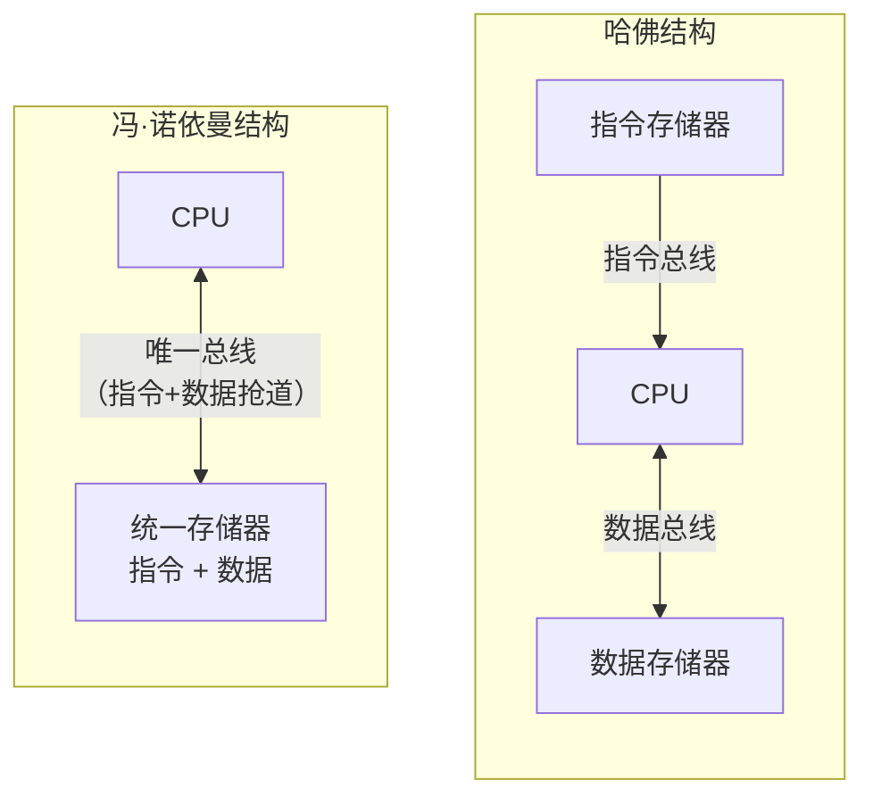
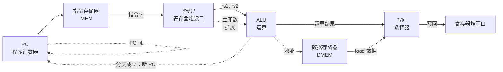
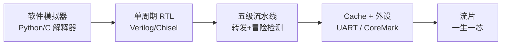
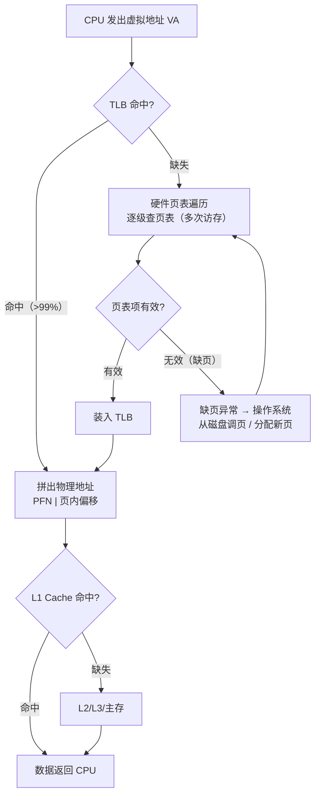

# 计算机组成原理

> 从一根导线上的高低电平，到能跑大模型的算力集群——本讲义讲清楚中间那几层抽象是怎么搭起来的。

## 0. AI 时代为什么还要学计组

有人说模型都能自动写代码了，还抠什么补码和流水线？恰恰相反：**AI 把计组从"考研科目"变回了"生产力科目"**。

理由有三。**第一，算力瓶颈在硬件不在算法。** 训练大模型每天面对的是 fp16/bf16/fp8 精度、HBM 带宽、算子融合、KV Cache 命中率、张量并行通信开销——全是计组概念延伸。不懂组成原理，只能把 GPU 当黑盒，看着 30% 利用率束手无策。**第二，"内存墙"是最贵的一堵墙。** 半个世纪 CPU 算力涨约 10 万倍，DRAM 延迟只改善不到 10 倍：`算术强度 = 计算量 / 访存量` 直接决定程序是 compute-bound 还是 memory-bound，FlashAttention 正是为它而生。**第三，专用芯片时代需要懂底层的人。** GPU 的 CUDA Core、NPU 的脉动阵列，本质都是把"矩阵乘法"这一种运算的数据通路做到极致。

一句话：**上层框架屏蔽的是复杂度，不是物理定律。** 越往上走，越需要有人知道下面发生了什么。

---

## 1. 计算机系统概述

### 知识要点

| 概念 | 要点 |
|------|------|
| 冯·诺依曼结构 | 存储程序、程序控制；五大部件：运算器、控制器、存储器、输入、输出 |
| 核心思想 | 指令和数据同等地位存放于存储器，按地址访问 |
| 哈佛结构 | 指令与数据分开存储、独立总线；DSP 与 CPU 的 L1 Cache 常用 |
| 层次结构 | 应用软件 → 高级语言 → 汇编 → 操作系统 → ISA → 微架构 → 逻辑门 → 器件 |
| ISA 地位 | 软硬件分界契约。x86/ARM/RISC-V 是 ISA；Zen4/A17 是微架构 |
| CPU 时间 | `CPU时间 = 指令数 IC × CPI × 时钟周期 T = IC × CPI / f` |
| MIPS | `MIPS = f(MHz) / CPI`，每秒百万条指令；跨指令集不可比 |
| 阿姆达尔定律 | `加速比 = 1 / ((1-p) + p/s)`，p 为可优化部分占比 |

### 关键概念精讲

**冯·诺依曼瓶颈**：指令和数据共用一条总线，CPU 再快也得排队等这一根管子。整个存储层次、Cache、乱序执行、预取，全在给这个瓶颈打补丁。

两种结构的差别一图看清——冯·诺依曼结构里指令和数据挤同一条总线，哈佛结构给它们各修一条路（现代 CPU 的 L1 Cache 正是"内部哈佛、外部冯·诺依曼"的折中）：



**CPI 是个陷阱指标**：单看 CPI 低不代表快。RISC 的 CPI 接近 1，CISC 可能是 4，但 CISC 一条指令干的活多、`IC` 小。只有 `IC × CPI × T` 才是真实时间。MIPS 被戏称为 "Meaningless Indicator of Processor Speed" 正是此因。

| 因素 | 谁能影响 |
|------|----------|
| 指令数 IC | 算法、编译器、指令集 |
| CPI | 微架构（流水线、Cache、分支预测）、指令集 |
| 时钟周期 T | 工艺制程、电路设计、流水线深度 |

**阿姆达尔定律的残酷**：若 5% 串行，哪怕一万个核，加速比上限也只有 20 倍——这解释了大模型训练为何要拼命消除同步点。

### 案例代码：性能公式计算器

```python
# perf_calc.py —— 性能三要素与阿姆达尔定律
def cpu_time(ic, cpi, freq_hz):
    """CPU 时间 = 指令数 x CPI / 主频"""
    return ic * cpi / freq_hz

def amdahl(p, s):
    """p: 可加速部分占比; s: 该部分的加速倍数"""
    return 1.0 / ((1 - p) + p / s)

machines = [("CISC-A", 1_000_000, 4.0, 2.0), ("RISC-B", 1_600_000, 1.2, 2.0),
            ("RISC-C", 1_600_000, 1.2, 3.0)]
print(f"{'机器':<10}{'指令数':>10}{'CPI':>7}{'主频GHz':>9}{'时间(ms)':>11}{'MIPS':>9}")
for name, ic, cpi, ghz in machines:
    t = cpu_time(ic, cpi, ghz * 1e9)
    print(f"{name:<10}{ic:>10}{cpi:>7.1f}{ghz:>9.1f}{t*1e3:>11.3f}{ghz*1000/cpi:>9.0f}")
print("\nRISC-B 的 MIPS 是 CISC-A 的 5.6 倍，实际时间只快 2.1 倍——跨指令集比 MIPS 无意义。\n")

print(f"{'可并行占比':>12}{'加速100x':>12}{'加速无穷':>12}")
for p in (0.50, 0.90, 0.95, 0.99, 0.999):
    print(f"{p:>11.1%}{amdahl(p,100):>12.2f}{amdahl(p,1e9):>12.2f}")
print("\n结论: 90% 并行度下，堆一万张卡也只能加速约 10 倍；优化先找那 10% 串行。")
```

---

## 2. 数据的表示

### 知识要点

| 编码 | 定义（8 位） | 表示范围 | 0 的表示 |
|------|------------|----------|----------|
| 原码 | 最高位符号，其余绝对值 | -127~+127 | +0 和 -0 |
| 反码 | 负数时数值位取反 | -127~+127 | +0 和 -0 |
| 补码 | 负数时反码+1；`2^n - |x|` | -128~+127 | 唯一 |
| 移码 | 补码符号位取反；`移码 = 真值 + 偏置` | -128~+127 | 唯一 |

- **补码是硬件唯一选择**：符号位直接参与运算，减法变加法（`A - B = A + (-B)补`），一个加法器搞定。
- **IEEE 754 浮点**三字段：符号 S、阶码 E（移码）、尾数 M（原码，规格化时有隐含 1）。阶码全 0 为非零规范数或 0，全 1 为无穷大或 NaN。

| 格式 | 总位 | 符号 | 阶码 | 尾数 | 偏置 | 十进制有效位 |
|------|------|------|------|------|------|--------------|
| binary16 (fp16) | 16 | 1 | 5 | 10 | 15 | ~3.3 |
| bfloat16 | 16 | 1 | 8 | 7 | 127 | ~2.4 |
| binary32 (float) | 32 | 1 | 8 | 23 | 127 | ~7.2 |
| binary64 (double) | 64 | 1 | 11 | 52 | 1023 | ~15.9 |

单精度 32 位的三段划分如下图。真值公式：规格化数 `V = (-1)^S × 1.M × 2^(E-127)`，其中隐含的 "1." 不占存储位——白赚 1 位精度：

<svg viewBox="0 0 680 170" role="img" aria-label="IEEE 754 单精度位域划分图">
  <text x="340" y="18" text-anchor="middle" fill="var(--text)" font-size="14" font-weight="bold">IEEE 754 单精度（binary32）位域划分</text>
  <!-- 位号 -->
  <text x="40" y="44" text-anchor="middle" fill="var(--text)" font-size="11">31</text>
  <text x="62" y="44" text-anchor="middle" fill="var(--text)" font-size="11">30</text>
  <text x="196" y="44" text-anchor="middle" fill="var(--text)" font-size="11">23</text>
  <text x="220" y="44" text-anchor="middle" fill="var(--text)" font-size="11">22</text>
  <text x="648" y="44" text-anchor="middle" fill="var(--text)" font-size="11">0</text>
  <!-- 符号位 -->
  <rect x="30" y="52" width="22" height="44" fill="var(--accent)" stroke="var(--text)" stroke-width="1"/>
  <text x="41" y="79" text-anchor="middle" fill="var(--panel)" font-size="13" font-weight="bold">S</text>
  <!-- 阶码 -->
  <rect x="52" y="52" width="155" height="44" fill="none" stroke="var(--text)" stroke-width="1"/>
  <text x="129" y="73" text-anchor="middle" fill="var(--text)" font-size="12" font-weight="bold">阶码 E（8 位）</text>
  <text x="129" y="90" text-anchor="middle" fill="var(--text)" font-size="11">移码，偏置 127</text>
  <!-- 尾数 -->
  <rect x="207" y="52" width="443" height="44" fill="var(--panel)" stroke="var(--text)" stroke-width="1"/>
  <text x="428" y="73" text-anchor="middle" fill="var(--text)" font-size="12" font-weight="bold">尾数 M（23 位）</text>
  <text x="428" y="90" text-anchor="middle" fill="var(--text)" font-size="11">原码小数，隐含整数位 1.</text>
  <!-- 示例 -->
  <text x="30" y="122" fill="var(--text)" font-size="12">例：-118.625 = -1110110.101₂ = -1.110110101 × 2⁶</text>
  <text x="30" y="142" fill="var(--text)" font-size="12">S=1，E = 6+127 = 133 = 10000101₂，M = 11011010100...0 → 0xC2ED4000</text>
  <text x="30" y="162" fill="var(--text)" font-size="11">阶码全 0（非规格化数/零）与全 1（无穷/NaN）是保留模式，不套上面公式。</text>
</svg>

### 关键概念精讲

**补码为何统一加减法**：把 n 位机器看成一个模 `2^n` 的钟表。`-3` 与 `+13`（4 位机）在模 16 下等价，故 `5-3` 与 `5+13=18≡2(mod 16)` 相同。硬件只需一个加法器加取反+1 电路。

**阶码为何用移码**：浮点数比较大小时希望像整数逐位比。移码让阶码单调递增，正浮点位模式按无符号整数比大小即正确顺序。

**bf16 为何在 AI 圈赢 fp16**：bf16 牺牲尾数（7 位）保住 8 位阶码，动态范围与 fp32 相同。深度学习梯度值域跨十几个数量级，**范围比精度更要命**——fp16 易溢出成 inf，bf16 不会，且与 fp32 转换只需截断/补零。

**浮点不满足结合律**：`(a+b)+c != a+(b+c)` 普遍成立，是多卡训练复现困难的根源之一。

### 案例代码：补码运算与位级验算

```python
# twos_complement.py —— 补码的构造、运算与溢出
to_twos = lambda x, b=8: x & ((1 << b) - 1)
from_twos = lambda v, b=8: (v & ((1 << b) - 1)) - (1 << b) if (v >> (b - 1)) & 1 else v & ((1 << b) - 1)

print("=== 8 位三种编码对照 ===")
for x in (0, 5, -1, -5, -127, -128, 127):
    if x == -128:
        print(f"{x:>5}  原码/反码无法表示        补码={to_twos(x):08b}  (补码白赚的一个)")
        continue
    sm = (0x80 | abs(x)) if x < 0 else x
    oc = (0x80 | (~abs(x) & 0x7F)) if x < 0 else x
    print(f"{x:>5}  原码={sm:08b} 反码={oc:08b} 补码={to_twos(x):08b} (0x{to_twos(x):02X})")

print("\n=== 减法 = 加负数补码（模 2^8，进位自然丢弃）===")
raw = to_twos(50) + to_twos(-30)
print(f"50 - 30: {to_twos(50):08b} + {to_twos(-30):08b} = {raw:09b} -> {to_twos(raw):08b} = {from_twos(raw)}")
assert from_twos(raw) == 20

print("\n=== 溢出判断：三种方法互相验证 ===")
def add8(a, b):
    ra, rb = to_twos(a), to_twos(b)
    s = ra + rb
    res, c_in, c_out = to_twos(s), ((ra & 0x7F) + (rb & 0x7F)) >> 7, s >> 8
    m1 = (ra >> 7) == (rb >> 7) and (res >> 7) != (ra >> 7)
    m2 = bool(c_in ^ c_out)
    m3 = (((ra >> 7) + (rb >> 7) + c_in) & 0b11) in (0b01, 0b10)
    assert m1 == m2 == m3, (a, b)
    return from_twos(res), m1

for a, b in [(100, 27), (100, 28), (-100, -28), (-100, -29), (127, 1), (-128, -1)]:
    r, ovf = add8(a, b)
    print(f"{a:>5} + {b:>4} = {r:>5}  ({'溢出!' if ovf else '正常'})  真值应为 {a + b}")

print("\n结论: 硬件不抛异常，溢出只是悄悄回绕。C 语言 signed 溢出属未定义行为，")
print("      unsigned 才保证模运算语义——这是无数安全漏洞的源头。")
```

完整的 IEEE 754 手工编解码器见 `code/03-organization/ieee754.py`，逐位对照 `struct` 并解释 `0.1 + 0.2 != 0.3` 的位级原因。

---

## 3. 运算方法与 ALU

### 知识要点

| 运算 | 核心方法 |
|------|----------|
| 加法 | 全加器串联=行波进位（慢）；先行进位 CLA（并行算进位，快） |
| 减法 | `A - B = A + (~B) + 1`，与加法共用电路 |
| 乘法 | 移位相加；Booth 算法；华莱士树压缩部分积 |
| 溢出判断 | 同号相加异号、进位异或、双符号位，三法等价 |
| 浮点加减 | 对阶（小阶向大阶）→ 尾数加减 → 规格化 → 舍入 |
| 舍入方式 | 就近（偶数优先）、朝零、朝正无穷、朝负无穷 |

### 关键概念精讲

**行波进位为何慢**：n 位加法器最高位须等前 n-1 位进位，延迟正比于 n。**CLA** 引入生成 `G=A·B` 与传播 `P=A+B`，把进位表达为纯组合逻辑，用面积换延迟——这是"并行化"在门电路层的第一次出现。

**对阶为何小阶向大阶**：大阶向小阶靠要左移尾数，会溢出丢高位（灾难）；小阶向大阶是右移，只丢低位（可接受）。

**大数吃小数**：`1e8 + 1` 在 fp32 下等于 `1e8`——对阶后 1 被右移出尾数范围。深度学习累加上百万梯度须用 fp32 累加器，**这正是 Kahan 补偿求和存在的理由**。

**ALU 的本质**是个多路选择器：把加法器、逻辑门、移位器结果并行算出，再由 `ALUOp` 选一个输出。

### 案例代码：一个能跑的 ALU

```python
# alu.py —— 8 位 ALU 与浮点对阶演示
import struct
MASK = 0xFF
sext = lambda v, b=8: v - (1 << b) if v >> (b - 1) else v

class ALU:
    """8 位算术逻辑单元：并行算出所有结果 + 多路选择器，输出 Z/N/C/V 标志。"""
    def exec(self, op, a, b):
        a &= MASK; b &= MASK
        c = v = 0
        if op == "ADD":
            raw = a + b; r = raw & MASK; c = raw >> 8
            v = int((a >> 7) == (b >> 7) and (r >> 7) != (a >> 7))
        elif op == "SUB":
            raw = a + (~b & MASK) + 1; r = raw & MASK; c = raw >> 8
            v = int((a >> 7) != (b >> 7) and (r >> 7) != (a >> 7))
        elif op == "AND": r = a & b
        elif op == "OR":  r = a | b
        elif op == "XOR": r = a ^ b
        elif op == "SLL": r = (a << (b & 7)) & MASK
        elif op == "SRL": r = a >> (b & 7)
        elif op == "SRA": r = (sext(a) >> (b & 7)) & MASK
        elif op == "SLT": r = int(sext(a) < sext(b))
        else: raise ValueError(op)
        return r, {"Z": int(r == 0), "N": r >> 7, "C": c, "V": v}

alu = ALU()
print("=== ALU 功能验证 ===")
print(f"{'操作':<6}{'A':>8}{'B':>8}{'结果':>10}{'有符号':>8}   置位标志")
for op, a, b in [("ADD",0x7F,0x01),("ADD",0x10,0x20),("SUB",0x10,0x20),
                 ("AND",0xF0,0x3C),("XOR",0xFF,0x0F),("SLL",0x81,1),
                 ("SRL",0x81,1),("SRA",0x81,1),("SLT",0xFF,0x01)]:
    r, f = alu.exec(op, a, b)
    print(f"{op:<6}{a:>#8x}{b:>#8x}{r:>#10x}{sext(r):>8}   {' '.join(k for k,x in f.items() if x) or '-'}")
print("SRL(0x81)=64(无符号)；SRA(0x81)=-64(保号，等价除以2)。")

print("\n=== fp32 加法：大数吃小数 ===")
fp32 = lambda x: struct.unpack(">f", struct.pack(">f", x))[0]
for x, y in [(1e8, 1.0), (1e7, 1.0)]:
    s = fp32(x + y)
    print(f"  fp32: {x:g} + {y:g} = {s:g}  ->  x+y==x ? {s == x}")
print("\n结论: fp32 尾数仅 23 位，1e8 量级相邻浮点已相差 8，加 1 改不动任何一位；")
print("      深度学习累加百万梯度须用 fp32 累加器，正为躲此坑。")
```

---

## 4. 存储系统

### 知识要点

**存储层次金字塔**（典型值）：

| 层级 | 容量 | 访问延迟 | 每字节成本 | 管理者 |
|------|------|----------|-----------|--------|
| 寄存器 | 数百字节 | < 1 周期 | 极高 | 编译器 |
| L1 Cache | 32~64 KB | 3~5 周期 | 高 | 硬件 |
| L2 Cache | 256KB~2MB | 10~20 周期 | 较高 | 硬件 |
| L3 Cache | 8~64 MB | 30~60 周期 | 中 | 硬件 |
| 主存 DRAM | 8~512 GB | 200~300 周期 | 低 | OS |
| SSD/HDD | TB 级 | 10 万~1000 万周期 | 极低 | OS |

<svg viewBox="0 0 680 300" role="img" aria-label="存储层次金字塔">
  <text x="340" y="20" text-anchor="middle" fill="var(--text)" font-size="14" font-weight="bold">存储层次金字塔：越往上越快越贵越小</text>
  <!-- 梯形分层，自上而下 -->
  <polygon points="310,34 370,34 390,72 290,72" fill="var(--accent)" stroke="var(--text)" stroke-width="1"/>
  <text x="340" y="58" text-anchor="middle" fill="var(--panel)" font-size="12" font-weight="bold">寄存器</text>
  <polygon points="290,76 390,76 410,114 270,114" fill="var(--panel)" stroke="var(--text)" stroke-width="1"/>
  <text x="340" y="99" text-anchor="middle" fill="var(--text)" font-size="12">L1 Cache（SRAM）</text>
  <polygon points="270,118 410,118 430,156 250,156" fill="var(--panel)" stroke="var(--text)" stroke-width="1"/>
  <text x="340" y="141" text-anchor="middle" fill="var(--text)" font-size="12">L2 Cache（SRAM）</text>
  <polygon points="250,160 430,160 450,198 230,198" fill="var(--panel)" stroke="var(--text)" stroke-width="1"/>
  <text x="340" y="183" text-anchor="middle" fill="var(--text)" font-size="12">L3 Cache（SRAM，共享）</text>
  <polygon points="230,202 450,202 470,240 210,240" fill="var(--panel)" stroke="var(--text)" stroke-width="1"/>
  <text x="340" y="225" text-anchor="middle" fill="var(--text)" font-size="12">主存 DRAM</text>
  <polygon points="210,244 470,244 490,282 190,282" fill="var(--panel)" stroke="var(--text)" stroke-width="1"/>
  <text x="340" y="267" text-anchor="middle" fill="var(--text)" font-size="12">SSD / HDD</text>
  <!-- 左侧容量 -->
  <text x="180" y="58" text-anchor="end" fill="var(--text)" font-size="11">数百 B</text>
  <text x="180" y="99" text-anchor="end" fill="var(--text)" font-size="11">32~64 KB</text>
  <text x="180" y="141" text-anchor="end" fill="var(--text)" font-size="11">256KB~2MB</text>
  <text x="180" y="183" text-anchor="end" fill="var(--text)" font-size="11">8~64 MB</text>
  <text x="180" y="225" text-anchor="end" fill="var(--text)" font-size="11">8~512 GB</text>
  <text x="180" y="267" text-anchor="end" fill="var(--text)" font-size="11">TB 级</text>
  <!-- 右侧延迟 -->
  <text x="500" y="58" fill="var(--text)" font-size="11">&lt;1 周期</text>
  <text x="500" y="99" fill="var(--text)" font-size="11">3~5 周期</text>
  <text x="500" y="141" fill="var(--text)" font-size="11">10~20 周期</text>
  <text x="500" y="183" fill="var(--text)" font-size="11">30~60 周期</text>
  <text x="500" y="225" fill="var(--text)" font-size="11">200~300 周期</text>
  <text x="500" y="267" fill="var(--text)" font-size="11">10⁵~10⁷ 周期</text>
  <!-- 两侧箭头 -->
  <line x1="60" y1="270" x2="60" y2="46" stroke="var(--text)" stroke-width="1.5"/>
  <polygon points="60,38 55,50 65,50" fill="var(--text)"/>
  <text x="60" y="290" text-anchor="middle" fill="var(--text)" font-size="11">更快、更贵</text>
  <line x1="620" y1="46" x2="620" y2="270" stroke="var(--text)" stroke-width="1.5"/>
  <polygon points="620,278 615,266 625,266" fill="var(--text)"/>
  <text x="620" y="34" text-anchor="middle" fill="var(--text)" font-size="11">更大、更便宜</text>
</svg>

**SRAM vs DRAM**：SRAM 是 6 管双稳态触发器，不需刷新、快、贵、低密度，用于 Cache/寄存器堆；DRAM 是 1 管 1 电容，需 64ms 一轮刷新、慢、便宜、高密度，用于主存/显存。

**Cache 三种映射**：`地址 = Tag | Index | Offset`。

| 方式 | 主存块可放位置 | 冲突缺失 | 硬件复杂度 |
|------|---------------|----------|-----------|
| 直接映射 | 唯一一行 | 严重 | 最低 |
| 全相联 | 任意行 | 无 | 最高 |
| N 路组相联 | 组内任意一路 | 较少 | 折中 |

直接映射下一次访存的完整流程如下图（以 32KB Cache、64B 块为例）：Index 选行、Tag 比对、Offset 选字节，三段各司其职。

<svg viewBox="0 0 680 270" role="img" aria-label="Cache 地址划分与直接映射示意">
  <text x="340" y="18" text-anchor="middle" fill="var(--text)" font-size="14" font-weight="bold">32 位地址的拆分与直接映射查找（32KB / 64B 块 / 512 行）</text>
  <!-- 地址条 -->
  <rect x="60" y="34" width="290" height="34" fill="var(--panel)" stroke="var(--text)" stroke-width="1"/>
  <text x="205" y="56" text-anchor="middle" fill="var(--text)" font-size="12" font-weight="bold">Tag（17 位）</text>
  <rect x="350" y="34" width="160" height="34" fill="var(--accent)" stroke="var(--text)" stroke-width="1"/>
  <text x="430" y="56" text-anchor="middle" fill="var(--panel)" font-size="12" font-weight="bold">Index（9 位）</text>
  <rect x="510" y="34" width="110" height="34" fill="var(--panel)" stroke="var(--text)" stroke-width="1"/>
  <text x="565" y="56" text-anchor="middle" fill="var(--text)" font-size="12" font-weight="bold">Offset（6 位）</text>
  <text x="60" y="30" fill="var(--text)" font-size="10">31</text>
  <text x="352" y="30" fill="var(--text)" font-size="10">14</text>
  <text x="512" y="30" fill="var(--text)" font-size="10">5</text>
  <text x="612" y="30" fill="var(--text)" font-size="10">0</text>
  <!-- Cache 行阵列 -->
  <rect x="230" y="120" width="330" height="120" fill="none" stroke="var(--text)" stroke-width="1"/>
  <line x1="230" y1="150" x2="560" y2="150" stroke="var(--text)" stroke-width="0.7"/>
  <line x1="230" y1="180" x2="560" y2="180" stroke="var(--text)" stroke-width="0.7"/>
  <line x1="230" y1="210" x2="560" y2="210" stroke="var(--text)" stroke-width="0.7"/>
  <line x1="270" y1="120" x2="270" y2="240" stroke="var(--text)" stroke-width="0.7"/>
  <line x1="390" y1="120" x2="390" y2="240" stroke="var(--text)" stroke-width="0.7"/>
  <text x="250" y="114" text-anchor="middle" fill="var(--text)" font-size="10">有效位</text>
  <text x="330" y="114" text-anchor="middle" fill="var(--text)" font-size="10">Tag 存储</text>
  <text x="475" y="114" text-anchor="middle" fill="var(--text)" font-size="10">数据块（64B）</text>
  <text x="215" y="140" text-anchor="end" fill="var(--text)" font-size="10">行 0</text>
  <text x="215" y="170" text-anchor="end" fill="var(--text)" font-size="10">行 1</text>
  <rect x="230" y="180" width="330" height="30" fill="var(--accent)" opacity="0.25"/>
  <text x="215" y="200" text-anchor="end" fill="var(--accent)" font-size="10" font-weight="bold">行 i</text>
  <text x="215" y="232" text-anchor="end" fill="var(--text)" font-size="10">行 511</text>
  <!-- Index 箭头：选行 -->
  <path d="M 430 68 L 430 88 L 180 88 L 180 195 L 226 195" fill="none" stroke="var(--accent)" stroke-width="1.5"/>
  <polygon points="230,195 220,190 220,200" fill="var(--accent)"/>
  <text x="150" y="150" fill="var(--accent)" font-size="11" font-weight="bold">① 选行</text>
  <!-- Tag 箭头：比较 -->
  <path d="M 205 68 L 205 78 L 610 78 L 610 160" fill="none" stroke="var(--text)" stroke-width="1.5"/>
  <circle cx="610" cy="176" r="14" fill="var(--panel)" stroke="var(--text)" stroke-width="1.5"/>
  <text x="610" y="181" text-anchor="middle" fill="var(--text)" font-size="12" font-weight="bold">=?</text>
  <path d="M 560 195 L 596 184" fill="none" stroke="var(--text)" stroke-width="1"/>
  <text x="640" y="168" fill="var(--text)" font-size="11">② 比较</text>
  <text x="610" y="215" text-anchor="middle" fill="var(--text)" font-size="11">相等且有效 → 命中</text>
  <!-- Offset -->
  <path d="M 565 68 L 565 84 L 475 84 L 475 116" fill="none" stroke="var(--text)" stroke-width="1" stroke-dasharray="4 3"/>
  <text x="480" y="100" fill="var(--text)" font-size="11">③ 选块内字节</text>
  <text x="340" y="262" text-anchor="middle" fill="var(--text)" font-size="11">相隔 32KB（512×64B）的地址 Index 相同，只能互踢同一行——冲突缺失的几何来源。</text>
</svg>

**替换算法**：LRU/FIFO/随机/伪LRU。**写策略**：写直达 vs 写回；写分配 vs 非写分配。**3C 缺失**：强制/容量/冲突。**虚拟存储**：页表 + TLB，`虚拟地址 = VPN | 页内偏移` 经 TLB 转 `PFN | 页内偏移`。

### 关键概念精讲

**局部性原理是整座金字塔的地基**：时间局部性（循环变量）靠保留，空间局部性（数组遍历）靠整块调入。

**AMAT 公式**：`AMAT = 命中时间 + 缺失率 × 缺失代价`。三个变量都能优化，这是 AI 算子优化的第一课。

**为何块大小普遍 64 字节**：块变大→强制缺失下降，但行数变少→冲突加剧。命中率曲线呈 U 形，64B 是工程谷底。

**TLB 是页表的 Cache**：命中率常 >99%，大页（Huge Page）能让同样 TLB 覆盖更大地址空间。

**内存墙量化**：命中率 99%、缺失代价 200 周期时 AMAT=3；掉到 95% 时 AMAT=11，慢近 4 倍。

### 案例代码：地址拆分与命中率

```python
# cache_addr.py —— Cache 地址拆分 + 直接映射命中率手算
def analyze(cache_size, block_size, ways, addr_bits=32):
    lines = cache_size // block_size
    sets = lines // ways
    offset = block_size.bit_length() - 1
    index = sets.bit_length() - 1
    tag = addr_bits - offset - index
    overhead = lines * (tag + 2)
    kind = "直接映射" if ways == 1 else ("全相联" if sets == 1 else f"{ways}路组相联")
    return dict(kind=kind, lines=lines, sets=sets, tag=tag, index=index,
                offset=offset, overhead_bits=overhead)

print("=== 32KB Cache，64B 块，不同相联度的地址划分 ===")
print(f"{'组织方式':<12}{'行数':>6}{'组数':>6}{'Tag':>6}{'Index':>7}{'Offset':>8}{'标记开销(B)':>13}")
for ways in (1, 2, 4, 8, 512):
    a = analyze(32 * 1024, 64, ways)
    print(f"{a['kind']:<12}{a['lines']:>6}{a['sets']:>6}{a['tag']:>6}"
          f"{a['index']:>7}{a['offset']:>8}{a['overhead_bits'] // 8:>13}")
print("\n相联度越高，Index 越少、Tag 越多，比较器也越多——面积与功耗的代价。")

print("\n=== 手工追踪：4 行直接映射 Cache（块 16B）===")
BLOCK, LINES = 16, 4
tags = [None] * LINES
seq = [0, 4, 8, 16, 20, 64, 68, 0, 4, 128, 0]
hits = 0
print(f"{'地址':>6}{'块号':>6}{'行号':>6}{'Tag':>6}   结果")
for addr in seq:
    blk = addr // BLOCK; line = blk % LINES; tag = blk // LINES
    hit = tags[line] == tag; hits += hit; tags[line] = tag
    print(f"{addr:>6}{blk:>6}{line:>6}{tag:>6}   {'命中' if hit else '缺失 -> 调入'}")
print(f"\n命中率 = {hits}/{len(seq)} = {hits / len(seq):.1%}")
print("地址 0 与 64 都映射行 0，反复互踢——这就是冲突缺失。")
```

完整 Cache 模拟器见 `code/03-organization/cache_sim.py`：支持直接/组相联/全相联与 LRU/FIFO，并用矩阵乘法 `ijk` 与 `ikj` 顺序实测命中率从 96.87% 升到 98.37%、分块后达 99.66%。

---

## 5. 指令系统

### 知识要点

**指令格式**：`操作码 OP | 地址码/操作数`；按地址码个数分零/一/二/三地址指令。

**常见寻址方式**：立即（`操作数在指令中`）、寄存器（`EA=寄存器`）、直接（`EA=A`）、间接（`EA=(A)`）、寄存器间接（`EA=(Ri)`）、基址（`EA=(基址)+A`）、变址（`EA=(变址)+A`，数组遍历）、相对（`EA=PC+A`，分支/PIE）、堆栈（`EA=SP`）。

**CISC vs RISC**：

| 维度 | CISC（x86） | RISC（ARM/RISC-V/MIPS） |
|------|-------------|------------------------|
| 指令长度 | 变长 1~15 字节 | 定长多为 4 字节 |
| 访存 | 多数指令可访存 | 仅 load/store |
| 寄存器 | 少（x86-64 为 16） | 多（32） |
| 控制器 | 微程序为主 | 硬布线为主 |
| CPI | 高但 IC 低 | 低但 IC 高 |

现代 x86 是"CISC 外壳 + RISC 内核"：前端译码成 μops 送乱序引擎。

**RISC-V 要点**：开源模块化 ISA，RV32I 仅 47 条指令，扩展 `M/A/F/D/C/V`。`RV64GC=IMAFDC`。`x0` 恒 0，使 `mv rd,rs` 复用 `addi rd,rs,0`、`nop` 即 `addi x0,x0,0`。RV32I 六种格式（R/I/S/B/U/J）的 `rs1/rs2/rd` 位置固定，译码时可先读寄存器。

### 关键概念精讲

**三条经验法则（Patterson & Hennessy）**：简单源于规整、越小越快（32 寄存器是速度与溢出频率的平衡）、优秀设计需折中（RISC-V 立即数拆散只为符号位恒在最高位）。

**为何 load/store 架构更好流水**：仅一类指令需 MEM 段，其余 EX 结果直接进 WB，冒险种类大减。

### 案例代码：RISC-V 指令编解码

```python
# riscv_decode.py —— RV32I 指令编码与反汇编
REGS = ("zero ra sp gp tp t0 t1 t2 s0 s1 a0 a1 a2 a3 a4 a5 a6 a7 "
        "s2 s3 s4 s5 s6 s7 s8 s9 s10 s11 t3 t4 t5 t6").split()
sext = lambda v, b: v - (1 << b) if (v >> (b - 1)) & 1 else v

def decode(inst):
    """解析 32 位 RV32I 指令；rs1/rs2/rd 在所有格式中位置固定。"""
    if inst == 0x00000013:
        return "nop    (= addi zero, zero, 0)"
    op, rd = inst & 0x7F, (inst >> 7) & 0x1F
    f3, rs1, rs2, f7 = (inst >> 12) & 7, (inst >> 15) & 0x1F, (inst >> 20) & 0x1F, inst >> 25
    D, S1, S2 = REGS[rd], REGS[rs1], REGS[rs2]
    imm_i = sext(inst >> 20, 12)
    if op == 0x33:
        n = {(0,0):"add",(0,0x20):"sub",(7,0):"and",(6,0):"or",
             (4,0):"xor",(2,0):"slt",(1,0):"sll",(5,0x20):"sra"}.get((f3,f7),"?")
        return f"{n} {D}, {S1}, {S2}"
    if op == 0x13:
        n = {0:"addi",7:"andi",6:"ori",4:"xori",2:"slti"}.get(f3,"?")
        if n == "addi" and rs1 == 0: return f"li {D}, {imm_i}    (= addi {D}, zero, {imm_i})"
        if n == "addi" and imm_i == 0: return f"mv {D}, {S1}    (= addi {D}, {S1}, 0)"
        return f"{n} {D}, {S1}, {imm_i}"
    if op == 0x03:
        return f"{ {0:'lb',1:'lh',2:'lw',4:'lbu'}.get(f3,'?') } {D}, {imm_i}({S1})"
    if op == 0x23:
        return f"{ {0:'sb',1:'sh',2:'sw'}.get(f3,'?') } {S2}, {sext((f7<<5)|rd,12)}({S1})"
    if op == 0x63:
        imm = sext(((inst>>31)<<12)|(((inst>>7)&1)<<11)|
                   (((inst>>25)&0x3F)<<5)|(((inst>>8)&0xF)<<1), 13)
        return f"{ {0:'beq',1:'bne',4:'blt',5:'bge'}.get(f3,'?') } {S1}, {S2}, {imm:+d}"
    return f"未支持 opcode 0x{op:02X}"

enc_r = lambda f7,rs2,rs1,f3,rd: (f7<<25)|(rs2<<20)|(rs1<<15)|(f3<<12)|(rd<<7)|0x33
enc_i = lambda imm,rs1,f3,rd,op=0x13: ((imm&0xFFF)<<20)|(rs1<<15)|(f3<<12)|(rd<<7)|op

print("=== RV32I 编码 -> 反汇编回环验证 ===")
for w, expect in [(enc_r(0x00,11,10,0,12),"add a2, a0, a1"),
                  (enc_r(0x20,11,10,0,12),"sub a2, a0, a1"),
                  (enc_i(42,0,0,10),"li a0, 42"),
                  (enc_i(0,10,0,11),"mv a1, a0"),
                  (enc_i(-8,2,2,8,0x03),"lw s0, -8(sp)"),
                  (0x00000013,"nop")]:
    print(f"0x{w:08X}  ->  {decode(w):<40} 期望: {expect}")
w = enc_r(0,11,10,0,12)
print(f"\n位域 0x{w:08X}: opcode=0x{w&0x7F:02X} rd=x{(w>>7)&0x1F} f3={(w>>12)&7} "
      f"rs1=x{(w>>15)&0x1F} rs2=x{(w>>20)&0x1F}")
print("rs1/rs2/rd 位置固定，译码可在识别类型前先把寄存器读出来——定长规整格式的最大红利。")
```

---

## 6. CPU 结构与数据通路

### 知识要点

**CPU = 运算器 + 控制器**。主要寄存器：PC（程序计数器）、IR（指令寄存器）、MAR/MDR（存储器地址/数据寄存器）、GPR（通用寄存器）、PSW（程序状态字，存 ZF/NF/CF/OF）。

**指令周期**：取指 →（间址）→ 执行 →（中断）。

**三种控制器对比**：

| 维度 | 硬布线 | 微程序 |
|------|--------|--------|
| 原理 | 组合逻辑直接产生控制信号 | 控制信号存成微指令逐条取出 |
| 速度 | 快 | 慢（多一次控存访问） |
| 灵活性 | 差，改设计重画电路 | 好，改控存即可 |
| 适用 | RISC | CISC（x86 至今靠微码打补丁） |

**三种数据通路对比**：

| 实现 | CPI | 时钟周期 | 特点 |
|------|-----|----------|------|
| 单周期 | 1 | 由最慢指令决定（长） | 简单，但被 load 拖累 |
| 多周期 | 3~5 | 由最慢单步决定（短） | 部件复用，需状态机 |
| 流水线 | 理想 1 | 短 | 吞吐最高，有冒险 |

### 关键概念精讲

**单周期"公平地慢"**：时钟须容纳最长指令（load 走满五段），`add` 明明 6ns 也要等满 8ns，所有指令为最慢那条陪绑。

**多周期**：把指令拆步，每步短周期，简单指令少走几步，代价是状态机 + 锁存中间结果。

**微程序 vs 硬布线是时代与场景之分**：今天 RISC 追求主频用硬布线；x86 仍用微码且能靠 BIOS 在线打补丁（Spectre/Meltdown 即靠微码缓解）。

**关键路径决定主频**：单周期关键路径 `PC → 指令存储器 → 寄存器堆 → ALU → 数据存储器 → 写口`，延迟之和取倒数即主频上限。

单周期数据通路的主干如下图，一条 load 指令要从左到右走完全程——这正是关键路径：



图中实线是 load 的必经之路（五段全走），虚线是分支回填与顺序取指。`add` 不经过 DMEM，却仍要等满整个时钟周期——"为最慢指令陪绑"。

### 案例代码：玩具 CPU 单周期模拟器（招牌案例）

完整实现见 `code/03-organization/toy_cpu.py`：TOY-16 16 位定长指令集、两趟汇编器、反汇编器、单周期模拟器。指令格式 `R 型: op[15:12]|rd[11:9]|rs1[8:6]|rs2[5:3]|000`；`I 型: op|rd|imm[8:0]`（9 位补码）；`M/J 型: op|rd|addr[8:0]`。示例程序「求 1+2+...+10」汇编为 `LOADI R1,0 / LOADI R2,1 / LOADI R3,11 / loop: SLT R4,R2,R3 / JZ R4,done / ADD R1,R1,R2 / ADDI R2,1 / JMP loop / done: STORE R1,100 / OUT R1 / HALT`，运行结果 `DMEM[100]=55`，共 58 周期，CPI=1.00。

三种实现实测对比：

| 实现 | 周期数 | 时钟(ns) | 总时间(ns) | CPI |
|------|--------|----------|-----------|-----|
| 单周期 | 58 | 8.0 | 464.0 | 1.00 |
| 多周期 | 209 | 2.0 | 418.0 | 3.60 |
| 五级流水（理想） | 62 | 2.2 | 136.4 | 1.07 |

多周期 CPI 是单周期 3.6 倍却更快——这是"CPI 不能单看"的最好证据。下面这段精简版（40 行）可独立运行，直接执行上面的机器码：

```python
# mini_cpu.py —— 单周期 CPU，直接执行 TOY-16 机器码
to_signed = lambda x, b=16: (x & ((1 << b) - 1)) - (1 << b) if (x >> (b - 1)) & 1 else x & ((1 << b) - 1)

class MiniCPU:
    def __init__(self, code):
        self.imem, self.dmem, self.reg = code, [0] * 256, [0] * 8
        self.pc = self.cycles = 0
        self.halted, self.out = False, []

    _r = lambda self, i: 0 if i == 0 else self.reg[i]
    def _w(self, i, v):
        if i: self.reg[i] = to_signed(v)

    def step(self):
        """一个时钟周期跑完一条指令，CPI 恒为 1。"""
        if self.pc >= len(self.imem):
            self.halted = True; return
        w = self.imem[self.pc]; self.pc += 1                   # ---- IF 取指 ----
        op = (w >> 12) & 0xF                                   # ---- ID 译码 ----
        rd, rs1, rs2 = (w >> 9) & 7, (w >> 6) & 7, (w >> 3) & 7
        imm, addr = to_signed(w & 0x1FF, 9), w & 0x1FF
        R, W = self._r, self._w                                # ---- EX/MEM/WB ----
        if   op == 0x0: self.halted = True
        elif op == 0x1: W(rd, imm)
        elif op == 0x2: W(rd, self.dmem[addr])
        elif op == 0x3: self.dmem[addr] = R(rd)
        elif op == 0x4: W(rd, R(rs1) + R(rs2))
        elif op == 0x5: W(rd, R(rs1) - R(rs2))
        elif op == 0x8: W(rd, int(R(rs1) < R(rs2)))
        elif op == 0x9: W(rd, R(rd) + imm)
        elif op == 0xA: self.pc = addr
        elif op == 0xB: self.pc = addr if R(rd) == 0 else self.pc
        elif op == 0xC: self.pc = addr if R(rd) != 0 else self.pc
        elif op == 0xD: self.out.append(R(rd))
        else: raise ValueError(f"非法操作码 0x{op:X}")
        self.cycles += 1

    def run(self):
        while not self.halted: self.step()
        return self

CODE = [0x1200, 0x1401, 0x160B, 0x8898, 0xB808, 0x4250, 0x9401, 0xA003, 0x3264, 0xD200, 0x0000]
cpu = MiniCPU(CODE).run()
print(f"输出 = {cpu.out}  DMEM[100] = {cpu.dmem[100]}  周期 = {cpu.cycles}  CPI=1.00")
assert cpu.dmem[100] == 55 and cpu.out == [55]

stage_ns = {"IF":2.0,"ID":1.0,"EX":2.0,"MEM":2.0,"WB":1.0}
T = sum(stage_ns.values())          # 单周期时钟须容纳走满五段的 LOAD
print(f"关键路径 = {'+'.join(f'{k}({v})' for k,v in stage_ns.items())} = {T}ns"
      f" -> 主频上限 {1000/T:.0f}MHz，程序耗时 {cpu.cycles*T}ns")
print("ADD 用不到 MEM 段却也要等满 8ns——单周期「为最慢指令陪绑」的代价。")
```

运行 `python code/03-organization/toy_cpu.py` 可见四组演示：求和逐周期追踪、数组访存、16 位补码溢出回绕、三种实现性能对比。

---

## 7. 流水线

### 知识要点

**经典五级流水**：IF → ID → EX → MEM → WB。

下面的时空图是理解流水线的钥匙：横轴时钟周期、纵轴指令，同一列的五种颜色说明五个部件在同一拍各干各的活。第 2 条指令因 load-use 冒险插了一个气泡，其后指令整体顺延一拍：

<svg viewBox="0 0 680 320" role="img" aria-label="五级流水线时空图，含 load-use 气泡">
  <text x="340" y="18" text-anchor="middle" fill="var(--text)" font-size="14" font-weight="bold">五级流水线时空图（含 load-use 停顿）</text>
  <!-- 周期表头 -->
  <text x="80" y="46" text-anchor="middle" fill="var(--text)" font-size="11" font-weight="bold">时钟周期 →</text>
  <text x="181" y="46" text-anchor="middle" fill="var(--text)" font-size="12">1</text>
  <text x="237" y="46" text-anchor="middle" fill="var(--text)" font-size="12">2</text>
  <text x="293" y="46" text-anchor="middle" fill="var(--text)" font-size="12">3</text>
  <text x="349" y="46" text-anchor="middle" fill="var(--text)" font-size="12">4</text>
  <text x="405" y="46" text-anchor="middle" fill="var(--text)" font-size="12">5</text>
  <text x="461" y="46" text-anchor="middle" fill="var(--text)" font-size="12">6</text>
  <text x="517" y="46" text-anchor="middle" fill="var(--text)" font-size="12">7</text>
  <text x="573" y="46" text-anchor="middle" fill="var(--text)" font-size="12">8</text>
  <text x="629" y="46" text-anchor="middle" fill="var(--text)" font-size="12">9</text>
  <!-- I1: lw -->
  <text x="148" y="76" text-anchor="end" fill="var(--text)" font-size="11" font-family="monospace">lw x1,0(x2)</text>
  <rect x="155" y="58" width="52" height="27" rx="3" fill="#4e79a7"/><text x="181" y="76" text-anchor="middle" fill="#fff" font-size="11" font-weight="bold">IF</text>
  <rect x="211" y="58" width="52" height="27" rx="3" fill="#59a14f"/><text x="237" y="76" text-anchor="middle" fill="#fff" font-size="11" font-weight="bold">ID</text>
  <rect x="267" y="58" width="52" height="27" rx="3" fill="#f28e2b"/><text x="293" y="76" text-anchor="middle" fill="#fff" font-size="11" font-weight="bold">EX</text>
  <rect x="323" y="58" width="52" height="27" rx="3" fill="#b07aa1"/><text x="349" y="76" text-anchor="middle" fill="#fff" font-size="11" font-weight="bold">MEM</text>
  <rect x="379" y="58" width="52" height="27" rx="3" fill="#e15759"/><text x="405" y="76" text-anchor="middle" fill="#fff" font-size="11" font-weight="bold">WB</text>
  <!-- I2: add 依赖 x1 -->
  <text x="148" y="112" text-anchor="end" fill="var(--text)" font-size="11" font-family="monospace">add x3,x1,x4</text>
  <rect x="211" y="94" width="52" height="27" rx="3" fill="#4e79a7"/><text x="237" y="112" text-anchor="middle" fill="#fff" font-size="11" font-weight="bold">IF</text>
  <rect x="267" y="94" width="52" height="27" rx="3" fill="#59a14f"/><text x="293" y="112" text-anchor="middle" fill="#fff" font-size="11" font-weight="bold">ID</text>
  <rect x="323" y="94" width="52" height="27" rx="3" fill="none" stroke="var(--text)" stroke-width="1.2" stroke-dasharray="5 3"/><text x="349" y="112" text-anchor="middle" fill="var(--text)" font-size="11">气泡</text>
  <rect x="379" y="94" width="52" height="27" rx="3" fill="#f28e2b"/><text x="405" y="112" text-anchor="middle" fill="#fff" font-size="11" font-weight="bold">EX</text>
  <rect x="435" y="94" width="52" height="27" rx="3" fill="#b07aa1"/><text x="461" y="112" text-anchor="middle" fill="#fff" font-size="11" font-weight="bold">MEM</text>
  <rect x="491" y="94" width="52" height="27" rx="3" fill="#e15759"/><text x="517" y="112" text-anchor="middle" fill="#fff" font-size="11" font-weight="bold">WB</text>
  <!-- I3: sub -->
  <text x="148" y="148" text-anchor="end" fill="var(--text)" font-size="11" font-family="monospace">sub x5,x3,x6</text>
  <rect x="267" y="130" width="52" height="27" rx="3" fill="#4e79a7"/><text x="293" y="148" text-anchor="middle" fill="#fff" font-size="11" font-weight="bold">IF</text>
  <rect x="323" y="130" width="52" height="27" rx="3" fill="none" stroke="var(--text)" stroke-width="1.2" stroke-dasharray="5 3"/><text x="349" y="148" text-anchor="middle" fill="var(--text)" font-size="11">气泡</text>
  <rect x="379" y="130" width="52" height="27" rx="3" fill="#59a14f"/><text x="405" y="148" text-anchor="middle" fill="#fff" font-size="11" font-weight="bold">ID</text>
  <rect x="435" y="130" width="52" height="27" rx="3" fill="#f28e2b"/><text x="461" y="148" text-anchor="middle" fill="#fff" font-size="11" font-weight="bold">EX</text>
  <rect x="491" y="130" width="52" height="27" rx="3" fill="#b07aa1"/><text x="517" y="148" text-anchor="middle" fill="#fff" font-size="11" font-weight="bold">MEM</text>
  <rect x="547" y="130" width="52" height="27" rx="3" fill="#e15759"/><text x="573" y="148" text-anchor="middle" fill="#fff" font-size="11" font-weight="bold">WB</text>
  <!-- I4: or -->
  <text x="148" y="184" text-anchor="end" fill="var(--text)" font-size="11" font-family="monospace">or x7,x8,x9</text>
  <rect x="379" y="166" width="52" height="27" rx="3" fill="#4e79a7"/><text x="405" y="184" text-anchor="middle" fill="#fff" font-size="11" font-weight="bold">IF</text>
  <rect x="435" y="166" width="52" height="27" rx="3" fill="#59a14f"/><text x="461" y="184" text-anchor="middle" fill="#fff" font-size="11" font-weight="bold">ID</text>
  <rect x="491" y="166" width="52" height="27" rx="3" fill="#f28e2b"/><text x="517" y="184" text-anchor="middle" fill="#fff" font-size="11" font-weight="bold">EX</text>
  <rect x="547" y="166" width="52" height="27" rx="3" fill="#b07aa1"/><text x="573" y="184" text-anchor="middle" fill="#fff" font-size="11" font-weight="bold">MEM</text>
  <rect x="603" y="166" width="52" height="27" rx="3" fill="#e15759"/><text x="629" y="184" text-anchor="middle" fill="#fff" font-size="11" font-weight="bold">WB</text>
  <!-- 转发箭头: lw 的 MEM(周期4) -> add 的 EX(周期5) -->
  <path d="M 349 88 L 349 91 L 398 91 L 398 94" fill="none" stroke="var(--accent)" stroke-width="2"/>
  <polygon points="398,96 393,88 403,88" fill="var(--accent)"/>
  <text x="470" y="222" fill="var(--accent)" font-size="11" font-weight="bold">↑ MEM→EX 转发（即便如此仍须停 1 拍）</text>
  <!-- 竖线标注同一周期 -->
  <line x1="435" y1="55" x2="435" y2="198" stroke="var(--text)" stroke-width="0.8" stroke-dasharray="3 3"/>
  <text x="30" y="222" fill="var(--text)" font-size="11">周期 6 这一列：lw 已完成，add 在访存、sub 在运算、or 在译码——四个部件同拍并行。</text>
  <!-- 图例 -->
  <rect x="30" y="240" width="34" height="20" rx="3" fill="#4e79a7"/><text x="70" y="254" fill="var(--text)" font-size="11">IF 取指</text>
  <rect x="130" y="240" width="34" height="20" rx="3" fill="#59a14f"/><text x="170" y="254" fill="var(--text)" font-size="11">ID 译码</text>
  <rect x="230" y="240" width="34" height="20" rx="3" fill="#f28e2b"/><text x="270" y="254" fill="var(--text)" font-size="11">EX 执行</text>
  <rect x="330" y="240" width="34" height="20" rx="3" fill="#b07aa1"/><text x="370" y="254" fill="var(--text)" font-size="11">MEM 访存</text>
  <rect x="440" y="240" width="34" height="20" rx="3" fill="#e15759"/><text x="480" y="254" fill="var(--text)" font-size="11">WB 写回</text>
  <rect x="550" y="240" width="34" height="20" rx="3" fill="none" stroke="var(--text)" stroke-dasharray="5 3"/><text x="590" y="254" fill="var(--text)" font-size="11">停顿气泡</text>
  <text x="30" y="288" fill="var(--text)" font-size="11">4 条指令共 9 周期（理想应为 5+3=8），CPI = 9/4 = 2.25 → 消除气泡是提性能的直接抓手。</text>
  <text x="30" y="306" fill="var(--text)" font-size="11">lw 的数据周期 4 末才出，add 周期 4 就要进 EX——时间上不可能，转发也救不了，只能停顿。</text>
</svg>

**性能公式**：`T = max(各段延迟) + 流水线寄存器延迟`；n 条指令周期数 `= k + (n-1)`；加速比 `S = n·T_非流水 / ((k+n-1)·T_流水)`；`n→∞` 时 `S → T_非流水/T_流水`（除非各段完全均衡）；`TP = n / ((k+n-1)·T)`。

**三类冒险**：

| 冒险 | 起因 | 解法 |
|------|------|------|
| 结构 | 争抢同一硬件资源 | 指令/数据存储器分离、资源复制、停顿 |
| 数据 | 后条要用前条未写回结果 | 转发、停顿、编译器调度 |
| 控制 | 分支结果未定 | 分支预测、延迟槽、提前判定 |

**数据相关**：RAW（真相关，流水线必有）、WAR/WAW（乱序才需寄存器重命名）。**转发**三条通路：EX/MEM→EX、MEM/WB→EX、MEM/WB→MEM。**load-use 冒险**：load 数据到 MEM 末尾才出，紧跟指令即便转发也须停顿 1 拍。**分支预测**：静态（总跳/总不跳/后向跳前向不跳）、动态（1/2 位饱和计数器、BHT、BTB、TAGE）。

### 关键概念精讲

**流水线不减少单条指令延迟，只提吞吐率**：一条指令仍走 5 周期，但每周期完成一条。工厂流水线同理。

**级数不是越多越好**：每级付寄存器建立时间 + 时钟偏移，级数越深固定开销占比越大，分支惩罚随级数线性增长。Pentium 4 的 31 级是著名反面教材。

**2 位饱和计数器为何比 1 位好**：循环最后一次必错，1 位会翻转致下次首错（一循环错两次）；2 位需连错两次才改方向，错误率减半。

**分支预测杠杆**：`附加CPI = 分支占比 × 预测失败率 × 惩罚周期`。分支占 20%、惩罚 15 周期时，准确率 99%→95% 使 CPI 从 1.03 涨到 1.15，损失 10%。

### 案例代码：五级流水线时空图

完整实现见 `code/03-organization/pipeline_viz.py`（自动检测冒险、插气泡、画 ASCII 时空图）。核心思想是把每条指令五段解算成具体时刻，下面精简版可独立运行：

```python
# mini_pipeline.py —— 冒险检测 + 气泡插入 + 时空图
def simulate(prog, forwarding=True):
    """prog 每项 (助记符, 目的寄存器或 None, [源寄存器])"""
    sched = []
    for i, (op, rd, srcs) in enumerate(prog):
        if_c = 1 if i == 0 else sched[-1]["if"] + 1
        id_c, ex_c, note = if_c + 1, if_c + 2, ""
        for j in range(i - 1, max(-1, i - 4), -1):
            p_op, p_rd, _ = prog[j]
            if p_rd is None or p_rd not in srcs:
                continue
            ps = sched[j]
            if forwarding:
                if p_op.split()[0] == "LOAD":
                    if ps["me"] + 1 > ex_c: note = f"load-use({p_rd})"
                    ex_c = max(ex_c, ps["me"] + 1)
                else:
                    ex_c = max(ex_c, ps["ex"] + 1)
            else:
                if ps["wb"] + 1 > ex_c: note = f"RAW({p_rd})"
                ex_c = max(ex_c, ps["wb"] + 1)
            break
        ex_c = max(ex_c, sched[-1]["ex"] + 1) if sched else ex_c
        sched.append({"op":op,"if":if_c,"id":id_c,"ex":ex_c,"me":ex_c+1,"wb":ex_c+2,
                      "stall":ex_c-id_c-1,"note":note})
    return sched

def draw(sched, title):
    total = sched[-1]["wb"]
    print(f"\n{title}")
    print(" " * 18 + "".join(f"{c:>3}" for c in range(1, total + 1)))
    for r in sched:
        row = [""] * (total + 1)
        row[r["if"]], row[r["id"]] = "IF", "ID"
        for c in range(r["id"] + 1, r["ex"]): row[c] = " *"
        row[r["ex"]], row[r["me"]], row[r["wb"]] = "EX", "ME", "WB"
        print(f"{r['op']:<18}" + "".join(f"{row[c]:>3}" for c in range(1, total + 1))
              + (f"  <- {r['note']}" if r["note"] else ""))
    print(f"  总周期={total}  CPI={total/len(sched):.2f}  停顿={sum(r['stall'] for r in sched)}")
    return total

CHAIN = [("ADD  R1,R2,R3","R1",["R2","R3"]),("SUB  R4,R1,R5","R4",["R1","R5"]),
         ("AND  R6,R1,R4","R6",["R1","R4"]),("OR   R7,R6,R2","R7",["R6","R2"])]
a = draw(simulate(CHAIN, False), "【无转发】干等生产者写回寄存器堆")
b = draw(simulate(CHAIN, True), "【有转发】ALU 结果直接抄近道回送")
print(f"\n转发加速比 = {a}/{b} = {a/b:.2f}x")

draw(simulate([("LOAD R1,0(R6)","R1",["R6"]),("ADD  R2,R1,R3","R2",["R1","R3"]),
               ("SUB  R4,R2,R1","R4",["R2","R1"])], True), "【load-use】转发已开仍须停 1 拍")

print("\n分支占比 20%、失败惩罚 15 周期时的 CPI：")
for acc in (0.99, 0.95, 0.90, 0.80):
    print(f"  准确率 {acc:.0%} -> CPI = 1 + 0.2×{1-acc:.2f}×15 = {1+0.2*(1-acc)*15:.3f}")
```

实测加速比随指令数增长（各段 2/1/2/2/1 ns，寄存器 0.2ns）：n=1 时 0.73x、n=10 时 2.60x、n=1000 时 3.62x、n=1e5 时 3.64x。**上限 3.64 而非级数 5**——因各段延迟不均衡（最慢 2ns、平均 1.6ns）再加寄存器开销，故"切得均匀"是流水线设计第一要务。

---

## 8. 总线与输入输出

### 知识要点

**总线分类**：按功能分地址/数据/控制总线（地址线 n 位 → `2^n` 地址空间）；按位置分片内/系统/通信总线。**带宽** `= 总线宽度(字节) × 频率(Hz)`，如 64 位 1600MHz DDR 双沿：`8B×1600M×2 = 25.6 GB/s`。仲裁分集中式（链式/计数/独立请求）与分布式。

**I/O 控制方式对比**：

| 方式 | CPU 参与 | 数据流路径 | 适用 |
|------|----------|-----------|------|
| 程序查询（轮询） | 全程忙等 | 外设→CPU→内存 | 简单低速 |
| 程序中断 | 传输时参与 | 外设→CPU→内存 | 中低速随机事件 |
| DMA | 仅首尾参与 | 外设↔内存（绕开 CPU） | 高速块传输 |
| 通道/IOP | 几乎不参与 | I/O 处理机完成 | 大型机 |

**中断流程**：请求→判优→响应（关中断、保存断点、引ISR）→处理→返回。**DMA 三方式**：停CPU访存、周期挪用（最常用）、交替访存。

### 关键概念精讲

**中断为何提效**：轮询是"好了没"忙等，中断是"好了叫我"。但每次中断有几百~几千周期固定开销，高速设备用中断会被"中断风暴"打垮——万兆网卡每秒百万包，只能靠 NAPI（中断+轮询）或 DPDK（纯轮询）。**没有绝对更好的方案，只有匹配速率的方案。**

**DMA 价值是解放数据通路**：控制器接管总线，数据直进内存，CPU 同时干别的。GPU 训练 CPU 利用率压低靠的就是 DMA + 异步拷贝流水。

**Cache 一致性从这里开始**：DMA 改了内存，CPU 的 Cache 可能仍是旧副本。解决：缓冲区标不可缓存，或 DMA 后驱动主动失效相应 Cache 行——写驱动最易出诡异 bug 处。

### 案例代码：三种 I/O 方式的 CPU 占用率

```python
# io_compare.py —— 轮询 / 中断 / DMA 的 CPU 开销对比
BUS_BW = 12800.0      # 内存总线有效带宽 字节/微秒（约 12.8 GB/s）

def polling(n, per, dev): return (n // per) * dev
def interrupt(n, per, dev, isr=2.0): return (n // per) * isr
def dma(n, per, dev, setup=5.0): return setup * 2 + n / BUS_BW   # 仅与劳动者数据量有关

SIZE = 4 * 1024 * 1024
devices = [("慢速串口",1,100.0),("机械硬盘",512,10.0),("SATA SSD",4096,8.0),("NVMe SSD",4096,1.2)]
print("=== 传 4MB 时 CPU 占用（ms）===")
print(f"{'设备':<12}{'每次字节':>10}{'延迟us':>10}{'轮询':>12}{'中断':>10}{'DMA':>9}")
for name, per, lat in devices:
    p, i, d = (f(SIZE, per, lat) / 1000 for f in (polling, interrupt, dma))
    print(f"{name:<12}{per:>10}{lat:>10.1f}{p:>12.1f}{i:>10.2f}{d:>9.2f}")

print("\n观察1: 设备越慢轮询浪费越夸张（串口空转近 420 秒）。")
print("观察2: NVMe 中断比轮询贵——单次中断开销已超设备延迟，故 DPDK 回归轮询。")
print("观察3: DMA 开销只取决于数据量，与设备快慢无关，最稳定。")

print("\n=== 中断风暴：万兆网卡 100 万包/秒 ===")
pps, isr, cores = 1_000_000, 2.0, 8
cpu_pct = pps * isr / 1e6 * 100
print(f"  纯中断: {cpu_pct:.0f}% 单核时间；需 {cpu_pct/100:.1f} 核只处理中断（共 {cores} 核）")
print(f"  合并中断（每 64 包一次）: {cpu_pct/64:.1f}% —— 即 NAPI 思路")

print("\n=== 总线带宽 ===")
for name, gts, lanes, eff in [("PCIe 3.0 x16",8.0,16,128/130),("PCIe 4.0 x16",16.0,16,128/130),
                              ("PCIe 5.0 x16",32.0,16,128/130)]:
    print(f"  {name:<16} {gts:>5.1f} GT/s x{lanes:<3} -> {gts*lanes*eff/8:>6.1f} GB/s")
print("  对比 HBM3 单堆栈约 819 GB/s —— 显存必须贴着 GPU 封装。")
```

---

## 9. 多处理器与并行体系结构初步

### 知识要点

**Flynn 分类**：SISD（单核标量）、SIMD（SSE/AVX、GPU warp、NPU 向量）、MISD（极少见）、MIMD（多核、集群）。

**并行层次**：位级 → 指令级 ILP（流水线/超标量/乱序/VLIW）→ 数据级 DLP（SIMD/向量）→ 线程级 TLP（多核/SMT）→ 请求级 RLP（集群）。

**多核存储**：UMA（SMP，延迟一致）vs NUMA（跨节点慢 1.5~3 倍）。

**MESI 四状态**：

| 状态 | 含义 | 其他核副本 | 与内存一致 |
|------|------|-----------|-----------|
| M (Modified) | 已改，独占 | 否 | 否（脏） |
| E (Exclusive) | 独占未改 | 否 | 是 |
| S (Shared) | 共享 | 可能有 | 是 |
| I (Invalid) | 无效 | — | — |

**一致性模型**：顺序一致性 SC、TSO（x86）、弱一致性（ARM/RISC-V，需显式屏障）。**加速比定律**：阿姆达尔（固定规模，悲观）vs 古斯塔夫森（规模随核增，乐观）。

### 关键概念精讲

**伪共享是多线程头号隐形杀手**：两线程改互不相干变量，却落同一 64B Cache 行，每次写使对方行失效，核间互抢，性能暴跌一个数量级。解决：缓存行对齐填充（padding）。

**MESI 的代价**：每次写共享变量都要发总线嗅探/失效消息，核数越多一致性流量越大——这是多核扩展性天花板，也是 GPU 选弱一致性 + 显式同步（`__syncthreads()`）的原因。

**GPU 为何适合 AI**：非"核多"，而是三点合力——SIMT（一条指令驱动 32 线程，控制逻辑摊薄）、高访存带宽（HBM）、靠海量线程切换**隐藏**延迟（而非像 CPU 靠 Cache **降低**延迟）。CPU 是延迟优化机器，GPU 是吞吐优化机器。

### 案例代码：MESI 状态机与伪共享

```python
# mesi_sim.py —— MESI 一致性协议与伪共享
class MESIBus:
    """多核 MESI 模拟，每核每缓存行维护 M/E/S/I 之一。"""
    def __init__(self, n):
        self.n, self.st, self.msgs, self.wb, self.log = n, [{} for _ in range(n)], 0, 0, []

    def read(self, core, line):
        if self.st[core].get(line, "I") != "I":
            self.log.append(f"核{core} 读行{line}: 本地命中({self.st[core][line]})"); return
        self.msgs += 1
        holders = [c for c in range(self.n) if c != core and self.st[c].get(line,"I") != "I"]
        if not holders:
            self.st[core][line] = "E"
            self.log.append(f"核{core} 读行{line}: 从内存取, E(独占)")
        else:
            for c in holders:
                if self.st[c][line] == "M": self.wb += 1
                self.st[c][line] = "S"
            self.st[core][line] = "S"
            self.log.append(f"核{core} 读行{line}: 由核{holders} 供给 -> 双方 S(共享)")

    def write(self, core, line):
        if self.st[core].get(line, "I") == "M":
            self.log.append(f"核{core} 写行{line}: 已 M 独占, 零总线流量"); return
        self.msgs += 1
        killed = [c for c in range(self.n) if c != core and self.st[c].get(line,"I") != "I"]
        for c in killed:
            if self.st[c][line] == "M": self.wb += 1
            self.st[c][line] = "I"
        self.st[core][line] = "M"
        self.log.append(f"核{core} 写行{line}: {self.st[core].get(line,'I')} -> M" +
                        (f", 使核{killed} 失效" if killed else ""))

print("=== 场景1: 正常共享（两核读同行，一核写）===")
b = MESIBus(2); b.read(0,100); b.read(1,100); b.write(0,100); b.read(1,100)
print("\n".join("  " + x for x in b.log)); print(f"  总线消息 {b.msgs} 次, 脏行写回 {b.wb} 次")

print("\n=== 场景2: 伪共享（两核改不同变量却落同一行 200）===")
b = MESIBus(2)
for _ in range(5): b.write(0,200); b.write(1,200)
print(f"  10 次写产生 {b.msgs} 次总线失效消息，行在两核间来回弹跳")

print("=== 场景3: 缓存行对齐后（各自独占一行）===")
b = MESIBus(2)
for _ in range(5): b.write(0,200); b.write(1,201)
print(f"  同样 10 次写只产生 {b.msgs} 次总线消息，其余本地命中")
print("\n结论: 伪共享使互不相干变量彼此拖累，64B 对齐填充可根治——")
print("      即 Java @Contended、C++ alignas(64) 存在理由。")

print("\n=== 阿姆达尔 vs 古斯塔夫森（p=0.95）===")
print(f"{'核数':>6}{'阿姆达尔':>14}{'古斯塔夫森':>16}")
for n in (2, 8, 64, 1024, 8192):
    print(f"{n:>6}{1/(0.05+0.95/n):>14.2f}{0.05+0.95*n:>16.1f}")
print("阿姆达尔: 规模固定，串行锁死天花板（上限 20 倍）。")
print("古斯塔夫森: 核越多解越大问题，加速近似线性；大模型训练属后者。")
```

---

## 扩展知识点

以下方向按主题分组列出，其中三个最有价值的方向（RISC-V 与自制 CPU、虚拟存储与 TLB、DRAM/HBM 与内存墙）在本节末尾展开为正式小节。

**处理器微架构**：1) 超标量与乱序执行（Tomasulo、保留站、ROB、寄存器重命名消除 WAR/WAW，x86 执行窗口已达数百条）；2) 推测执行与安全（Spectre/Meltdown 揭示"性能优化引入安全漏洞"）；3) SMT/超线程（共享执行单元填补停顿，也带侧信道风险）；4) VLIW/EPIC（调度交编译器，Itanium 失败说明静态调度难应对动态缺失）；5) 自己写 CPU（Verilog/Chisel 实现 RV32I 单周期→五级流水→加 Cache，跑 riscv-tests；推荐"一生一芯"与 NEMU）。

**存储方向**：6) HBM（3D 堆叠 + TSV，HBM3 单堆栈约 819 GB/s，AI 芯片命脉）；7) CXL 互连（CPU/GPU/内存池共享一致地址空间）；8) 存内/近存计算 PIM（把计算搬进存储阵列绕开内存墙）；9) NVM（3D XPoint、ReRAM，模糊内存与存储边界）。

**芯片工程**：10) Chiplet 与先进封装（小裸片分制再封装提良率，AMD Zen、Intel Foveros 代表）；11) Dennard 缩放终结与暗硅（晶体管仍变小但功耗密度不降，催生异构专用加速器）；12) DSA 领域专用架构（TPU 脉动阵列、NPU、DPU；Hennessy & Patterson《新黄金时代》必读）。

**AI 硬件**：13) 张量核心与低精度（TF32、fp8 的 E4M3/E5M2、INT4 量化，混合精度须保留 fp32 主权重）；14) 算术强度与 Roofline（`算术强度 = FLOPs / 访存字节`，判断计算/访存受限的标准起手式）；15) FlashAttention 的启发（未改数学定义，仅分块+重计算把中间结果留 SRAM，纯存储层次优化却数倍加速——"懂计组"最好的商业价值证明）。

### 深入一：RISC-V 指令集详解与自制 CPU 路线

第 5 章介绍了 RISC-V 的骨架，这里回答两个更深的问题：**它的编码为什么长成那个怪样子**，以及**普通本科生怎么用它亲手造一颗 CPU**。

**模块化是 RISC-V 的第一性设计。** RV32I 基础整数指令集只有 47 条指令、冻结后永不改动；乘除（M）、原子（A）、单双精度浮点（F/D）、压缩（C）、向量（V）都是可选扩展。一颗给洗衣机用的 MCU 可以只实现 RV32EC，一颗服务器芯片实现 RV64GCV——同一套工具链、同一份教材。对比 x86 四十年积累的三千多条指令和无法删除的历史包袱，"做减法的权利"正是后发 ISA 最大的奢侈。

**立即数编码的"怪"全是精心设计。** 六种格式（R/I/S/B/U/J）中最让初学者困惑的是 B 型和 J 型：立即数的位被拆散打乱塞在指令各处。例如 B 型的 13 位偏移，`imm[12]` 在指令第 31 位、`imm[11]` 却在第 7 位。乱序的原因有两条铁律：① **符号位永远在指令最高位**（第 31 位），这样符号扩展电路不必等译码完成就能开工；② **`rs1/rs2/rd` 字段在所有格式中位置固定**，寄存器堆可以在识别指令类型之前就投机地把操作数读出来。位打乱增加的只是接线（免费），换来的是关键路径缩短（值钱）——硬件世界里"布线换时间"的经典交易。下面的代码逐位验证这套拆散-重组规则：

```python
# rv_imm.py —— B 型立即数的拆散与重组，逐位验证
def encode_b_imm(imm13):
    """把 13 位分支偏移（imm[0] 恒 0）拆进 B 型指令的 4 个碎片。"""
    u = imm13 & 0x1FFF
    return (((u >> 12) & 1) << 31) | (((u >> 5) & 0x3F) << 25) | \
           (((u >> 1) & 0xF) << 8) | (((u >> 11) & 1) << 7)

def decode_b_imm(inst):
    u = (((inst >> 31) & 1) << 12) | (((inst >> 7) & 1) << 11) | \
        (((inst >> 25) & 0x3F) << 5) | (((inst >> 8) & 0xF) << 1)
    return u - (1 << 13) if u >> 12 else u

print(f"{'偏移':>8}  指令中的碎片分布 [31|30:25|11:8|7]")
for off in (4, -4, 128, -2048, 4094, -4096):
    inst = encode_b_imm(off)
    back = decode_b_imm(inst)
    assert back == off, (off, back)
    print(f"{off:>8}  inst[31]={inst >> 31 & 1} inst[30:25]={inst >> 25 & 0x3F:06b} "
          f"inst[11:8]={inst >> 8 & 0xF:04b} inst[7]={inst >> 7 & 1}  重组={back}")
print("\n验证通过：无论偏移正负，符号位 imm[12] 都落在指令第 31 位——")
print("符号扩展不用等译码，B/J/I/S 全部如此。这就是拆散的全部意义。")
```

**自制 CPU 的可行路线**（每一步都有开源参照物）：

1. **软件模拟器**（1~2 周）：用 Python/C 写 RV32I 解释器，跑通官方 `riscv-tests`。本讲义的 `toy_cpu.py` 就是这一步的迷你版，换成 RV32I 编码即可。南京大学 PA 实验的 NEMU 是完整参照。
2. **单周期 RTL**（2~4 周）：用 Verilog/Chisel 描述取指-译码-执行-访存-写回的组合逻辑，Verilator 仿真。参照 Ripes 的图形化数据通路。
3. **五级流水线**（4~8 周）：加流水线寄存器、转发通路、冒险检测——第 7 章全部理论落地成代码。
4. **加 Cache 与外设**（其后）：接 UART 打印 "Hello"，跑 CoreMark，最终目标可以是国科大"一生一芯"计划——本科生流片一颗真芯片。



这条路走完，第 5、6、7 章的每一个概念都会从"考点"变成"你调过的 bug"。

### 深入二：虚拟存储与 TLB 地址翻译全流程

第 4 章只留了一句"TLB 是页表的 Cache"，这里把一次访存的完整旅程走一遍。

**程序里的每个地址都是假的。** CPU 发出的都是虚拟地址（VA），必须经 MMU 翻译成物理地址（PA）才能上内存总线。以 32 位系统、4KB 页为例：VA 拆成 `VPN(20 位) | 页内偏移(12 位)`，翻译只动 VPN，偏移原样保留。好处三件套：每个进程独享平坦地址空间（隔离）、物理内存可以碎片化利用（映射自由）、内存不够时把冷页换到磁盘（容量假象）。

**单级页表存不起，所以分级。** 20 位 VPN 意味着每进程 100 万个页表项（4MB），系统跑 100 个进程就是 400MB 纯开销。两级页表把 VPN 再拆成 `一级索引(10 位) | 二级索引(10 位)`，没用到的地址空间根本不分配二级表——稀疏地址空间下开销骤降（x86-64 用四到五级，同一思想）。代价是一次翻译要查两次内存，**加上取数据本身，访存开销变成三倍**。

**TLB 负责把这三倍打回原形。** TLB 是放在 CPU 里的小型全相联/组相联 Cache，专存"VPN→PFN"映射，命中只需不到 1 周期。程序有局部性，一个 4KB 页内的几千次访问共享同一条映射，所以 64 项的 TLB 就能做到 99% 以上命中率。一次访存的完整决策流程：



三种代价差出六个数量级：TLB 命中约 1 周期；TLB 缺失 + 页表遍历约几十~几百周期；缺页要读磁盘，是**毫秒级、上千万周期**的灾难。下面的模拟器量化这条链：

```python
# tlb_sim.py —— 两级页表 + TLB 的地址翻译模拟
from collections import OrderedDict
import random

PAGE, TLB_SIZE = 4096, 64
class MMU:
    def __init__(self):
        self.tlb = OrderedDict()                 # VPN -> PFN，LRU
        self.page_table = {}                     # 简化的两级页表 {一级索引: {二级索引: PFN}}
        self.next_pfn = 0
        self.tlb_hit = self.tlb_miss = self.page_fault = 0

    def translate(self, va):
        vpn, off = va // PAGE, va % PAGE
        if vpn in self.tlb:                      # ① TLB 命中：~1 周期
            self.tlb_hit += 1; self.tlb.move_to_end(vpn)
            return self.tlb[vpn] * PAGE + off, 1
        self.tlb_miss += 1
        l1, l2 = vpn >> 10, vpn & 0x3FF          # ② 页表遍历：2 次访存 ~400 周期
        cost = 400
        if l1 not in self.page_table or l2 not in self.page_table[l1]:
            self.page_fault += 1                 # ③ 缺页：操作系统调页 ~10^7 周期
            self.page_table.setdefault(l1, {})[l2] = self.next_pfn
            self.next_pfn += 1
            cost += 10_000_000
        pfn = self.page_table[l1][l2]
        if len(self.tlb) >= TLB_SIZE: self.tlb.popitem(last=False)
        self.tlb[vpn] = pfn
        return pfn * PAGE + off, cost

random.seed(7)
for name, gen in [("顺序扫 4MB 数组", (i * 4 for i in range(1_000_000))),
                  ("随机访问 4MB 内", (random.randrange(4 << 20) for _ in range(1_000_000))),
                  ("随机访问 1GB 内", (random.randrange(1 << 30) for _ in range(1_000_000)))]:
    m = MMU(); total = 0
    for va in gen:
        _, c = m.translate(va); total += c
    n = m.tlb_hit + m.tlb_miss
    print(f"{name:<16} TLB命中率 {m.tlb_hit / n:8.3%}  缺页 {m.page_fault:>6} 次"
          f"  平均翻译开销 {total / n:>10.1f} 周期")
print("\n顺序扫描: 一页 4KB 内上千次访问共享一条映射，命中率 >99.9%。")
print("随机访问: 工作集页数一旦超过 64 项 TLB 的覆盖范围(256KB)，命中率雪崩；")
print("1GB 随机还伴随海量缺页。大页(2MB Huge Page)让同样 64 项覆盖 128MB——")
print("数据库和大模型框架主动申请大页的原因就在这里。")
```

**工程含义**：数据库、JVM 大堆、深度学习框架都主动申请大页；GPU 的显存管理同样有页表和 TLB（CUDA 统一内存的缺页迁移就是这套机制跨设备的翻版）。看懂这条翻译链，"为什么随机访问大数组慢得离谱"就有了完整答案：Cache 缺失、TLB 缺失、页表遍历三重罚款是叠加收取的。

### 深入三：DRAM/HBM 内部结构与内存墙

第 4 章说 DRAM"慢、便宜、要刷新"，这里打开芯片看看**慢在哪、HBM 为什么能快十倍**。

**DRAM 芯片是二维矩阵，不是一维数组。** 存储单元（1 晶体管 + 1 电容）排成行×列的阵列（bank），访问分三步：`ACTIVATE` 把整行（典型 8KB）读进**行缓冲**（row buffer）→ `READ/WRITE` 按列地址在行缓冲里存取 → 换行前 `PRECHARGE` 把当前行写回并复位。三步各需 10~15ns 量级，这就是 DRAM 延迟几十纳秒、折合 CPU 200~300 周期的来源：

<svg viewBox="0 0 680 250" role="img" aria-label="DRAM bank 内部结构">
  <text x="340" y="18" text-anchor="middle" fill="var(--text)" font-size="14" font-weight="bold">DRAM Bank 内部：行激活 → 行缓冲 → 列选择</text>
  <!-- 行译码器 -->
  <rect x="40" y="50" width="80" height="120" fill="var(--panel)" stroke="var(--text)" stroke-width="1"/>
  <text x="80" y="105" text-anchor="middle" fill="var(--text)" font-size="11">行译码器</text>
  <text x="80" y="120" text-anchor="middle" fill="var(--text)" font-size="10">(行地址)</text>
  <!-- 存储阵列 -->
  <rect x="140" y="50" width="360" height="120" fill="none" stroke="var(--text)" stroke-width="1"/>
  <line x1="140" y1="80" x2="500" y2="80" stroke="var(--text)" stroke-width="0.5"/>
  <line x1="140" y1="110" x2="500" y2="110" stroke="var(--text)" stroke-width="0.5"/>
  <line x1="140" y1="140" x2="500" y2="140" stroke="var(--text)" stroke-width="0.5"/>
  <rect x="140" y="110" width="360" height="30" fill="var(--accent)" opacity="0.3"/>
  <text x="320" y="130" text-anchor="middle" fill="var(--text)" font-size="11">被激活的行（整行 8KB 一起读出）</text>
  <text x="320" y="44" text-anchor="middle" fill="var(--text)" font-size="11">存储阵列：数万行 × 数千列（1T1C 单元）</text>
  <path d="M 120 125 L 136 125" stroke="var(--accent)" stroke-width="2"/>
  <polygon points="140,125 132,120 132,130" fill="var(--accent)"/>
  <!-- 行缓冲 -->
  <rect x="140" y="185" width="360" height="26" fill="var(--accent)" stroke="var(--text)" stroke-width="1"/>
  <text x="320" y="202" text-anchor="middle" fill="var(--panel)" font-size="11" font-weight="bold">行缓冲 Row Buffer（放大器阵列，天然的"行级 Cache"）</text>
  <path d="M 320 170 L 320 181" stroke="var(--text)" stroke-width="1.5"/>
  <polygon points="320,185 315,177 325,177" fill="var(--text)"/>
  <text x="512" y="180" fill="var(--text)" font-size="10">① ACTIVATE ~14ns</text>
  <!-- 列译码器 -->
  <rect x="540" y="185" width="100" height="26" fill="var(--panel)" stroke="var(--text)" stroke-width="1"/>
  <text x="590" y="202" text-anchor="middle" fill="var(--text)" font-size="10">列译码器/IO</text>
  <path d="M 500 198 L 536 198" stroke="var(--text)" stroke-width="1.5"/>
  <polygon points="540,198 532,193 532,203" fill="var(--text)"/>
  <text x="512" y="232" fill="var(--text)" font-size="10">② READ ~14ns</text>
  <text x="140" y="232" fill="var(--text)" font-size="10">③ 换行须先 PRECHARGE ~14ns：行缓冲命中 1 步，行缺失 3 步——顺序访问快的芯片级原因</text>
</svg>

**行缓冲就是 DRAM 自带的 Cache**：连续访问同一行只付 1 步的钱（约 15ns），跳到别的行要付满 3 步（约 45ns）。所以内存的"顺序快随机慢"在芯片内部还有一层放大。多 bank 并行（DDR4 每通道 16 个 bank）允许各 bank 交错工作掩盖延迟——内存控制器调度请求顺序的水平直接影响带宽利用率。

**HBM 的思路：既然频率提不动，就把路修宽、修短。** DDR 内存条走主板铜线，引脚数受插槽限制（64 位数据线）；HBM 把 8~12 层 DRAM 裸片用 TSV（硅通孔）垂直堆叠，再通过硅中介层与 GPU 并排封装，数据线宽达 1024 位/堆栈，走线从厘米级缩到毫米级。HBM3 单堆栈约 819 GB/s，一颗训练卡装 5~8 个堆栈，总带宽数 TB/s——是 DDR5 双通道的几十倍。代价是贵（先进封装良率）且容量有限，这就是"显存又贵又小"的物理原因。

**内存墙是速度差的复利积累。** CPU 算力年增约 50%，DRAM 延迟年降约 7%，几十年复利下来差距达千倍量级。跑一遍数字感受一下：

```python
# memory_wall.py —— 内存墙的复利数学 + 行缓冲效应
print("=== 复利 30 年：算力 vs 内存延迟 ===")
cpu, mem = 1.0, 1.0
for year in range(0, 31, 5):
    print(f"  第 {year:>2} 年: 算力 x{cpu:>10.0f}   内存改善 x{mem:>6.2f}   差距 x{cpu / mem:>8.0f}")
    cpu *= 1.5 ** 5; mem *= 1.07 ** 5

print("\n=== 行缓冲命中 vs 缺失（tCAS=14ns, tRCD=14ns, tRP=14ns）===")
t_hit, t_miss = 14, 14 + 14 + 14
for name, hit_rate in [("顺序扫描（同行 8KB 内连续命中）", 0.99),
                       ("跨行跳跃（如大步长列遍历）", 0.05)]:
    avg = hit_rate * t_hit + (1 - hit_rate) * t_miss
    print(f"  {name:<28} 行缓冲命中率 {hit_rate:.0%} -> 平均 {avg:.1f} ns/次")

print("\n=== 带宽对比：一次读满 7B 模型（14GB fp16）===")
for name, gbps in [("DDR5-6400 双通道", 102.4), ("GDDR6X 384bit", 1008.0),
                   ("HBM3 x5 堆栈", 4096.0)]:
    print(f"  {name:<18} {gbps:>7.1f} GB/s -> {14 * 1024 / gbps:>7.1f} ms/遍 "
          f"-> 推理上限约 {1000 / (14 * 1024 / gbps):>6.1f} token/s")
print("\n同一颗 GPU 芯片，换内存系统吞吐差 40 倍——大模型推理买的是带宽，不是算力。")
```

**破墙的三条路**（对应扩展列表 6~8）：把内存搬近计算（HBM、3D 封装）、把计算搬进内存（PIM 存内计算）、用池化打破容量墙（CXL 内存池）。内存墙没有被推倒，只是被一层层垫高的桥绕过去——而每座桥的图纸，都画在本讲义第 4 章的公式里。

---

## 练习与思考题

**1（性能计算）** A 机：指令数 `2×10^9`、CPI 2.5、主频 2GHz；B 机：指令数 `3×10^9`、CPI 1.2、主频 2.5GHz。求各自执行时间与 MIPS，并回答 MIPS 高的一定更快吗？若 A 机把 60% 运算加速 5 倍，整机加速比多少？

<details markdown="1">
<summary>参考答案</summary>

**执行时间**（`CPU时间 = IC × CPI / f`）：

- A 机：`2×10^9 × 2.5 / (2×10^9) = 2.5 s`
- B 机：`3×10^9 × 1.2 / (2.5×10^9) = 1.44 s`

**MIPS**（`MIPS = f(MHz) / CPI`）：

- A 机：`2000 / 2.5 = 800 MIPS`
- B 机：`2500 / 1.2 ≈ 2083 MIPS`

本题 B 机 MIPS 高且确实更快，但**MIPS 高不保证更快**：MIPS 完全没考虑指令数 IC。若两机指令集不同（如 CISC vs RISC），完成同一任务的 IC 可差数倍——RISC 机 MIPS 高但每条指令干的活少。跨指令集比较只能比总时间。

**阿姆达尔定律**：p = 0.6，s = 5：

```text
加速比 = 1 / ((1 - 0.6) + 0.6/5) = 1 / (0.4 + 0.12) = 1 / 0.52 ≈ 1.92
```

60% 的部分加速 5 倍，整机只快 1.92 倍——剩下 40% 没动的部分锁死了上限（p→1 之前，上限是 `1/(1-p) = 2.5` 倍）。

</details>

**2（数据表示与浮点）** (a) 用 8 位补码算 `(-73)+(-58)`，写出二进制过程并用"同号相加异号"与"双符号位"两法判溢出；改用 16 位补码结果如何？(b) 已知单精度 `0xC1C80000`，求真值；把 `-118.625` 编码成 IEEE 754 单精度十六进制（可用 `ieee754.py` 的 `explain()` 验证）。(c) 为何 fp32 下 `1e8+1.0==1e8` 但 `1e7+1.0!=1e7`？这对梯度累加有何启示？为何 bf16 比 fp16 更受训练欢迎？

<details markdown="1">
<summary>参考答案</summary>

**(a)** 先求两数的 8 位补码：`73 = 01001001`，取反加一得 `[-73]补 = 10110111`；`58 = 00111010`，取反加一得 `[-58]补 = 11000110`。相加：

```text
    1 0 1 1 0 1 1 1     (-73)
+   1 1 0 0 0 1 1 0     (-58)
-----------------------
  1 0 1 1 1 1 1 0 1     最高进位丢弃 → 01111101 = +125（错！真值应为 -131）
```

- **同号相加异号法**：两个负数相加得正数（符号位 0），溢出。
- **双符号位法**：`110110111 + 111000110 = (1)101111101`，双符号位为 `10`（不一致），负溢出。

16 位补码：`-131 = 1111111101111101 (0xFF7D)`，范围 -32768~+32767 足够容纳，不溢出。

**(b)** `0xC1C80000 = 1100 0001 1100 1000 0...0`：S=1，E = `10000011` = 131，e = 131-127 = 4；M = `1001` 后接零，即尾数 `1.1001₂`。真值 = `-1.1001₂ × 2^4 = -11001.0₂ = -25.0`。

`-118.625`：`118.625 = 1110110.101₂ = 1.110110101 × 2^6`。S=1；E = 6+127 = 133 = `10000101`；M = `11011010100...0`（去掉隐含 1）。拼接：`1 10000101 11011010100000000000000` = **0xC2ED4000**。

**(c)** fp32 尾数 23 位。`1e8 ≈ 2^26.6`，相邻可表示数间距（ulp）为 `2^(26-23) = 8`，加 1 不足半个 ulp，舍入后原样返回；`1e7 ≈ 2^23.3`，ulp = 1，加 1 恰好可表示。启示：**累加百万级小梯度时，累加器一旦变大，小增量会被整个吃掉**——所以混合精度训练必须用 fp32 累加器（或 Kahan 补偿求和）。bf16 受欢迎是因为它保住 8 位阶码（动态范围同 fp32），梯度跨十几个数量级也不会上溢成 inf/下溢成 0；fp16 只有 5 位阶码，须配 loss scaling 等补丁。范围比精度更救命。

</details>

**3（Cache 组织与局部性）** 某机字长 32 位、主存 4GB、Cache 64KB、块 32B、4 路组相联。(a) 主存块数、Cache 行数；(b) Tag/Index/Offset 各几位；(c) 标记开销总位数及占 Cache 容量百分比。另：`N=4096`、`int` 4B、Cache 行 64B 时，下列两版本哪个快、约快几倍？给出第三种更快写法。

```text
// 版本 A                  // 版本 B
for (i=0;i<N;i++)          for (j=0;j<N;j++)
  for (j=0;j<N;j++)          for (i=0;i<N;i++)
    sum += a[i][j];            sum += a[i][j];
```

<details markdown="1">
<summary>参考答案</summary>

**(a)** 主存 4GB = `2^32` B，块 32B = `2^5` B → 主存块数 `2^32 / 2^5 = 2^27 = 134 217 728` 块。Cache 行数 = `64KB / 32B = 2^16 / 2^5 = 2048` 行。

**(b)** 4 路组相联 → 组数 = `2048 / 4 = 512 = 2^9`。地址划分：

```text
Offset = log2(32)  = 5 位
Index  = log2(512) = 9 位
Tag    = 32 - 9 - 5 = 18 位
```

**(c)** 每行标记开销 = Tag 18 位 + 有效位 1 + 脏位 1 = 20 位（写回法）。总开销 = `2048 × 20 = 40960 位 = 5 KB`，占数据容量 `5KB / 64KB ≈ 7.8%`。

**循环顺序**：版本 A 快。`a[i][j]` 按行主序存储，A 沿行扫，一个 64B 行装 16 个 int，缺失率 ≈ 1/16；B 按列扫，相邻两次访问跨 `4096×4 = 16KB`，几乎每次都缺失（且数组远超 Cache 容量，行被反复踢掉），缺失率 ≈ 100%。理想比值约 **16 倍**（实测因硬件预取器帮 A 不帮 B，差距常更大）。

**第三种更快写法**：把二维数组当一维扫 `for (k=0;k<N*N;k++) sum += a0[k];` 消除内层寻址与循环开销，再配合循环展开 / SIMD（一条 AVX2 指令加 8 个 int）或多线程分段求和。访存模式已是最优（纯顺序），剩下的提升空间在计算侧。

</details>

**4（流水线性能）** 五级流水各段 IF 3ns、ID 2ns、EX 4ns、MEM 3ns、WB 2ns，寄存器 0.5ns。(a) 时钟周期与主频；(b) 连续 100 条无冒险指令的时间与加速比；(c) 若把 EX 拆成两级各 2ns，重算 (a)(b)，解释为何加速不如预期。

<details markdown="1">
<summary>参考答案</summary>

**(a)** 时钟周期由最慢段决定：`T = max(3,2,4,3,2) + 0.5 = 4.5 ns`，主频 `f = 1/4.5ns ≈ 222 MHz`。

**(b)** 流水线：`(k + n - 1) × T = (5 + 99) × 4.5 = 468 ns`。
非流水（单周期式逐条执行）：每条 `3+2+4+3+2 = 14 ns`，共 `1400 ns`。

```text
加速比 = 1400 / 468 ≈ 2.99
```

远低于级数 5，因为各段不均衡（最慢 4ns vs 平均 2.8ns）+ 每级 0.5ns 寄存器开销。

**(c)** EX 拆成 EX1/EX2 各 2ns 后共 6 级，瓶颈变成 IF/MEM 的 3ns：`T = 3 + 0.5 = 3.5 ns`，`f ≈ 286 MHz`。100 条指令：`(6 + 99) × 3.5 = 367.5 ns`，加速比 `1400 / 367.5 ≈ 3.81`。

时钟只从 4.5 降到 3.5（-22%）而非砍半，原因有三：① 新瓶颈 3ns 立刻顶上来，切碎一段救不了别的段；② 寄存器 0.5ns 是每级固定税，级数越多占比越高（已占周期 14%）；③ 级数加深还会放大分支错误预测惩罚与 load-use 停顿（本题未计）。这就是"流水线级数不是越多越好"的定量版本。

</details>

**5（冒险分析）** 对下列序列画「无转发」与「有转发」时空图，标出停顿并算 CPI；说明编译器如何调度消除气泡。

```text
LOAD R1, 0(R6)
ADD  R2, R1, R3
SUB  R4, R2, R1
STORE R4, 4(R6)
```

<details markdown="1">
<summary>参考答案</summary>

约定与第 7 章模拟器一致：无转发时消费者的 EX 必须排在生产者 WB 之后。`*` 为停顿气泡。

**无转发**（14 周期，CPI = 14/4 = 3.5）：

```text
               1  2  3  4  5  6  7  8  9 10 11 12 13 14
LOAD  R1      IF ID EX ME WB
ADD   R2         IF ID  *  * EX ME WB            <- 等 R1 写回
SUB   R4            IF ID  *  *  *  * EX ME WB   <- 等 R2 写回
STORE R4               IF ID  *  *  *  *  *  * EX ME WB
```

**有转发**（9 周期，CPI = 9/4 = 2.25）：

```text
               1  2  3  4  5  6  7  8  9
LOAD  R1      IF ID EX ME WB
ADD   R2         IF ID  * EX ME WB       <- load-use：MEM→EX 转发仍须停 1 拍
SUB   R4            IF ID  * EX ME WB    <- R2 经 EX/MEM→EX 转发，跟随顺延
STORE R4               IF ID  * EX ME WB <- R4 经转发到位
```

转发把停顿从 6 拍压到 1 拍/链，唯一消不掉的是 **load-use**：LOAD 的数据第 4 周期末才从存储器出来，ADD 第 4 周期就要进 EX，时间上不可能，硬件只能插 1 个气泡。

**编译器调度**：把与 R1 无关的指令（例如后续代码里其它数组元素的 LOAD、地址计算 ADDI）搬到 LOAD 与 ADD 之间，填掉那 1 拍气泡；这就是"静态调度"，零硬件成本。若找不到可填指令，气泡只能留着。

</details>

**6（综合·联系 AI）** (a) 有人说"GPU 有几千核，把 CPU 也做几千核不就行了"，请从流水线、Cache 一致性、内存带宽、编程模型四角度反驳。(b) 7B 模型 fp16 推理占 14GB 权重，显存带宽 1TB/s，每生成一 token 需读一遍权重：估算每秒 token 上限，判断计算受限还是访存受限，并提至少三种提升吞吐的思路（对应本讲义章节原理）。

<details markdown="1">
<summary>参考答案</summary>

**(a)** 四个角度：

1. **流水线**：CPU 核是"延迟机器"——深流水线 + 乱序执行 + 分支预测 + 大 ROB，单核面积/功耗是 GPU 流处理单元的几十倍。做几千个这样的核，芯片面积和功耗都不允许；砍掉这些机制它就不再是 CPU 核了。
2. **Cache 一致性**：MESI 类协议的嗅探/目录流量随核数增长，几千核维持硬件一致性会让互连网络被一致性消息淹没。GPU 干脆放弃自动一致性，用弱一致性 + `__syncthreads()` 显式同步（见第 9 章）。
3. **内存带宽**：几千核同时跑，每核哪怕 1 GB/s 需求，总需求就是 TB/s 级——DDR 通道给不起。GPU 靠 HBM（堆叠在封装内）+ 靠海量线程切换**隐藏**延迟，而 CPU 靠大 Cache **降低**延迟，两条技术路线不可混搭。
4. **编程模型**：CPU 的几千核意味着几千个独立指令流（MIMD），同步、负载均衡、伪共享全是程序员的灾难；GPU 用 SIMT——一条指令驱动 32 线程，控制逻辑摊薄，代价是分支发散会浪费算力。通用性和吞吐不可兼得。

**(b)** 每 token 必须读全部权重：`14 GB / 1 TB/s = 14 ms` → 上限约 **71 token/s**。判断瓶颈：每 token 计算量约 `2 × 7×10^9 = 14 GFLOP`，现代 GPU fp16 算力 100+ TFLOPS，只需约 0.14 ms——计算比访存快 100 倍，**严重访存受限**（算术强度 `14 GFLOP / 14 GB = 1 FLOP/B`，远低于 GPU 的平衡点约 100 FLOP/B）。提升思路：

- **量化**（第 2 章数据表示）：INT8/INT4 权重把每 token 读取量降到 7GB/3.5GB，吞吐直接翻 2~4 倍。
- **批处理**（Roofline / 算术强度）：一次读权重同时算 batch=32 个请求的 token，算术强度提高 32 倍，向计算受限区间移动。
- **存储层次优化**（第 4 章）：KV Cache 复用历史计算、FlashAttention 把中间结果留在 SRAM 减少 HBM 往返。
- 其他：投机解码（小模型草稿+大模型验证，摊薄权重读取）、MoE 稀疏激活（每 token 只读部分专家权重）、更高带宽的 HBM3e/多卡张量并行（带宽横向扩展）。

</details>

**7（编程题·必做）** 扩展 `toy_cpu.py` 的 TOY-16：(a) 新增 `MUL rd,rs1,rs2`（取低16位）与 `LOADR rd,rs`（寄存器间接寻址），同步改汇编器与反汇编器；(b) 用扩展指令写程序算 `DMEM[0..9]` 平方和存 `DMEM[20]`；(c) 统计 IC、周期数、指令占比，按 `CPU时间 = IC×CPI×T` 估算时间。

<details markdown="1">
<summary>参考答案</summary>

基于第 6 章 `MiniCPU` 的完整可运行扩展版（新增 opcode `0x6=MUL`、`0x7=LOADR`），含程序、统计与时间估算：

```python
# ans_q7.py —— TOY-16 扩展：MUL + LOADR，平方和程序与性能统计
to_signed = lambda x, b=16: (x & ((1 << b) - 1)) - (1 << b) if (x >> (b - 1)) & 1 else x & ((1 << b) - 1)
NAMES = {0x0:"HALT",0x1:"LOADI",0x2:"LOAD",0x3:"STORE",0x4:"ADD",0x5:"SUB",
         0x6:"MUL",0x7:"LOADR",0x8:"SLT",0x9:"ADDI",0xA:"JMP",0xB:"JZ",0xC:"JNZ",0xD:"OUT"}

class CPU:
    def __init__(self, code, dmem_init=()):
        self.imem, self.dmem, self.reg = code, [0]*256, [0]*8
        for i, v in enumerate(dmem_init): self.dmem[i] = v
        self.pc = self.cycles = 0; self.halted = False; self.stat = {}

    def step(self):
        w = self.imem[self.pc]; self.pc += 1
        op = (w >> 12) & 0xF
        rd, rs1, rs2 = (w >> 9) & 7, (w >> 6) & 7, (w >> 3) & 7
        imm, addr = to_signed(w & 0x1FF, 9), w & 0x1FF
        R = lambda i: 0 if i == 0 else self.reg[i]
        def W(i, v):
            if i: self.reg[i] = to_signed(v)
        if   op == 0x0: self.halted = True
        elif op == 0x1: W(rd, imm)
        elif op == 0x2: W(rd, self.dmem[addr])
        elif op == 0x3: self.dmem[addr] = R(rd)
        elif op == 0x4: W(rd, R(rs1) + R(rs2))
        elif op == 0x5: W(rd, R(rs1) - R(rs2))
        elif op == 0x6: W(rd, R(rs1) * R(rs2))          # 新增 MUL：取低 16 位（W 内截断）
        elif op == 0x7: W(rd, self.dmem[R(rs1) & 0xFF]) # 新增 LOADR：寄存器间接寻址
        elif op == 0x8: W(rd, int(R(rs1) < R(rs2)))
        elif op == 0x9: W(rd, R(rd) + imm)
        elif op == 0xA: self.pc = addr
        elif op == 0xB: self.pc = addr if R(rd) == 0 else self.pc
        elif op == 0xC: self.pc = addr if R(rd) != 0 else self.pc
        self.stat[NAMES[op]] = self.stat.get(NAMES[op], 0) + 1
        self.cycles += 1

    def run(self):
        while not self.halted: self.step()
        return self

# 汇编辅助（两种指令格式的编码器 = 汇编器核心；NAMES 反查 = 反汇编器核心）
enc_r = lambda op, rd, rs1=0, rs2=0: (op << 12) | (rd << 9) | (rs1 << 6) | (rs2 << 3)
enc_i = lambda op, rd, v: (op << 12) | (rd << 9) | (v & 0x1FF)

PROG = [enc_i(0x1, 1, 0),        #  0 LOADI R1, 0    ; sum = 0
        enc_i(0x1, 2, 0),        #  1 LOADI R2, 0    ; i = 0
        enc_i(0x1, 3, 10),       #  2 LOADI R3, 10
        enc_r(0x8, 4, 2, 3),     #  3 loop: SLT R4, R2, R3
        enc_i(0xB, 4, 10),       #  4 JZ   R4, done(=10)
        enc_r(0x7, 5, 2),        #  5 LOADR R5, R2   ; R5 = DMEM[i]
        enc_r(0x6, 5, 5, 5),     #  6 MUL  R5, R5, R5
        enc_r(0x4, 1, 1, 5),     #  7 ADD  R1, R1, R5
        enc_i(0x9, 2, 1),        #  8 ADDI R2, 1
        enc_i(0xA, 0, 3),        #  9 JMP  loop(=3)
        enc_i(0x3, 1, 20),       # 10 done: STORE R1, 20
        enc_r(0x0, 0)]           # 11 HALT

cpu = CPU(PROG, dmem_init=range(1, 11)).run()
expect = sum(x * x for x in range(1, 11))
print(f"DMEM[20] = {cpu.dmem[20]}  (期望 {expect})"); assert cpu.dmem[20] == expect
ic = cpu.cycles
print(f"IC = {ic}  周期 = {cpu.cycles}  CPI = {cpu.cycles / ic:.2f}")
print("指令占比:", {k: f"{v}({v/ic:.0%})" for k, v in sorted(cpu.stat.items(), key=lambda kv: -kv[1])})
T = 8e-9   # 单周期时钟 8ns（同第 6 章）
print(f"CPU时间 = IC × CPI × T = {ic} × 1.00 × 8ns = {ic * 1 * T * 1e9:.0f} ns")
```

运行输出：`DMEM[20] = 385`，IC = 77 条、CPI = 1.00、总时间 616 ns；占比最高的是循环体指令（SLT/JZ 各 14%，LOADR/MUL/ADD/ADDI/JMP 各 13%），序言与收尾仅占 6%——**程序时间几乎全花在循环里**，这就是"优化循环体"的量化依据。要点：① 新 opcode 只需在译码 `elif` 链加两行，规整编码的好处；② `LOADR` 让地址来自寄存器，数组遍历不再需要自修改代码；③ 若在 `toy_cpu.py` 上做，还需在汇编器的助记符表和反汇编器格式表各加一项。

</details>

**8（编程题·选做）** 修改 `cache_sim.py` 实现两级 Cache（L1: 32KB/64B/8 路，L2: 512KB/64B/16 路，inclusive）：(a) 算全局缺失率与 `AMAT = L1命中时间 + L1缺失率×(L2命中时间 + L2缺失率×内存延迟)`；(b) 用矩阵地址流对比有无 L2 的 AMAT；(c) 加顺序预取器（缺失时顺带调入下一块），观察对顺序/随机访问的不同影响并解释预取为何可能有害。

<details markdown="1">
<summary>参考答案</summary>

独立可运行的两级 Cache 模拟器（LRU 用 `OrderedDict` 白拿）：

```python
# ans_q8.py —— 两级 Cache + 顺序预取器
from collections import OrderedDict
import random

class Cache:
    def __init__(self, size, block, ways):
        self.block, self.sets = block, size // block // ways
        self.ways, self.data = ways, [OrderedDict() for _ in range(self.sets)]
        self.hit = self.miss = 0

    def access(self, addr, count=True):
        blk = addr // self.block
        s = self.data[blk % self.sets]; tag = blk // self.sets
        if tag in s:
            if count: self.hit += 1
            s.move_to_end(tag); return True
        if count: self.miss += 1
        if len(s) >= self.ways: s.popitem(last=False)   # 踢 LRU
        s[tag] = True; return False

def run(trace, l2=True, prefetch=False, t1=4, t2=12, tmem=200):
    L1 = Cache(32*1024, 64, 8); L2 = Cache(512*1024, 64, 16)
    total = 0
    for a in trace:
        total += t1
        if L1.access(a): continue
        if l2:
            total += t2
            if not L2.access(a):
                total += tmem
                if prefetch:                    # 缺失时顺带调入下一块（不计命中统计）
                    L1.access(a + 64, False); L2.access(a + 64, False)
        else:
            total += tmem
            if prefetch: L1.access(a + 64, False)
    m1 = L1.miss / len(trace)
    m2 = L2.miss / max(1, L2.hit + L2.miss)
    return m1, m2, total / len(trace)

N, I = 512, 4                                   # 512x512 int 矩阵按行遍历，数组 1MB > L2
seq = [(r * N + c) * I for r in range(N) for c in range(N)]
rng = random.Random(42)
rnd = [rng.randrange(0, N * N) * I for _ in range(N * N)]

print(f"{'场景':<22}{'L1缺失率':>10}{'L2局部缺失率':>13}{'AMAT(周期)':>12}")
for name, tr, l2, pf in [("顺序流 仅L1", seq, False, False), ("顺序流 L1+L2", seq, True, False),
                         ("顺序流 L1+L2+预取", seq, True, True), ("随机流 L1+L2", rnd, True, False),
                         ("随机流 L1+L2+预取", rnd, True, True)]:
    m1, m2, amat = run(tr, l2, pf)
    print(f"{name:<22}{m1:>10.2%}{m2:>13.2%}{amat:>12.1f}")
print("\n公式验证(顺序流 L1+L2): AMAT = 4 + m1x(12 + m2x200)")
m1, m2, amat = run(seq, True, False)
print(f"  = 4 + {m1:.4f} x (12 + {m2:.4f} x 200) = {4 + m1*(12 + m2*200):.1f} ≈ 实测 {amat:.1f}")
```

实测结果（数值随机器可能微差）：顺序流 L1 缺失率 6.25%（每 16 个 int 缺一次）；数组 1MB 超 L2 容量、无复用，L2 局部缺失率≈100%，故 L2 在纯顺序单遍扫描下几乎不省时间（AMAT 17.2 vs 16.5，反被 L2 查找时间拖慢）——**L2 的价值在于有复用的工作集**（如分块矩阵乘）。加顺序预取后顺序流 L1 缺失率砍半（6.25%→3.1%），AMAT 明显下降；随机流预取几乎无收益。**预取为何可能有害**：① 预取错的块浪费内存带宽；② 塞进 Cache 会踢掉真正有用的行（Cache 污染），随机/链表型访问下可能净变慢；③ 预取流量与正常缺失争抢总线，加剧排队延迟。所以硬件预取器都带置信度机制，识别不出步长就闭嘴。

</details>

---

## 参考资料

**教材**：Patterson & Hennessy《计算机组成与设计：硬件/软件接口》（RISC-V 版）；Hennessy & Patterson《计算机体系结构：量化研究方法》（第 6 版）；唐朔飞《计算机组成原理》（第 3 版）；Bryant & O'Hallaron《深入理解计算机系统》CSAPP；Tanenbaum《结构化计算机组成》。

**规范与手册**：IEEE Std 754-2019；The RISC-V Instruction Set Manual, Volume I；Intel 64 and IA-32 Architectures Software Developer's Manual。

**在线课程与实验**：MIT 6.004 Computation Structures；UC Berkeley CS61C；国科大「一生一芯」计划；南京大学 PA 实验。

**工具**：Ripes（图形化 RISC-V 五级流水模拟器，配合第 7 章）；Venus/RARS（在线 RISC-V 汇编模拟）；Cachegrind（Cache 命中率分析）；perf（Linux 性能计数器，可读 CPI/Cache 缺失/分支预测失败）。

**延伸阅读**：Hennessy & Patterson "A New Golden Age for Computer Architecture", CACM 2019；Drepper "What Every Programmer Should Know About Memory", 2007；Dao et al. "FlashAttention", NeurIPS 2022。

---

**本讲义配套代码**（位于 `code/03-organization/`，仅依赖 Python 标准库，可直接运行）：

| 文件 | 内容 | 章节 |
|------|------|------|
| `ieee754.py` | IEEE 754 手工编解码器，与 `struct` 逐位对照 | 第 2 章 |
| `cache_sim.py` | 直接/组相联/全相联 Cache 模拟器，6 组对比实验 | 第 4 章 |
| `toy_cpu.py` | TOY-16 玩具 ISA：汇编器 + 反汇编器 + 单周期 CPU | 第 6 章 |
| `pipeline_viz.py` | 五级流水线时空图、冒险检测、转发与分支惩罚分析 | 第 7 章 |
