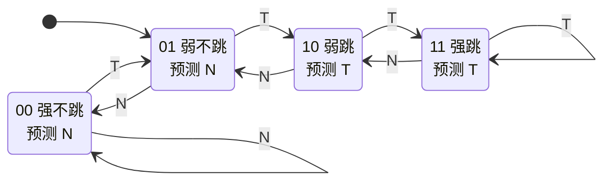
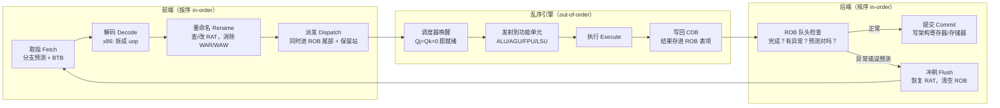
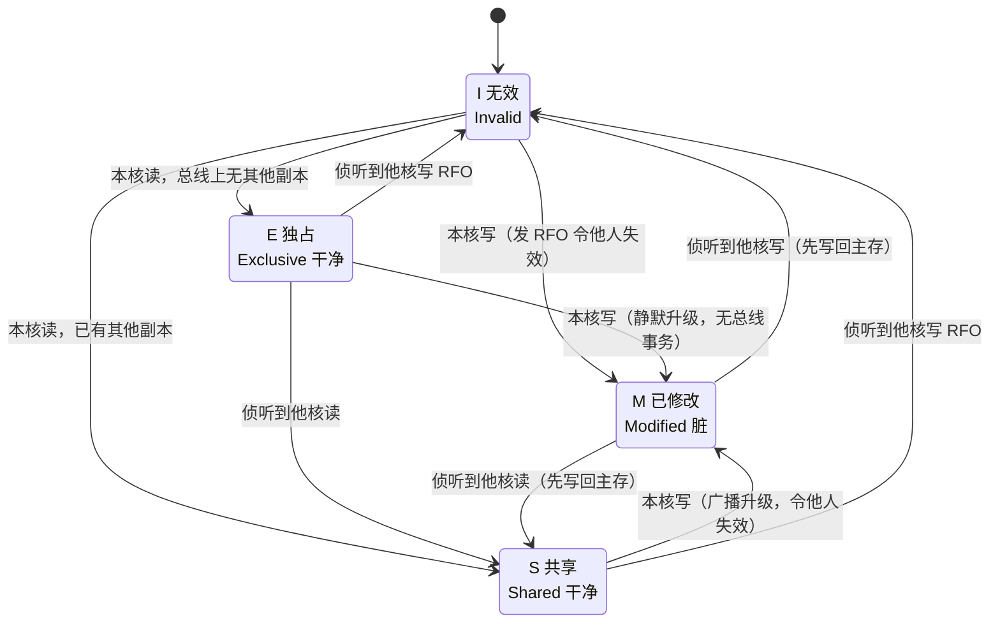
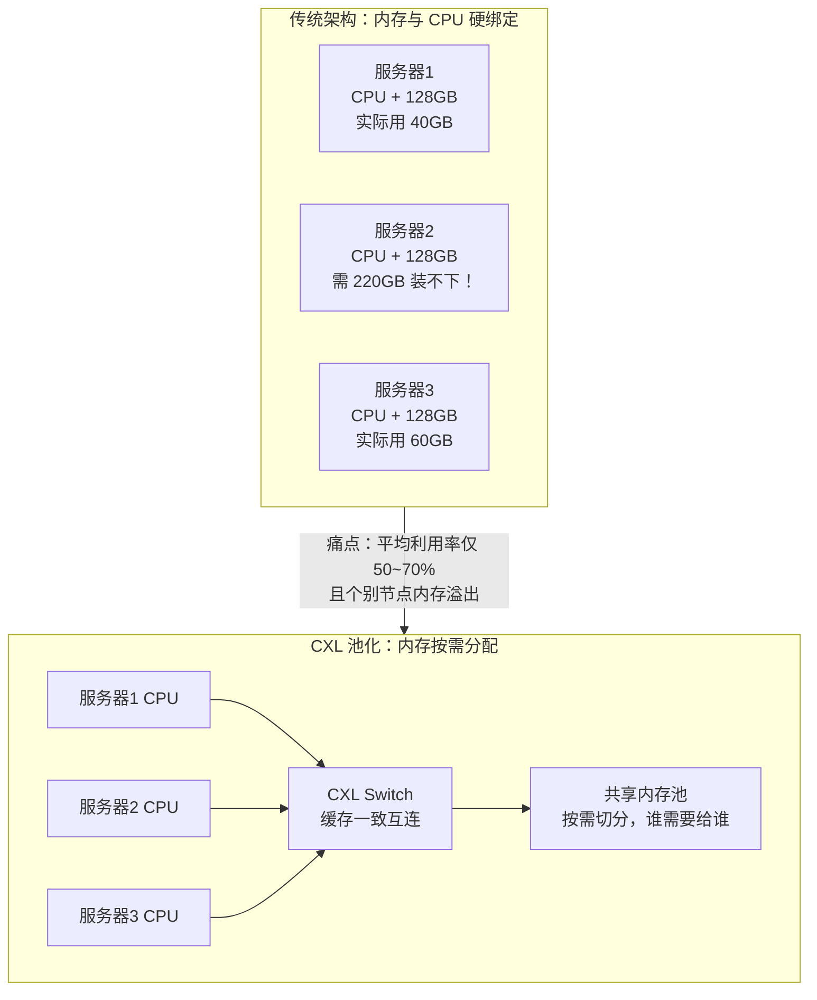

# 计算机体系结构

> 计算机组成回答"机器由什么组成"，体系结构回答"如何量化地设计与加速一台机器"——本讲用性能公式、并行分类与领域专用架构，带你看懂从 CPU 乱序核到 TPU 脉动阵列的全部设计逻辑。

## 0. AI 时代为什么还要学体系结构

2017 年图灵奖得主 Hennessy 和 Patterson 在获奖演讲中宣告："计算机体系结构的新黄金时代"来了。这句话背后是三个残酷的物理事实：

1. **Dennard 缩放终结（约 2005 年）**：晶体管变小后功耗密度不再恒定，主频停在 3~5 GHz 上不去了——"免费午餐"结束；
2. **摩尔定律放缓**：晶体管翻倍从 2 年拉长到 3 年以上，且单晶体管成本不再下降；
3. **通用处理器收益枯竭**：乱序、多发射、大缓存的边际收益越来越低，单核性能年增速从 52% 跌到不足 4%。

而 AI 对算力的需求却每年翻数倍。唯一的出路是**领域专用架构（DSA, Domain-Specific Architecture）**：为特定领域定制硬件，砍掉通用性换取 10~100 倍的能效。Google TPU、NVIDIA Tensor Core、各类 NPU 都是这条路线的产物。

对学 AI 的人来说，体系结构不再是"底层无关知识"：为什么 batch size 影响吞吐？为什么量化到 INT8 能快 4 倍？为什么算子要做 tiling？答案全部藏在本讲的性能公式、存储层次和脉动阵列里。**读懂硬件的人，才能写出榨干硬件的软件。**

## 1. 量化设计基础：性能公式、Amdahl 定律与能耗

### 知识要点

| 概念 | 公式（纯文本） | 说明 |
| --- | --- | --- |
| CPU 时间 | `CPU时间 = 指令数 x CPI x 时钟周期` | 铁律（Iron Law），三因子缺一不可 |
| CPI | `CPI = 总周期数 / 指令数` | 每条指令平均周期数，越小越好 |
| MIPS 的陷阱 | `MIPS = 频率 / (CPI x 10^6)` | 指令集不同不可比，慎用 |
| Amdahl 定律 | `Speedup = 1 / ((1-f) + f/s)` | f = 可加速部分占比，s = 局部加速倍数 |
| Amdahl 上限 | `Speedup_max = 1 / (1-f)` | 串行部分决定天花板 |
| Gustafson 定律 | `Speedup = (1-f) + f*s` | 问题规模随算力扩大时的乐观视角 |
| 动态功耗 | `P = C x V^2 x f` | 电压平方项是降压降频省电的根源 |
| 能效 | `每焦耳操作数 = OPS / W` | AI 芯片的第一指标 |

### 关键概念精讲

**性能铁律**告诉我们优化只有三条路：减少指令数（更好的算法/指令集）、降低 CPI（流水线、乱序、缓存）、缩短周期（提频、更深流水线）。三者互相牵制——RISC 用更多指令换更低 CPI，深流水线提频但分支惩罚变大。

**Amdahl 定律**是全书最重要的一个公式：如果程序只有 90% 可以并行，那么哪怕用 1 万个核，加速比也不会超过 10 倍。它的推论是"**让常见情况更快**"（make the common case fast）——优化要花在占比最大的部分上。AI 训练中它无处不在：GPU 把矩阵乘加速 100 倍后，原本不起眼的数据加载、Python 调度反而成了新瓶颈。

**能耗视角**：Dennard 缩放终结后，芯片设计从"性能优先"转向"能效优先"。`P = C x V^2 x f` 中电压是平方项，所以"降压 + 多核并行"胜过"高压 + 单核提频"——这就是多核时代到来的物理原因。访存能耗远高于计算：读一次 DRAM 约消耗一次浮点乘加 200 倍以上的能量，所以后面所有章节的主题其实都是"少动数据"。

### 案例代码

完整代码见 `code/04-architecture/amdahl.py`，核心如下：

```python
def amdahl(f, s):
    """Amdahl 定律：固定问题规模下的整体加速比。"""
    return 1.0 / ((1.0 - f) + f / s)

def gustafson(f, s):
    """Gustafson 定律：问题规模随处理器数扩大时的加速比。"""
    return (1.0 - f) + f * s

fractions = [0.5, 0.9, 0.95, 0.99]   # 可并行部分占比
speeds = [2, 4, 8, 16, 64, 1024]     # 并行部分加速倍数

print("=== Amdahl: Speedup = 1 / ((1-f) + f/s) ===")
print("f\\s   " + "".join("{:>9}".format(s) for s in speeds))
for f in fractions:
    print("{:<6}".format(f) +
          "".join("{:>9.2f}".format(amdahl(f, s)) for s in speeds))

print("=== 加速上限 1/(1-f) ===")
for f in fractions:
    print("f = {:<5} 上限 = {:.1f}x".format(f, 1.0 / (1.0 - f)))
```

运行结果（节选）：f = 0.9 时用 1024 倍并行只得到 9.91 倍加速；f = 0.99 时上限也只有 100 倍。**串行部分就是天花板。**

## 2. 指令级并行 ILP：动态调度与寄存器重命名

### 知识要点

- ILP（Instruction-Level Parallelism）：让相互独立的指令同时执行；
- 三种数据冒险：RAW（真依赖）、WAR（反依赖）、WAW（输出依赖）；
- WAR/WAW 是**假依赖**——只是寄存器名字不够用，可用**寄存器重命名**消除；
- 静态调度：编译器重排指令（软件流水、循环展开）；
- 动态调度：硬件运行时重排，代表是 **Tomasulo 算法**（IBM 360/91, 1967）；
- Tomasulo 三要素：保留站（Reservation Station）缓存待执行指令、公共数据总线（CDB）广播结果、寄存器重命名到保留站编号。

### 关键概念精讲

**为什么需要动态调度**：一条 load 缺失要等几十上百拍，顺序流水线会让后面所有无关指令陪着等。Tomasulo 的思想是"**指令等数据，而不是数据等指令**"：指令进入保留站后，缺哪个操作数就监听 CDB，操作数一到齐立刻执行，与程序顺序无关。

**寄存器重命名**是消除假依赖的钥匙。程序里 `r1` 被反复复用只是因为寄存器名字有限；硬件把每次写入映射到不同的物理寄存器（或保留站编号），WAR/WAW 就消失了，只剩下真正的 RAW 数据流。现代 CPU 有几百个物理寄存器，架构寄存器（如 x86 的 16 个）只是"逻辑名"。

**重命名实例**：下面这段代码有 RAW、WAR、WAW 三种依赖：

| 指令 | 依赖 | 重命名后 | 依赖是否消失 |
| --- | --- | --- | --- |
| `mul r1, r2, r3` | — | `mul p10, r2, r3` | — |
| `add r4, r1, r5` | RAW on r1 | `add p11, p10, r5` | 保留（真依赖） |
| `sub r1, r6, r7` | WAW on r1（与第1条）、WAR on r1（与第2条） | `sub p12, r6, r7` | 全部消失 |

重命名后第 3 条指令不依赖任何人，可以立刻执行——甚至比第 1 条更早完成。硬件只需在提交时把 p12 记为"架构寄存器 r1 的最新值"。

这个思想在软件世界也随处可见：SSA（静态单赋值）中间表示就是编译器版的寄存器重命名。

### Tomasulo 算法详解

Tomasulo 是 1967 年 Robert Tomasulo 为 IBM 360/91 的浮点单元设计的动态调度算法，今天所有高性能乱序处理器仍在用它的骨架。要真正理解它，必须把三个硬件部件和三个执行阶段拆开来看。

#### 硬件结构

<svg viewBox="0 0 680 430" xmlns="http://www.w3.org/2000/svg" role="img" aria-label="Tomasulo 硬件结构框图">
  <defs>
  <marker id="tmarr" markerWidth="9" markerHeight="9" refX="8" refY="3" orient="auto">
  <path d="M0,0 L0,6 L8,3 z" fill="var(--text)"/>
  </marker>
  <marker id="tmarra" markerWidth="9" markerHeight="9" refX="8" refY="3" orient="auto">
  <path d="M0,0 L0,6 L8,3 z" fill="var(--accent)"/>
  </marker>
  </defs>
  <rect x="18" y="14" width="170" height="44" rx="6" fill="var(--panel)" stroke="var(--text)" stroke-width="1.5"/> <text x="103" y="41" fill="var(--text)" font-size="13" text-anchor="middle">指令队列（按序发射）</text> <rect x="430" y="14" width="232" height="44" rx="6" fill="var(--panel)" stroke="var(--text)" stroke-width="1.5"/>
  <text x="546" y="33" fill="var(--text)" font-size="13" text-anchor="middle">浮点寄存器堆 + 寄存器状态表 Qi</text> <text x="546" y="50" fill="var(--text)" font-size="11" text-anchor="middle">Qi 记录"谁将写这个寄存器"</text> <rect x="18" y="108" width="150" height="76" rx="6" fill="var(--panel)" stroke="var(--text)" stroke-width="1.5"/>
  <text x="93" y="128" fill="var(--text)" font-size="12" text-anchor="middle">Load 缓冲 x3</text> <text x="93" y="147" fill="var(--text)" font-size="11" text-anchor="middle">Busy / Addr</text> <text x="93" y="166" fill="var(--text)" font-size="11" text-anchor="middle">地址就绪即访存</text>
  <rect x="196" y="108" width="196" height="76" rx="6" fill="var(--panel)" stroke="var(--accent)" stroke-width="2"/> <text x="294" y="128" fill="var(--text)" font-size="12" text-anchor="middle">保留站 Add1~Add3</text> <text x="294" y="147" fill="var(--text)" font-size="11" text-anchor="middle">Busy Op Vj Vk Qj Qk</text>
  <text x="294" y="166" fill="var(--text)" font-size="11" text-anchor="middle">ADDD / SUBD</text> <rect x="420" y="108" width="196" height="76" rx="6" fill="var(--panel)" stroke="var(--accent)" stroke-width="2"/> <text x="518" y="128" fill="var(--text)" font-size="12" text-anchor="middle">保留站 Mult1~Mult2</text>
  <text x="518" y="147" fill="var(--text)" font-size="11" text-anchor="middle">Busy Op Vj Vk Qj Qk</text> <text x="518" y="166" fill="var(--text)" font-size="11" text-anchor="middle">MULD / DIVD</text> <rect x="18" y="234" width="150" height="42" rx="6" fill="var(--panel)" stroke="var(--text)" stroke-width="1.5"/>
  <text x="93" y="260" fill="var(--text)" font-size="12" text-anchor="middle">存储单元 Load/Store</text> <rect x="196" y="234" width="196" height="42" rx="6" fill="var(--panel)" stroke="var(--text)" stroke-width="1.5"/> <text x="294" y="260" fill="var(--text)" font-size="12" text-anchor="middle">FP 加法器（2 拍）</text>
  <rect x="420" y="234" width="196" height="42" rx="6" fill="var(--panel)" stroke="var(--text)" stroke-width="1.5"/> <text x="518" y="260" fill="var(--text)" font-size="12" text-anchor="middle">FP 乘除器（6 / 12 拍）</text>
  <line x1="103" y1="58" x2="103" y2="104" stroke="var(--text)" stroke-width="1.4" marker-end="url(#tmarr)"/> <line x1="188" y1="36" x2="294" y2="36" stroke="var(--text)" stroke-width="1.4"/>
  <line x1="294" y1="36" x2="294" y2="104" stroke="var(--text)" stroke-width="1.4" marker-end="url(#tmarr)"/> <line x1="410" y1="36" x2="410" y2="80" stroke="var(--text)" stroke-width="1.4"/>
  <line x1="410" y1="80" x2="518" y2="80" stroke="var(--text)" stroke-width="1.4"/> <line x1="518" y1="80" x2="518" y2="104" stroke="var(--text)" stroke-width="1.4" marker-end="url(#tmarr)"/> <text x="352" y="30" fill="var(--muted)" font-size="10">发射：写入 Op/Vj/Vk 或 Qj/Qk</text>
  <line x1="93" y1="184" x2="93" y2="230" stroke="var(--text)" stroke-width="1.4" marker-end="url(#tmarr)"/> <line x1="294" y1="184" x2="294" y2="230" stroke="var(--text)" stroke-width="1.4" marker-end="url(#tmarr)"/>
  <line x1="518" y1="184" x2="518" y2="230" stroke="var(--text)" stroke-width="1.4" marker-end="url(#tmarr)"/> <text x="300" y="204" fill="var(--muted)" font-size="10">操作数齐 -&gt; 执行</text>
  <line x1="93" y1="276" x2="93" y2="320" stroke="var(--accent)" stroke-width="1.6"/> <line x1="294" y1="276" x2="294" y2="320" stroke="var(--accent)" stroke-width="1.6"/> <line x1="518" y1="276" x2="518" y2="320" stroke="var(--accent)" stroke-width="1.6"/>
  <rect x="18" y="320" width="644" height="30" rx="4" fill="var(--accent)" opacity="0.16" stroke="var(--accent)" stroke-width="2"/> <text x="340" y="340" fill="var(--text)" font-size="13" text-anchor="middle">CDB 公共数据总线（每拍广播一个 &lt;保留站编号, 结果值&gt;）</text>
  <line x1="150" y1="320" x2="150" y2="190" stroke="var(--accent)" stroke-width="1.4" stroke-dasharray="4 3" marker-end="url(#tmarra)"/> <line x1="360" y1="320" x2="360" y2="190" stroke="var(--accent)" stroke-width="1.4" stroke-dasharray="4 3" marker-end="url(#tmarra)"/>
  <line x1="590" y1="320" x2="590" y2="190" stroke="var(--accent)" stroke-width="1.4" stroke-dasharray="4 3" marker-end="url(#tmarra)"/> <line x1="646" y1="320" x2="646" y2="64" stroke="var(--accent)" stroke-width="1.4" stroke-dasharray="4 3" marker-end="url(#tmarra)"/>
  <text x="20" y="372" fill="var(--muted)" font-size="11">虚线 = CDB 侦听：所有 Qj/Qk 与广播编号匹配的保留站同时抓取结果</text> <text x="20" y="392" fill="var(--muted)" font-size="11">实线 = 数据/控制通路。注意寄存器堆不在关键路径上，保留站直接互相供数</text> <text x="20" y="412" fill="var(--muted)" font-size="11">整个结构没有"集中调度器"，全靠分布式的标签匹配自组织</text>
</svg>

#### 保留站的字段：一张表看懂全部状态

保留站（Reservation Station, RS）是 Tomasulo 的核心存储结构。每个表项有 6 个字段：

| 字段 | 含义 | 什么时候写 | 什么时候读 |
| --- | --- | --- | --- |
| `Busy` | 该保留站是否被占用 | 发射时置 1，写结果后清 0 | 发射时找空闲站 |
| `Op` | 要执行的操作（ADDD/MULD/…） | 发射时 | 执行时送给功能单元 |
| `Vj` | 源操作数 1 的**值** | 发射时（若已就绪）或 CDB 广播时 | 执行时 |
| `Vk` | 源操作数 2 的**值** | 同上 | 同上 |
| `Qj` | 将产生源操作数 1 的**保留站编号** | 发射时（若未就绪） | 侦听 CDB 时做标签匹配 |
| `Qk` | 将产生源操作数 2 的保留站编号 | 同上 | 同上 |

**关键不变式**：`Vj` 与 `Qj` 互斥——要么值已到手（`Qj = 0`，用 `Vj`），要么还在等（`Qj = 某保留站编号`，`Vj` 无效）。当 `Qj = Qk = 0` 时这条指令的操作数齐了，可以开始执行。

配套还有一张**寄存器状态表**（Register Status / RAT）：每个架构寄存器一个 `Qi` 字段，记录"当前有哪个保留站将要写这个寄存器"。`Qi = 0` 表示寄存器里的值是最新的。**`Qi` 就是硬件版的寄存器重命名表**——它把"寄存器名"翻译成"生产者编号"。

#### CDB：一条总线取代所有旁路

公共数据总线（Common Data Bus, CDB）是 Tomasulo 的第二个发明。传统设计中，功能单元的结果要写回寄存器堆，等待它的指令再从寄存器堆读出——一来一回两次访问。CDB 的做法是**广播**：

1. 功能单元算完，把 `<保留站编号, 结果值>` 二元组挂上 CDB；
2. **所有**保留站同时比对：我的 `Qj` 或 `Qk` 等于这个编号吗？是就抓走值、把对应的 Q 清零；
3. 寄存器状态表同时比对：哪个寄存器的 `Qi` 等于这个编号？是就把值写进寄存器堆并清空 `Qi`。

这一步同时完成了「转发」和「唤醒」两件事，而且是全局并行的。代价是 CDB 每拍只能广播一个结果——**CDB 是结构冲突的高发地**，现代多发射处理器要配 2~4 条 CDB。

#### 三个阶段的具体动作

| 阶段 | 触发条件 | 硬件动作（伪代码） |
| --- | --- | --- |
| **Issue 发射** | 有空闲的对应类型保留站（否则结构冲突停顿） | 取源操作数：若 `Qi[src] == 0` 则 `Vj = Reg[src]`，否则 `Qj = Qi[src]`；置 `Busy=1, Op=op`；写重命名：`Qi[dst] = 本保留站编号` |
| **Execute 执行** | `Qj == 0 且 Qk == 0`（RAW 已解决） | 占用功能单元，算 `lat` 拍。多条同时就绪时按发射序或轮转仲裁 |
| **Write Result 写结果** | 执行完毕且 CDB 空闲 | 把 `<本编号, 结果>` 广播上 CDB；所有 `Qj/Qk` 匹配的保留站抓值；`Qi` 匹配的寄存器更新；`Busy=0` 释放保留站 |

注意发射阶段那一句 `Qi[dst] = 本保留站编号`：**这就是寄存器重命名发生的瞬间**。后面再有指令写同一个寄存器，只是把 `Qi[dst]` 改指向新的保留站，老的生产者-消费者链完全不受影响——WAW 消失了。而已经发射的指令早已把源操作数的值或标签抓在自己手里，后来者覆盖寄存器也影响不到它——WAR 也消失了。

#### 逐周期追踪：一段经典指令序列

用下面 6 条指令走一遍完整流程（延迟：LD=2、ADDD/SUBD=2、MULD=6、DIVD=12，每拍发射 1 条，每拍 CDB 广播 1 个结果）：

```
1. LD   F6, 34(R2)
2. LD   F2, 45(R3)
3. MULD F0, F2, F4
4. SUBD F8, F6, F2
5. DIVD F10, F0, F6
6. ADDD F6, F8, F2
```

**第 3 拍**（MULD 刚发射，它要的 F2 还在 Load2 手里）：

| Name | Busy | Op | Vj | Vk | Qj | Qk |
| --- | --- | --- | --- | --- | --- | --- |
| Load1 | yes | LD | — | — | — | — |
| Load2 | yes | LD | — | — | — | — |
| Add1~3 | no | — | — | — | — | — |
| Mult1 | yes | MULD | — | 3 | **Load2** | — |
| Mult2 | no | — | — | — | — | — |

寄存器状态表：`F0<-Mult1, F2<-Load2, F6<-Load1`。Mult1 的 `Qj=Load2` 就是一条"等 Load2 出结果"的订阅。

**第 4 拍**（Load1 广播，SUBD 发射）：

| Name | Busy | Op | Vj | Vk | Qj | Qk |
| --- | --- | --- | --- | --- | --- | --- |
| Load1 | **no** | — | — | — | — | — |
| Load2 | yes | LD | — | — | — | — |
| Add1 | yes | SUBD | **10** | — | — | **Load2** |
| Mult1 | yes | MULD | — | 3 | Load2 | — |

Load1 一广播，Add1 的 F6 立刻拿到值 10（甚至没走寄存器堆），Load1 保留站同拍释放。

**第 5 拍**（Load2 广播，一拍唤醒两条指令）：

| Name | Busy | Op | Vj | Vk | Qj | Qk |
| --- | --- | --- | --- | --- | --- | --- |
| Add1 | yes | SUBD | 10 | **10** | — | — |
| Mult1 | yes | MULD | **10** | 3 | — | — |
| Mult2 | yes | DIVD | — | 10 | **Mult1** | — |

这是 CDB 广播语义最漂亮的一幕：**一次广播同时喂饱 Add1 和 Mult1**，两条指令在第 6 拍并行开跑。同一拍发射的 DIVD 则订阅 Mult1。

最终的三阶段时刻表：

| 指令 | Issue | Execute | Write Result | 备注 |
| --- | --- | --- | --- | --- |
| `LD F6` | 1 | 2–3 | 4 | |
| `LD F2` | 2 | 3–4 | 5 | |
| `MULD F0,F2,F4` | 3 | 6–11 | 12 | 等 F2 到第 5 拍 |
| `SUBD F8,F6,F2` | 4 | **6–7** | 8 | **抢在 MULD 前面完成** |
| `DIVD F10,F0,F6` | 5 | 13–24 | 25 | 等 MULD 的 F0 |
| `ADDD F6,F8,F2` | 6 | 9–10 | 11 | 写 F6，与第 1 条 WAW，已被重命名消除 |

三个观察点：

1. **SUBD 在第 8 拍就写完了，而排在它前面的 MULD 要到第 12 拍**——这就是乱序完成；
2. **ADDD 写 F6，和第 1 条 LD 构成 WAW；ADDD 读 F2，和其他指令构成 WAR**。因为所有值都在保留站里以"编号"流通，这两类假相关根本没机会形成停顿；
3. **DIVD 的 12 拍长延迟被完全暴露**——它依赖 MULD，是真正的 RAW，Tomasulo 也无能为力。**动态调度只能消除假相关，消除不了真数据流。**

#### Tomasulo 的两个缺陷

原始 Tomasulo 有两个致命短板，直接催生了第 4 章的 ROB：

- **没有精确异常**：指令乱序写回寄存器堆，异常发生时机器状态是"半新半旧"的，无法确定断点，也就无法支持虚拟内存缺页和调试；
- **不能推测执行**：分支必须等到结果出来才能继续，深流水线下代价无法接受。

### 寄存器重命名深入：从 RAT 到物理寄存器堆

- **架构寄存器（ARF）** 是 ISA 里可见的名字（x86-64 有 16 个通用寄存器），**物理寄存器（PRF）** 是硬件实际拥有的存储（现代大核 200~600 个）；
- **RAT（Register Alias Table，寄存器别名表）** 维护"架构寄存器 -> 当前物理寄存器"的映射；
- **空闲表（Free List）** 管理未被占用的物理寄存器；
- 重命名规则只有两条：**读源操作数查 RAT；写目的寄存器分配新物理寄存器并更新 RAT**；
- 物理寄存器的释放时机：当**再次写同一架构寄存器的指令提交**时，旧的物理寄存器才能回收（在此之前可能还有回滚需求）。

**为什么"每次写都换一个新名字"就能消除 WAR/WAW**：假相关的本质是「名字复用」而非「数据流动」。给每次写入一个全新的名字后，两条写同一架构寄存器的指令写的是不同物理寄存器（WAW 消失）；后写的指令不会覆盖先读者要读的物理寄存器（WAR 消失）。剩下的 RAW 是真实的生产-消费关系，只能靠等。

这和编译器的 **SSA（静态单赋值）** 形式是同一个思想的两种实现——SSA 在编译期给每次赋值加下标 `x1, x2, x3`，重命名在运行期分配物理寄存器编号。区别在于：编译器看不见运行期的分支走向和访存延迟，硬件看得见但窗口只有几百条指令。**两者互补，缺一不可。**

**重命名前后对照**（源程序 4 条指令，含 1 处 RAW、1 处 WAR、1 处 WAW）：

| # | 原指令 | 与前面的相关 | 重命名后 | 剩余相关 |
| --- | --- | --- | --- | --- |
| 1 | `mul r1, r2, r3` | — | `mul p10, r2, r3` | — |
| 2 | `add r4, r1, r5` | RAW on r1（真） | `add p11, p10, r5` | RAW on p10（保留） |
| 3 | `sub r1, r6, r7` | WAW on r1（与 1）、WAR on r1（与 2） | `sub p12, r6, r7` | **无！可立即执行** |
| 4 | `and r8, r1, r9` | RAW on r1（真，来自 3） | `and p13, p12, r9` | RAW on p12（保留） |

重命名后指令 3 不依赖任何人——它甚至可以比指令 1 更早完成。提交时把 RAT 里 `r1 -> p12` 落实为架构状态即可。

### 案例代码一：寄存器重命名模拟

```python
# 寄存器重命名模拟：架构寄存器 -> 物理寄存器，消除 WAR / WAW
prog = [
    ("mul", "r1", ["r2", "r3"]),
    ("add", "r4", ["r1", "r5"]),
    ("sub", "r1", ["r6", "r7"]),     # WAW(与1) + WAR(与2)
    ("and", "r8", ["r1", "r9"]),     # RAW on 新的 r1
]

def find_hazards(prog):
    """在架构寄存器视角下找出三类数据相关。"""
    hz = []
    for i, (_, di, si) in enumerate(prog):
        for j in range(i + 1, len(prog)):
            _, dj, sj = prog[j]
            if di in sj:
                hz.append(("RAW", i + 1, j + 1, di))
            if dj in si:
                hz.append(("WAR", i + 1, j + 1, dj))
            if di == dj:
                hz.append(("WAW", i + 1, j + 1, di))
    return hz

def rename(prog, n_phys=16):
    """把每次写入映射到一个全新的物理寄存器。"""
    free = ["p{}".format(i) for i in range(10, 10 + n_phys)]
    rat = {}                              # 寄存器别名表 RAT: 架构 -> 物理
    out = []
    for op, dst, srcs in prog:
        psrc = [rat.get(s, s) for s in srcs]   # 源: 查表得最新物理寄存器
        pdst = free.pop(0)                     # 目的: 分配全新物理寄存器
        rat[dst] = pdst
        out.append((op, pdst, psrc, dst))
    return out, rat

print("重命名前的相关（架构寄存器视角）：")
for kind, a, b, r in find_hazards(prog):
    print("  指令{} -> 指令{}  {} on {}".format(a, b, kind, r))

renamed, rat = rename(prog)
print("\n重命名后的指令流（物理寄存器视角）：")
for i, (op, pdst, psrc, arch) in enumerate(renamed):
    print("  {}. {:<4} {:<4} <- {:<12} (架构目的 {})".format(
        i + 1, op, pdst, ",".join(psrc), arch))

phys = [(op, d, s) for op, d, s, _ in renamed]
left = find_hazards(phys)
print("\n重命名后剩余相关：")
for kind, a, b, r in left:
    print("  指令{} -> 指令{}  {} on {}".format(a, b, kind, r))
print("WAR/WAW 数量: {} -> {}".format(
    sum(1 for h in find_hazards(prog) if h[0] != "RAW"),
    sum(1 for h in left if h[0] != "RAW")))
```

运行结果：

```
重命名前的相关（架构寄存器视角）：
  指令1 -> 指令2  RAW on r1
  指令1 -> 指令3  WAW on r1
  指令1 -> 指令4  RAW on r1
  指令2 -> 指令3  WAR on r1
  指令3 -> 指令4  RAW on r1

重命名后的指令流（物理寄存器视角）：
  1. mul  p10  <- r2,r3        (架构目的 r1)
  2. add  p11  <- p10,r5       (架构目的 r4)
  3. sub  p12  <- r6,r7        (架构目的 r1)
  4. and  p13  <- p12,r9       (架构目的 r8)

重命名后剩余相关：
  指令1 -> 指令2  RAW on p10
  指令3 -> 指令4  RAW on p12
WAR/WAW 数量: 2 -> 0
```

注意"指令1 -> 指令4 RAW on r1"这条**伪 RAW** 也一并消失了——原本它读的 r1 其实来自指令 3，只是架构寄存器名字骗了我们。重命名后依赖图变成真正的数据流图，可并行度一目了然。

### 案例代码二：Tomasulo 模拟器

完整代码见 `code/04-architecture/tomasulo.py`，核心的三阶段主循环如下：

```python
while cycle < max_cycle:
    cycle += 1
    # ---- 阶段 1：Execute（用本拍开始时的状态判断就绪） ----
    for rs in stations:
        if not rs.busy or rs.exec_start is not None:
            continue
        if timing[rs.idx]["issue"] >= cycle:      # 发射当拍不能执行
            continue
        if not rs.ready():                        # Qj/Qk 必须都为空
            continue
        rs.exec_start = cycle
        rs.exec_end = cycle + LATENCY[rs.op] - 1

    # ---- 阶段 2：Write Result（CDB 每拍仅一个，老指令优先） ----
    done = [rs for rs in stations
            if rs.busy and rs.exec_end is not None and rs.exec_end < cycle]
    if done:
        rs = min(done, key=lambda r: r.idx)       # CDB 仲裁
        value = compute(rs)
        for other in stations:                    # 广播到所有订阅者
            if other.qj == rs.name:
                other.vj, other.qj = value, None
            if other.qk == rs.name:
                other.vk, other.qk = value, None
        for r, owner in list(qi.items()):         # 广播到寄存器状态表
            if owner == rs.name:
                regs[r] = value
                del qi[r]
        rs.busy = False                           # 释放保留站

    # ---- 阶段 3：Issue（每拍一条） ----
    if pc < len(program):
        op, dst, s1, s2 = program[pc]
        free = next((r for r in stations if not r.busy and op in r.ops), None)
        if free is not None:
            free.busy, free.op, free.idx = True, op, pc
            free.vj = load_src(s1, regs, qi, free, "j")   # 就绪写 V，否则写 Q
            free.vk = load_src(s2, regs, qi, free, "k")
            qi[dst] = free.name                  # <<< 寄存器重命名在此发生
            pc += 1
```

程序会逐拍打印保留站与寄存器状态表，末尾给出三阶段时刻表：

```
====================================================================
各指令三阶段时刻表
====================================================================
  指令                      Issue    Execute    Write
  1. LD    F6   <- mem        1        2-3        4
  2. LD    F2   <- mem        2        3-4        5
  3. MULD  F0   <- F2,F4      3       6-11       12
  4. SUBD  F8   <- F6,F2      4        6-7        8
  5. DIVD  F10  <- F0,F6      5      13-24       25
  6. ADDD  F6   <- F8,F2      6       9-10       11

总耗时 25 拍。
若严格顺序执行（每条 发射1拍 + 执行lat拍）约需 32 拍，
Tomasulo 通过保留站 + CDB 让无关指令重叠，加速比约 1.28x
```

建议自己动手改三个参数感受设计权衡：把 `Add` 保留站数量从 3 改成 1（观察结构冲突停顿）、把 `DIVD` 延迟从 12 改成 40（观察长延迟指令如何堵住后面）、把程序改成全是独立指令（观察 CDB 成为瓶颈）。

### 案例代码三：转发能救回多少停顿

动态调度成本高昂，先看看便宜得多的**转发（forwarding）**能做到什么程度——这是理解"为什么还需要 Tomasulo"的对照组。

```python
# 5 级流水线 RAW 冒险代价：有无转发（forwarding）的周期数对比
# 指令格式: (类型, 目的寄存器, [源寄存器])
prog = [
    ("load", "r1", ["r9"]),        # lw  r1, 0(r9)
    ("alu",  "r2", ["r1", "r5"]),  # add r2, r1, r5   <- load-use 依赖
    ("alu",  "r3", ["r2", "r1"]),  # sub r3, r2, r1   <- ALU 依赖
    ("alu",  "r4", ["r6", "r7"]),  # and r4, r6, r7   无依赖
]

def total_cycles(prog, forwarding):
    stalls = 0
    for i, (kind, dst, srcs) in enumerate(prog):
        need = 0
        for back in (1, 2):                    # 只需检查前 1、2 条指令
            if i - back < 0:
                continue
            pk, pd, _ = prog[i - back]
            if pd in srcs:
                if forwarding:
                    # 转发后仅剩 load-use 冒险: 紧邻的 load 依赖停 1 拍
                    if pk == "load" and back == 1:
                        need = max(need, 1)
                else:
                    # 无转发: 必须等写回, 距离 1 停 2 拍, 距离 2 停 1 拍
                    need = max(need, 3 - back)
        stalls += need
    return len(prog) + 4 + stalls              # 5 级流水: 首条占 5 拍

print("无转发:", total_cycles(prog, False), "周期")   # 12
print("有转发:", total_cycles(prog, True), "周期")    # 9
print("理想值:", len(prog) + 4, "周期(无任何停顿)")     # 8
```

转发把 4 条指令的停顿从 4 拍压到 1 拍，仅剩的 1 拍是 load-use 冒险——它连转发都救不了，只能靠编译器把无关指令填进去。

## 3. 分支预测

### 知识要点

| 预测器 | 原理 | 典型准确率 |
| --- | --- | --- |
| 静态预测 | 永远猜跳/不跳，或"向后跳猜跳"（循环友好） | 60%~70% |
| 1-bit | 记住上次结果，猜和上次一样 | 80%~85% |
| 2-bit 饱和计数器 | 连续错两次才改口，抗偶发抖动 | 90%~93% |
| 两级自适应/gshare | 用分支历史模式索引计数器表 | 95%+ |
| TAGE / 感知机 | 多长度历史匹配 / 神经网络思想 | 98%+，现代 CPU 标配 |
| BTB | 分支目标缓冲，缓存跳转目标地址 | 解决"跳到哪"的问题 |

- 深流水线中一次误预测冲掉 15~20 拍的工作，代价极高；
- 预测方向（taken 与否）和预测目标（BTB）是两个独立问题。

### 关键概念精讲

**2-bit 饱和计数器状态转移图**（T = 实际跳转，N = 实际不跳；状态编码的最高位就是预测结果）：



看图就能读出"饱和"二字的含义：两端的 `00` 和 `11` 遇到同向结果时**原地不动**（计数器饱和不溢出），这给了预测器抗噪的惯性；而从"预测跳"翻转到"预测不跳"必须连续经过 `11 -> 10 -> 01` 两步，也就是**连错两次才改口**。

**为什么 2-bit 优于 1-bit**：考虑循环分支 `TTT N TTT N ...`（3 次跳转 + 1 次退出）。1-bit 预测器在每次循环退出时错一次，重新进入时又错一次——每轮错 2 次。2-bit 计数器有"惯性"：偶发的一次不跳只让它从"强跳"退到"弱跳"，预测方向不变，每轮只错 1 次。硬件成本仅仅是每个分支多 1 个 bit。

**对抗模式**：交替分支 `TNTN...` 会让 1-bit 和 2-bit 都退化到接近 0% ——它们只看"最近趋势"，看不见"模式"。解决办法是两级预测器：把最近 k 次分支历史（如 `TN`）作为索引，为每种历史模式单独配一个 2-bit 计数器，交替模式立刻被学会。这个"用历史模式索引预测表"的思想，和 n-gram 语言模型如出一辙。

### 案例代码

完整代码见 `code/04-architecture/branch_predictor.py`，核心如下：

```python
def predict_1bit(history, init=0):
    """1-bit 预测器：猜下一次和上次一样。"""
    state, correct = init, 0
    for actual in history:
        if (state == 1) == actual:
            correct += 1
        state = 1 if actual else 0
    return correct / len(history)

def predict_2bit(history, init=1):
    """2-bit 饱和计数器：0 强不跳 1 弱不跳 2 弱跳 3 强跳。"""
    state, correct = init, 0
    for actual in history:
        if (state >= 2) == actual:      # 状态 >= 2 预测跳转
            correct += 1
        state = min(3, state + 1) if actual else max(0, state - 1)
    return correct / len(history)

def make_loop_pattern(iters, trips):
    """每 trips 次跳转后跟 1 次不跳（循环退出）。"""
    pat = []
    for _ in range(iters):
        pat.extend([True] * trips + [False])
    return pat

patterns = {
    "全 taken": [True] * 100,
    "交替 TNTN": [i % 2 == 0 for i in range(100)],
    "循环退出 TTTN x25": make_loop_pattern(25, 3),
}
for name, h in patterns.items():
    print("{:<18} 1-bit: {:>4.0%}  2-bit: {:>4.0%}".format(
        name, predict_1bit(h), predict_2bit(h)))
```

实测结果：循环退出模式下 2-bit 达 74%，1-bit 只有 50%；交替模式下两者都是 0%——印证了上面的分析。

## 4. 超标量与乱序执行：ROB 与推测执行

### 知识要点

- **超标量（superscalar）**：每拍取指/发射多条指令（现代大核 4~8 发射）;
- **乱序执行（OoO）**：按数据就绪顺序执行，按程序顺序提交；
- **重排序缓冲区 ROB（Reorder Buffer）**：给每条指令按程序顺序编号排队，执行完的结果先存在 ROB，队头指令才允许"提交"（写入架构状态）；
- **推测执行（speculation）**：沿预测的分支方向提前执行；猜错则清空 ROB 中该分支之后的所有条目，架构状态毫发无损；
- **精确异常**：ROB 保证异常发生时，之前的指令全部完成、之后的全部作废；
- 现代乱序核流程：取指 -> 解码 -> 重命名 -> 派发到保留站 -> 乱序执行 -> 写回 ROB -> 按序提交。

### 关键概念精讲

乱序执行的精髓是"**外表顺序，内里乱序**"。程序员看到的机器永远是一条一条按序执行的（这是 ISA 契约），但内部几百条指令在数据流驱动下并行乱飞。ROB 是维持这个假象的关键装置——它像一条传送带，指令可以在带上任意位置完成加工，但只能从队头下线。

**代价**：ROB、保留站、重命名表占据大量面积和功耗，换来的 IPC 提升却是亚线性的——这正是第 0 章说的"通用处理器收益枯竭"。2018 年曝光的 Spectre/Meltdown 漏洞更揭示了推测执行的安全代价：被作废的指令虽然不改架构状态，却在 cache 中留下了可测量的痕迹。

### 现代乱序核的完整流水线

第 2 章的 Tomasulo 只覆盖了"发射—执行—写结果"三段。现代乱序核在它前后各加了一段，形成**前端按序、中段乱序、后端按序**的沙漏结构：



三段的分工可以一句话概括：

- **前端按序**：保证程序顺序信息被完整记录下来（ROB 的入队顺序 = 程序顺序）；
- **中段乱序**：只认数据流，谁的操作数先齐谁先跑；
- **后端按序**：按 ROB 顺序落实架构状态，对外重建"一条一条执行"的假象。

**ROB 与保留站的分工别搞混**：保留站管的是"这条指令能不能开始算"（调度问题），ROB 管的是"这条指令的结果什么时候能算数"（提交问题）。指令派发时**同时**进入两者，写回时释放保留站、把结果留在 ROB，提交时才释放 ROB 表项。

### ROB 表项结构与按序提交

ROB 本质是一个**循环队列（环形缓冲）**，头指针指向最老的未提交指令，尾指针指向下一个空位。每个表项字段如下：

| 字段 | 含义 | 用途 |
| --- | --- | --- |
| `Busy` | 表项是否占用 | 队列满则前端停顿（ROB 大小直接决定乱序窗口） |
| `Type` | 指令类型（寄存器写 / 存储 / 分支） | 决定提交时做什么动作 |
| `Dest` | 目的架构寄存器编号（或存储地址） | 提交时写到哪里 |
| `Value` | 执行结果 | 提交时写入架构寄存器；未提交前只能被 ROB 内部转发 |
| `Ready` | 执行是否完成 | 队头 `Ready=1` 才允许提交 |
| `PC` | 该指令的地址 | 异常时报告精确断点、误预测时恢复取指 |
| `Exception` | 异常标志与原因 | 提交时才真正触发异常处理 |
| `Speculative` | 是否处于未决分支的阴影下 | 分支解析后清除或整体作废 |

<svg viewBox="0 0 680 250" xmlns="http://www.w3.org/2000/svg" role="img" aria-label="ROB 按序提交与误预测冲刷示意">
  <defs>
  <marker id="robarr" markerWidth="9" markerHeight="9" refX="8" refY="3" orient="auto">
  <path d="M0,0 L0,6 L8,3 z" fill="var(--accent)"/>
  </marker>
  </defs>
  <text x="20" y="22" fill="var(--text)" font-size="13">ROB（环形队列，只能从队头提交）</text> <rect x="20" y="40" width="92" height="52" rx="4" fill="var(--accent)" opacity="0.22" stroke="var(--accent)" stroke-width="2"/>
  <text x="66" y="60" fill="var(--text)" font-size="11" text-anchor="middle">#1 ADD r1</text> <text x="66" y="78" fill="var(--text)" font-size="11" text-anchor="middle">Ready=1</text> <rect x="122" y="40" width="92" height="52" rx="4" fill="var(--panel)" stroke="var(--text)" stroke-width="1.5"/>
  <text x="168" y="60" fill="var(--text)" font-size="11" text-anchor="middle">#2 LD r4</text> <text x="168" y="78" fill="var(--text)" font-size="11" text-anchor="middle">Ready=0 缺失</text> <rect x="224" y="40" width="92" height="52" rx="4" fill="var(--panel)" stroke="var(--text)" stroke-width="1.5"/>
  <text x="270" y="60" fill="var(--text)" font-size="11" text-anchor="middle">#3 BEQ 分支</text> <text x="270" y="78" fill="var(--text)" font-size="11" text-anchor="middle">预测：跳</text> <rect x="326" y="40" width="92" height="52" rx="4" fill="var(--panel)" stroke="var(--text)" stroke-width="1.5" stroke-dasharray="5 3"/>
  <text x="372" y="60" fill="var(--text)" font-size="11" text-anchor="middle">#4 MUL r5</text> <text x="372" y="78" fill="var(--muted)" font-size="11" text-anchor="middle">Ready=1 推测</text> <rect x="428" y="40" width="92" height="52" rx="4" fill="var(--panel)" stroke="var(--text)" stroke-width="1.5" stroke-dasharray="5 3"/>
  <text x="474" y="60" fill="var(--text)" font-size="11" text-anchor="middle">#5 ADD r8</text> <text x="474" y="78" fill="var(--muted)" font-size="11" text-anchor="middle">Ready=1 推测</text> <rect x="530" y="40" width="130" height="52" rx="4" fill="var(--panel)" stroke="var(--border)" stroke-width="1.5"/>
  <text x="595" y="70" fill="var(--muted)" font-size="11" text-anchor="middle">空位（尾指针）</text> <text x="66" y="110" fill="var(--accent)" font-size="11" text-anchor="middle">头指针 head</text> <line x1="66" y1="118" x2="66" y2="96" stroke="var(--accent)" stroke-width="1.6" marker-end="url(#robarr)"/>
  <line x1="595" y1="118" x2="595" y2="96" stroke="var(--accent)" stroke-width="1.6" marker-end="url(#robarr)"/> <text x="595" y="132" fill="var(--accent)" font-size="11" text-anchor="middle">尾指针 tail</text> <line x1="20" y1="150" x2="316" y2="150" stroke="var(--text)" stroke-width="1.2"/>
  <text x="20" y="168" fill="var(--text)" font-size="11">#2 未 Ready，队头卡住 -&gt; #3 #4 #5 即使算完也不能提交（按序提交）</text> <text x="20" y="188" fill="var(--text)" font-size="11">#3 提交时若发现分支预测错误 -&gt; 虚线框的 #4 #5 整体作废，RAT 回滚到 #3 的快照</text> <text x="20" y="208" fill="var(--text)" font-size="11">作废代价 = 清空 ROB + 重取指，约 15~20 拍；但架构寄存器从未被污染</text>
  <text x="20" y="230" fill="var(--muted)" font-size="11">ROB 容量决定乱序窗口：Skylake 224 项，Golden Cove 512 项，Apple M1 约 630 项</text>
</svg>

**为什么乱序执行非要按序提交？** 三个理由，缺一不可：

1. **精确异常**。缺页、除零、非法指令随时可能发生。如果 `#4` 已经把结果写进架构寄存器，而更老的 `#2` 才报缺页，操作系统就无法还原一个干净的现场——虚拟内存、信号处理、单步调试全部失效。按序提交保证「异常点之前全部生效、之后全部未生效」；
2. **推测执行可回滚**。分支预测错误时，所有在分支阴影下的指令必须无痕消失。因为它们的结果只存在 ROB 里、物理寄存器还没成为任何架构寄存器的"当前版本"，一次冲刷即可干净回滚；
3. **对外维持 ISA 契约**。中断、多核可见的存储写、性能计数器都必须按程序顺序呈现，否则软件世界的所有假设都会崩塌。

**推测执行的回滚细节**：分支误预测时硬件要做三件事——(a) 清空 ROB 中该分支之后的全部表项；(b) 把 RAT 恢复到分支处的快照（现代设计在每条分支处保存一份 RAT 的检查点，或用 ROB 反向遍历回退）；(c) 归还这些指令占用的物理寄存器到空闲表，并从正确目标重新取指。整个过程通常 15~20 拍，这就是第 3 章说"一次误预测冲掉 15~20 拍工作"的来源。

**Store 是特例**：存储指令一旦写进 cache 就无法撤销，所以它在提交前只能待在**存储缓冲（Store Buffer）**里，提交时才真正下写。而后续的 load 要能从 store buffer 里"提前"读到值（store-to-load forwarding）——这块逻辑是现代处理器最复杂的部分之一，也是 Meltdown 类漏洞的温床。

### 案例代码一：ROB 与误预测回滚

```python
# ROB（重排序缓冲）：乱序完成、按序提交、误预测整体回滚
# (指令名, 执行延迟, 是否为分支, 分支是否预测正确)
INSTS = [
    ("ADD  r1,r2,r3", 1, False, True),
    ("LD   r4,[r1]",  8, False, True),    # 慢: 缓存缺失
    ("BEQ  r4,label", 1, True,  False),   # 分支, 预测错误!
    ("MUL  r5,r6,r7", 3, False, True),    # 推测执行(错误路径)
    ("ADD  r8,r5,r1", 1, False, True),    # 推测执行(错误路径)
]
ROB_SIZE = 8

def run_rob(insts, verbose=True):
    rob = []                       # 每项: dict(name, state, done_at, mispredict)
    cycle = issued = committed = flushed = 0
    log = []
    while committed + flushed < len(insts) and cycle < 100:
        cycle += 1
        # 1) 按序提交: 只看队头
        if rob and rob[0]["state"] == "done":
            head = rob.pop(0)
            committed += 1
            log.append((cycle, "COMMIT", head["name"]))
            if head["mispredict"]:
                flushed += len(rob)          # 队头之后全部作废
                log.append((cycle, "FLUSH",
                            "作废 ROB 中后续 {} 条推测指令".format(len(rob))))
                rob = []
        # 2) 完成执行(乱序): 到点即置 done
        for e in rob:
            if e["state"] == "exec" and cycle >= e["done_at"]:
                e["state"] = "done"
                log.append((cycle, "DONE  ", e["name"]))
        # 3) 派发 + 开始执行(每拍 1 条), ROB 满则停顿
        if issued < len(insts) and len(rob) < ROB_SIZE:
            name, lat, is_br, ok = insts[issued]
            rob.append(dict(name=name, state="exec", done_at=cycle + lat,
                            mispredict=(is_br and not ok)))
            log.append((cycle, "ISSUE ", name))
            issued += 1
    if verbose:
        for c, act, msg in log:
            print("  第{:>2}拍 {} {}".format(c, act, msg))
    return cycle, committed, flushed

c, ok, bad = run_rob(INSTS)
print("\n总周期 {}，按序提交 {} 条，回滚作废 {} 条".format(c, ok, bad))
```

运行输出：

```
  第 1拍 ISSUE  ADD  r1,r2,r3
  第 2拍 DONE   ADD  r1,r2,r3
  第 2拍 ISSUE  LD   r4,[r1]
  第 3拍 COMMIT ADD  r1,r2,r3
  第 3拍 ISSUE  BEQ  r4,label
  第 4拍 DONE   BEQ  r4,label
  第 4拍 ISSUE  MUL  r5,r6,r7
  第 5拍 ISSUE  ADD  r8,r5,r1
  第 6拍 DONE   ADD  r8,r5,r1
  第 7拍 DONE   MUL  r5,r6,r7
  第10拍 DONE   LD   r4,[r1]
  第11拍 COMMIT LD   r4,[r1]
  第12拍 COMMIT BEQ  r4,label
  第12拍 FLUSH 作废 ROB 中后续 2 条推测指令

总周期 12，按序提交 3 条，回滚作废 2 条
```

三个值得盯住的现象：

- **第 6 拍 `ADD r8` 比第 7 拍的 `MUL r5` 先完成**——完成是乱序的；
- **第 4 拍分支就算完了，却要等到第 12 拍才提交**——因为队头的 `LD` 缺失卡到第 10 拍。这说明**ROB 队头阻塞是乱序核的头号性能杀手**，也是为什么现代设计要配几百项 ROB（队头卡住时后面还能继续装指令干活）；
- **回滚发生在提交时刻而非执行时刻**，代价被推迟但也被"批量化"了：一次 flush 干掉全部错误路径指令。

### 案例代码二：精确异常

```python
# 精确异常：异常指令之前的全部生效，之后的全部作废
arch = {"r1": 1, "r2": 2, "r3": 3, "r4": 4}
rob = [
    ("ADD r1,#10", "r1", 11, None),          # 正常
    ("DIV r2,#0",  "r2", 0,  "除零异常"),      # 异常, 但执行很慢
    ("ADD r3,#20", "r3", 23, None),          # 已乱序算完
    ("ADD r4,#30", "r4", 34, None),          # 已乱序算完
]
print("异常前架构寄存器:", arch)
for name, dst, val, exc in rob:
    if exc:
        print("  队头 {} 触发【{}】-> 停止提交, 其后条目全部作废".format(name, exc))
        break
    arch[dst] = val
    print("  提交 {} -> {}={}".format(name, dst, val))
print("异常时架构寄存器:", arch)
```

运行输出：

```
异常前架构寄存器: {'r1': 1, 'r2': 2, 'r3': 3, 'r4': 4}
  提交 ADD r1,#10 -> r1=11
  队头 DIV r2,#0 触发【除零异常】-> 停止提交, 其后条目全部作废
异常时架构寄存器: {'r1': 11, 'r2': 2, 'r3': 3, 'r4': 4}
```

`r3`、`r4` 在硬件内部早已算出 23 和 34，但操作系统看到的寄存器仍是 3 和 4——**这就是"精确"二字的全部含义**。异常处理程序返回后从 `DIV` 重新执行，语义与顺序机完全一致。

### 案例代码三：顺序 vs 乱序

```python
# 顺序执行 vs 乱序执行：同一段指令的完成时间对比
# (指令, 依赖的指令下标, 执行延迟)  假设每拍最多发射 1 条
insts = [
    ("LD  r1,[a]",   [],  4),   # 缓存缺失, 4 拍
    ("ADD r2,r1,1",  [0], 1),
    ("MUL r3,r2,r2", [1], 3),
    ("LD  r4,[b]",   [],  4),   # 与前三条无依赖
    ("ADD r5,r4,1",  [3], 1),
]

def run(insts, out_of_order):
    finish = [0] * len(insts)
    prev_start = -1
    for i, (name, deps, lat) in enumerate(insts):
        ready = max([finish[d] for d in deps] or [0])  # 操作数就绪时间
        start = max(ready, i)              # 每拍取指 1 条, 最早第 i 拍开始
        if not out_of_order:               # 顺序机: 等待中的指令阻塞后续发射
            start = max(start, prev_start + 1)
            prev_start = start
        finish[i] = start + lat
        print("  {:<14} 第{:>2}拍开始, 第{:>2}拍完成".format(name, start, finish[i]))
    return max(finish)

print("顺序执行(阻塞式):")
t1 = run(insts, out_of_order=False)
print("乱序执行(依赖驱动):")
t2 = run(insts, out_of_order=True)
print("总周期: 顺序 {} vs 乱序 {}".format(t1, t2))   # 11 vs 8
```

乱序机把与前三条无关的第二组 load 提前到第 3 拍开始，用别的活填满了缓存缺失的等待时间——这就是乱序执行"隐藏访存延迟"的能力。

## 5. Cache 进阶与存储墙

### 知识要点

| 概念 | 内容 |
| --- | --- |
| 存储墙 | CPU 速度年增 50%+，DRAM 延迟年降约 7%，鸿沟越拉越大 |
| 多级 cache | L1（~4 拍，32~64KB）/ L2（~12 拍，~1MB）/ L3（~40 拍，几十 MB 共享） |
| 平均访存时间 | `AMAT = 命中时间 + 缺失率 x 缺失代价`，逐级展开 |
| 3C 缺失分类 | 强制缺失 Compulsory / 容量缺失 Capacity / 冲突缺失 Conflict |
| 缓解手段 | 加大容量治 Capacity、提高相联度治 Conflict、预取治 Compulsory |
| 预取 | 硬件流预取器识别顺序/固定步长访问，提前搬数据 |
| 写策略 | 写回 + 写分配（主流），写缓冲隐藏写延迟 |

### 关键概念精讲

**存储层次的量化直觉**（延迟按 3 GHz 主频折算，容量为典型服务器 CPU）：

<svg viewBox="0 0 680 300" xmlns="http://www.w3.org/2000/svg" role="img" aria-label="存储层次金字塔与延迟带宽">
  <polygon points="340,16 400,60 280,60" fill="var(--accent)" opacity="0.85" stroke="var(--text)" stroke-width="1.2"/> <polygon points="278,64 402,64 428,110 252,110" fill="var(--accent)" opacity="0.6" stroke="var(--text)" stroke-width="1.2"/>
  <polygon points="250,114 430,114 456,160 224,160" fill="var(--accent)" opacity="0.42" stroke="var(--text)" stroke-width="1.2"/> <polygon points="222,164 458,164 484,210 196,210" fill="var(--accent)" opacity="0.26" stroke="var(--text)" stroke-width="1.2"/>
  <polygon points="194,214 486,214 512,260 168,260" fill="var(--accent)" opacity="0.12" stroke="var(--text)" stroke-width="1.2"/> <text x="340" y="54" fill="var(--text)" font-size="11" text-anchor="middle">寄存器</text> <text x="340" y="92" fill="var(--text)" font-size="11" text-anchor="middle">L1 I/D Cache</text>
  <text x="340" y="142" fill="var(--text)" font-size="11" text-anchor="middle">L2 Cache</text> <text x="340" y="192" fill="var(--text)" font-size="11" text-anchor="middle">L3 共享 Cache</text>
  <text x="340" y="242" fill="var(--text)" font-size="11" text-anchor="middle">主存 DRAM / HBM</text> <text x="524" y="52" fill="var(--text)" font-size="11">~1 KB，1 拍</text> <text x="524" y="94" fill="var(--text)" font-size="11">32~64 KB，4 拍</text> <text x="524" y="144" fill="var(--text)" font-size="11">0.5~2 MB，12 拍</text>
  <text x="524" y="194" fill="var(--text)" font-size="11">16~64 MB，40 拍</text> <text x="524" y="244" fill="var(--text)" font-size="11">16 GB+，200+ 拍</text> <line x1="120" y1="30" x2="120" y2="266" stroke="var(--text)" stroke-width="1.4"/> <path d="M120,266 L116,258 L124,258 z" fill="var(--text)"/>
  <path d="M120,30 L116,38 L124,38 z" fill="var(--text)"/> <text x="30" y="60" fill="var(--muted)" font-size="11">快 / 小 / 贵</text> <text x="30" y="250" fill="var(--muted)" font-size="11">慢 / 大 / 便宜</text> <text x="30" y="150" fill="var(--accent)" font-size="11">延迟差</text>
  <text x="30" y="168" fill="var(--accent)" font-size="11">200 倍</text> <text x="20" y="288" fill="var(--muted)" font-size="11">局部性原理是整个金字塔成立的前提：时间局部性（刚用过的还会用）+ 空间局部性（用了这个还会用旁边的）</text>
</svg>

**3C 模型**教你对症下药：强制缺失是第一次访问必然发生的，只能靠预取和大缓存行；容量缺失是工作集装不下，靠加大容量或算法分块（tiling）；冲突缺失是多个热点地址映射到同一组，靠提高相联度或调整数据布局。AI 框架里 GEMM 分块、im2col 布局变换，本质都是在为 3C 做软件侧优化。

**存储墙对 AI 的意义**：大模型推理是典型的访存受限（memory-bound）负载——权重读一次只做一两次乘加。这时决定吞吐的不是 TFLOPS 而是显存带宽，HBM、KV-Cache 优化、量化压缩全是在对抗存储墙。判断一个负载是算力受限还是带宽受限，用扩展知识点里的 Roofline 模型。

### 案例代码

```python
# 直接映射 cache 模拟：顺序访问 vs 冲突步长访问
LINE = 64          # 行大小 64 字节
NLINES = 64        # 64 行, 共 4KB

def miss_rate(addrs):
    cache = [None] * NLINES            # 每行记录 tag
    miss = 0
    for a in addrs:
        block = a // LINE
        idx, tag = block % NLINES, block // NLINES
        if cache[idx] != tag:
            miss += 1
            cache[idx] = tag           # 缺失后装入
    return miss / len(addrs)

seq = [i * 4 for i in range(4096)]                # 顺序读 int32 数组
stride = []
for i in range(2048):                             # 交替访问相距 4KB 的两个数组
    stride.append(i * 4)                          # 数组 A
    stride.append(i * 4 + NLINES * LINE)          # 数组 B: 映射到同一行!
print("顺序访问缺失率: {:.1%}".format(miss_rate(seq)))      # 6.2%
print("冲突交替缺失率: {:.1%}".format(miss_rate(stride)))   # 98.4%
```

同样的数据量，访问模式一变，缺失率从 6.2% 飙到 98.4%（两个数组互相踢出对方，称为颠簸 thrashing）。把数组 B 挪开 64 字节即可解决——**数据布局就是性能**。

再用 AMAT 公式做一次定量决策：

```python
# AMAT（平均访存时间）逐级计算与灵敏度分析
def amat(t1, m1, t2, m2, t_mem):
    """AMAT = t1 + m1 x (t2 + m2 x t_mem)，单位: 时钟周期"""
    return t1 + m1 * (t2 + m2 * t_mem)

base = amat(4, 0.10, 20, 0.25, 200)
print("基准 AMAT = {:.1f} 拍".format(base))                                # 11.0
print("L1 缺失率 10% -> 5%: AMAT = {:.1f} 拍".format(amat(4, 0.05, 20, 0.25, 200)))  # 7.5
print("主存 200 -> 100 拍:  AMAT = {:.1f} 拍".format(amat(4, 0.10, 20, 0.25, 100)))  # 8.5
```

把 L1 缺失率减半（11.0 -> 7.5 拍）比把主存延迟减半（11.0 -> 8.5 拍）收益更大——不做计算凭直觉很容易猜反。**量化方法的意义就在于此。**

## 6. 数据级并行 DLP：SIMD、向量机与 GPU 的 SIMT

### 知识要点

- **DLP（Data-Level Parallelism）**：同一操作作用于大量数据元素；
- **SIMD**：单指令多数据。x86 演进：SSE（128 位）-> AVX2（256 位）-> AVX-512；一条 AVX-512 指令同时处理 16 个 float32；
- **向量机**：Cray 传统，一条指令处理可变长向量（现代复兴：RISC-V V 扩展、ARM SVE）；
- **GPU 的 SIMT**（单指令多线程）：以 warp（NVIDIA 32 线程）为单位锁步执行同一条指令，每线程有独立寄存器和访存地址；
- **分支发散（divergence）**：warp 内线程走不同分支时，各路径串行执行，算力按路径数打折；
- GPU 用海量线程切换隐藏访存延迟（而 CPU 用缓存和乱序），所以 GPU 需要足够大的并行度才能"喂饱"。

### 关键概念精讲

CPU 与 GPU 的设计哲学对比：

| 维度 | CPU（延迟机器） | GPU（吞吐机器） |
| --- | --- | --- |
| 目标 | 单线程尽快完成 | 海量线程总吞吐最大 |
| 隐藏访存延迟 | 大缓存 + 乱序执行 + 预取 | 线程切换（warp 调度器零开销换人） |
| 芯片面积去向 | 控制逻辑、缓存占大头 | 绝大部分给 ALU |
| 分支处理 | 高精度分支预测 | 无预测，发散就串行两个路径 |
| 适合负载 | 分支多、依赖长的串行逻辑 | 规整、并行度极高的数值计算 |

**SIMD vs SIMT**：SIMD 是"一条指令、一个线程、宽寄存器"，向量宽度暴露给程序员，改宽度要重编译；SIMT 是"一条指令、一群标量线程"，程序员写标量代码，硬件负责编组——编程模型友好得多，这是 CUDA 成功的关键设计。

**为什么 AI 与 GPU 天作之合**：神经网络的核心是矩阵乘和逐元素运算，天然 DLP 密集、分支极少、访存规整——正中 GPU 下怀。反过来，写 GPU 代码要极力避免分支发散和非合并访存（uncoalesced access），这两个坑本质上都是硬件锁步执行模型的代价。

### 案例代码

```python
# SIMD 指令数收益 与 SIMT 分支发散代价
N = 4096
print("处理 {} 个 float32 的逐元素加法:".format(N))
print("  标量指令数: {}".format(N))
print("  SSE(128位, 4路): {}".format(N // 4))
print("  AVX-512(512位, 16路): {}".format(N // 16))

# SIMT 分支发散: 一个 warp(8 线程) 内 if/else 需要分别串行执行两个路径
warp = [i % 2 == 0 for i in range(8)]      # 一半线程走 if, 一半走 else
paths = len(set(warp))                      # 需要串行执行的路径数
print("warp 内线程走向: {}".format(["if" if t else "else" for t in warp]))
print("需串行执行 {} 个路径, 有效算力降为 1/{}".format(paths, paths))
```

指令数直接除以向量宽度，这就是"量化到 INT8 比 FP32 快 4 倍"的第一层原因：同样 512 位寄存器，INT8 一次装 64 个数，FP32 只能装 16 个。

## 7. 线程级并行 TLP：多核、MESI 与存储一致性

### 知识要点

- **TLP（Thread-Level Parallelism）**：多个独立控制流并行，载体是多核与超线程（SMT）；
- **缓存一致性（coherence）**：同一地址在多个私有 cache 中的副本必须表现得像只有一份——协议保证；
- **MESI 协议**四状态：Modified（独占且脏）、Exclusive（独占且干净）、Shared（多副本只读）、Invalid（无效）；
- 关键不变式：任意时刻一行至多一个 M/E 副本；M/E 与其他有效副本互斥；
- **写共享行必须先广播失效（RFO）**——这是伪共享（false sharing）性能灾难的根源：两个核写同一 cache 行的不同变量，行在两核间来回弹跳；
- **存储一致性（consistency）**是另一个问题：不同地址的读写在多核间的可见顺序。顺序一致性 SC 直观但慢；x86 用 TSO（写缓冲允许写后读乱序）；ARM/RISC-V 更弱，需要程序员用内存屏障/原子操作约束。

### 关键概念精讲

**MESI 状态转移图**（实线 = 本核发起的访问，虚线箭头上的 "侦听" = 被动响应总线事件）：



图里最值得记住的两条边：`E -> M` 是**唯一不需要总线事务的写升级**（因为已经独占），这解释了为什么 E 状态存在——它让"读后写"这种极常见的模式省掉一次广播；而 `S -> M` 必须广播失效，这是伪共享灾难的直接来源。

**MESI 状态转换速查表**（本核事件 / 侦听到他核事件）：

| 当前状态 | 本核读 | 本核写 | 侦听到他核读 | 侦听到他核写(RFO) |
| --- | --- | --- | --- | --- |
| I | 缺失：有共享者进 S，否则进 E | 缺失：广播 RFO，进 M | 不变 | 不变 |
| S | 命中，不变 | 广播升级失效，进 M | 不变 | 进 I |
| E | 命中，不变 | 静默进 M（无总线事务） | 进 S | 进 I |
| M | 命中，不变 | 命中，不变 | 写回脏数据，进 S | 写回脏数据，进 I |

**coherence 和 consistency 别混淆**：前者管"同一个变量的多个副本"，硬件全自动；后者管"不同变量的更新顺序在别的核看来是什么样"，需要程序员配合（这就是为什么并发编程要用 `atomic`、锁和屏障，而不是裸读裸写）。Java/C++ 内存模型里的 happens-before 规则，就是把底层存储一致性模型包装成语言级契约。

**MESI 的工程直觉**：读多写少的共享数据很廉价（大家都 S 态各读各的）；频繁写共享数据极其昂贵（每次写都要全局失效广播）。高性能并发代码的通用法则——**能不共享就不共享，必须共享就少写**——直接来自 MESI。

### 案例代码

完整代码见 `code/04-architecture/mesi.py`，核心状态机如下：

```python
M, E, S, I = "M", "E", "S", "I"

def cpu_read(cache, bus):
    if cache.state == I:                     # 读缺失
        shared = bus.read(cache)             # 总线询问其他 cache
        cache.state = S if shared else E     # 有别的副本进 S, 否则独占 E
    # M/E/S 状态下读命中，状态不变

def cpu_write(cache, bus):
    if cache.state in (I, S):                # 写缺失或需升级
        bus.read_for_ownership(cache)        # RFO: 其他副本全部失效
    cache.state = M                          # 写完必为 Modified
    # E 状态写命中：静默升级为 M，不需要总线事务
```

运行输出（Core0/Core1 交替读写同一地址 X）：

```
Core0 读 X            -> Core0:E Core1:I
Core0 写 X            -> Core0:M Core1:I
      [总线] Core0 侦听到读请求, 写回脏数据
Core1 读 X            -> Core0:S Core1:S
Core1 写 X            -> Core0:I Core1:M
```

每次"对方写"都让自己失效、下次读还要等对方写回——两个核对同一行的交替写就是这样把性能拖垮的。

## 8. 领域专用架构 DSA：TPU 与脉动阵列

### 知识要点

- **DSA 设计四原则**（Hennessy & Patterson）：用专用存储减少数据搬运、把晶体管花在算力而非乱序/预测、匹配领域的最简并行形式、用领域专用数据类型（如 INT8/BF16）；
- **Google TPU v1**（2016）：65536 个 INT8 乘加器组成 256x256 **脉动阵列**，92 TOPS，无缓存、无分支预测、无乱序——推理能效是同期 GPU 的数十倍；
- **脉动阵列（systolic array）**：数据像心跳一样逐拍流过处理单元（PE）网格，每个数据被复用 N 次，只在边界访存；
- **量化计算**：INT8 乘法器面积/能耗约为 FP32 的 1/10 以下，精度损失可用校准/量化感知训练弥补；
- NVIDIA Tensor Core 思路类似：4x4 矩阵乘作为一条指令，本质也是空间阵列。

### 关键概念精讲

**为什么脉动阵列是矩阵乘的最优解**：矩阵乘 `C = A x B` 中每个元素 `a[i][k]` 要参与 N 次乘加。CPU/GPU 靠缓存复用它，每次仍要读寄存器/缓存并消耗指令带宽；脉动阵列让它**在 PE 之间物理流动**，读一次内存、途经 N 个 PE 被复用 N 次，中间结果驻留在 PE 里根本不动。控制逻辑简化到极致——没有指令、没有地址计算，只有一个全局节拍。**用数据流动换访存带宽**，这就是 TPU 用一小部分功耗跑出海量 TOPS 的秘密。

**脉动阵列的数据流动示意**（3x3 输出驻留阵列，A 从左侧注入向右流，B 从顶部注入向下流）：

<svg viewBox="0 0 680 400" xmlns="http://www.w3.org/2000/svg" role="img" aria-label="脉动阵列数据流动示意">
  <defs>
  <marker id="syarr" markerWidth="8" markerHeight="8" refX="7" refY="2.5" orient="auto">
  <path d="M0,0 L0,5 L7,2.5 z" fill="var(--accent)"/>
  </marker>
  <marker id="syarr2" markerWidth="8" markerHeight="8" refX="7" refY="2.5" orient="auto">
  <path d="M0,0 L0,5 L7,2.5 z" fill="var(--accent2)"/>
  </marker>
  </defs>
  <text x="20" y="20" fill="var(--text)" font-size="13">B 从顶部注入（列方向向下流，斜排错开 j 拍）</text> <text x="452" y="44" fill="var(--accent2)" font-size="11">b02</text> <text x="452" y="60" fill="var(--accent2)" font-size="11">b12</text> <text x="452" y="76" fill="var(--accent2)" font-size="11">b22</text>
  <text x="332" y="60" fill="var(--accent2)" font-size="11">b01</text> <text x="332" y="76" fill="var(--accent2)" font-size="11">b11</text> <text x="212" y="76" fill="var(--accent2)" font-size="11">b00</text> <line x1="222" y1="86" x2="222" y2="112" stroke="var(--accent2)" stroke-width="1.6" marker-end="url(#syarr2)"/>
  <line x1="342" y1="86" x2="342" y2="112" stroke="var(--accent2)" stroke-width="1.6" marker-end="url(#syarr2)"/> <line x1="462" y1="86" x2="462" y2="112" stroke="var(--accent2)" stroke-width="1.6" marker-end="url(#syarr2)"/> <text x="18" y="140" fill="var(--accent)" font-size="11">a00</text>
  <text x="52" y="140" fill="var(--accent)" font-size="11">a01</text> <text x="86" y="140" fill="var(--accent)" font-size="11">a02</text> <text x="52" y="212" fill="var(--accent)" font-size="11">a10</text> <text x="86" y="212" fill="var(--accent)" font-size="11">a11</text>
  <text x="86" y="284" fill="var(--accent)" font-size="11">a20</text> <line x1="112" y1="136" x2="182" y2="136" stroke="var(--accent)" stroke-width="1.6" marker-end="url(#syarr)"/> <line x1="112" y1="208" x2="182" y2="208" stroke="var(--accent)" stroke-width="1.6" marker-end="url(#syarr)"/>
  <line x1="112" y1="280" x2="182" y2="280" stroke="var(--accent)" stroke-width="1.6" marker-end="url(#syarr)"/>
  <g>
  <rect x="186" y="112" width="72" height="48" rx="5" fill="var(--panel)" stroke="var(--text)" stroke-width="1.5"/> <text x="222" y="132" fill="var(--text)" font-size="11" text-anchor="middle">PE(0,0)</text> <text x="222" y="150" fill="var(--accent)" font-size="11" text-anchor="middle">acc=C00</text>
  <rect x="306" y="112" width="72" height="48" rx="5" fill="var(--panel)" stroke="var(--text)" stroke-width="1.5"/> <text x="342" y="132" fill="var(--text)" font-size="11" text-anchor="middle">PE(0,1)</text> <text x="342" y="150" fill="var(--accent)" font-size="11" text-anchor="middle">acc=C01</text>
  <rect x="426" y="112" width="72" height="48" rx="5" fill="var(--panel)" stroke="var(--text)" stroke-width="1.5"/> <text x="462" y="132" fill="var(--text)" font-size="11" text-anchor="middle">PE(0,2)</text> <text x="462" y="150" fill="var(--accent)" font-size="11" text-anchor="middle">acc=C02</text>
  <rect x="186" y="184" width="72" height="48" rx="5" fill="var(--panel)" stroke="var(--text)" stroke-width="1.5"/> <text x="222" y="204" fill="var(--text)" font-size="11" text-anchor="middle">PE(1,0)</text> <text x="222" y="222" fill="var(--accent)" font-size="11" text-anchor="middle">acc=C10</text>
  <rect x="306" y="184" width="72" height="48" rx="5" fill="var(--accent)" opacity="0.2" stroke="var(--accent)" stroke-width="2"/> <text x="342" y="204" fill="var(--text)" font-size="11" text-anchor="middle">PE(1,1)</text> <text x="342" y="222" fill="var(--text)" font-size="11" text-anchor="middle">acc=C11</text>
  <rect x="426" y="184" width="72" height="48" rx="5" fill="var(--panel)" stroke="var(--text)" stroke-width="1.5"/> <text x="462" y="204" fill="var(--text)" font-size="11" text-anchor="middle">PE(1,2)</text> <text x="462" y="222" fill="var(--accent)" font-size="11" text-anchor="middle">acc=C12</text>
  <rect x="186" y="256" width="72" height="48" rx="5" fill="var(--panel)" stroke="var(--text)" stroke-width="1.5"/> <text x="222" y="276" fill="var(--text)" font-size="11" text-anchor="middle">PE(2,0)</text> <text x="222" y="294" fill="var(--accent)" font-size="11" text-anchor="middle">acc=C20</text>
  <rect x="306" y="256" width="72" height="48" rx="5" fill="var(--panel)" stroke="var(--text)" stroke-width="1.5"/> <text x="342" y="276" fill="var(--text)" font-size="11" text-anchor="middle">PE(2,1)</text> <text x="342" y="294" fill="var(--accent)" font-size="11" text-anchor="middle">acc=C21</text>
  <rect x="426" y="256" width="72" height="48" rx="5" fill="var(--panel)" stroke="var(--text)" stroke-width="1.5"/> <text x="462" y="276" fill="var(--text)" font-size="11" text-anchor="middle">PE(2,2)</text> <text x="462" y="294" fill="var(--accent)" font-size="11" text-anchor="middle">acc=C22</text>
  </g>
  <line x1="258" y1="136" x2="302" y2="136" stroke="var(--accent)" stroke-width="1.6" marker-end="url(#syarr)"/> <line x1="378" y1="136" x2="422" y2="136" stroke="var(--accent)" stroke-width="1.6" marker-end="url(#syarr)"/>
  <line x1="258" y1="208" x2="302" y2="208" stroke="var(--accent)" stroke-width="1.6" marker-end="url(#syarr)"/> <line x1="378" y1="208" x2="422" y2="208" stroke="var(--accent)" stroke-width="1.6" marker-end="url(#syarr)"/>
  <line x1="258" y1="280" x2="302" y2="280" stroke="var(--accent)" stroke-width="1.6" marker-end="url(#syarr)"/> <line x1="378" y1="280" x2="422" y2="280" stroke="var(--accent)" stroke-width="1.6" marker-end="url(#syarr)"/>
  <line x1="222" y1="160" x2="222" y2="180" stroke="var(--accent2)" stroke-width="1.6" marker-end="url(#syarr2)"/> <line x1="342" y1="160" x2="342" y2="180" stroke="var(--accent2)" stroke-width="1.6" marker-end="url(#syarr2)"/>
  <line x1="462" y1="160" x2="462" y2="180" stroke="var(--accent2)" stroke-width="1.6" marker-end="url(#syarr2)"/> <line x1="222" y1="232" x2="222" y2="252" stroke="var(--accent2)" stroke-width="1.6" marker-end="url(#syarr2)"/>
  <line x1="342" y1="232" x2="342" y2="252" stroke="var(--accent2)" stroke-width="1.6" marker-end="url(#syarr2)"/> <line x1="462" y1="232" x2="462" y2="252" stroke="var(--accent2)" stroke-width="1.6" marker-end="url(#syarr2)"/>
  <line x1="510" y1="120" x2="600" y2="290" stroke="var(--accent)" stroke-width="2" stroke-dasharray="6 4"/> <text x="518" y="330" fill="var(--accent)" font-size="11">计算波前 wavefront</text>
  <text x="518" y="348" fill="var(--muted)" font-size="11">沿对角线从左上扫到右下</text> <text x="20" y="330" fill="var(--text)" font-size="11">每个 PE 每拍：acc += a_in * b_in；同时把 a_in 传给右邻、b_in 传给下邻</text> <text x="20" y="350" fill="var(--text)" font-size="11">读一次内存的 a00 途经 3 个 PE 被复用 3 次 —— 用"数据流动"换访存带宽</text>
  <text x="20" y="370" fill="var(--muted)" font-size="11">稳态时每拍完成 N^2 次乘加，边界每拍只注入 2N 个数，计算访存比 = N/2</text> <text x="20" y="390" fill="var(--muted)" font-size="11">总拍数 = M + N + K - 2（3x3 时为 7 拍），阵列越大摊销越充分</text>
</svg>

代价是极端专用：阵列尺寸固定（矩阵太小填不满、太大要切块）、只擅长规则稠密计算。这正是 DSA 的哲学——放弃通用性，换取一个领域内的极致。

### 案例代码（招牌案例）

完整代码见 `code/04-architecture/systolic.py`，逐拍打印 3x3 输出驻留脉动阵列计算矩阵乘的全过程：

```python
def systolic_matmul(A, B, verbose=True):
    """输出驻留脉动阵列: PE[i][j] 累加出 C[i][j]。
    A 第 i 行从左侧注入向右流, B 第 j 列从顶部注入向下流,
    输入斜排(skew)错开 i 拍, 保证 a[i][k] 与 b[k][j] 在 PE[i][j] 相遇。"""
    n = len(A)
    acc = [[0] * n for _ in range(n)]       # 每个 PE 的累加器（驻留 C[i][j]）
    a_reg = [[None] * n for _ in range(n)]  # 向右流动的 a 寄存器
    b_reg = [[None] * n for _ in range(n)]  # 向下流动的 b 寄存器

    for t in range(3 * n - 2):              # 总拍数 3N-2
        # 1) 数据在阵列内向右/向下移动一格（从远端往近端搬）
        for i in range(n):
            for j in range(n - 1, 0, -1):
                a_reg[i][j] = a_reg[i][j - 1]      # a 右移
        for i in range(n - 1, 0, -1):
            for j in range(n):
                b_reg[i][j] = b_reg[i - 1][j]      # b 下移

        # 2) 边界注入：第 i 行在第 t 拍注入 a[i][t-i]，列同理
        for i in range(n):
            k = t - i
            a_reg[i][0] = A[i][k] if 0 <= k < n else None
        for j in range(n):
            k = t - j
            b_reg[0][j] = B[k][j] if 0 <= k < n else None

        # 3) 所有 PE 并行做乘加
        for i in range(n):
            for j in range(n):
                if a_reg[i][j] is not None and b_reg[i][j] is not None:
                    acc[i][j] += a_reg[i][j] * b_reg[i][j]

        # 4) 打印本拍状态
        if verbose:
            print("--- 第 {} 拍 ---".format(t + 1))
            for i in range(n):
                print("  " + " ".join(
                    "[a={:>2} b={:>2}|acc={:>3}]".format(
                        "-" if a_reg[i][j] is None else a_reg[i][j],
                        "-" if b_reg[i][j] is None else b_reg[i][j],
                        acc[i][j])
                    for j in range(n)))
    return acc
```

运行输出（节选，A、B 为 3x3 矩阵，共 7 拍）：

```
--- 第 1 拍 ---
  [a= 1 b= 1|acc=  1] [a= - b= -|acc=  0] [a= - b= -|acc=  0]
  [a= - b= -|acc=  0] [a= - b= -|acc=  0] [a= - b= -|acc=  0]
  [a= - b= -|acc=  0] [a= - b= -|acc=  0] [a= - b= -|acc=  0]
--- 第 4 拍 ---
  [a= - b= -|acc=  4] [a= 3 b= 1|acc=  5] [a= 2 b= 2|acc=  6]
  [a= 6 b= 1|acc= 10] [a= 5 b= 1|acc=  5] [a= 4 b= 2|acc=  8]
  [a= 8 b= 0|acc=  7] [a= 7 b= 0|acc=  0] [a= - b= -|acc=  0]
--- 第 7 拍 ---
  [a= - b= -|acc=  4] [a= - b= -|acc=  5] [a= - b= -|acc=  9]
  [a= - b= -|acc= 10] [a= - b= -|acc= 11] [a= - b= -|acc= 24]
  [a= - b= -|acc= 16] [a= - b= -|acc= 17] [a= 9 b= 1|acc= 39]

脉动阵列结果: [[4, 5, 9], [10, 11, 24], [16, 17, 39]]
朴素乘法结果: [[4, 5, 9], [10, 11, 24], [16, 17, 39]]
结果一致: True
```

可以清楚看到计算波前（wavefront）沿对角线从左上角扫到右下角：第 1 拍只有 PE[0][0] 工作，第 4 拍对角线满载，第 7 拍波前到达 PE[2][2]。N x N 阵列稳态时每拍完成 N^2 次乘加，而边界每拍只注入 2N 个数——**计算量是访存量的 N/2 倍**，阵列越大越划算。

## 9. 互连与 Chiplet

### 知识要点

- **片上互连（NoC）**：核数增多后总线不够用，进化为环形（Intel Ring）、网格（Mesh，服务器 CPU 与众核 AI 芯片）等片上网络；
- **片间互连**：PCIe（通用）、NVLink（GPU 间高带宽）、InfiniBand/RoCE（集群互连）——大模型训练的 AllReduce 通信直接受制于此；
- **Chiplet（芯粒）**：把大芯片拆成多颗小 die，用先进封装（2.5D CoWoS、3D 堆叠、UCIe 标准互连）拼装；
- 动机一：光刻掩膜版尺寸上限约 858 mm2，单片做不大；
- 动机二：**良率经济学**——缺陷随机分布，die 越大良率越低，成本超线性上升；
- 动机三：异构集成——计算 die 用最先进工艺，IO/模拟 die 用成熟工艺，各取所需；
- 实例：AMD EPYC（计算 + IO die 分离）、Apple M 系列 Ultra（两颗 Max 拼接）、NVIDIA B200（双 die）。

### 关键概念精讲

**良率模型**：常用负二项模型 `Yield = (1 + A*D0/alpha)^(-alpha)`，A 是 die 面积，D0 是单位面积缺陷密度。面积翻倍，良率远不止减半——800 mm2 巨片可能只有两成良率，而同等总面积的 4 颗小 die 各自良率高得多，坏一颗只扔一颗。Chiplet 用封装成本换制造良率，是摩尔定律放缓后延续"等效缩放"的主要路径。

**对 AI 系统的意义**：单芯片算力封顶后，扩展只能靠"scale-up（片间高速互连拼大芯片/大节点）+ scale-out（网络拼集群）"。于是互连带宽取代晶体管数量，成为新的第一稀缺资源——理解了这一点，就理解了 NVLink、HBM、UCIe 为什么是当下芯片竞争的焦点。

### 案例代码

```python
# Chiplet 的经济学：良率模型下大芯片 vs 小芯片拼装
def die_yield(area_mm2, d0=0.002, alpha=10):
    """负二项良率模型: yield = (1 + A*D0/alpha)^(-alpha)"""
    return (1 + area_mm2 * d0 / alpha) ** (-alpha)

big = 800                       # 单片 800 mm^2 巨型芯片
small = 200                     # 4 颗 200 mm^2 chiplet
y_big, y_small = die_yield(big), die_yield(small)

# 相对成本 ~ 面积 / 良率 (忽略封装与切割开销)
cost_big = big / y_big
cost_chiplet = 4 * small / y_small
print("800mm2 单片良率: {:.1%}, 相对成本 {:.0f}".format(y_big, cost_big))
print("200mm2 单颗良率: {:.1%}, 4 颗总成本 {:.0f}".format(y_small, cost_chiplet))
print("Chiplet 方案成本仅为单片的 {:.0%}".format(cost_chiplet / cost_big))
```

实测：800 mm2 单片良率 22.7%，而 4 颗 200 mm2 chiplet 总成本只有单片的 34%——这就是 AMD 靠 Chiplet 翻身的算术依据。

## 扩展知识点

下面三个方向是本课在 AI 系统方向上最有实战价值的延伸，各自展开成完整小节；其余内容留作自学清单。

### 扩展一：Roofline 性能建模实战

#### 为什么需要一个模型

拿到一个跑得慢的算子，第一个问题永远是：**它慢在算力不够，还是带宽不够？** 猜错方向，优化就会白干——给一个带宽受限的算子换更强的计算单元，性能一点都不会涨。

Roofline 模型用一张图回答这个问题。核心只有一个公式：

```
可达性能 = min(峰值算力, 算术强度 x 峰值带宽)
算术强度 AI = 总浮点运算次数 / 总访存字节数   (单位 FLOPs/Byte)
```

两条"屋顶线"围出可达性能的上界：一条是水平的**算力顶**（峰值 FLOPS），一条是斜率为峰值带宽的**带宽墙**。两条线的交点叫**屋脊点（ridge point）**，横坐标 `峰值算力 / 峰值带宽` 就是这台机器"算存平衡"的分界线。

#### 屋顶线图

<svg viewBox="0 0 680 350" xmlns="http://www.w3.org/2000/svg" role="img" aria-label="Roofline 屋顶线模型图">
  <rect x="60" y="40" width="463" height="240" fill="var(--accent)" opacity="0.07"/> <rect x="523" y="40" width="117" height="240" fill="var(--accent2)" opacity="0.10"/> <text x="200" y="62" fill="var(--accent)" font-size="12">访存受限区（带宽墙下）</text> <text x="530" y="62" fill="var(--accent2)" font-size="12">计算受限区</text>
  <line x1="60" y1="280" x2="650" y2="280" stroke="var(--text)" stroke-width="1.5"/> <line x1="60" y1="30" x2="60" y2="280" stroke="var(--text)" stroke-width="1.5"/> <line x1="205" y1="280" x2="205" y2="276" stroke="var(--text)" stroke-width="1"/> <line x1="350" y1="280" x2="350" y2="276" stroke="var(--text)" stroke-width="1"/>
  <line x1="495" y1="280" x2="495" y2="276" stroke="var(--text)" stroke-width="1"/> <line x1="640" y1="280" x2="640" y2="276" stroke="var(--text)" stroke-width="1"/>
  <text x="60" y="296" fill="var(--muted)" font-size="10" text-anchor="middle">0.1</text> <text x="205" y="296" fill="var(--muted)" font-size="10" text-anchor="middle">1</text>
  <text x="350" y="296" fill="var(--muted)" font-size="10" text-anchor="middle">10</text> <text x="495" y="296" fill="var(--muted)" font-size="10" text-anchor="middle">100</text> <text x="640" y="296" fill="var(--muted)" font-size="10" text-anchor="middle">1000</text>
  <text x="350" y="318" fill="var(--text)" font-size="12" text-anchor="middle">算术强度 FLOPs/Byte（对数轴）</text> <text x="52" y="284" fill="var(--muted)" font-size="10" text-anchor="end">0.1</text>
  <text x="52" y="224" fill="var(--muted)" font-size="10" text-anchor="end">1</text> <text x="52" y="164" fill="var(--muted)" font-size="10" text-anchor="end">10</text>
  <text x="52" y="104" fill="var(--muted)" font-size="10" text-anchor="end">100</text> <text x="52" y="44" fill="var(--muted)" font-size="10" text-anchor="end">1000</text> <text x="18" y="180" fill="var(--text)" font-size="12" transform="rotate(-90 18 180)" text-anchor="middle">可达性能 TFLOPS</text>
  <line x1="60" y1="262" x2="523" y2="70" stroke="var(--accent)" stroke-width="2.5"/> <line x1="523" y1="70" x2="650" y2="70" stroke="var(--accent2)" stroke-width="2.5"/> <text x="120" y="188" fill="var(--accent)" font-size="11" transform="rotate(-22 120 188)">带宽墙 斜率 = 2.0 TB/s</text>
  <text x="540" y="88" fill="var(--accent2)" font-size="11">算力顶 = 312 TFLOPS</text> <circle cx="523" cy="70" r="5" fill="var(--accent)" stroke="var(--text)" stroke-width="1.5"/> <text x="470" y="46" fill="var(--text)" font-size="11">屋脊点 156 FLOPs/Byte</text> <circle cx="135" cy="231" r="4" fill="var(--text)"/>
  <text x="142" y="235" fill="var(--text)" font-size="10">向量加 0.33 (0.2% 峰值)</text> <circle cx="205" cy="202" r="4" fill="var(--text)"/> <text x="212" y="206" fill="var(--text)" font-size="10">LLM 解码 bs=1 (0.6%)</text> <circle cx="467" cy="94" r="4" fill="var(--text)"/>
  <text x="330" y="112" fill="var(--text)" font-size="10">LLM 解码 bs=64 (41%)</text> <circle cx="508" cy="76" r="4" fill="var(--accent2)"/> <text x="330" y="150" fill="var(--accent2)" font-size="10">GEMM 分块 T=256 (80%)</text> <line x1="205" y1="202" x2="460" y2="98" stroke="var(--muted)" stroke-width="1.2" stroke-dasharray="4 3"/>
  <text x="230" y="180" fill="var(--muted)" font-size="10">增大 batch / 分块 = 沿屋顶线向右上爬</text> <text x="20" y="340" fill="var(--muted)" font-size="11">优化路线：左区 -&gt; 提升复用（分块、融合、增大 batch、量化）；右区 -&gt; 提升算力利用（Tensor Core、避免发散）</text>
</svg>

#### 三条实战规则

1. **点落在斜线上 = 带宽受限**。此时提升性能只有两条路：减少访存字节（量化、算子融合、避免中间张量落地）或增加复用（分块、增大 batch）。换更快的计算单元毫无意义。
2. **点落在水平线上 = 算力受限**。此时该去查是否用上了 Tensor Core、有没有分支发散、指令流水是否有气泡。
3. **点远低于屋顶线 = 两者都没吃满**。多半是延迟没被隐藏（并行度不足）、访存不合并、或是启动开销占比过高（kernel 太小）。

大模型推理是这个模型的最佳教材：**Prefill 阶段是大矩阵乘，算力受限；Decode 阶段每步只有 GEMV，算术强度约等于 1，严重带宽受限。** 所以 decode 的吞吐几乎完全由显存带宽决定，而 continuous batching 的全部意义就是把 batch 撑大、把点沿着斜线往右上推。

#### 案例代码

```python
# Roofline 实战：算术强度 -> 可达性能 -> 优化方向
PEAK_FLOPS = 312e12      # A100 FP16 峰值 312 TFLOPS
PEAK_BW    = 2.0e12      # HBM2e 带宽 2.0 TB/s
RIDGE = PEAK_FLOPS / PEAK_BW

def roofline(ai):
    """可达性能 = min(峰值算力, 算术强度 x 峰值带宽)"""
    return min(PEAK_FLOPS, ai * PEAK_BW)

def gemm_ai_tiled(M, N, K, T, bytes_per_elem=2):
    """分块 GEMM: 每个 TxT 输出块只需读 A 的 TxK 与 B 的 KxT"""
    flops = 2.0 * M * N * K
    n_blocks = (M / T) * (N / T)
    bytes_ = n_blocks * (T * K + K * T) * bytes_per_elem + M * N * bytes_per_elem
    return flops / bytes_

kernels = [
    ("向量加 y=a+b (FP16)",      2.0 / (3 * 2)),       # 读2写1个FP16, 2次运算
    ("Softmax (FP16)",           5.0 / (2 * 2)),       # 约5次运算/元素, 读写各1
    ("LLM 解码 GEMV bs=1",       2.0 / 2),             # 每个FP16权重做1次乘加
    ("LLM 解码 GEMV bs=64",      2.0 * 64 / 2),        # 权重被 64 个请求共享
    ("GEMM 4096 (数据全驻留)",    (2.0 * 4096**3) / (3 * 4096**2 * 2)),
]
print("屋脊点 = {:.0f} FLOPs/Byte  (低于它=带宽受限, 高于它=算力受限)".format(RIDGE))
print("{:<26}{:>10}{:>12}{:>10}  {}".format(
    "算子", "强度", "可达TFLOPS", "峰值占比", "判定"))
for name, ai in kernels:
    p = roofline(ai)
    kind = "算力受限" if ai >= RIDGE else "带宽受限"
    print("{:<26}{:>10.2f}{:>12.1f}{:>9.1%}  {}".format(
        name, ai, p / 1e12, p / PEAK_FLOPS, kind))

print("\n分块(tiling)如何把算子推到屋脊右侧: GEMM 4096x4096x4096")
for T in (1, 16, 64, 128, 256):
    ai = gemm_ai_tiled(4096, 4096, 4096, T)
    p = roofline(ai)
    print("  块大小 {:>4}: 强度 {:>8.1f}  可达 {:>6.1f} TFLOPS ({:.0%} 峰值)".format(
        T, ai, p / 1e12, p / PEAK_FLOPS))
```

运行结果：

```
屋脊点 = 156 FLOPs/Byte  (低于它=带宽受限, 高于它=算力受限)
算子                                强度    可达TFLOPS      峰值占比  判定
向量加 y=a+b (FP16)                0.33         0.7     0.2%  带宽受限
Softmax (FP16)                  1.25         2.5     0.8%  带宽受限
LLM 解码 GEMV bs=1                1.00         2.0     0.6%  带宽受限
LLM 解码 GEMV bs=64              64.00       128.0    41.0%  带宽受限
GEMM 4096 (数据全驻留)          1365.33       312.0   100.0%  算力受限

分块(tiling)如何把算子推到屋脊右侧: GEMM 4096x4096x4096
  块大小    1: 强度      0.5  可达    1.0 TFLOPS (0% 峰值)
  块大小   16: 强度      8.0  可达   16.0 TFLOPS (5% 峰值)
  块大小   64: 强度     31.8  可达   63.5 TFLOPS (20% 峰值)
  块大小  128: 强度     63.0  可达  126.0 TFLOPS (40% 峰值)
  块大小  256: 强度    124.1  可达  248.2 TFLOPS (80% 峰值)
```

后半段是整节最有价值的数字：**同一个 GEMM，只改分块大小，可达性能从 1 TFLOPS 变到 248 TFLOPS，相差 248 倍**——而计算量一个字节都没变。这就是为什么 cuBLAS / CUTLASS / Triton 的核心工作全是在调 tile 大小和数据布局。注意块大小并非越大越好：`T=256` 时一个块要占 `256x256x2 = 128 KB` 共享内存，早已超过 SM 的 shared memory 容量，实际必须在算术强度和片上存储容量之间折中——这正是 GPU kernel 调优的核心张力。

### 扩展二：GPU 架构与 SIMT 执行模型深入

#### 从 SIMD 到 SIMT

第 6 章讲过 SIMD 与 SIMT 的编程模型差异，这里深入到硬件。一个 NVIDIA SM（流式多处理器）的关键部件：

- **Warp 调度器**：每拍从数十个驻留 warp 中挑一个就绪的发射，**换人零开销**（所有 warp 的寄存器都物理常驻，不需要保存/恢复上下文）；
- **巨大的寄存器堆**：一个 SM 有 256 KB 寄存器（比 L1 还大！），这是零开销切换的物理基础；
- **共享内存 / L1**：程序员可控的片上暂存器，分块算法的落脚点；
- **Tensor Core**：矩阵乘专用单元，一条指令完成 `16x16x16` 的 `D = A*B + C`；
- **SIMT 栈 / 活跃掩码**：记录 warp 内哪些线程当前活跃，是处理分支发散的硬件机制。

**根本设计差异**：CPU 靠**缓存 + 乱序 + 预测**来"避免等待"，GPU 靠**超额订阅 + 零开销切换**来"等的时候干别的"。所以 GPU 的每个核心极其简单（无乱序、无分支预测），把晶体管全砸在 ALU 和寄存器上。

#### 分支发散的硬件真相

<svg viewBox="0 0 680 300" xmlns="http://www.w3.org/2000/svg" role="img" aria-label="warp 分支发散执行时序">
  <text x="20" y="20" fill="var(--text)" font-size="13">一个 8 线程 warp 执行 if(tid&lt;4) X(); else Y(); 的时序（横轴为时间）</text> <text x="20" y="48" fill="var(--muted)" font-size="11">线程</text> <text x="120" y="48" fill="var(--muted)" font-size="11">公共代码</text> <text x="250" y="48" fill="var(--accent)" font-size="11">if 分支 X()</text>
  <text x="400" y="48" fill="var(--accent2)" font-size="11">else 分支 Y()</text> <text x="545" y="48" fill="var(--muted)" font-size="11">重新汇聚</text> <rect x="110" y="58" width="120" height="196" fill="var(--accent)" opacity="0.18" stroke="var(--border)"/>
  <rect x="240" y="58" width="140" height="196" fill="none" stroke="var(--border)" stroke-dasharray="3 3"/> <rect x="390" y="58" width="140" height="196" fill="none" stroke="var(--border)" stroke-dasharray="3 3"/>
  <rect x="540" y="58" width="110" height="196" fill="var(--accent)" opacity="0.18" stroke="var(--border)"/> <rect x="240" y="58" width="140" height="96" fill="var(--accent)" opacity="0.55"/>
  <rect x="390" y="158" width="140" height="96" fill="var(--accent2)" opacity="0.55"/> <text x="300" y="112" fill="var(--text)" font-size="11" text-anchor="middle">T0~T3 活跃</text> <text x="300" y="205" fill="var(--muted)" font-size="11" text-anchor="middle">T4~T7 空转（掩码屏蔽）</text>
  <text x="460" y="112" fill="var(--muted)" font-size="11" text-anchor="middle">T0~T3 空转</text> <text x="460" y="205" fill="var(--text)" font-size="11" text-anchor="middle">T4~T7 活跃</text>
  <line x1="110" y1="58" x2="650" y2="58" stroke="var(--text)" stroke-width="1"/> <line x1="110" y1="254" x2="650" y2="254" stroke="var(--text)" stroke-width="1"/>
  <line x1="110" y1="156" x2="650" y2="156" stroke="var(--text)" stroke-width="1" stroke-dasharray="3 3"/> <text x="60" y="110" fill="var(--text)" font-size="11">T0-T3</text>
  <text x="60" y="210" fill="var(--text)" font-size="11">T4-T7</text> <text x="20" y="278" fill="var(--text)" font-size="11">两条路径被串行执行：总耗时 = X() + Y()，而任一时刻只有一半 ALU 在干活 -&gt; 有效算力 50%</text> <text x="20" y="296" fill="var(--muted)" font-size="11">推论：warp 内 32 个线程若走 32 条不同路径，有效算力降到 1/32；只要发散边界对齐 warp（如 tid/32），代价为零</text>
</svg>

关键点：**发散的代价取决于 warp 内部是否分歧，而不是整个 block**。`if (blockIdx.x % 2)` 完全没有发散代价，`if (threadIdx.x % 2)` 却让算力减半。写 kernel 时把分支条件设计成 warp 对齐（32 的倍数），是最廉价的优化之一。

#### 访存合并与占用率

除了发散，GPU 上另外两个性能杀手是：

- **非合并访存（uncoalesced）**：一个 warp 的 32 个线程如果访问连续地址，硬件只需 1 次 128 字节事务；如果散落在 32 个不同 cache line，就要 32 次事务，带宽利用率跌到 1/32。矩阵转置、稀疏索引、AoS（结构体数组）布局都是重灾区，标准解法是用共享内存做中转、或改成 SoA（数组结构体）布局；
- **占用率（occupancy）不足**：每个 SM 能驻留的 warp 数受寄存器和共享内存用量限制。warp 太少就没法用切换隐藏访存延迟——HBM 一次访问 400~600 拍，需要几十个 warp 轮流填坑才能填满。

#### 案例代码

```python
# SIMT 三大性能杀手：分支发散、非合并访存、占用率不足
WARP = 32

def divergence_cost(pred):
    """warp 内各线程的分支条件 -> 需串行的路径数与有效算力"""
    paths = len(set(pred))
    active = [sum(1 for p in pred if p == v) for v in sorted(set(pred))]
    return paths, sum(active) / float(paths * WARP)

cases = {
    "全部走 if (无发散)":   [True] * 32,
    "半数发散 (tid<16)":    [i < 16 for i in range(32)],
    "奇偶发散 (tid%2)":     [i % 2 == 0 for i in range(32)],
}
print("== 分支发散 ==")
for name, pred in cases.items():
    paths, eff = divergence_cost(pred)
    print("  {:<22} 串行路径 {}  有效算力 {:.0%}".format(name, paths, eff))

def coalesce(addrs, line=128, elem=4):
    """统计一个 warp 的访存需要多少个 cache line 事务"""
    lines = set((a * elem) // line for a in addrs)
    ideal = (WARP * elem + line - 1) // line
    return len(lines), ideal

print("\n== 访存合并 (每线程读 1 个 float32, 128B 事务) ==")
patterns = {
    "连续 a[tid]":          [i for i in range(32)],
    "步长 2  a[2*tid]":     [2 * i for i in range(32)],
    "步长 32 a[32*tid]":    [32 * i for i in range(32)],
    "随机(转置最坏情况)":    [(i * 97) % 4096 for i in range(32)],
}
for name, addrs in patterns.items():
    n, ideal = coalesce(addrs)
    print("  {:<22} 实际 {:>2} 次事务 / 理想 {} 次 -> 带宽利用率 {:>5.0%}".format(
        name, n, ideal, ideal / float(n)))

print("\n== 延迟隐藏所需占用率 ==")
MEM_LAT, WORK_PER_WARP = 400, 20     # 访存 400 拍, 每 warp 平均可做 20 拍计算
for warps in (1, 4, 16, 32, 64):
    hidden = min(1.0, warps * WORK_PER_WARP / float(MEM_LAT))
    print("  每 SM 驻留 {:>2} 个 warp: 延迟隐藏度 {:>5.0%}".format(warps, hidden))
```

运行结果：

```
== 分支发散 ==
  全部走 if (无发散)           串行路径 1  有效算力 100%
  半数发散 (tid<16)          串行路径 2  有效算力 50%
  奇偶发散 (tid%2)           串行路径 2  有效算力 50%

== 访存合并 (每线程读 1 个 float32, 128B 事务) ==
  连续 a[tid]              实际  1 次事务 / 理想 1 次 -> 带宽利用率  100%
  步长 2  a[2*tid]         实际  2 次事务 / 理想 1 次 -> 带宽利用率   50%
  步长 32 a[32*tid]        实际 32 次事务 / 理想 1 次 -> 带宽利用率    3%
  随机(转置最坏情况)             实际 32 次事务 / 理想 1 次 -> 带宽利用率    3%

== 延迟隐藏所需占用率 ==
  每 SM 驻留  1 个 warp: 延迟隐藏度    5%
  每 SM 驻留  4 个 warp: 延迟隐藏度   20%
  每 SM 驻留 16 个 warp: 延迟隐藏度   80%
  每 SM 驻留 32 个 warp: 延迟隐藏度  100%
```

注意"步长 32"和"随机"这两行：**同样是读 32 个 float32，一个方案 1 次事务、另一个 32 次，带宽有效利用率相差 32 倍**。这就是为什么 CUDA 教程里反复强调"让相邻线程访问相邻地址"。矩阵转置的经典优化——先按行合并读进共享内存、再按列写出——正是为了绕开这一条。

### 扩展三：存内计算 PIM 与 CXL 内存解耦

#### 一个决定性的数字：搬数据比算数据贵 100 倍

存储墙的本质不是"慢"，而是"贵"。Horowitz 在 ISSCC 2014 给出的一组能耗数据至今仍是芯片设计的圣经：在 45nm 工艺下，一次 32 位 DRAM 访问约 640 pJ，而一次 FP32 乘加只要约 4.6 pJ——**搬一次数据的能耗够算 139 次**。

<svg viewBox="0 0 680 260" xmlns="http://www.w3.org/2000/svg" role="img" aria-label="不同操作的能耗对比（对数尺度）">
  <text x="20" y="20" fill="var(--text)" font-size="13">单次操作能耗对比（对数尺度条形图，单位 pJ）</text> <rect x="150" y="34" width="30" height="22" fill="var(--accent)" opacity="0.9"/> <text x="20" y="50" fill="var(--text)" font-size="11">INT8 乘加</text> <text x="190" y="50" fill="var(--muted)" font-size="11">0.2 pJ</text>
  <rect x="150" y="66" width="118" height="22" fill="var(--accent)" opacity="0.8"/> <text x="20" y="82" fill="var(--text)" font-size="11">FP16 乘加</text> <text x="278" y="82" fill="var(--muted)" font-size="11">1.5 pJ</text> <rect x="150" y="98" width="166" height="22" fill="var(--accent)" opacity="0.7"/>
  <text x="20" y="114" fill="var(--text)" font-size="11">FP32 乘加</text> <text x="326" y="114" fill="var(--muted)" font-size="11">4.6 pJ</text> <rect x="150" y="130" width="200" height="22" fill="var(--accent2)" opacity="0.6"/> <text x="20" y="146" fill="var(--text)" font-size="11">读 8KB SRAM</text>
  <text x="360" y="146" fill="var(--muted)" font-size="11">10 pJ</text> <rect x="150" y="162" width="230" height="22" fill="var(--accent2)" opacity="0.7"/> <text x="20" y="178" fill="var(--text)" font-size="11">片上互连搬 32 位</text> <text x="390" y="178" fill="var(--muted)" font-size="11">20 pJ</text>
  <rect x="150" y="194" width="381" height="22" fill="var(--accent2)" opacity="0.95"/> <text x="20" y="210" fill="var(--text)" font-size="11">读 DRAM 32 位</text> <text x="541" y="210" fill="var(--text)" font-size="11">640 pJ（= 139 次 FP32 乘加）</text>
  <text x="20" y="238" fill="var(--muted)" font-size="11">结论一：算力早已"免费"，能耗预算几乎全花在搬运上 —— 所以架构创新的主线是"少搬数据"</text> <text x="20" y="254" fill="var(--muted)" font-size="11">结论二：量化（FP32-&gt;INT8）省的不只是算力，更是 4 倍的访存字节数，这才是量化提速的大头</text>
</svg>

顺着这个数字，两条技术路线自然浮现：**要么把计算搬到数据旁边（PIM），要么把内存做成可灵活分配的池子（CXL）。**

#### 路线一：存内计算 PIM

传统架构里数据要从 DRAM bank 出发，穿过 DRAM IO、内存总线、内存控制器、片上互连、多级 cache，才到达 ALU。**PIM（Processing-in-Memory）** 的思路是在 DRAM 芯片内部、紧贴 bank 的位置放置简单的乘加单元：

- **优势**：bank 内部的带宽比对外 IO 高一个数量级（所有 bank 可并行），搬运距离缩短到几百微米，能耗可降到 1/10~1/20；
- **局限**：DRAM 工艺做不了复杂逻辑（晶体管性能差、层数少），只能放极简 ALU；编程模型也是难题——数据布局必须与 bank 划分严格对齐；
- **现状**：三星 HBM-PIM、SK 海力士 AiM 已流片，主要面向 GEMV 这类极端带宽受限的算子（正好是 LLM decode 的形态）。

#### 路线二：CXL 内存解耦

CXL 建立在 PCIe 物理层之上，提供**缓存一致**的三类协议（cxl.io / cxl.cache / cxl.mem）。对数据中心最重要的能力是**内存池化**：把内存从服务器里"拆"出来，做成机架级共享池，按需分配。



CXL 内存的延迟约为本地 DRAM 的 1.5~2 倍（200~300 ns），所以它不是本地内存的替代品，而是**层级扩展**：热数据留本地，温数据放 CXL 池，形成新的一级存储层次。对大模型场景，KV-Cache 卸载到 CXL 内存是当前最热门的落地方向之一。

#### 案例代码

```python
# 数据搬运能耗模型：为什么"计算靠近数据"是必然趋势
# 单位: pJ (皮焦), 数量级参考 Horowitz, ISSCC 2014
ENERGY = {
    "INT8 乘加":        0.2,
    "FP16 乘加":        1.5,
    "FP32 乘加":        4.6,
    "读 8KB SRAM":     10.0,
    "片上互连搬 32 位":  20.0,
    "读 DRAM 32 位":   640.0,
}
print("== 一次操作的能耗对比 ==")
base = ENERGY["FP32 乘加"]
for k, v in sorted(ENERGY.items(), key=lambda kv: kv[1]):
    print("  {:<16} {:>7.1f} pJ   ({:>7.2f}x FP32乘加)".format(k, v, v / base))

def energy_of(macs, reuse, dtype="FP16"):
    """做 macs 次乘加, 每个从 DRAM 取来的数被复用 reuse 次"""
    compute = macs * ENERGY[dtype + " 乘加"]
    fetch = (macs / float(reuse)) * ENERGY["读 DRAM 32 位"]
    return compute, fetch

print("\n== 10^9 次 FP16 乘加, 数据复用度对总能耗的影响 ==")
for reuse in (1, 8, 64, 256):
    c, f = energy_of(1e9, reuse)
    tot = c + f
    print("  复用 {:>4} 次: 计算 {:>6.2f} mJ + 搬运 {:>7.2f} mJ = {:>7.2f} mJ"
          "  (搬运占 {:>4.0%})".format(reuse, c / 1e9, f / 1e9, tot / 1e9, f / tot))

print("\n== 存内计算(PIM): 乘加搬进 DRAM bank, 搬运能耗按 1/20 计 ==")
for reuse in (1, 8):
    c, f = energy_of(1e9, reuse)
    print("  复用 {:>2} 次  传统 {:>7.2f} mJ  ->  PIM {:>7.2f} mJ  节能 {:.1f}x".format(
        reuse, (c + f) / 1e9, (c + f / 20) / 1e9, (c + f) / (c + f / 20)))

print("\n== CXL 内存池化: 8 台服务器的内存利用率 ==")
demand = [40, 220, 60, 30, 180, 50, 90, 40]      # 各节点峰值内存需求 GB
local = 128                                       # 传统: 每台固定 128GB
print("  传统独占: 每台 {}GB, 总装机 {}GB".format(local, local * len(demand)))
oom = [i + 1 for i, d in enumerate(demand) if d > local]
print("  其中节点 {} 内存溢出(需 {}GB), 只能换更贵的大内存机型".format(
    oom, [demand[i - 1] for i in oom]))
print("  平均利用率 {:.0%}".format(sum(demand) / float(local * len(demand))))
pool = int(sum(demand) * 1.15)                    # 池化后留 15% 余量
print("  CXL 池化: 共享池 {}GB 即可满足全部峰值, 利用率 {:.0%}, 省内存 {:.0%}".format(
    pool, sum(demand) / float(pool), 1 - pool / float(local * len(demand))))
```

运行结果（节选）：

```
== 10^9 次 FP16 乘加, 数据复用度对总能耗的影响 ==
  复用    1 次: 计算   1.50 mJ + 搬运  640.00 mJ =  641.50 mJ  (搬运占 100%)
  复用    8 次: 计算   1.50 mJ + 搬运   80.00 mJ =   81.50 mJ  (搬运占  98%)
  复用   64 次: 计算   1.50 mJ + 搬运   10.00 mJ =   11.50 mJ  (搬运占  87%)
  复用  256 次: 计算   1.50 mJ + 搬运    2.50 mJ =    4.00 mJ  (搬运占  62%)

== 存内计算(PIM): 乘加搬进 DRAM bank, 搬运能耗按 1/20 计 ==
  复用  1 次  传统  641.50 mJ  ->  PIM   33.50 mJ  节能 19.1x

== CXL 内存池化: 8 台服务器的内存利用率 ==
  传统独占: 每台 128GB, 总装机 1024GB
  其中节点 [2, 5] 内存溢出(需 [220, 180]GB), 只能换更贵的大内存机型
  平均利用率 69%
  CXL 池化: 共享池 816GB 即可满足全部峰值, 利用率 87%, 省内存 20%
```

第一段数据把整门课串了起来：**复用度为 1 时，99.8% 的能量花在搬数据上**；把复用度提到 256（也就是做好分块），总能耗降到 1/160。这正是脉动阵列、cache 分块、Roofline 优化在做的同一件事——**它们都是"提高复用度"的不同实现形式**。而 PIM 走的是另一条路：既然复用度提不上去（GEMV 天生只能复用 1 次），那就把搬运本身变便宜。

### 其余自学清单

- **RISC-V 向量扩展（RVV）**：向量长度无关（VLA）编程模型，同一二进制跑在不同向量宽度硬件上，是经典向量机思想的现代复兴；
- **推测执行侧信道**：Spectre/Meltdown 攻击原理与缓解，体系结构与安全的交叉前沿。理解了第 4 章的 ROB 与推测执行后，它们的原理只有一句话：被作废的指令改不了架构状态，却改了 cache 状态；
- **TAGE 与感知机分支预测器**：现代 CPU 实际使用的预测器，读懂它们再看第 3 章会豁然开朗；
- **HBM 与 3D 堆叠**：硅通孔（TSV）把 DRAM 叠在处理器旁边，带宽 TB/s 级，大模型芯片标配；
- **数据流架构（dataflow）**：脉动阵列的推广，Groq、Cerebras 等新型 AI 芯片的设计思想；
- **存储一致性模型的形式化**：从 SC 到 TSO 到 Release Consistency，以及 C++/Java 内存模型如何把它们包装成语言级契约。

## 练习与思考题

**第 1 题** 某程序在 2 GHz CPU 上执行 8x10^9 条指令，CPI = 1.25。求执行时间；若换用 CPI = 2 但频率 3.2 GHz 的 CPU（指令数不变），哪个更快？

<details markdown="1">
<summary>参考答案</summary>

用性能铁律 `CPU时间 = 指令数 x CPI x 时钟周期 = 指令数 x CPI / 频率`。

**CPU A（2 GHz, CPI = 1.25）**：

```
T_A = 8x10^9 x 1.25 / 2x10^9
    = 10x10^9 / 2x10^9
    = 5.00 秒
```

**CPU B（3.2 GHz, CPI = 2）**：

```
T_B = 8x10^9 x 2.0 / 3.2x10^9
    = 16x10^9 / 3.2x10^9
    = 5.00 秒
```

**结论：两者一样快。** 这是一道刻意设计的陷阱题——B 的频率高了 60%，但 CPI 也差了 60%，两个因子恰好抵消。

再算一下 MIPS 验证：

```
MIPS_A = 频率 / (CPI x 10^6) = 2x10^9 / (1.25 x 10^6) = 1600 MIPS
MIPS_B = 3.2x10^9 / (2.0 x 10^6) = 1600 MIPS
```

**本题的教训**：只看主频（或只看 CPI、只看 IPC）判断性能都是错的。三因子必须一起看——这正是"性能铁律"被称为铁律的原因。市场宣传常年只提主频，而 CPI 的差异往往被隐藏在微架构里。

</details>

**第 2 题** 用 Amdahl 定律解释：为什么把 GPU 算力再提高 10 倍，很多训练任务的端到端时间只快了不到 2 倍？给出一个 f 的估算例子。

<details markdown="1">
<summary>参考答案</summary>

Amdahl 定律：`Speedup = 1 / ((1-f) + f/s)`，其中 f 是能被加速的部分占**原始总时间**的比例，s 是这部分的局部加速倍数。

**一个真实的训练迭代时间构成**（假设总时间 100 ms）：

| 环节 | 耗时 | 能否被 GPU 算力提速 |
| --- | --- | --- |
| 矩阵乘 / 卷积（前向 + 反向） | 50 ms | 能（f 的来源） |
| 数据加载 + 预处理（CPU/IO） | 20 ms | 否 |
| Python 框架调度 + kernel 启动开销 | 15 ms | 否 |
| 多卡 AllReduce 通信 | 10 ms | 否（受网络带宽限制） |
| 优化器更新（访存受限） | 5 ms | 否（带宽受限，不是算力受限） |

所以 `f = 50/100 = 0.5`。算力提高 10 倍：

```
Speedup = 1 / ((1 - 0.5) + 0.5/10)
        = 1 / (0.5 + 0.05)
        = 1 / 0.55
        = 1.82x
```

**只快了 1.82 倍，远不到 10 倍。** 而且哪怕算力提到无穷大：

```
Speedup_max = 1 / (1 - 0.5) = 2.0x
```

**天花板就是 2 倍。**

换几个 f 值对比（s = 10）：

| f | Speedup(s=10) | 上限 1/(1-f) |
| --- | --- | --- |
| 0.5 | 1.82x | 2.0x |
| 0.7 | 2.70x | 3.3x |
| 0.9 | 5.26x | 10.0x |
| 0.99 | 9.17x | 100.0x |

**推论**：优化 GPU 算力之前，先用 profiler 量出 f。如果 f 只有 0.5，正确做法是去砍那 50 ms 的非计算开销——用 DALI 加速数据加载、用 CUDA Graph 消除 kernel 启动开销、用梯度累积减少通信次数。**Amdahl 定律的真正用法不是算加速比，而是告诉你该去优化哪里。**

</details>

**第 3 题** 指令序列 `mul r1,r2,r3; add r4,r1,r5; sub r1,r6,r7` 中分别找出 RAW、WAR、WAW 依赖各一处，并说明寄存器重命名后哪些依赖消失。

<details markdown="1">
<summary>参考答案</summary>

先编号：

```
I1: mul r1, r2, r3
I2: add r4, r1, r5
I3: sub r1, r6, r7
```

**三类相关**：

| 类型 | 位置 | 说明 | 性质 |
| --- | --- | --- | --- |
| **RAW**（真相关） | I1 -> I2，寄存器 `r1` | I1 写 r1，I2 读 r1，I2 必须等 I1 出结果 | 真数据流，**无法消除** |
| **WAR**（反相关） | I2 -> I3，寄存器 `r1` | I2 读 r1（旧值），I3 写 r1。若 I3 抢先写，I2 会读到错值 | 假相关，只因名字复用 |
| **WAW**（输出相关） | I1 -> I3，寄存器 `r1` | 两者都写 r1，最终 r1 必须是 I3 的结果 | 假相关，只因名字复用 |

**重命名后**（每次写分配一个全新的物理寄存器）：

```
I1: mul p10, r2, r3        # r1 的第 1 个版本 -> p10
I2: add p11, p10, r5       # 源 r1 查 RAT 得 p10
I3: sub p12, r6, r7        # r1 的第 2 个版本 -> p12（全新的名字！）
```

**消失情况**：

- **WAR 消失**：I3 写的是 p12，I2 读的是 p10，两者物理上互不相干；
- **WAW 消失**：I1 写 p10、I3 写 p12，不再冲突。提交时 RAT 把 `r1 -> p12` 落实为架构状态即可；
- **RAW 保留**：I2 仍要等 p10 的值，这是真实的数据流动。

**并行度收益**：重命名前 I3 必须排在 I2 之后（WAR）和 I1 之后（WAW），三条指令只能串行；重命名后 I3 不依赖任何人，**可以和 I1 在同一拍并行发射，甚至比 I1 更早完成**。三条指令的关键路径从 3 层压缩到 2 层。

</details>

**第 4 题** 分支模式为 `TTNN TTNN ...` 循环。手工推演 2-bit 饱和计数器（初始"弱不跳"）前 8 次预测的对错，并说明为什么两级历史预测器能做到接近 100%。

<details markdown="1">
<summary>参考答案</summary>

状态编码：`00` 强不跳、`01` 弱不跳、`10` 弱跳、`11` 强跳；状态 >= `10` 时预测 T。规则：实际 T 则加 1（饱和于 11），实际 N 则减 1（饱和于 00）。初始 `01`。

| 次序 | 当前状态 | 预测 | 实际 | 对错 | 新状态 |
| --- | --- | --- | --- | --- | --- |
| 1 | 01 弱不跳 | N | T | **错** | 10 |
| 2 | 10 弱跳 | T | T | 对 | 11 |
| 3 | 11 强跳 | T | N | **错** | 10 |
| 4 | 10 弱跳 | T | N | **错** | 01 |
| 5 | 01 弱不跳 | N | T | **错** | 10 |
| 6 | 10 弱跳 | T | T | 对 | 11 |
| 7 | 11 强跳 | T | N | **错** | 10 |
| 8 | 10 弱跳 | T | N | **错** | 01 |

**前 8 次：2 对 6 错，准确率仅 25%。** 状态在第 4 拍和第 8 拍回到初始 `01`，说明进入了周期为 4 的稳定循环，长期准确率就是 **25%**。

**惊人的对比**：同样的模式下 1-bit 预测器反而有 50% 准确率（它每次都猜"和上次一样"，`TTNN` 里第 2、4 次会猜对）。

```
1-bit: 状态N -> 预测N/实际T 错 -> 状态T -> 预测T/实际T 对
       -> 状态T -> 预测T/实际N 错 -> 状态N -> 预测N/实际N 对   => 50%
```

**结论：2-bit 不是无条件优于 1-bit。** 2-bit 的"惯性"在循环退出型模式（`TTTN`）上是优点（74% vs 50%），在 `TTNN` 这种"半周期"模式上却成了缺点——它总是慢半拍地跟随趋势，永远踩不准节奏。

**为什么两级历史预测器能接近 100%**：

`TTNN` 的关键性质是**下一次结果完全由最近 2 次历史决定**：

| 最近 2 次历史 | 下一次必然是 |
| --- | --- |
| `NN` | T |
| `NT` | T |
| `TT` | N |
| `TN` | N |

两级预测器用分支历史寄存器（BHR）的最近 k 位作索引，为**每一种历史模式**单独配一个 2-bit 计数器。上表中每种历史对应的下一次结果都是确定的，所以每个计数器都会被训练到饱和，之后永不出错。只有开头几次热身会错，长期准确率趋近 100%（实测 k=4 时 400 次分支达 99%）。

**这就是"用历史模式索引预测表"的威力**——它把一个"时序问题"转化成了"查表问题"，本质上和 n-gram 语言模型是同一个思想。局限也很明显：能捕捉的模式周期不能超过 `2^k`，且表大小随 k 指数增长，这正是 TAGE 用"多种历史长度并行匹配"来突破的地方。

</details>

**第 5 题** 一个 L1 命中 4 拍、缺失率 10%，L2 命中 20 拍、局部缺失率 25%，主存 200 拍。计算 AMAT（公式 `AMAT = t1 + m1 x (t2 + m2 x t_mem)`），并讨论把 L1 缺失率降到 5% 和把主存延迟减半哪个收益大。

<details markdown="1">
<summary>参考答案</summary>

**基准 AMAT**：

```
AMAT = t1 + m1 x (t2 + m2 x t_mem)
     = 4 + 0.10 x (20 + 0.25 x 200)
     = 4 + 0.10 x (20 + 50)
     = 4 + 0.10 x 70
     = 4 + 7.0
     = 11.0 拍
```

**方案 A：L1 缺失率 10% -> 5%**

```
AMAT_A = 4 + 0.05 x (20 + 0.25 x 200)
       = 4 + 0.05 x 70
       = 4 + 3.5
       = 7.5 拍          (省下 3.5 拍, 降低 31.8%)
```

**方案 B：主存延迟 200 -> 100 拍**

```
AMAT_B = 4 + 0.10 x (20 + 0.25 x 100)
       = 4 + 0.10 x (20 + 25)
       = 4 + 0.10 x 45
       = 4 + 4.5
       = 8.5 拍          (省下 2.5 拍, 降低 22.7%)
```

**结论：降低 L1 缺失率收益更大（3.5 拍 vs 2.5 拍）。**

**为什么？** 看主存延迟在公式中被两级缺失率连乘衰减：

```
主存延迟对 AMAT 的贡献 = m1 x m2 x t_mem = 0.10 x 0.25 x 200 = 5.0 拍
```

主存只影响 `0.10 x 0.25 = 2.5%` 的访问，把它减半只省 2.5 拍。而 L1 缺失率是**第一级放大系数**，它乘在整个后续开销（70 拍）上，减半直接省 3.5 拍。

**工程推论**：

1. **优化要从上往下做**。改善靠近 CPU 那一级的命中率，收益被后面所有层级放大；
2. 这解释了软件优化的优先级——**数据分块（tiling）、循环重排、结构体布局这些"提升 L1 命中率"的手段，往往比换更快的内存条更有效**，而且免费；
3. 也别忘了 `t1 = 4` 这个基准项：它占 11.0 拍中的 4 拍。若 L1 缺失率降到 0，AMAT 也只能到 4 拍——**命中时间是新的天花板**，这就是为什么 L1 不能做大（做大就慢了）。

</details>

**第 6 题** 两个线程分别高频写同一 cache 行内的两个不同 int 变量。用 MESI 状态转换解释性能损失，并给出两种修复方法。

<details markdown="1">
<summary>参考答案</summary>

这是经典的**伪共享（False Sharing）**。设变量 `a` 和 `b` 相邻（同在一个 64 字节 cache 行 L 内），线程 T0 只写 `a`，线程 T1 只写 `b`，逻辑上毫无共享。

**MESI 状态推演**：

| 步骤 | 事件 | Core0 对 L 的状态 | Core1 对 L 的状态 | 总线动作 |
| --- | --- | --- | --- | --- |
| 0 | 初始 | I | I | — |
| 1 | T0 写 a | I -> **M** | I | RFO（读取并获得所有权） |
| 2 | T1 写 b | M -> **I** | I -> **M** | RFO；Core0 **写回脏数据**后失效 |
| 3 | T0 写 a | I -> **M** | M -> **I** | RFO；Core1 写回脏数据后失效 |
| 4 | T1 写 b | M -> **I** | I -> **M** | RFO；Core0 写回后失效 |
| … | 无限循环 | 乒乓 | 乒乓 | 每次写都是一次全局事务 |

**性能损失量化**：正常的 L1 写命中约 1~4 拍；伪共享下每次写都变成 `RFO 广播 + 等对方写回 + 从 L3/对方 L1 取行`，约 **100~300 拍**。两个线程各自的循环变慢 **几十到上百倍**，而且**核数越多越糟**（每次 RFO 要让更多副本失效）。最讽刺的是：程序逻辑上完全正确，只是变量挨得太近。

**修复方法（任选两种即可）**：

**方法一：缓存行填充 / 对齐（最直接）**

让两个变量各占一整个 cache 行：

```c
// C/C++
struct alignas(64) PaddedCounter { long value; };
PaddedCounter counters[NUM_THREADS];   // 每个计数器独占一行

// 或手工填充
struct { long value; char pad[64 - sizeof(long)]; } counter;
```

Java 用 `@sun.misc.Contended`（需 `-XX:-RestrictContended`），Go 用 `_ [64]byte` 填充字段，Rust 用 `#[repr(align(64))]`。

**方法二：线程局部累加，最后合并（最推荐）**

从根上不共享——每个线程在自己的栈上或线程局部变量里累加，循环结束后再合并一次：

```c
long local = 0;
for (...) local += 1;        // 全程无共享写，L1 命中
__atomic_fetch_add(&global, local, __ATOMIC_RELAXED);  // 只做 1 次
```

这不仅消除伪共享，还消除了真共享的原子操作开销，是高性能并发的标准范式（也是 map-reduce 里 combiner 的思想）。

**方法三：数据布局重排**

把"按线程分组"改成"每个线程一块连续区域"（AoS -> SoA 或分块），保证不同线程的工作集天然落在不同 cache 行。

**如何发现伪共享**：Linux 下用 `perf c2c record/report` 可以直接定位到发生 cache line 争用的源码行；也可关注 `perf stat` 中异常高的 `cache-misses` 与 `LLC-load-misses`。

</details>

**第 7 题** （编程）扩展 `branch_predictor.py`：实现两级自适应预测器（用最近 4 次分支历史作为索引，每种历史配一个独立的 2-bit 计数器），验证它在交替模式 `TNTN...` 和 `TTNN...` 上都能达到接近 100% 的准确率。

<details markdown="1">
<summary>参考答案</summary>

完整可运行代码：

```python
def step_2bit(state, actual):
    """2-bit 饱和计数器走一步，返回 (本次预测, 新状态)。"""
    pred = state >= 2                                  # 10/11 预测跳转
    state = min(3, state + 1) if actual else max(0, state - 1)
    return pred, state

def predict_1bit(history, init=0):
    state, correct = init, 0
    for actual in history:
        if (state == 1) == actual:
            correct += 1
        state = 1 if actual else 0
    return correct / float(len(history))

def predict_2bit(history, init=1):
    state, correct = init, 0
    for actual in history:
        pred, state = step_2bit(state, actual)
        if pred == actual:
            correct += 1
    return correct / float(len(history))

def predict_two_level(history, k=4):
    """两级自适应（局部历史）预测器：
       第一级 = k 位分支历史寄存器 BHR，记录最近 k 次结果；
       第二级 = 2^k 个 2-bit 计数器组成的模式历史表 PHT。
       用 BHR 的值索引 PHT，取出对应计数器做预测并更新它。"""
    mask = (1 << k) - 1
    pht = [1] * (1 << k)            # 2^k 个计数器, 初始"弱不跳"
    bhr, correct = 0, 0
    for actual in history:
        idx = bhr & mask                          # 第一级：查历史
        pred, pht[idx] = step_2bit(pht[idx], actual)   # 第二级：查表并更新
        if pred == actual:
            correct += 1
        bhr = ((bhr << 1) | (1 if actual else 0)) & mask   # 移入新结果
    return correct / float(len(history))

pats = {
    "交替 TNTN":     [i % 2 == 0 for i in range(400)],
    "TTNN 循环":     [(i % 4) < 2 for i in range(400)],
    "TTTN 循环":     [(i % 4) != 3 for i in range(400)],
    "全 taken":      [True] * 400,
}
print("{:<14}{:>9}{:>9}{:>11}".format("模式", "1-bit", "2-bit", "两级(k=4)"))
for name, h in pats.items():
    print("{:<14}{:>9.0%}{:>9.0%}{:>11.0%}".format(
        name, predict_1bit(h), predict_2bit(h), predict_two_level(h)))
```

运行结果：

```
模式                1-bit    2-bit    两级(k=4)
交替 TNTN              0%       0%        99%
TTNN 循环             50%      25%        99%
TTTN 循环             50%      75%        98%
全 taken            100%     100%        99%
```

**结果解读**：

1. **交替 `TNTN`**：1-bit 和 2-bit 都是 **0%**（每次都猜反，是最坏情况），两级预测器 **99%**。因为历史 `...T` 后面必是 N、`...N` 后面必是 T，查表一次就学会了；
2. **`TTNN`**：印证了第 4 题的手工推演——2-bit（25%）**竟然不如** 1-bit（50%），而两级预测器 99%；
3. **`TTTN`**：2-bit（75%）优于 1-bit（50%），这是 2-bit 的主场（循环退出型分支）；
4. 两级预测器在所有模式上都是 98%~99%，那 1%~2% 的损失全部来自开头几十次的**热身（warm-up）**，属于冷启动代价，不是稳态误差。

**代价分析**：k=4 需要 16 个 2-bit 计数器 = 32 bit，比单个 2-bit 贵 16 倍。k 每加 1 表大小翻倍，且热身时间也翻倍——**这就是历史长度的根本权衡**。现代 TAGE 预测器的做法是同时维护多张不同历史长度的表，用"匹配到的最长历史"来预测，兼顾长模式识别能力与短模式的快速收敛。

</details>

**第 8 题** （编程）修改 `systolic.py`：将阵列尺寸改为 4x4 并支持非方阵 `C(M,N) = A(M,K) x B(K,N)`，统计总拍数与乘加次数，验证总拍数为 `M + N + K - 2`。

<details markdown="1">
<summary>参考答案</summary>

完整可运行代码：

```python
def systolic_mn(A, B):
    """输出驻留脉动阵列: C(M,N) = A(M,K) x B(K,N)
    阵列尺寸 MxN（由输出决定），K 是流过的数据条数。
    返回 (结果矩阵, 总拍数, 实际乘加次数)。"""
    M, K, N = len(A), len(A[0]), len(B[0])
    acc   = [[0] * N for _ in range(M)]      # 每个 PE 的累加器（驻留 C[i][j]）
    a_reg = [[None] * N for _ in range(M)]   # 向右流动的 a
    b_reg = [[None] * N for _ in range(M)]   # 向下流动的 b
    macs, total = 0, M + N + K - 2

    for t in range(total):
        # 1) 阵列内数据移动一格（从远端往近端搬，避免覆盖）
        for i in range(M):
            for j in range(N - 1, 0, -1):
                a_reg[i][j] = a_reg[i][j - 1]        # a 右移
        for i in range(M - 1, 0, -1):
            for j in range(N):
                b_reg[i][j] = b_reg[i - 1][j]        # b 下移
        # 2) 边界注入（斜排 skew：第 i 行/第 j 列延迟 i/j 拍）
        for i in range(M):
            k = t - i
            a_reg[i][0] = A[i][k] if 0 <= k < K else None
        for j in range(N):
            k = t - j
            b_reg[0][j] = B[k][j] if 0 <= k < K else None
        # 3) 所有 PE 并行乘加
        for i in range(M):
            for j in range(N):
                if a_reg[i][j] is not None and b_reg[i][j] is not None:
                    acc[i][j] += a_reg[i][j] * b_reg[i][j]
                    macs += 1
    return acc, total, macs

def naive(A, B):
    M, K, N = len(A), len(A[0]), len(B[0])
    return [[sum(A[i][k] * B[k][j] for k in range(K)) for j in range(N)]
            for i in range(M)]

for (M, K, N) in [(3, 3, 3), (4, 4, 4), (4, 3, 2), (2, 5, 3)]:
    A = [[(i * K + k + 1) % 7 for k in range(K)] for i in range(M)]
    B = [[(k * N + j + 2) % 5 for j in range(N)] for k in range(K)]
    C, cycles, macs = systolic_mn(A, B)
    print("C({0}x{2}) = A({0}x{1}) x B({1}x{2}): 拍数 {3} (M+N+K-2={4}), "
          "乘加 {5} (M*N*K={6}), 结果正确 {7}".format(
              M, K, N, cycles, M + N + K - 2, macs, M * K * N, C == naive(A, B)))
```

运行结果：

```
C(3x3) = A(3x3) x B(3x3): 拍数 7 (M+N+K-2=7), 乘加 27 (M*N*K=27), 结果正确 True
C(4x4) = A(4x4) x B(4x4): 拍数 10 (M+N+K-2=10), 乘加 64 (M*N*K=64), 结果正确 True
C(4x2) = A(4x3) x B(3x2): 拍数 7 (M+N+K-2=7), 乘加 24 (M*N*K=24), 结果正确 True
C(2x3) = A(2x5) x B(5x3): 拍数 8 (M+N+K-2=8), 乘加 30 (M*N*K=30), 结果正确 True
```

**为什么总拍数是 `M + N + K - 2`？**

拆成两段来看：

1. **填充（fill）阶段**：数据从阵列左上角注入，要传到最远的 `PE[M-1][N-1]`，需要向右走 `N-1` 步、向下走 `M-1` 步，波前抵达最后一个 PE 需要 `(M-1) + (N-1)` 拍；
2. **稳态（steady）阶段**：`PE[M-1][N-1]` 抵达后还要连续做 `K` 次乘加才能算完 `C[M-1][N-1]`。

```
总拍数 = (M-1) + (N-1) + K = M + N + K - 2
```

**效率分析**：

```
理想乘加次数 = M x N x K   （每个 PE 做 K 次）
实际 PE-拍数 = M x N x (M+N+K-2)
利用率 = K / (M+N+K-2)
```

代入 `M=N=256`（TPU v1 的尺寸）、`K=256`：利用率 `256/766 = 33%`；但若 `K` 增大到 4096（大模型的典型规约维度），利用率升到 `4096/4606 = 89%`。

**这就是 TPU 设计的核心洞见**：脉动阵列的填充/排空开销是固定的 `M+N-2` 拍，**只有当 K 足够大（矩阵足够"深"）时才能摊薄**。所以 TPU 擅长大 batch、大隐藏层的矩阵乘，而对 batch=1 的推理（K 退化为 1）效率极低——这也从硬件角度解释了为什么 LLM 推理要做 continuous batching。

**扩展思考**：如果 `M x N` 大于物理阵列尺寸怎么办？答案是**切块（tiling）**：把大矩阵切成阵列大小的块，逐块流过，块之间的部分和累加到片外或累加缓冲中——和第 5 章 cache 分块是同一个思想在不同层次的应用。

</details>

## 参考资料

- John L. Hennessy, David A. Patterson. Computer Architecture: A Quantitative Approach (6th Edition). Morgan Kaufmann, 2019.（体系结构圣经，量化方法的源头）
- David A. Patterson, John L. Hennessy. Computer Organization and Design: RISC-V Edition. Morgan Kaufmann, 2020.
- John L. Hennessy, David A. Patterson. A New Golden Age for Computer Architecture. Communications of the ACM, 2019.（图灵奖演讲文章，第 0 章的出处）
- Norman P. Jouppi et al. In-Datacenter Performance Analysis of a Tensor Processing Unit. ISCA 2017.（TPU 论文，脉动阵列复兴之作）
- Samuel Williams et al. Roofline: An Insightful Visual Performance Model for Multicore Architectures. Communications of the ACM, 2009.
- H. T. Kung. Why Systolic Architectures? IEEE Computer, 1982.（脉动阵列开山之作）
- Onur Mutlu. Digital Design and Computer Architecture 公开课（ETH Zurich，视频与讲义免费）。
- CS 152/252A: Computer Architecture and Engineering（UC Berkeley 公开课程材料）。
