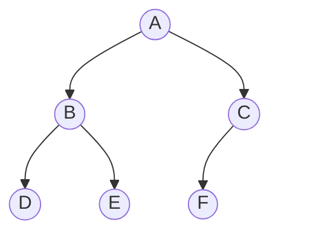
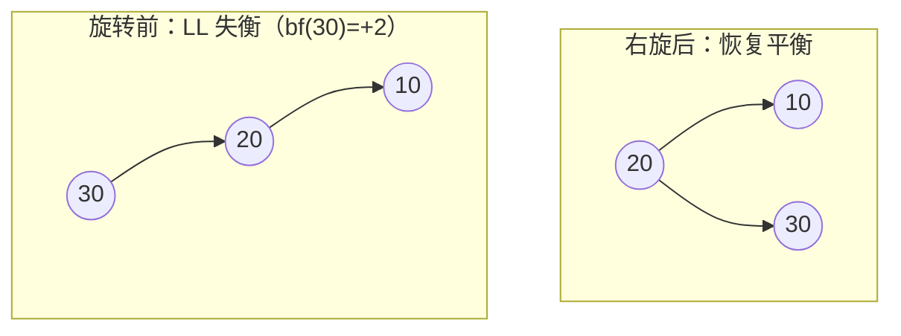
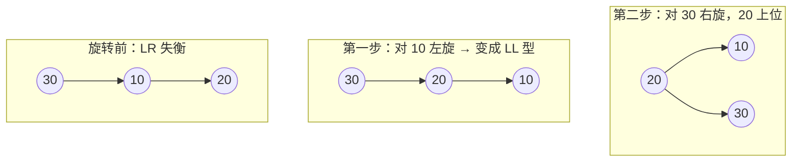

# 数据结构

> 数据结构决定数据"怎么放"，算法决定数据"怎么算"；放得对，算得才快——在 AI 时代，这条规律没有半点松动。

## 0. AI 时代为什么还要学数据结构

有同学会问：模型都能写代码了，还学这些链表红黑树干什么？

答案是：AI 时代的每一个核心组件，本质上都是一个数据结构问题。

深度学习框架里的**张量**，是"多维数组 + 步长（stride）"的实现——理解了顺序表的连续存储与寻址公式，你才明白为什么 `reshape` 几乎零成本、而 `transpose` 后再 `view` 会报错。反向传播依赖的**计算图**就是一张有向无环图，求导顺序正是**拓扑排序**，`autograd` 沿图做的是一次 DFS 回溯。

RAG 系统里的**向量数据库**，检索层的 HNSW 索引是"分层跳表 + 邻近图"的组合，Faiss 的 IVF 索引是"聚类 + 倒排索引"；不懂图与堆，你连参数含义都调不明白。大模型推理的 **KV Cache** 淘汰用 LRU，靠的是"哈希表 + 双向链表"；**分词器**（BPE）的词表匹配靠 Trie 树；训练数据去重靠布隆过滤器。

更现实的一点：AI 能写出对的代码，但选错数据结构的代码"跑得通却跑不动"——一个 `O(n²)` 的相似度检索在百万级向量上就是灾难。**判断该用什么结构、复杂度是否可接受，这个决策权仍在你手里。**

---

## 1. 绪论与复杂度分析

### 知识要点

| 概念 | 说明 |
| --- | --- |
| 数据结构 | 数据元素集合 + 元素间关系 + 定义其上的操作 |
| 逻辑结构 | 集合、线性、树形、图状（关注"关系"） |
| 存储结构 | 顺序、链式、索引、散列（关注"实现"） |
| 时间复杂度 | 基本操作次数随规模 n 的增长量级，记为大 O |
| 空间复杂度 | 除输入外额外占用的存储量级 |
| 均摊分析 | 一系列操作的总代价除以操作次数 |

### 关键概念精讲

**大 O 记号**描述增长量级的上界，忽略常数与低阶项。常见量级从快到慢：

`O(1)` < `O(log n)` < `O(n)` < `O(n log n)` < `O(n²)` < `O(2ⁿ)` < `O(n!)`

判断技巧：循环嵌套层数 ≈ 多项式次数；每次问题规模砍半 → 出现 `log n`；分治（砍半 + 每层线性合并）→ `O(n log n)`。**均摊分析**容易被忽略但极其重要。以 Python 的 `list.append` 为例：数组满了要申请两倍空间并搬迁，单次是 `O(n)`，但下次扩容要等再插入 n 个元素之后。设初始容量 1，插入 n 个元素的总搬迁次数为 `1+2+4+…+n ≈ 2n`，平均到每次是 `O(1)`。所以说 `append` 的**均摊复杂度是 `O(1)`**，而非最坏 `O(n)`。

注意区分三个概念：**最坏情况**是任何输入下的上界，工程上最常用（有保证）；**平均情况**是所有输入的期望，依赖输入分布假设；**均摊**是对操作序列的总代价平均，不涉及概率。

### 案例代码：复杂度实测

```python
import time

def timeit(func, n):
    t = time.perf_counter(); func(n)
    return time.perf_counter() - t

def linear(n):                          # O(n)
    return sum(range(n))

def quadratic(n):                       # O(n^2)
    return sum(1 for i in range(n) for j in range(n))

def amortized_append(n):                # n 次均摊 O(1) 的追加 => 总体 O(n)
    a = []
    for i in range(n):
        a.append(i)

if __name__ == "__main__":
    print("规模翻倍时，O(n) 耗时约 2 倍，O(n^2) 约 4 倍：")
    for n in [1000, 2000, 4000]:
        print(f"  n={n:>5}  O(n)={timeit(linear,n)*1000:7.3f}ms"
              f"   O(n^2)={timeit(quadratic,n)*1000:8.3f}ms")
    print("\n列表追加的均摊代价（单次基本恒定，与规模无关）：")
    for n in [10000, 100000, 1000000]:
        t = timeit(amortized_append, n)
        print(f"  n={n:>8}  总耗时={t*1000:7.2f}ms  单次均摊={t/n*1e9:5.1f}ns")
```

---

## 2. 线性表

### 知识要点

| 结构 | 随机访问 | 头部插入 | 尾部插入 | 中间删除 | 额外空间 |
| --- | --- | --- | --- | --- | --- |
| 顺序表（数组） | `O(1)` | `O(n)` | 均摊 `O(1)` | `O(n)` | 少（可能预留） |
| 单链表 | `O(n)` | `O(1)` | `O(n)`（无尾指针） | `O(1)`（已知前驱） | 每节点一个指针 |
| 双链表 | `O(n)` | `O(1)` | `O(1)` | `O(1)`（已知节点） | 每节点两个指针 |
| 循环链表 | `O(n)` | `O(1)` | `O(1)` | `O(1)` | 同上 |

### 关键概念精讲

**顺序表的本质是"连续内存 + 寻址公式"**：第 i 个元素的地址 = 基地址 + i × 元素大小。这一个乘加运算就是 `O(1)` 随机访问的全部秘密，也是缓存友好的原因——顺序遍历数组时一次缓存行加载能带进相邻的多个元素。链表节点散落在堆上，每次跳转都可能缓存未命中，所以**即使复杂度相同，数组的实际常数往往比链表小一个数量级**。

**链表的三个经典技巧**：**哑结点（dummy node）**——头部加一个不存数据的节点，让"删除头结点"与"删除中间结点"逻辑统一，省掉一堆边界判断；**快慢指针**——快指针一次两步、慢指针一次一步，快指针到尾时慢指针恰在中点，若有环则两者必在环内相遇（Floyd 判圈法）；**三指针反转**——`prev / cur / next` 滚动前进，原地反转，`O(n)` 时间 `O(1)` 空间。

下图对比单链表与双链表的节点结构：单链表节点只有一个 `next` 指针，只能单向前进；双链表节点多一个 `prev` 指针，可双向游走，代价是每个节点多占一个指针的空间。

<svg viewBox="0 0 680 250" role="img" aria-label="单链表与双链表节点结构对比">
  <defs> <marker id="arr05a" markerWidth="8" markerHeight="8" refX="7" refY="4" orient="auto"> <path d="M0,0 L8,4 L0,8 z" fill="var(--text)"/> </marker> </defs>
  <text x="20" y="30" fill="var(--text)" font-size="13" font-weight="bold">单链表：数据域 + next 指针</text> <text x="20" y="72" fill="var(--text)" font-size="12">head</text>
  <line x1="55" y1="68" x2="95" y2="68" stroke="var(--text)" stroke-width="1.5" marker-end="url(#arr05a)"/> <rect x="100" y="50" width="60" height="34" fill="var(--panel)" stroke="var(--text)"/>
  <rect x="160" y="50" width="30" height="34" fill="var(--accent)" stroke="var(--text)" opacity="0.85"/> <text x="130" y="72" fill="var(--text)" font-size="13" text-anchor="middle">1</text>
  <line x1="175" y1="68" x2="255" y2="68" stroke="var(--text)" stroke-width="1.5" marker-end="url(#arr05a)"/> <rect x="260" y="50" width="60" height="34" fill="var(--panel)" stroke="var(--text)"/>
  <rect x="320" y="50" width="30" height="34" fill="var(--accent)" stroke="var(--text)" opacity="0.85"/> <text x="290" y="72" fill="var(--text)" font-size="13" text-anchor="middle">2</text>
  <line x1="335" y1="68" x2="415" y2="68" stroke="var(--text)" stroke-width="1.5" marker-end="url(#arr05a)"/> <rect x="420" y="50" width="60" height="34" fill="var(--panel)" stroke="var(--text)"/>
  <rect x="480" y="50" width="30" height="34" fill="var(--panel)" stroke="var(--text)"/> <text x="450" y="72" fill="var(--text)" font-size="13" text-anchor="middle">3</text>
  <text x="495" y="73" fill="var(--text)" font-size="13" text-anchor="middle">∧</text> <text x="530" y="72" fill="var(--muted, var(--text))" font-size="11">∧ 表示 NULL</text>
  <text x="20" y="140" fill="var(--text)" font-size="13" font-weight="bold">双链表：prev 指针 + 数据域 + next 指针</text> <rect x="100" y="160" width="26" height="34" fill="var(--panel)" stroke="var(--text)"/>
  <rect x="126" y="160" width="52" height="34" fill="var(--panel)" stroke="var(--text)"/> <rect x="178" y="160" width="26" height="34" fill="var(--accent)" stroke="var(--text)" opacity="0.85"/>
  <text x="152" y="182" fill="var(--text)" font-size="13" text-anchor="middle">1</text> <text x="113" y="183" fill="var(--text)" font-size="12" text-anchor="middle">∧</text>
  <rect x="280" y="160" width="26" height="34" fill="var(--accent)" stroke="var(--text)" opacity="0.85"/> <rect x="306" y="160" width="52" height="34" fill="var(--panel)" stroke="var(--text)"/>
  <rect x="358" y="160" width="26" height="34" fill="var(--accent)" stroke="var(--text)" opacity="0.85"/> <text x="332" y="182" fill="var(--text)" font-size="13" text-anchor="middle">2</text>
  <rect x="460" y="160" width="26" height="34" fill="var(--accent)" stroke="var(--text)" opacity="0.85"/> <rect x="486" y="160" width="52" height="34" fill="var(--panel)" stroke="var(--text)"/>
  <rect x="538" y="160" width="26" height="34" fill="var(--panel)" stroke="var(--text)"/> <text x="512" y="182" fill="var(--text)" font-size="13" text-anchor="middle">3</text>
  <text x="551" y="183" fill="var(--text)" font-size="12" text-anchor="middle">∧</text> <line x1="191" y1="168" x2="275" y2="168" stroke="var(--text)" stroke-width="1.5" marker-end="url(#arr05a)"/>
  <line x1="285" y1="186" x2="209" y2="186" stroke="var(--text)" stroke-width="1.5" marker-end="url(#arr05a)"/>
  <line x1="371" y1="168" x2="455" y2="168" stroke="var(--text)" stroke-width="1.5" marker-end="url(#arr05a)"/>
  <line x1="465" y1="186" x2="389" y2="186" stroke="var(--text)" stroke-width="1.5" marker-end="url(#arr05a)"/>
  <text x="100" y="225" fill="var(--text)" font-size="12">上箭头为 next（向右），下箭头为 prev（向左）；已知节点时删除自身为 O(1)</text>
</svg>

### 案例代码：链表经典操作

```python
class Node:
    def __init__(self, val):
        self.val, self.next = val, None

def build(vals):
    dummy = cur = Node(None)            # 哑结点统一边界
    for v in vals:
        cur.next = Node(v); cur = cur.next
    return dummy.next

def to_list(head):
    out = []
    while head:
        out.append(head.val); head = head.next
    return out

def reverse(head):
    """三指针原地反转：O(n) 时间，O(1) 空间"""
    prev, cur = None, head
    while cur:
        nxt = cur.next
        cur.next = prev                 # 掉头
        prev, cur = cur, nxt            # 双双前移
    return prev

def middle_and_cycle(head):
    """快慢指针一箭双雕：快指针到尾时慢指针在中点；有环则两者必相遇"""
    slow = fast = head
    while fast and fast.next:
        slow, fast = slow.next, fast.next.next
        if slow is fast:
            return None, True                   # Floyd 判圈：检测到环
    return slow.val, False

def merge_sorted(a, b):
    """合并两个有序链表：归并排序的核心步骤"""
    dummy = tail = Node(None)
    while a and b:
        if a.val <= b.val:
            tail.next, a = a, a.next
        else:
            tail.next, b = b, b.next
        tail = tail.next
    tail.next = a or b                  # 接上剩余部分，无需逐个搬运
    return dummy.next

if __name__ == "__main__":
    print("原链表:", to_list(build([1, 2, 3, 4, 5])),
          " (中点, 有环):", middle_and_cycle(build([1, 2, 3, 4, 5])))
    print("反转后:", to_list(reverse(build([1, 2, 3, 4, 5]))),
          " 合并有序表:", to_list(merge_sorted(build([1, 3, 5]), build([2, 4, 6]))))
```

### C 版本对照

```c
#include <stdio.h>
#include <stdlib.h>

typedef struct Node { int data; struct Node *next; } Node;

Node *push_front(Node *head, int val) {     /* 头插法：新节点成为新头 */
    Node *node = (Node *)malloc(sizeof(Node));
    node->data = val; node->next = head;
    return node;
}

Node *reverse(Node *head) {                 /* 与 Python 版三指针完全同构 */
    Node *prev = NULL, *cur = head;
    while (cur) {
        Node *next = cur->next;
        cur->next = prev; prev = cur; cur = next;
    }
    return prev;
}

void print_list(Node *head) {
    for (Node *p = head; p; p = p->next) printf("%d ", p->data);
    printf("\n");
}

int main(void) {
    Node *head = NULL;
    for (int i = 5; i >= 1; i--) head = push_front(head, i);
    print_list(head);                       /* 1 2 3 4 5 */
    print_list(head = reverse(head));       /* 5 4 3 2 1 */
    while (head) { Node *n = head->next; free(head); head = n; }  /* 手动释放 */
    return 0;
}
```

> 对照要点：Python 靠垃圾回收自动管理内存，C 必须 `malloc`/`free` 配对。链表是理解指针最好的练习场。

### 招牌案例：LRU 缓存 = 哈希表 + 双向链表

双链表最著名的工程应用是 **LRU（Least Recently Used）缓存**：哈希表负责 `O(1)` 找到节点，双向链表负责 `O(1)` 维护"最近使用"顺序——两个结构各出一技之长，拼出 `get`/`put` 全 `O(1)` 的缓存。大模型推理的 KV Cache、Redis 的近似 LRU 淘汰、操作系统页面置换，用的都是这套骨架。

<svg viewBox="0 0 680 260" role="img" aria-label="LRU 缓存的哈希表加双向链表结构">
  <defs> <marker id="arr05b" markerWidth="8" markerHeight="8" refX="7" refY="4" orient="auto"> <path d="M0,0 L8,4 L0,8 z" fill="var(--text)"/> </marker> </defs>
  <text x="20" y="26" fill="var(--text)" font-size="13" font-weight="bold">哈希表（key → 节点指针）</text> <rect x="20" y="40" width="120" height="30" fill="var(--panel)" stroke="var(--text)"/>
  <text x="80" y="60" fill="var(--text)" font-size="12" text-anchor="middle">"A" → 节点A</text> <rect x="20" y="70" width="120" height="30" fill="var(--panel)" stroke="var(--text)"/>
  <text x="80" y="90" fill="var(--text)" font-size="12" text-anchor="middle">"B" → 节点B</text> <rect x="20" y="100" width="120" height="30" fill="var(--panel)" stroke="var(--text)"/>
  <text x="80" y="120" fill="var(--text)" font-size="12" text-anchor="middle">"C" → 节点C</text> <text x="200" y="26" fill="var(--text)" font-size="13" font-weight="bold">双向链表（头=最新，尾=最旧）</text>
  <text x="210" y="140" fill="var(--text)" font-size="12">head</text> <line x1="222" y1="145" x2="222" y2="165" stroke="var(--text)" stroke-width="1.5" marker-end="url(#arr05b)"/>
  <rect x="190" y="170" width="70" height="40" fill="var(--accent)" stroke="var(--text)" opacity="0.85"/> <text x="225" y="195" fill="var(--text)" font-size="13" text-anchor="middle">B（新）</text>
  <rect x="330" y="170" width="70" height="40" fill="var(--panel)" stroke="var(--text)"/> <text x="365" y="195" fill="var(--text)" font-size="13" text-anchor="middle">A</text>
  <rect x="470" y="170" width="70" height="40" fill="var(--panel)" stroke="var(--text)"/> <text x="505" y="195" fill="var(--text)" font-size="13" text-anchor="middle">C（旧）</text>
  <line x1="263" y1="180" x2="325" y2="180" stroke="var(--text)" stroke-width="1.5" marker-end="url(#arr05b)"/>
  <line x1="327" y1="198" x2="265" y2="198" stroke="var(--text)" stroke-width="1.5" marker-end="url(#arr05b)"/>
  <line x1="403" y1="180" x2="465" y2="180" stroke="var(--text)" stroke-width="1.5" marker-end="url(#arr05b)"/>
  <line x1="467" y1="198" x2="405" y2="198" stroke="var(--text)" stroke-width="1.5" marker-end="url(#arr05b)"/> <text x="560" y="140" fill="var(--text)" font-size="12">tail</text>
  <line x1="572" y1="145" x2="530" y2="168" stroke="var(--text)" stroke-width="1.5" marker-end="url(#arr05b)"/>
  <line x1="140" y1="85" x2="360" y2="165" stroke="var(--accent)" stroke-width="1.2" stroke-dasharray="4 3" marker-end="url(#arr05b)"/>
  <text x="180" y="240" fill="var(--text)" font-size="12">get(A)：哈希表定位节点 A → 摘下并挪到链表头；容量满时淘汰 tail 指向的最旧节点</text>
</svg>

命中一次 `get(key)` 的完整动作：哈希表 `O(1)` 找到节点 → 从链表中摘下（改前后节点的两根指针，`O(1)`）→ 插到链表头。容量满时 `put` 直接删除尾部节点并同步删掉哈希表里的项。**没有双向指针就做不到 `O(1)` 摘除**——单链表删除节点要先 `O(n)` 找前驱，这就是"为什么必须是双链表"的答案。完整实现见 `code/05-data-structures/linked_list.py`。

---

## 3. 栈与队列

### 知识要点

| 结构 | 规则 | 核心操作 | 典型应用 |
| --- | --- | --- | --- |
| 栈 Stack | 后进先出 LIFO | push / pop / top | 函数调用、括号匹配、表达式求值、回溯、DFS |
| 队列 Queue | 先进先出 FIFO | enqueue / dequeue | BFS、任务调度、缓冲区、生产者消费者 |
| 双端队列 Deque | 两端均可进出 | 四方向操作 | 滑动窗口最值、单调队列 |
| 循环队列 | 数组实现，取模复用空间 | 同队列 | 环形缓冲、流式数据 |
| 优先队列 | 按优先级出队 | push / pop-min | 见第 7 章「堆」 |

### 关键概念精讲

**循环队列的"满/空"判定**是经典坑。用数组 + `front`/`rear` 时，`front == rear` 既可能表示空也可能表示满。两种解法：牺牲一个存储单元（约定 `(rear+1) % cap == front` 为满），或额外记录元素个数 `size`。**单调栈**是高频技巧：维护栈内元素单调递增（或递减），用于求"每个元素左/右侧第一个比它大/小的元素"。每个元素最多入栈一次、出栈一次，整体 `O(n)`，远快于暴力的 `O(n²)`。

**表达式求值**分两步：中缀转后缀（逆波兰式），再对后缀式求值。转换的核心规则是"栈顶运算符优先级 ≥ 当前运算符时先弹出"。

栈与队列的操作方向是理解一切的关键：栈只在**同一端**（栈顶）进出，队列在**两端**分别进出。

<svg viewBox="0 0 680 240" role="img" aria-label="栈与队列操作示意">
  <defs> <marker id="arr05c" markerWidth="8" markerHeight="8" refX="7" refY="4" orient="auto"> <path d="M0,0 L8,4 L0,8 z" fill="var(--text)"/> </marker> </defs>
  <text x="70" y="26" fill="var(--text)" font-size="13" font-weight="bold">栈 Stack（LIFO）</text> <line x1="80" y1="60" x2="80" y2="210" stroke="var(--text)" stroke-width="2"/>
  <line x1="200" y1="60" x2="200" y2="210" stroke="var(--text)" stroke-width="2"/> <line x1="80" y1="210" x2="200" y2="210" stroke="var(--text)" stroke-width="2"/>
  <rect x="90" y="170" width="100" height="32" fill="var(--panel)" stroke="var(--text)"/> <text x="140" y="191" fill="var(--text)" font-size="13" text-anchor="middle">1（栈底）</text>
  <rect x="90" y="134" width="100" height="32" fill="var(--panel)" stroke="var(--text)"/> <text x="140" y="155" fill="var(--text)" font-size="13" text-anchor="middle">2</text>
  <rect x="90" y="98" width="100" height="32" fill="var(--accent)" stroke="var(--text)" opacity="0.85"/> <text x="140" y="119" fill="var(--text)" font-size="13" text-anchor="middle">3（栈顶）</text>
  <line x1="40" y1="50" x2="105" y2="88" stroke="var(--text)" stroke-width="1.5" marker-end="url(#arr05c)"/> <text x="14" y="44" fill="var(--text)" font-size="12">push 入栈</text>
  <line x1="175" y1="88" x2="240" y2="50" stroke="var(--text)" stroke-width="1.5" marker-end="url(#arr05c)"/> <text x="212" y="44" fill="var(--text)" font-size="12">pop 出栈</text>
  <text x="96" y="230" fill="var(--text)" font-size="12">进出都在栈顶一端</text> <text x="420" y="26" fill="var(--text)" font-size="13" font-weight="bold">队列 Queue（FIFO）</text>
  <rect x="360" y="110" width="70" height="36" fill="var(--accent)" stroke="var(--text)" opacity="0.85"/> <text x="395" y="133" fill="var(--text)" font-size="13" text-anchor="middle">1（队头）</text>
  <rect x="430" y="110" width="70" height="36" fill="var(--panel)" stroke="var(--text)"/> <text x="465" y="133" fill="var(--text)" font-size="13" text-anchor="middle">2</text>
  <rect x="500" y="110" width="70" height="36" fill="var(--panel)" stroke="var(--text)"/> <text x="535" y="133" fill="var(--text)" font-size="13" text-anchor="middle">3（队尾）</text>
  <line x1="645" y1="128" x2="580" y2="128" stroke="var(--text)" stroke-width="1.5" marker-end="url(#arr05c)"/> <text x="590" y="112" fill="var(--text)" font-size="12">enqueue 入队</text>
  <line x1="352" y1="128" x2="300" y2="128" stroke="var(--text)" stroke-width="1.5" marker-end="url(#arr05c)"/>
  <text x="292" y="112" fill="var(--text)" font-size="12" text-anchor="end">dequeue 出队</text> <text x="366" y="180" fill="var(--text)" font-size="12">队尾进、队头出，先来先服务</text>
</svg>

### 案例代码：括号匹配 + 表达式求值 + 单调栈

```python
def is_balanced(s):
    """括号匹配：左括号入栈，右括号与栈顶配对"""
    pairs, stack = {')': '(', ']': '[', '}': '{'}, []
    for ch in s:
        if ch in "([{":
            stack.append(ch)
        elif ch in pairs:
            if not stack or stack.pop() != pairs[ch]:
                return False
    return not stack

def to_postfix(tokens):
    """中缀转后缀（逆波兰式）"""
    prec = {'+': 1, '-': 1, '*': 2, '/': 2}
    out, ops = [], []
    for t in tokens:
        if t.isdigit():
            out.append(t)
        elif t == '(':
            ops.append(t)
        elif t == ')':
            while ops and ops[-1] != '(':
                out.append(ops.pop())
            ops.pop()                                   # 弹掉左括号
        else:
            # 栈顶优先级不低于当前运算符时先输出，保证左结合
            while ops and ops[-1] != '(' and prec[ops[-1]] >= prec[t]:
                out.append(ops.pop())
            ops.append(t)
    return out + ops[::-1]

def eval_postfix(postfix):
    """后缀求值：数字入栈，运算符弹两个算完再入栈"""
    stack = []
    for t in postfix:
        if t.isdigit():
            stack.append(int(t))
        else:
            b, a = stack.pop(), stack.pop()             # 先弹的是右操作数
            stack.append({'+': a+b, '-': a-b, '*': a*b, '/': a//b}[t])
    return stack[0]

def daily_temperatures(temps):
    """单调栈：求之后第一个更暖的日子还要等几天，O(n)"""
    res, stack = [0] * len(temps), []                   # 栈存下标，温度单调递减
    for i, t in enumerate(temps):
        while stack and temps[stack[-1]] < t:
            j = stack.pop()
            res[j] = i - j
        stack.append(i)
    return res

if __name__ == "__main__":
    for s in ["({[]})", "([)]", "((("]:
        print(f"{s:8} 匹配: {is_balanced(s)}")
    expr = list("3+(2*4-6)/2")
    post = to_postfix(expr)
    print("\n中缀:", "".join(expr), "-> 后缀:", " ".join(post),
          "-> 求值:", eval_postfix(post))
    temps = [73, 74, 75, 71, 69, 72, 76, 73]
    print("\n温度:", temps, "\n等待天数:", daily_temperatures(temps))
```

---

## 4. 串与数组

### 知识要点

| 主题 | 要点 |
| --- | --- |
| 串的存储 | 定长顺序串、堆分配串、块链串 |
| 朴素模式匹配 | 逐位比较，主串指针要回退，最坏 `O(n·m)` |
| KMP 算法 | 利用已匹配信息不回退主串指针，`O(n+m)` |
| next 数组 | 模式串每个前缀的"最长相等前后缀"长度 |
| 多维数组 | 行优先 / 列优先存储，寻址公式 |
| 特殊矩阵压缩 | 对称矩阵、三角矩阵只存一半 |
| 稀疏矩阵 | 三元组表 (行, 列, 值)、十字链表、CSR 格式 |

### 关键概念精讲

**KMP 的核心一句话：失配时主串指针不回退，模式串指针跳到"最长相等前后缀"的位置继续比。** 为什么可以不回退？因为已匹配成功的那段字符内容我们完全知道。如果模式串的前缀 `P[0..k-1]` 与刚匹配的后缀相同，直接把模式串右滑到让这个前缀对齐即可，中间的位置不可能匹配成功。`next` 数组存的就是每个位置对应的这个 `k`。

**稀疏矩阵**在 AI 里无处不在：推荐系统的用户-物品评分矩阵、词袋模型的文档-词矩阵、图神经网络的邻接矩阵，非零元素往往不到 1%。三元组表 `(row, col, value)` 把空间从 `O(m·n)` 降到 `O(nnz)`。工业界更常用 **CSR（压缩稀疏行）**格式：三个数组分别存值、列下标、每行起始位置，兼顾空间与行遍历速度——`scipy.sparse` 和 PyTorch 稀疏张量都是这么干的。

**行优先寻址公式**（C/Python 采用）：二维数组 `A[m][n]` 中 `A[i][j]` 的偏移 = `i * n + j`。这也解释了为什么按行遍历远快于按列遍历——按行是连续内存，缓存命中率高。

### 案例代码：KMP + 稀疏矩阵

```python
def build_next(pattern):
    """next[i] = pattern[0..i] 的最长相等前后缀长度"""
    nxt, k = [0] * len(pattern), 0
    for i in range(1, len(pattern)):
        while k > 0 and pattern[i] != pattern[k]:
            k = nxt[k - 1]                      # 回退到更短的前后缀
        if pattern[i] == pattern[k]:
            k += 1
        nxt[i] = k
    return nxt

def kmp_search(text, pattern):
    """KMP 匹配：返回所有匹配起始下标，O(n+m)"""
    if not pattern:
        return []
    nxt, res, k = build_next(pattern), [], 0
    for i, ch in enumerate(text):
        while k > 0 and ch != pattern[k]:
            k = nxt[k - 1]                      # 失配，模式串右滑，主串 i 不回退
        if ch == pattern[k]:
            k += 1
        if k == len(pattern):
            res.append(i - k + 1)
            k = nxt[k - 1]                      # 继续找下一个
    return res

class SparseMatrix:
    """三元组表存储稀疏矩阵：空间从 O(m*n) 降到 O(nnz)"""
    def __init__(self, rows, cols):
        self.rows, self.cols, self.triples = rows, cols, []

    def set(self, i, j, v):
        if v != 0:
            self.triples.append((i, j, v))

    def transpose(self):
        """转置：交换行列下标后按行排序"""
        t = SparseMatrix(self.cols, self.rows)
        t.triples = sorted((j, i, v) for i, j, v in self.triples)
        return t

    def dense(self):
        m = [[0] * self.cols for _ in range(self.rows)]
        for i, j, v in self.triples:
            m[i][j] = v
        return m

    def memory_ratio(self):
        """三元组表相对稠密存储的空间占比"""
        return 3 * len(self.triples) / (self.rows * self.cols)

if __name__ == "__main__":
    text, pat = "ABABDABACDABABCABAB", "ABABCABAB"
    print("文本:", text, "  模式:", pat)
    print("next 数组:", build_next(pat), " KMP 匹配位置:", kmp_search(text, pat))
    print(f"（朴素匹配需回退主串反复比较，KMP 全程扫描至多 {len(text)} 次）")

    print("\n稀疏矩阵（6x6，仅 5 个非零元）:")
    sm = SparseMatrix(6, 6)
    for i, j, v in [(0, 2, 3), (1, 0, 7), (3, 4, 1), (4, 1, 9), (5, 5, 4)]:
        sm.set(i, j, v)
    for row in sm.dense():
        print("  ", row)
    print("  三元组表:", sm.triples, f"\n  空间占比: {sm.memory_ratio():.1%}",
          "\n  转置后:", sm.transpose().triples)
```

---

## 5. 树与二叉树

### 知识要点

| 概念 | 定义 |
| --- | --- |
| 度 | 节点的子树个数；树的度 = 最大节点度 |
| 满二叉树 | 每层节点都满，深度 k 共 `2^k - 1` 个节点 |
| 完全二叉树 | 除最后一层外都满，最后一层节点靠左连续 |
| 二叉树性质 | 第 i 层最多 `2^(i-1)` 个节点；叶子数 n0 = 度为 2 的节点数 n2 + 1 |
| 遍历 | 前序（根左右）、中序（左根右）、后序（左右根）、层序（BFS） |
| 线索二叉树 | 用空指针域指向前驱/后继，使遍历不需递归栈 |
| 哈夫曼树 | 带权路径长度最小的二叉树，用于最优前缀编码 |
| 并查集 | 森林表示的集合，支持快速合并与查询 |

### 关键概念精讲

**遍历的本质是递归的三种时机**：访问根的动作放在"递归左子树之前"是前序，"两次递归之间"是中序，"递归右子树之后"是后序。理解这一点，三种遍历就只是一行代码的位置差别。一个重要结论：**已知中序 + 前序（或后序）可唯一确定一棵二叉树**，但只有前序 + 后序不行，因为中序提供了"左右子树分界线"的信息。

以下面这棵树为例（与案例代码中重建的树相同，F 是 C 的左孩子）：



四种遍历得到的访问序列：

| 遍历方式 | 访问时机 | 序列 |
| --- | --- | --- |
| 前序 | 先根，再左，再右 | `A B D E C F` |
| 中序 | 先左，再根，再右 | `D B E A F C` |
| 后序 | 先左，再右，最后根 | `D E B F C A` |
| 层序 | 自上而下、自左向右（BFS） | `A B C D E F` |

对照可见：前序第一个必是根、后序最后一个必是根、中序里根把序列切成左右子树两半——重建二叉树靠的就是这三条规律。

**哈夫曼编码**是贪心算法的典范：每次取权值最小的两个节点合并，新节点权值为二者之和。得到的编码是**前缀码**（任何编码都不是另一个的前缀），因此解码无需分隔符。gzip、JPEG 以及大模型分词器 BPE 的思想都与之相关。

**并查集**用一棵树表示一个集合，根节点作为代表元。两个优化让它近乎 `O(1)`：**路径压缩**（`find` 时把路径上的节点直接挂到根下）与**按秩合并**（矮树挂到高树下，避免退化成链）。两者结合后 m 次操作总复杂度为 `O(m·α(n))`，α 是反阿克曼函数，实际中不超过 5。

### 案例代码：遍历 + 哈夫曼编码

```python
import heapq
from collections import Counter

class TreeNode:
    def __init__(self, val):
        self.val, self.left, self.right = val, None, None

def build_from_pre_in(preorder, inorder):
    """由前序 + 中序重建二叉树"""
    if not preorder:
        return None
    root = TreeNode(preorder[0])
    k = inorder.index(preorder[0])              # 中序中根的位置分开左右子树
    root.left = build_from_pre_in(preorder[1:k+1], inorder[:k])
    root.right = build_from_pre_in(preorder[k+1:], inorder[k+1:])
    return root

def traverse(root, order):
    """三种遍历只差"访问根"这一行的位置"""
    out = []
    def go(n):
        if not n:
            return
        if order == "pre":  out.append(n.val)
        go(n.left)
        if order == "in":   out.append(n.val)
        go(n.right)
        if order == "post": out.append(n.val)
    go(root)
    return out

# ---------- 哈夫曼编码：贪心合并最小的两个权值 ----------
class HuffNode:
    def __init__(self, freq, char=None, left=None, right=None):
        self.freq, self.char, self.left, self.right = freq, char, left, right
    def __lt__(self, other):                    # 供堆比较
        return self.freq < other.freq

def huffman(text):
    freq = Counter(text)
    heap = [HuffNode(f, c) for c, f in freq.items()]
    heapq.heapify(heap)
    while len(heap) > 1:                        # 贪心：每次合并最小的两个
        a, b = heapq.heappop(heap), heapq.heappop(heap)
        heapq.heappush(heap, HuffNode(a.freq + b.freq, None, a, b))
    codes = {}
    def assign(node, code):
        if node.char is not None:
            codes[node.char] = code or "0"      # 单字符特例
            return
        assign(node.left, code + "0")
        assign(node.right, code + "1")
    assign(heap[0], "")
    return codes, freq

if __name__ == "__main__":
    root = build_from_pre_in(['A','B','D','E','C','F'], ['D','B','E','A','F','C'])
    print("前序:", traverse(root, "pre"), " 中序:", traverse(root, "in"))
    print("后序:", traverse(root, "post"))

    print("\n===== 哈夫曼编码 =====")
    text = "abracadabra"
    codes, freq = huffman(text)
    for ch in sorted(codes, key=lambda c: -freq[c]):
        print(f"  '{ch}' 频次={freq[ch]}  编码={codes[ch]}")
    encoded = "".join(codes[c] for c in text)
    print(f"  原文 {len(text)*8} bit -> 编码 {len(encoded)} bit，"
          f"压缩率 {len(encoded)/(len(text)*8):.1%}")
```

> 并查集（路径压缩 + 按秩合并）的完整实现与 Kruskal 最小生成树应用见 `code/05-data-structures/graph.py`。

---

## 6. 二叉搜索树与平衡树

### 知识要点

| 结构 | 查找 | 插入/删除 | 特点与用途 |
| --- | --- | --- | --- |
| BST | 平均 `O(log n)`，最坏 `O(n)` | 同左 | 简单，但有序插入会退化成链表 |
| AVL 树 | `O(log n)` | `O(log n)` | 严格平衡（高度差 ≤ 1），查询快、旋转频繁 |
| 红黑树 | `O(log n)` | `O(log n)` | 近似平衡，插删代价低，STL map / Java TreeMap |
| B 树 | `O(log_m n)` | `O(log_m n)` | 多路平衡，减少磁盘 I/O |
| B+ 树 | `O(log_m n)` | `O(log_m n)` | 数据只在叶子且叶子成链，数据库索引首选 |

### 关键概念精讲

**BST 的中序遍历必然有序**——这是它最重要的性质，也是验证一棵树是否为 BST 的最简单方法。

**AVL 的四种旋转**是必考点，判断依据是"失衡节点到新插入节点"的路径方向：

| 失衡类型 | 路径 | 处理 |
| --- | --- | --- |
| LL | 左子树的左侧 | 右旋一次 |
| RR | 右子树的右侧 | 左旋一次 |
| LR | 左子树的右侧 | 先对左孩子左旋，再对自己右旋 |
| RL | 右子树的左侧 | 先对右孩子右旋，再对自己左旋 |

**LL 型**最直观：依次插入 30、20、10 后，节点 30 的平衡因子变为 +2，对 30 做一次右旋，20 上位为新根：



**LR 型**需要两步：插入路径是"先左后右"，单次右旋救不回来，必须先把它拧成 LL 型。例如依次插入 30、10、20：



两张图的共同规律：**旋转前后中序序列不变**（始终是 10, 20, 30），变的只是"谁当根"——这正是旋转能在不破坏 BST 性质的前提下降低树高的原因。RR 与 RL 分别是 LL 与 LR 的镜像，请自行画图推演一遍。

**红黑树**放宽平衡要求，只保证"最长路径 ≤ 2 × 最短路径"。五条性质：节点非红即黑；根为黑；叶（NIL）为黑；红节点的孩子必为黑（不能连续红）；任一节点到其所有叶子的路径含相同数目的黑节点。代价是查询略慢于 AVL，但插删的旋转次数少（插入最多 2 次），所以**写多读少用红黑树，读多写少用 AVL**。

**B+ 树为什么是数据库索引的标准答案？** 三个原因：一是**树矮**，磁盘 I/O 是瓶颈，一个节点存一页（如 16KB）可容纳上百个键，3~4 层就能索引上亿条记录；二是**数据只在叶子节点**，非叶节点只存键不存数据，同样大小能装更多键，进一步降低树高；三是**叶子串成有序链表**，范围查询（`WHERE id BETWEEN 10 AND 100`）只需定位起点再顺链表扫，而 B 树要反复中序回溯。

### 案例代码：AVL 旋转与平衡插入

```python
class AVLNode:
    def __init__(self, key):
        self.key, self.left, self.right, self.height = key, None, None, 1

def h(node):
    return node.height if node else 0

def update(node):
    node.height = 1 + max(h(node.left), h(node.right))

def balance_factor(node):
    """平衡因子 = 左高 - 右高，绝对值 > 1 即失衡"""
    return h(node.left) - h(node.right) if node else 0

def rotate_right(y):
    """右旋（处理 LL）：y(x(A,B),C) => x(A, y(B,C))，中序序列保持不变"""
    x = y.left
    y.left, x.right = x.right, y
    update(y); update(x)
    return x

def rotate_left(x):
    """左旋（处理 RR）：右旋的镜像"""
    y = x.right
    x.right, y.left = y.left, x
    update(x); update(y)
    return y

def avl_insert(node, key, log):
    """普通 BST 插入 + 回溯途中检查平衡"""
    if node is None:
        return AVLNode(key)
    if key < node.key:
        node.left = avl_insert(node.left, key, log)
    elif key > node.key:
        node.right = avl_insert(node.right, key, log)
    else:
        return node
    update(node)

    bf = balance_factor(node)
    if bf > 1 and key < node.left.key:                  # LL
        log.append(f"节点 {node.key} LL 失衡 -> 右旋")
        return rotate_right(node)
    if bf < -1 and key > node.right.key:                # RR
        log.append(f"节点 {node.key} RR 失衡 -> 左旋")
        return rotate_left(node)
    if bf > 1 and key > node.left.key:                  # LR
        log.append(f"节点 {node.key} LR 失衡 -> 左孩子左旋 + 自身右旋")
        node.left = rotate_left(node.left)
        return rotate_right(node)
    if bf < -1 and key < node.right.key:                # RL
        log.append(f"节点 {node.key} RL 失衡 -> 右孩子右旋 + 自身左旋")
        node.right = rotate_right(node.right)
        return rotate_left(node)
    return node

def level_view(root):
    """按层输出各层的键，直观展示树形"""
    levels, cur = [], [root] if root else []
    while cur:
        levels.append([n.key for n in cur])
        cur = [c for n in cur for c in (n.left, n.right) if c]
    return levels

if __name__ == "__main__":
    root, log = None, []
    for k in [10, 20, 30, 40, 50, 25]:
        log.clear()
        root = avl_insert(root, k, log)
        print(f"插入 {k:>2}: {'；'.join(log) if log else '无需旋转'}")
        print(f"        层序 {level_view(root)}  树高={h(root)}")
```

> 完整的 BST 增删查改、四种遍历，以及"AVL vs 普通 BST 插入有序序列"的退化对照实验，见配套文件 `code/05-data-structures/bst.py`。

---

## 7. 堆与优先队列

### 知识要点

| 操作 | 复杂度 | 说明 |
| --- | --- | --- |
| 建堆（自底向上） | `O(n)` | 从最后一个非叶节点开始依次下沉 |
| 建堆（逐个插入） | `O(n log n)` | 较慢，不推荐 |
| 插入 push | `O(log n)` | 放末尾后上浮 |
| 取顶 peek | `O(1)` | 堆顶即最值 |
| 弹出 pop | `O(log n)` | 顶与末尾交换后下沉 |
| 堆排序 | `O(n log n)` | 原地、不稳定 |
| TopK | `O(n log k)` | 维护大小为 k 的堆 |

### 关键概念精讲

**堆是一棵完全二叉树，所以能用数组紧凑存储**，不需要指针。下标关系（0-based）：节点 `i` 的左孩子 = `2i + 1`，右孩子 = `2i + 2`，父亲 = `(i - 1) // 2`。下图展示小顶堆 `[10, 20, 15, 30, 40, 50, 60]` 的数组存储与完全二叉树的一一对应：

<svg viewBox="0 0 680 310" role="img" aria-label="堆的数组表示与完全二叉树对应关系">
  <defs> <marker id="arr05d" markerWidth="8" markerHeight="8" refX="7" refY="4" orient="auto"> <path d="M0,0 L8,4 L0,8 z" fill="var(--text)"/> </marker> </defs>
  <line x1="340" y1="52" x2="185" y2="100" stroke="var(--text)" stroke-width="1.5"/> <line x1="340" y1="52" x2="495" y2="100" stroke="var(--text)" stroke-width="1.5"/>
  <line x1="180" y1="122" x2="105" y2="170" stroke="var(--text)" stroke-width="1.5"/> <line x1="180" y1="122" x2="255" y2="170" stroke="var(--text)" stroke-width="1.5"/>
  <line x1="500" y1="122" x2="425" y2="170" stroke="var(--text)" stroke-width="1.5"/> <line x1="500" y1="122" x2="575" y2="170" stroke="var(--text)" stroke-width="1.5"/>
  <circle cx="340" cy="40" r="22" fill="var(--accent)" stroke="var(--text)" opacity="0.85"/> <text x="340" y="45" fill="var(--text)" font-size="13" text-anchor="middle">10</text>
  <text x="368" y="34" fill="var(--text)" font-size="11">i=0</text> <circle cx="180" cy="112" r="22" fill="var(--panel)" stroke="var(--text)"/>
  <text x="180" y="117" fill="var(--text)" font-size="13" text-anchor="middle">20</text> <text x="208" y="106" fill="var(--text)" font-size="11">i=1</text>
  <circle cx="500" cy="112" r="22" fill="var(--panel)" stroke="var(--text)"/> <text x="500" y="117" fill="var(--text)" font-size="13" text-anchor="middle">15</text>
  <text x="528" y="106" fill="var(--text)" font-size="11">i=2</text> <circle cx="105" cy="184" r="22" fill="var(--panel)" stroke="var(--text)"/>
  <text x="105" y="189" fill="var(--text)" font-size="13" text-anchor="middle">30</text> <text x="105" y="222" fill="var(--text)" font-size="11" text-anchor="middle">i=3</text>
  <circle cx="255" cy="184" r="22" fill="var(--panel)" stroke="var(--text)"/> <text x="255" y="189" fill="var(--text)" font-size="13" text-anchor="middle">40</text>
  <text x="255" y="222" fill="var(--text)" font-size="11" text-anchor="middle">i=4</text> <circle cx="425" cy="184" r="22" fill="var(--panel)" stroke="var(--text)"/>
  <text x="425" y="189" fill="var(--text)" font-size="13" text-anchor="middle">50</text> <text x="425" y="222" fill="var(--text)" font-size="11" text-anchor="middle">i=5</text>
  <circle cx="575" cy="184" r="22" fill="var(--panel)" stroke="var(--text)"/> <text x="575" y="189" fill="var(--text)" font-size="13" text-anchor="middle">60</text>
  <text x="575" y="222" fill="var(--text)" font-size="11" text-anchor="middle">i=6</text> <g> <rect x="130" y="248" width="60" height="34" fill="var(--accent)" stroke="var(--text)" opacity="0.85"/>
  <rect x="190" y="248" width="60" height="34" fill="var(--panel)" stroke="var(--text)"/> <rect x="250" y="248" width="60" height="34" fill="var(--panel)" stroke="var(--text)"/>
  <rect x="310" y="248" width="60" height="34" fill="var(--panel)" stroke="var(--text)"/> <rect x="370" y="248" width="60" height="34" fill="var(--panel)" stroke="var(--text)"/>
  <rect x="430" y="248" width="60" height="34" fill="var(--panel)" stroke="var(--text)"/> <rect x="490" y="248" width="60" height="34" fill="var(--panel)" stroke="var(--text)"/> </g>
  <text x="160" y="270" fill="var(--text)" font-size="13" text-anchor="middle">10</text> <text x="220" y="270" fill="var(--text)" font-size="13" text-anchor="middle">20</text>
  <text x="280" y="270" fill="var(--text)" font-size="13" text-anchor="middle">15</text> <text x="340" y="270" fill="var(--text)" font-size="13" text-anchor="middle">30</text>
  <text x="400" y="270" fill="var(--text)" font-size="13" text-anchor="middle">40</text> <text x="460" y="270" fill="var(--text)" font-size="13" text-anchor="middle">50</text>
  <text x="520" y="270" fill="var(--text)" font-size="13" text-anchor="middle">60</text> <text x="160" y="298" fill="var(--text)" font-size="11" text-anchor="middle">0</text>
  <text x="220" y="298" fill="var(--text)" font-size="11" text-anchor="middle">1</text> <text x="280" y="298" fill="var(--text)" font-size="11" text-anchor="middle">2</text>
  <text x="340" y="298" fill="var(--text)" font-size="11" text-anchor="middle">3</text> <text x="400" y="298" fill="var(--text)" font-size="11" text-anchor="middle">4</text>
  <text x="460" y="298" fill="var(--text)" font-size="11" text-anchor="middle">5</text> <text x="520" y="298" fill="var(--text)" font-size="11" text-anchor="middle">6</text>
  <text x="30" y="270" fill="var(--text)" font-size="12">数组：</text> <text x="560" y="270" fill="var(--text)" font-size="11">左=2i+1</text>
  <text x="560" y="286" fill="var(--text)" font-size="11">右=2i+2</text>
</svg>

例如 `i=1`（值 20）的左孩子在 `2×1+1=3`（值 30）、右孩子在 `2×1+2=4`（值 40），与树形完全吻合——不存指针也能瞬间定位亲子关系，这是堆比一般二叉树省内存又缓存友好的原因。**为什么自底向上建堆是 `O(n)` 而不是 `O(n log n)`？** 因为绝大多数节点在底层，而底层节点下沉的距离几乎为 0。第 h 层有约 `n/2^h` 个节点、每个最多下沉 h 层，总代价 `Σ h·n/2^h ≈ 2n`。

**TopK 问题的正确姿势**：求最大的 k 个数，应维护一个**大小为 k 的小顶堆**（而非大顶堆）。遍历数据时若当前值大于堆顶（即当前第 k 名），就替换堆顶并下沉。时间 `O(n log k)`、空间 `O(k)`——当 n 是千万级、k 只有 10 时，比全排序 `O(n log n)` 快出几个数量级，且支持流式数据。**向量数据库的召回层用的就是这个套路。**

### 案例代码：TopK 与优先队列调度

```python
import heapq, random, time

def topk_by_heap(nums, k):
    """维护大小为 k 的小顶堆，O(n log k)"""
    heap = []
    for x in nums:
        if len(heap) < k:
            heapq.heappush(heap, x)
        elif x > heap[0]:                       # 比当前第 k 名大才有资格进
            heapq.heapreplace(heap, x)
    return sorted(heap, reverse=True)

def topk_by_sort(nums, k):
    """全排序对照，O(n log n)"""
    return sorted(nums, reverse=True)[:k]

def schedule(tasks):
    """优先队列调度：(优先级越小越先执行, 序号保证同级按到达顺序, 名称)"""
    heap = [(prio, i, name) for i, (prio, name) in enumerate(tasks)]
    heapq.heapify(heap)
    order = []
    while heap:
        prio, _, name = heapq.heappop(heap)
        order.append(f"{name}(P{prio})")
    return order

if __name__ == "__main__":
    random.seed(42)
    data = [random.randint(1, 1000) for _ in range(20)]
    print("数据:", data)
    print("堆法 Top5:", topk_by_heap(data, 5), " 排序 Top5:", topk_by_sort(data, 5))

    big = [random.randint(1, 10**6) for _ in range(200000)]
    t0 = time.perf_counter(); r1 = topk_by_heap(big, 10)
    t1 = time.perf_counter(); r2 = topk_by_sort(big, 10); t2 = time.perf_counter()
    print(f"\n20 万数据取 Top10：堆 {(t1-t0)*1000:.2f}ms，"
          f"全排序 {(t2-t1)*1000:.2f}ms，结果一致: {r1 == r2}")
    print("任务调度:", schedule([(3,"写报告"), (1,"修线上bug"),
                               (2,"评审代码"), (1,"回滚发布")]))
```

> 手写小顶堆（含建堆逐步过程打印）与堆排序见 `code/05-data-structures/bst.py`。

---

## 8. 图

### 知识要点

| 主题 | 要点 |
| --- | --- |
| 存储 | 邻接矩阵 `O(V²)`（稠密图、查边 `O(1)`）；邻接表 `O(V+E)`（稀疏图） |
| BFS | 队列，逐层扩散，可求无权图最短路，`O(V+E)` |
| DFS | 栈/递归，一路到底再回溯，`O(V+E)` |
| 拓扑排序 | Kahn 入度法或 DFS 逆后序，仅适用于 DAG，可检测环 |
| 关键路径 | AOE 网上的最长路径，决定工程最短工期 |
| 最短路 | Dijkstra（非负权）、Bellman-Ford（可负权）、Floyd（多源） |
| 最小生成树 | Prim（加点，适合稠密）、Kruskal（加边 + 并查集，适合稀疏） |

### 关键概念精讲

先看同一张无向图（A-B、A-C、B-D、C-D 四条边）的两种存法：

<svg viewBox="0 0 680 250" role="img" aria-label="邻接矩阵与邻接表对比">
  <defs> <marker id="arr05e" markerWidth="8" markerHeight="8" refX="7" refY="4" orient="auto"> <path d="M0,0 L8,4 L0,8 z" fill="var(--text)"/> </marker> </defs>
  <text x="20" y="24" fill="var(--text)" font-size="13" font-weight="bold">原图</text> <line x1="60" y1="70" x2="130" y2="70" stroke="var(--text)" stroke-width="1.5"/>
  <line x1="60" y1="70" x2="60" y2="150" stroke="var(--text)" stroke-width="1.5"/> <line x1="130" y1="70" x2="130" y2="150" stroke="var(--text)" stroke-width="1.5"/>
  <line x1="60" y1="150" x2="130" y2="150" stroke="var(--text)" stroke-width="1.5"/> <circle cx="60" cy="70" r="16" fill="var(--accent)" stroke="var(--text)" opacity="0.85"/>
  <text x="60" y="75" fill="var(--text)" font-size="12" text-anchor="middle">A</text> <circle cx="130" cy="70" r="16" fill="var(--panel)" stroke="var(--text)"/>
  <text x="130" y="75" fill="var(--text)" font-size="12" text-anchor="middle">B</text> <circle cx="60" cy="150" r="16" fill="var(--panel)" stroke="var(--text)"/>
  <text x="60" y="155" fill="var(--text)" font-size="12" text-anchor="middle">C</text> <circle cx="130" cy="150" r="16" fill="var(--panel)" stroke="var(--text)"/>
  <text x="130" y="155" fill="var(--text)" font-size="12" text-anchor="middle">D</text> <text x="230" y="24" fill="var(--text)" font-size="13" font-weight="bold">邻接矩阵 O(V²)</text>
  <text x="268" y="52" fill="var(--text)" font-size="11">A</text> <text x="298" y="52" fill="var(--text)" font-size="11">B</text> <text x="328" y="52" fill="var(--text)" font-size="11">C</text>
  <text x="358" y="52" fill="var(--text)" font-size="11">D</text> <text x="242" y="78" fill="var(--text)" font-size="11">A</text> <text x="242" y="108" fill="var(--text)" font-size="11">B</text>
  <text x="242" y="138" fill="var(--text)" font-size="11">C</text> <text x="242" y="168" fill="var(--text)" font-size="11">D</text> <g font-size="12" text-anchor="middle">
  <rect x="258" y="62" width="30" height="30" fill="var(--panel)" stroke="var(--text)"/><text x="273" y="82" fill="var(--text)">0</text>
  <rect x="288" y="62" width="30" height="30" fill="var(--accent)" stroke="var(--text)" opacity="0.85"/><text x="303" y="82" fill="var(--text)">1</text>
  <rect x="318" y="62" width="30" height="30" fill="var(--accent)" stroke="var(--text)" opacity="0.85"/><text x="333" y="82" fill="var(--text)">1</text>
  <rect x="348" y="62" width="30" height="30" fill="var(--panel)" stroke="var(--text)"/><text x="363" y="82" fill="var(--text)">0</text>
  <rect x="258" y="92" width="30" height="30" fill="var(--accent)" stroke="var(--text)" opacity="0.85"/><text x="273" y="112" fill="var(--text)">1</text>
  <rect x="288" y="92" width="30" height="30" fill="var(--panel)" stroke="var(--text)"/><text x="303" y="112" fill="var(--text)">0</text>
  <rect x="318" y="92" width="30" height="30" fill="var(--panel)" stroke="var(--text)"/><text x="333" y="112" fill="var(--text)">0</text>
  <rect x="348" y="92" width="30" height="30" fill="var(--accent)" stroke="var(--text)" opacity="0.85"/><text x="363" y="112" fill="var(--text)">1</text>
  <rect x="258" y="122" width="30" height="30" fill="var(--accent)" stroke="var(--text)" opacity="0.85"/><text x="273" y="142" fill="var(--text)">1</text>
  <rect x="288" y="122" width="30" height="30" fill="var(--panel)" stroke="var(--text)"/><text x="303" y="142" fill="var(--text)">0</text>
  <rect x="318" y="122" width="30" height="30" fill="var(--panel)" stroke="var(--text)"/><text x="333" y="142" fill="var(--text)">0</text>
  <rect x="348" y="122" width="30" height="30" fill="var(--accent)" stroke="var(--text)" opacity="0.85"/><text x="363" y="142" fill="var(--text)">1</text>
  <rect x="258" y="152" width="30" height="30" fill="var(--panel)" stroke="var(--text)"/><text x="273" y="172" fill="var(--text)">0</text>
  <rect x="288" y="152" width="30" height="30" fill="var(--accent)" stroke="var(--text)" opacity="0.85"/><text x="303" y="172" fill="var(--text)">1</text>
  <rect x="318" y="152" width="30" height="30" fill="var(--accent)" stroke="var(--text)" opacity="0.85"/><text x="333" y="172" fill="var(--text)">1</text>
  <rect x="348" y="152" width="30" height="30" fill="var(--panel)" stroke="var(--text)"/><text x="363" y="172" fill="var(--text)">0</text> </g>
  <text x="450" y="24" fill="var(--text)" font-size="13" font-weight="bold">邻接表 O(V+E)</text> <g font-size="12" text-anchor="middle">
  <rect x="440" y="60" width="34" height="28" fill="var(--panel)" stroke="var(--text)"/><text x="457" y="79" fill="var(--text)">A</text>
  <rect x="440" y="96" width="34" height="28" fill="var(--panel)" stroke="var(--text)"/><text x="457" y="115" fill="var(--text)">B</text>
  <rect x="440" y="132" width="34" height="28" fill="var(--panel)" stroke="var(--text)"/><text x="457" y="151" fill="var(--text)">C</text>
  <rect x="440" y="168" width="34" height="28" fill="var(--panel)" stroke="var(--text)"/><text x="457" y="187" fill="var(--text)">D</text>
  <rect x="520" y="60" width="34" height="28" fill="var(--accent)" stroke="var(--text)" opacity="0.85"/><text x="537" y="79" fill="var(--text)">B</text>
  <rect x="590" y="60" width="34" height="28" fill="var(--accent)" stroke="var(--text)" opacity="0.85"/><text x="607" y="79" fill="var(--text)">C</text>
  <rect x="520" y="96" width="34" height="28" fill="var(--accent)" stroke="var(--text)" opacity="0.85"/><text x="537" y="115" fill="var(--text)">A</text>
  <rect x="590" y="96" width="34" height="28" fill="var(--accent)" stroke="var(--text)" opacity="0.85"/><text x="607" y="115" fill="var(--text)">D</text>
  <rect x="520" y="132" width="34" height="28" fill="var(--accent)" stroke="var(--text)" opacity="0.85"/><text x="537" y="151" fill="var(--text)">A</text>
  <rect x="590" y="132" width="34" height="28" fill="var(--accent)" stroke="var(--text)" opacity="0.85"/><text x="607" y="151" fill="var(--text)">D</text>
  <rect x="520" y="168" width="34" height="28" fill="var(--accent)" stroke="var(--text)" opacity="0.85"/><text x="537" y="187" fill="var(--text)">B</text>
  <rect x="590" y="168" width="34" height="28" fill="var(--accent)" stroke="var(--text)" opacity="0.85"/><text x="607" y="187" fill="var(--text)">C</text> </g>
  <line x1="474" y1="74" x2="515" y2="74" stroke="var(--text)" stroke-width="1.5" marker-end="url(#arr05e)"/>
  <line x1="554" y1="74" x2="585" y2="74" stroke="var(--text)" stroke-width="1.5" marker-end="url(#arr05e)"/>
  <line x1="474" y1="110" x2="515" y2="110" stroke="var(--text)" stroke-width="1.5" marker-end="url(#arr05e)"/>
  <line x1="554" y1="110" x2="585" y2="110" stroke="var(--text)" stroke-width="1.5" marker-end="url(#arr05e)"/>
  <line x1="474" y1="146" x2="515" y2="146" stroke="var(--text)" stroke-width="1.5" marker-end="url(#arr05e)"/>
  <line x1="554" y1="146" x2="585" y2="146" stroke="var(--text)" stroke-width="1.5" marker-end="url(#arr05e)"/>
  <line x1="474" y1="182" x2="515" y2="182" stroke="var(--text)" stroke-width="1.5" marker-end="url(#arr05e)"/>
  <line x1="554" y1="182" x2="585" y2="182" stroke="var(--text)" stroke-width="1.5" marker-end="url(#arr05e)"/>
  <text x="20" y="234" fill="var(--text)" font-size="12">矩阵查"AB 是否有边"O(1) 但占 V² 空间；邻接表只存实际存在的边，遍历邻居更快，稀疏图（E 远小于 V²）首选</text>
</svg>

**BFS 与 DFS 的唯一区别是容器**：待访问节点放进队列就是 BFS，放进栈就是 DFS。这个视角能把两者统一记忆。**拓扑排序的 Kahn 算法**流程：统计入度 → 入度为 0 的入队 → 出队一个并输出，把它指向的节点入度减 1，减到 0 就入队 → 重复。**若最终输出的节点数少于总节点数，说明图中有环。** 这个"检测环"的副产品在实际中比排序本身用得还多——构建系统的循环依赖检测、Excel 循环引用检测、深度学习框架校验计算图是否为 DAG，都是它。

**关键路径（Critical Path）**用于工程进度管理。在 AOE 网（边表示活动、权表示耗时）中，`ve[i]` 是事件 i 的最早发生时间（正向递推取最大），`vl[i]` 是最迟发生时间（逆向递推取最小）。活动的时间余量 = 最迟开始 − 最早开始，**余量为 0 的活动就是关键活动**，串起来即关键路径。只有缩短关键活动才能缩短总工期。

**Dijkstra 为什么不能处理负权边？** 它的贪心前提是"已确定最短距离的节点不会再被更新"。负权边打破了这个假设——一条更长的路径可能因后面有负权边而总长更短。此时要用 Bellman-Ford（`O(VE)`，还能检测负环）。

### 案例代码：BFS/DFS/拓扑排序/关键路径

```python
from collections import defaultdict, deque

def bfs_shortest(adj, src):
    """无权图最短路：BFS 逐层扩散，第一次到达即最短"""
    dist, q = {src: 0}, deque([src])
    while q:
        u = q.popleft()
        for v in adj[u]:
            if v not in dist:
                dist[v] = dist[u] + 1
                q.append(v)
    return dist

def topo_sort(nodes, edges):
    """Kahn 入度法；返回 (排序结果, 是否有环)"""
    adj, indeg = defaultdict(list), {n: 0 for n in nodes}
    for u, v in edges:
        adj[u].append(v); indeg[v] += 1
    q = deque(sorted(n for n in nodes if indeg[n] == 0))
    order = []
    while q:
        u = q.popleft()
        order.append(u)
        for v in adj[u]:
            indeg[v] -= 1
            if indeg[v] == 0:
                q.append(v)
    return order, len(order) != len(nodes)

if __name__ == "__main__":
    adj = {'A': ['B','C'], 'B': ['A','D'], 'C': ['A','D','E'],
           'D': ['B','C','F'], 'E': ['C','F'], 'F': ['D','E']}
    print("BFS 最短跳数:", bfs_shortest(adj, 'A'))

    print("\n===== 拓扑排序 =====")
    nodes = ["取数据", "清洗", "特征工程", "训练", "评估", "部署"]
    edges = [("取数据","清洗"), ("清洗","特征工程"), ("特征工程","训练"),
             ("训练","评估"), ("评估","部署")]
    order, cyc = topo_sort(nodes, edges)
    print("流水线顺序:", " -> ".join(order), "| 有环:", cyc)
    print("加入回边后检测到环:", topo_sort(nodes, edges + [("部署","取数据")])[1])
```

> 邻接矩阵/邻接表、关键路径（AOE 网 ve/vl 推算）、Dijkstra、Kruskal 最小生成树的完整实现见 `code/05-data-structures/graph.py`。

---

## 9. 查找与哈希

### 知识要点

| 查找方法 | 时间复杂度 | 前提 |
| --- | --- | --- |
| 顺序查找 | `O(n)` | 无 |
| 二分查找 | `O(log n)` | 有序 + 可随机访问 |
| 分块查找 | `O(√n)` | 块间有序 |
| BST / 平衡树 | `O(log n)` | 有序键 |
| 哈希表 | 平均 `O(1)`，最坏 `O(n)` | 好的哈希函数 |
| 布隆过滤器 | `O(k)` | 允许假阳性 |

| 冲突处理 | 做法 | 优缺点 |
| --- | --- | --- |
| 链地址法 | 冲突元素串成链表/红黑树 | 实现简单、装填因子可 > 1；有指针开销 |
| 线性探测 | 冲突后往后找空位 | 缓存友好；易产生一次聚集 |
| 平方探测 | 步长 `1², 2², 3²…` | 缓解一次聚集；有二次聚集 |
| 双重哈希 | 步长由第二个哈希决定 | 分布最均匀；计算稍慢 |
| 再哈希 | 换一个哈希函数重算 | 简单；需维护多份函数 |

### 关键概念精讲

先直观感受**链地址法**如何消化冲突：哈希函数 `H(key) = key % 5`，依次插入 12、25、7、17、5，其中 12、7、17 都落进 2 号槽，25、5 都落进 0 号槽——冲突元素在槽后串成链表即可：

<svg viewBox="0 0 680 240" role="img" aria-label="哈希表链地址法冲突处理">
  <defs> <marker id="arr05f" markerWidth="8" markerHeight="8" refX="7" refY="4" orient="auto"> <path d="M0,0 L8,4 L0,8 z" fill="var(--text)"/> </marker> </defs>
  <text x="20" y="26" fill="var(--text)" font-size="13" font-weight="bold">槽位数组</text> <g font-size="12" text-anchor="middle">
  <rect x="60" y="40" width="50" height="34" fill="var(--panel)" stroke="var(--text)"/><text x="85" y="62" fill="var(--text)">0</text>
  <rect x="60" y="74" width="50" height="34" fill="var(--panel)" stroke="var(--text)"/><text x="85" y="96" fill="var(--text)">1</text>
  <rect x="60" y="108" width="50" height="34" fill="var(--panel)" stroke="var(--text)"/><text x="85" y="130" fill="var(--text)">2</text>
  <rect x="60" y="142" width="50" height="34" fill="var(--panel)" stroke="var(--text)"/><text x="85" y="164" fill="var(--text)">3</text>
  <rect x="60" y="176" width="50" height="34" fill="var(--panel)" stroke="var(--text)"/><text x="85" y="198" fill="var(--text)">4</text> </g> <g font-size="13" text-anchor="middle">
  <rect x="180" y="40" width="60" height="34" fill="var(--accent)" stroke="var(--text)" opacity="0.85"/><text x="210" y="62" fill="var(--text)">25</text>
  <rect x="310" y="40" width="60" height="34" fill="var(--accent)" stroke="var(--text)" opacity="0.85"/><text x="340" y="62" fill="var(--text)">5</text>
  <rect x="180" y="108" width="60" height="34" fill="var(--accent)" stroke="var(--text)" opacity="0.85"/><text x="210" y="130" fill="var(--text)">12</text>
  <rect x="310" y="108" width="60" height="34" fill="var(--accent)" stroke="var(--text)" opacity="0.85"/><text x="340" y="130" fill="var(--text)">7</text>
  <rect x="440" y="108" width="60" height="34" fill="var(--accent)" stroke="var(--text)" opacity="0.85"/><text x="470" y="130" fill="var(--text)">17</text> </g>
  <line x1="110" y1="57" x2="175" y2="57" stroke="var(--text)" stroke-width="1.5" marker-end="url(#arr05f)"/>
  <line x1="240" y1="57" x2="305" y2="57" stroke="var(--text)" stroke-width="1.5" marker-end="url(#arr05f)"/>
  <line x1="110" y1="125" x2="175" y2="125" stroke="var(--text)" stroke-width="1.5" marker-end="url(#arr05f)"/>
  <line x1="240" y1="125" x2="305" y2="125" stroke="var(--text)" stroke-width="1.5" marker-end="url(#arr05f)"/>
  <line x1="370" y1="125" x2="435" y2="125" stroke="var(--text)" stroke-width="1.5" marker-end="url(#arr05f)"/> <text x="378" y="62" fill="var(--text)" font-size="12">∧</text>
  <text x="508" y="130" fill="var(--text)" font-size="12">∧</text> <text x="130" y="96" fill="var(--text)" font-size="12">∧（空槽）</text> <text x="130" y="164" fill="var(--text)" font-size="12">∧</text>
  <text x="130" y="198" fill="var(--text)" font-size="12">∧</text> <text x="20" y="232" fill="var(--text)" font-size="12">12 % 5 = 7 % 5 = 17 % 5 = 2，三者冲突后挂在同一条链上；查找 17 需沿链比较 3 次</text>
</svg>

链越长查找越慢，所以要控制**装填因子 α = 元素数 / 表长**——它是哈希表性能的命门。链地址法在 α ≈ 1 时平均查找长度仍很小；开放地址法在 α > 0.7 后性能急剧恶化（探测次数约 `1/(1-α)`）。所以 Java HashMap 的默认扩容阈值是 0.75，Python dict 是 2/3。**好的哈希函数**要满足：计算快、分布均匀、雪崩效应（输入微小变化导致输出剧变）。常用有除留余数法（`key % p`，p 取素数）、BKDR、FNV、MurmurHash。**注意：Python 的 `hash()` 对字符串默认加了随机盐**（防哈希碰撞 DoS 攻击），同一字符串在不同进程中的哈希值不同，不能持久化。

**布隆过滤器**用 m 位的位数组和 k 个哈希函数：插入时把 k 个位置置 1；查询时若有任一位为 0 则**一定不存在**，全为 1 则**可能存在**（假阳性）。它的价值在于用极小空间挡掉绝大多数无效查询：亿级 URL 去重只需几十 MB，而哈希表要几个 GB。代价是不支持删除（除非用计数布隆过滤器）。典型场景：缓存穿透防护、爬虫 URL 去重、LSM-Tree 的 SSTable 查找剪枝、训练数据去重。

**二分查找的边界是永恒的坑**。推荐记住"左闭右闭"写法：`while lo <= hi`，`hi = mid - 1`，`lo = mid + 1`。求左边界（第一个 ≥ target）时改用"左闭右开"：`while lo < hi`，`hi = mid`，`lo = mid + 1`。

### 案例代码：二分查找 + 布隆过滤器

```python
import hashlib

def binary_search(arr, target):
    """标准二分（左闭右闭），返回 (下标, 比较次数)"""
    lo, hi, steps = 0, len(arr) - 1, 0
    while lo <= hi:
        steps += 1
        mid = (lo + hi) // 2
        if arr[mid] == target:
            return mid, steps
        if arr[mid] < target:
            lo = mid + 1
        else:
            hi = mid - 1
    return -1, steps

class BloomFilter:
    def __init__(self, m_bits=1 << 16, k=4):
        self.m, self.k = m_bits, k
        self.bits = bytearray(m_bits // 8)

    def _positions(self, s):
        d = hashlib.sha256(s.encode()).digest()  # 从摘要切出 k 个独立哈希
        for i in range(self.k):
            yield int.from_bytes(d[i*4:(i+1)*4], "big") % self.m

    def add(self, s):
        for p in self._positions(s):
            self.bits[p // 8] |= 1 << (p % 8)

    def __contains__(self, s):
        return all(self.bits[p//8] & (1 << (p % 8)) for p in self._positions(s))

if __name__ == "__main__":
    arr = list(range(0, 200, 2))
    print("有序数组长度:", len(arr))
    for t in [88, 89]:
        idx, steps = binary_search(arr, t)
        print(f"  查找 {t}: 下标={idx}, 比较 {steps} 次"
              f"（顺序查找平均需 ~{len(arr)//2} 次）")

    print("===== 布隆过滤器（插入 1 万元素）=====")
    bf = BloomFilter()
    for i in range(10000):
        bf.add(f"user_{i}")
    hit = sum(1 for i in range(10000) if f"user_{i}" in bf)
    fp = sum(1 for i in range(10000, 20000) if f"user_{i}" in bf)
    print(f"  已插入元素全部命中: {hit}/10000")
    print(f"  未插入元素误判: {fp}/10000，假阳性率 {fp/10000:.4%}")
    print(f"  内存占用: {len(bf.bits)/1024:.1f} KB")
```

### C 版本对照

链地址法哈希表（BKDR 哈希 + 自动扩容 rehash）与开放地址法线性探测的完整 C 实现见 `code/05-data-structures/hashtable.c`，编译运行命令：

```c
/* gcc -std=c11 -Wall -O2 -o hashtable hashtable.c  &&  ./hashtable */
```

---

## 扩展知识点

学有余力的同学可按下面的清单继续深入，它们都是"教科书之外、工业界之内"的高频结构。

| 结构 | 一句话说明 | 典型应用 |
| --- | --- | --- |
| 跳表 Skip List | 多层有序链表，用概率实现平衡，期望 `O(log n)` | Redis ZSet、LevelDB MemTable |
| Trie 字典树 | 按字符逐层分叉，前缀共享 | 自动补全、IP 路由、BPE 分词器词表 |
| AC 自动机 | Trie + 失配指针，多模式串同时匹配 | 敏感词过滤、内容审核 |
| 后缀数组 / 后缀自动机 | 处理子串的所有问题 | 生物信息比对、全文检索 |
| 线段树 / 树状数组 | 区间查询与单点/区间修改，`O(log n)` | 区间和、区间最值、逆序对统计 |
| LSM-Tree | 写入先进内存表，批量合并落盘，写优化 | LevelDB、RocksDB、HBase |
| LRU / LFU 缓存 | 哈希表 + 双向链表 / 频次桶 | CPU 缓存、Redis 淘汰、大模型 KV Cache |
| 一致性哈希 | 哈希环 + 虚拟节点，扩缩容只影响少量数据 | 分布式缓存、分库分表 |
| HyperLogLog / Count-Min Sketch | 概率算法估算基数与频次 | 日活统计、流式热点、限流 |
| Merkle 树 | 哈希树，快速定位差异 | Git、区块链、数据同步校验 |
| R 树 / KD 树 | 空间索引，支持范围与最近邻 | 地图检索、碰撞检测、sklearn KNN |
| HNSW | 分层可导航小世界图，近似最近邻 | Milvus、Qdrant、Faiss |
| IVF-PQ | 倒排聚类 + 乘积量化压缩向量 | 十亿级向量检索 |

**重点推荐两条学习线**：

1. **数据库线**：B+ 树 → LSM-Tree → 一致性哈希。搞懂这三个，你就理解了 MySQL、RocksDB、Redis Cluster 的存储内核。
2. **AI 基础设施线**：Trie（分词）→ LRU（KV Cache）→ 堆 TopK（召回）→ HNSW（向量索引）。这四个串起来就是一套 RAG 系统的数据结构骨架。

下面把其中三个最有代表性的方向展开成正式小节：跳表（概率平衡的典范）、LSM-Tree（写优化存储的骨架）、HNSW（AI 时代向量检索的心脏）。

### 扩展一：跳表 Skip List——用抛硬币代替旋转

**动机**：有序链表查找是 `O(n)`，因为只能一格格走。如果在链表上方加几条"快车道"——第 1 层每 2 个节点抽 1 个、第 2 层每 4 个抽 1 个……查找时先坐快车粗定位、再下到慢车精确找，路径长度就变成了 `O(log n)`。这就是跳表：**多层有序链表，上层是下层的稀疏索引**。

<svg viewBox="0 0 680 230" role="img" aria-label="跳表多层结构与查找路径">
  <defs> <marker id="arr05g" markerWidth="8" markerHeight="8" refX="7" refY="4" orient="auto"> <path d="M0,0 L8,4 L0,8 z" fill="var(--text)"/> </marker> </defs>
  <text x="14" y="52" fill="var(--text)" font-size="12">L2</text> <text x="14" y="102" fill="var(--text)" font-size="12">L1</text> <text x="14" y="152" fill="var(--text)" font-size="12">L0</text>
  <g font-size="12" text-anchor="middle"> <rect x="44" y="34" width="44" height="28" fill="var(--panel)" stroke="var(--text)"/><text x="66" y="53" fill="var(--text)">head</text>
  <rect x="44" y="84" width="44" height="28" fill="var(--panel)" stroke="var(--text)"/><text x="66" y="103" fill="var(--text)">head</text>
  <rect x="44" y="134" width="44" height="28" fill="var(--panel)" stroke="var(--text)"/><text x="66" y="153" fill="var(--text)">head</text>
  <rect x="250" y="34" width="44" height="28" fill="var(--accent)" stroke="var(--text)" opacity="0.85"/><text x="272" y="53" fill="var(--text)">26</text>
  <rect x="150" y="84" width="44" height="28" fill="var(--panel)" stroke="var(--text)"/><text x="172" y="103" fill="var(--text)">7</text>
  <rect x="250" y="84" width="44" height="28" fill="var(--accent)" stroke="var(--text)" opacity="0.85"/><text x="272" y="103" fill="var(--text)">26</text>
  <rect x="430" y="84" width="44" height="28" fill="var(--panel)" stroke="var(--text)"/><text x="452" y="103" fill="var(--text)">37</text>
  <rect x="110" y="134" width="44" height="28" fill="var(--panel)" stroke="var(--text)"/><text x="132" y="153" fill="var(--text)">3</text>
  <rect x="150" y="134" width="44" height="28" fill="var(--panel)" stroke="var(--text)"/><text x="172" y="153" fill="var(--text)">7</text>
  <rect x="200" y="134" width="44" height="28" fill="var(--panel)" stroke="var(--text)"/><text x="222" y="153" fill="var(--text)">19</text>
  <rect x="250" y="134" width="44" height="28" fill="var(--accent)" stroke="var(--text)" opacity="0.85"/><text x="272" y="153" fill="var(--text)">26</text>
  <rect x="360" y="134" width="44" height="28" fill="var(--accent)" stroke="var(--text)" opacity="0.85"/><text x="382" y="153" fill="var(--text)">30</text>
  <rect x="430" y="134" width="44" height="28" fill="var(--panel)" stroke="var(--text)"/><text x="452" y="153" fill="var(--text)">37</text>
  <rect x="520" y="134" width="44" height="28" fill="var(--panel)" stroke="var(--text)"/><text x="542" y="153" fill="var(--text)">54</text> </g>
  <line x1="88" y1="48" x2="245" y2="48" stroke="var(--accent)" stroke-width="2" marker-end="url(#arr05g)"/>
  <line x1="88" y1="98" x2="145" y2="98" stroke="var(--text)" stroke-width="1.2" marker-end="url(#arr05g)"/>
  <line x1="194" y1="98" x2="245" y2="98" stroke="var(--text)" stroke-width="1.2" marker-end="url(#arr05g)"/>
  <line x1="294" y1="98" x2="425" y2="98" stroke="var(--accent)" stroke-width="2" marker-end="url(#arr05g)"/>
  <line x1="88" y1="148" x2="105" y2="148" stroke="var(--text)" stroke-width="1.2" marker-end="url(#arr05g)"/> <line x1="154" y1="148" x2="145" y2="148" stroke="none"/>
  <line x1="194" y1="148" x2="195" y2="148" stroke="none"/> <line x1="244" y1="148" x2="245" y2="148" stroke="none"/>
  <line x1="294" y1="148" x2="355" y2="148" stroke="var(--accent)" stroke-width="2" marker-end="url(#arr05g)"/>
  <line x1="404" y1="148" x2="425" y2="148" stroke="var(--text)" stroke-width="1.2" marker-end="url(#arr05g)"/>
  <line x1="474" y1="148" x2="515" y2="148" stroke="var(--text)" stroke-width="1.2" marker-end="url(#arr05g)"/>
  <line x1="272" y1="62" x2="272" y2="80" stroke="var(--accent)" stroke-width="2" stroke-dasharray="3 2" marker-end="url(#arr05g)"/>
  <line x1="272" y1="112" x2="272" y2="130" stroke="var(--accent)" stroke-width="2" stroke-dasharray="3 2" marker-end="url(#arr05g)"/>
  <text x="40" y="200" fill="var(--text)" font-size="12">查找 30 的路径（加粗）：L2 走到 26 → 降到 L1（37 超了）→ 降到 L0 → 前进一步命中 30，只比较了 5 次</text>
</svg>

**层数怎么定？抛硬币。** 每个新节点从第 0 层开始，以概率 `p = 0.5` 决定"再长高一层"，直到失败为止。于是约一半节点只有 1 层、四分之一有 2 层、`n/2^k` 个节点有 k+1 层——**期望层数是 2，整体高度期望 `O(log n)`**，查找、插入、删除的期望复杂度都是 `O(log n)`。这与 AVL/红黑树同级，但**完全不需要旋转**：插入只改前驱指针，实现量是红黑树的几分之一，还天然支持范围遍历（沿第 0 层顺序走）。Redis 的 ZSet、LevelDB 的 MemTable 选它，正是看中"简单 + 有序 + 并发友好"。

核心实现（完整版含 `delete` 与性能对比，见练习题 8 参考答案）：

```python
import random

MAX_LEVEL = 16

class SkipNode:
    def __init__(self, key, level):
        self.key = key
        self.forward = [None] * level        # 每层一个后继指针

class SkipList:
    def __init__(self, p=0.5):
        self.p = p
        self.head = SkipNode(None, MAX_LEVEL)   # 头结点不存数据
        self.level = 1

    def _random_level(self):
        """抛硬币：每多一层概率减半，期望层数 1/(1-p) = 2"""
        lvl = 1
        while random.random() < self.p and lvl < MAX_LEVEL:
            lvl += 1
        return lvl

    def insert(self, key):
        update = [self.head] * MAX_LEVEL
        cur = self.head
        for i in range(self.level - 1, -1, -1):     # 自顶向下找插入位置
            while cur.forward[i] and cur.forward[i].key < key:
                cur = cur.forward[i]
            update[i] = cur                          # 记录每层的前驱
        if cur.forward[0] and cur.forward[0].key == key:
            return                                   # 已存在
        lvl = self._random_level()
        self.level = max(self.level, lvl)
        node = SkipNode(key, lvl)
        for i in range(lvl):                         # 逐层接线，无需任何旋转
            node.forward[i] = update[i].forward[i]
            update[i].forward[i] = node

    def search(self, key):
        cur = self.head
        for i in range(self.level - 1, -1, -1):      # 高层粗跳、低层细走
            while cur.forward[i] and cur.forward[i].key < key:
                cur = cur.forward[i]
        nxt = cur.forward[0]
        return nxt is not None and nxt.key == key

    def layer_view(self):
        out = []
        for i in range(self.level - 1, -1, -1):
            keys, cur = [], self.head.forward[i]
            while cur:
                keys.append(cur.key); cur = cur.forward[i]
            out.append((i, keys))
        return out

if __name__ == "__main__":
    random.seed(42)
    sl = SkipList()
    for k in [3, 7, 11, 19, 26, 37, 54, 78]:
        sl.insert(k)
    print("跳表分层结构（自顶向下，上层是下层的稀疏索引）：")
    for lvl, keys in sl.layer_view():
        print(f"  L{lvl}: {keys}")
    print("search(26):", sl.search(26), " search(30):", sl.search(30))
```

对比平衡树记三点：**实现简单**（无旋转、无颜色标记）、**范围查询天然顺畅**（底层就是有序链表）、**代价是比较次数常数略大**（期望约 `log n / p` 次）且空间多出约一倍指针。工程上"读写都频繁的有序集合"选跳表，几乎不会错。

### 扩展二：LSM-Tree——把随机写变成顺序写

**动机**：B+ 树每次写入都可能触发磁盘随机 I/O（找到叶子页、原地改、可能分裂）。而磁盘（尤其是机械盘和 SSD 的整块擦写）做**顺序写比随机写快 1~2 个数量级**。LSM-Tree（Log-Structured Merge-Tree）的思路是：**写永远不碰旧数据——先写内存，攒够一批再顺序追加成新文件，后台慢慢归并**。LevelDB、RocksDB、HBase、Cassandra 的存储引擎全是这个骨架。

三个核心组件：

1. **MemTable**：内存中的有序结构（通常就是上一节的跳表），写入 `O(log n)`，写满一个阈值就"冻结"。
2. **SSTable（Sorted String Table）**：冻结的 MemTable 排好序后**一次性顺序写盘**，从此不可变。点查靠二分 + 布隆过滤器剪枝。
3. **Compaction（归并）**：SSTable 会越攒越多，读一个 key 可能要翻好几个文件（读放大）。后台线程定期把多个小段**多路归并**成大段：新值覆盖旧值、删除标记（墓碑）真正清除——正是归并排序的工程化应用。

<svg viewBox="0 0 680 250" role="img" aria-label="LSM-Tree 写入与归并流程">
  <defs> <marker id="arr05h" markerWidth="8" markerHeight="8" refX="7" refY="4" orient="auto"> <path d="M0,0 L8,4 L0,8 z" fill="var(--text)"/> </marker> </defs>
  <text x="20" y="30" fill="var(--text)" font-size="12">写请求</text> <line x1="30" y1="40" x2="30" y2="66" stroke="var(--text)" stroke-width="1.5" marker-end="url(#arr05h)"/>
  <rect x="20" y="70" width="150" height="46" fill="var(--accent)" stroke="var(--text)" opacity="0.85"/>
  <text x="95" y="90" fill="var(--text)" font-size="12" text-anchor="middle">MemTable（内存跳表）</text> <text x="95" y="106" fill="var(--text)" font-size="11" text-anchor="middle">写入 O(log n)，写满冻结</text>
  <line x1="170" y1="93" x2="235" y2="93" stroke="var(--text)" stroke-width="1.5" marker-end="url(#arr05h)"/> <text x="176" y="86" fill="var(--text)" font-size="11">flush 顺序写</text>
  <rect x="240" y="52" width="130" height="36" fill="var(--panel)" stroke="var(--text)"/> <text x="305" y="75" fill="var(--text)" font-size="12" text-anchor="middle">L0: SSTable 新段</text>
  <rect x="240" y="96" width="130" height="36" fill="var(--panel)" stroke="var(--text)"/> <text x="305" y="119" fill="var(--text)" font-size="12" text-anchor="middle">L0: SSTable 旧段</text>
  <line x1="370" y1="72" x2="445" y2="110" stroke="var(--text)" stroke-width="1.5" marker-end="url(#arr05h)"/>
  <line x1="370" y1="114" x2="445" y2="118" stroke="var(--text)" stroke-width="1.5" marker-end="url(#arr05h)"/> <text x="380" y="94" fill="var(--text)" font-size="11">compaction 多路归并</text>
  <rect x="450" y="96" width="200" height="42" fill="var(--panel)" stroke="var(--text)"/> <text x="550" y="114" fill="var(--text)" font-size="12" text-anchor="middle">L1: 合并后的大 SSTable</text>
  <text x="550" y="130" fill="var(--text)" font-size="11" text-anchor="middle">去重、清墓碑、全局有序</text>
  <line x1="30" y1="170" x2="30" y2="144" stroke="var(--accent)" stroke-width="1.5" marker-end="url(#arr05h)"/>
  <text x="20" y="188" fill="var(--text)" font-size="12">读请求：MemTable → L0（新→旧）→ L1，找到即停；每段配布隆过滤器，"一定没有"的段直接跳过</text>
  <text x="20" y="216" fill="var(--text)" font-size="12">代价三角：写放大（同一数据被归并多次重写）、读放大（翻多个段）、空间放大（旧版本暂存）</text> <text x="20" y="236" fill="var(--text)" font-size="12">调参的本质就是在这三个放大之间做交换，没有免费午餐</text>
</svg>

用 60 行代码模拟这套机制（MemTable 用 dict 简化，真实系统用跳表以保证 flush 时有序遍历）：

```python
from bisect import bisect_left

TOMBSTONE = "<deleted>"

class SSTable:
    """不可变有序段（模拟磁盘文件）：两个平行数组 + 二分点查"""
    def __init__(self, items):                  # items: 已排序的 (k, v) 列表
        self.keys = [k for k, _ in items]
        self.vals = [v for _, v in items]

    def get(self, key):
        i = bisect_left(self.keys, key)
        if i < len(self.keys) and self.keys[i] == key:
            return self.vals[i]
        return None

    def __len__(self):
        return len(self.keys)

class MiniLSM:
    def __init__(self, mem_limit=4, l0_limit=2):
        self.mem = {}                # MemTable：真实系统用跳表保证有序遍历
        self.mem_limit = mem_limit
        self.l0 = []                 # Level-0：新段在前
        self.l1 = None               # Level-1：合并后的大段
        self.l0_limit = l0_limit
        self.log = []

    def put(self, key, value):
        self.mem[key] = value        # 写只碰内存 => 写延迟极低
        if len(self.mem) >= self.mem_limit:
            self._flush()

    def delete(self, key):
        self.put(key, TOMBSTONE)     # 删除也是一次写入（墓碑标记）

    def _flush(self):
        sst = SSTable(sorted(self.mem.items()))
        self.l0.insert(0, sst)
        self.log.append(f"flush -> L0 新段 {list(sst.keys)}")
        self.mem = {}
        if len(self.l0) > self.l0_limit:
            self._compact()

    def _compact(self):
        """把 L0 全部段与 L1 归并成一个段：旧数据先写、新数据覆盖，墓碑真正删除"""
        merged = {}
        sources = ([self.l1] if self.l1 else []) + self.l0[::-1]  # 旧 -> 新
        for sst in sources:
            for k, v in zip(sst.keys, sst.vals):
                merged[k] = v
        live = sorted((k, v) for k, v in merged.items() if v != TOMBSTONE)
        self.l1 = SSTable(live)
        self.log.append(f"compact -> L1 共 {len(live)} 条（墓碑已清除）")
        self.l0 = []

    def get(self, key):
        """读路径：MemTable -> L0（新到旧）-> L1，找到即停（新值屏蔽旧值）"""
        if key in self.mem:
            v = self.mem[key]
            return None if v == TOMBSTONE else v
        for sst in self.l0:
            v = sst.get(key)
            if v is not None:
                return None if v == TOMBSTONE else v
        return self.l1.get(key) if self.l1 else None

if __name__ == "__main__":
    db = MiniLSM(mem_limit=4, l0_limit=2)
    for i in range(1, 11):
        db.put(f"k{i:02d}", i * 10)
    db.put("k03", 999)           # 覆盖写：不修改旧段，只写新记录
    db.delete("k05")             # 删除写墓碑
    for i in range(11, 15):
        db.put(f"k{i:02d}", i * 10)
    print("操作日志：")
    for line in db.log:
        print("  ", line)
    print("\n读验证: k03 =", db.get("k03"), "(应为 999，新值屏蔽旧值)")
    print("        k05 =", db.get("k05"), "(应为 None，已删除)")
    print("        k01 =", db.get("k01"), " k14 =", db.get("k14"))
    print("当前形态: MemTable", len(db.mem), "条 | L0", len(db.l0), "段 | L1",
          len(db.l1) if db.l1 else 0, "条")
```

运行可以看到：覆盖写 `k03 = 999` 并没有修改旧段，只是靠"新段优先"的读顺序屏蔽了旧值；`delete` 写入墓碑，直到 compaction 才真正消失。**与 B+ 树的取舍一句话总结：B+ 树读快写慢（原地更新），LSM-Tree 写快读稍慢（追加 + 归并）**——写多读少的日志、消息、时序场景选 LSM，读多写少的交易查询选 B+ 树。

### 扩展三：HNSW——向量检索的分层小世界图

**问题**：RAG 检索要在千万级向量里找与查询向量最相似的 Top-K。暴力扫描每次都要算 n 次距离，`O(n·d)` 扛不住；KD 树在高维（d > 20）退化到接近线性——这就是"维度灾难"。工业界的答案是**近似最近邻（ANN）**：放弃 100% 精确，换取上百倍加速，HNSW（Hierarchical Navigable Small World）是目前综合表现最好的方案之一，Milvus、Qdrant、Faiss、pgvector 都实现了它。

**两个思想拼起来就是 HNSW**：

1. **可导航小世界图（NSW）**：把每个向量连向它的若干近邻，形成一张图。查询时从任意入口出发做**贪心游走**——每步跳到邻居中离查询最近的点，直到没有更近的邻居。小世界图中任意两点间的期望跳数是 `O(log n)`。
2. **跳表式分层**：单层贪心容易困在局部最优，且起点离目标太远时游走慢。HNSW 给图加了层级——每个节点抛硬币决定最高出现在第几层（与跳表完全同构），高层节点稀疏、边跨度大，像"高速公路"；底层节点齐全、边致密，像"街道"。**查询自顶层贪心下降，到第 0 层再做精细的束搜索（beam search，宽度为参数 ef）**。

<svg viewBox="0 0 680 270" role="img" aria-label="HNSW 分层图检索示意">
  <defs> <marker id="arr05i" markerWidth="8" markerHeight="8" refX="7" refY="4" orient="auto"> <path d="M0,0 L8,4 L0,8 z" fill="var(--accent)"/> </marker> </defs>
  <rect x="40" y="30" width="600" height="56" fill="var(--panel)" stroke="var(--text)" opacity="0.5" rx="6"/>
  <rect x="40" y="106" width="600" height="56" fill="var(--panel)" stroke="var(--text)" opacity="0.5" rx="6"/>
  <rect x="40" y="182" width="600" height="60" fill="var(--panel)" stroke="var(--text)" opacity="0.5" rx="6"/> <text x="50" y="50" fill="var(--text)" font-size="12">L2 稀疏（高速公路）</text>
  <text x="50" y="126" fill="var(--text)" font-size="12">L1</text> <text x="50" y="202" fill="var(--text)" font-size="12">L0 全部节点（街道）</text>
  <line x1="240" y1="62" x2="420" y2="60" stroke="var(--text)" stroke-width="1"/> <circle cx="240" cy="62" r="9" fill="var(--accent)" stroke="var(--text)"/>
  <circle cx="420" cy="60" r="9" fill="var(--panel)" stroke="var(--text)"/> <text x="232" y="48" fill="var(--text)" font-size="11">入口</text>
  <line x1="200" y1="134" x2="330" y2="130" stroke="var(--text)" stroke-width="1"/> <line x1="330" y1="130" x2="470" y2="136" stroke="var(--text)" stroke-width="1"/>
  <circle cx="200" cy="134" r="8" fill="var(--panel)" stroke="var(--text)"/> <circle cx="330" cy="130" r="8" fill="var(--panel)" stroke="var(--text)"/>
  <circle cx="470" cy="136" r="8" fill="var(--panel)" stroke="var(--text)"/> <line x1="150" y1="214" x2="230" y2="208" stroke="var(--text)" stroke-width="1"/>
  <line x1="230" y1="208" x2="310" y2="216" stroke="var(--text)" stroke-width="1"/> <line x1="310" y1="216" x2="390" y2="210" stroke="var(--text)" stroke-width="1"/>
  <line x1="390" y1="210" x2="470" y2="216" stroke="var(--text)" stroke-width="1"/> <line x1="470" y1="216" x2="550" y2="210" stroke="var(--text)" stroke-width="1"/>
  <circle cx="150" cy="214" r="7" fill="var(--panel)" stroke="var(--text)"/> <circle cx="230" cy="208" r="7" fill="var(--panel)" stroke="var(--text)"/>
  <circle cx="310" cy="216" r="7" fill="var(--panel)" stroke="var(--text)"/> <circle cx="390" cy="210" r="7" fill="var(--panel)" stroke="var(--text)"/>
  <circle cx="470" cy="216" r="7" fill="var(--accent)" stroke="var(--text)"/> <circle cx="550" cy="210" r="7" fill="var(--panel)" stroke="var(--text)"/>
  <text x="462" y="258" fill="var(--text)" font-size="11">目标★</text> <line x1="240" y1="71" x2="330" y2="122" stroke="var(--accent)" stroke-width="2" stroke-dasharray="4 3" marker-end="url(#arr05i)"/>
  <line x1="330" y1="138" x2="470" y2="136" stroke="var(--accent)" stroke-width="2" marker-end="url(#arr05i)"/>
  <line x1="470" y1="144" x2="470" y2="208" stroke="var(--accent)" stroke-width="2" stroke-dasharray="4 3" marker-end="url(#arr05i)"/>
  <text x="560" y="90" fill="var(--text)" font-size="11">加粗虚线 = 查询路径：</text> <text x="560" y="106" fill="var(--text)" font-size="11">高层大步逼近，</text>
  <text x="560" y="122" fill="var(--text)" font-size="11">逐层下降，</text> <text x="560" y="138" fill="var(--text)" font-size="11">底层精细搜索</text>
</svg>

关键参数只有两个：**M**（每个节点保留的邻居数，大则图更稠密、召回高但内存大）、**ef**（搜索时的候选队列宽度，大则更准但更慢）。下面是一个只用标准库的简化实现，能跑出与暴力扫描对比的真实召回率：

```python
import random, math, heapq

DIST_CALLS = 0
def dist(a, b):
    global DIST_CALLS
    DIST_CALLS += 1
    return math.sqrt(sum((x - y) ** 2 for x, y in zip(a, b)))

class MiniHNSW:
    """简化版 HNSW：分层邻近图 + 贪心下降检索（原版还有启发式选邻等优化）"""
    def __init__(self, M=8, ef=32):
        self.M, self.ef = M, ef
        self.ml = 1 / math.log(M)        # 层数衰减系数
        self.vecs = []                   # id -> 向量
        self.layers = []                 # layers[l]: {id: 邻居集合}
        self.entry = None                # 全局入口点（最高层的节点）

    def _random_level(self):
        return min(int(-math.log(random.random()) * self.ml), 8)

    def _search_layer(self, q, ep, layer, ef):
        """单层贪心扩展：返回距 q 最近的至多 ef 个点，按距离升序"""
        visited = {ep}
        d0 = dist(q, self.vecs[ep])
        cand = [(d0, ep)]                # 小顶堆：待扩展的候选
        best = [(-d0, ep)]               # 大顶堆：当前最优 ef 个
        while cand:
            d, u = heapq.heappop(cand)
            if d > -best[0][0]:          # 最近候选都比最差结果远 => 收敛
                break
            for v in self.layers[layer][u]:
                if v in visited:
                    continue
                visited.add(v)
                dv = dist(q, self.vecs[v])
                if len(best) < ef or dv < -best[0][0]:
                    heapq.heappush(cand, (dv, v))
                    heapq.heappush(best, (-dv, v))
                    if len(best) > ef:
                        heapq.heappop(best)
        return sorted((-d, v) for d, v in best)

    def add(self, vec):
        uid = len(self.vecs)
        self.vecs.append(vec)
        level = self._random_level()
        old_top = len(self.layers) - 1
        while len(self.layers) <= level:
            self.layers.append({})
        for l in range(level + 1):
            self.layers[l][uid] = set()
        if self.entry is None:
            self.entry = uid
            return
        ep = self.entry
        for l in range(old_top, level, -1):          # 高层：只贪心找 1 个最近点
            ep = self._search_layer(vec, ep, l, 1)[0][1]
        for l in range(min(level, old_top), -1, -1): # 本节点所在各层：连边
            cand = self._search_layer(vec, ep, l, self.ef)
            for _, v in cand[:self.M]:
                self.layers[l][uid].add(v)
                self.layers[l][v].add(uid)
                if len(self.layers[l][v]) > self.M:  # 邻居超限 => 只留最近 M 个
                    keep = sorted(self.layers[l][v],
                                  key=lambda u: dist(self.vecs[v], self.vecs[u]))[:self.M]
                    self.layers[l][v] = set(keep)
            ep = cand[0][1]
        if level > old_top:
            self.entry = uid                          # 新节点层数更高 => 换入口

    def search(self, q, k):
        ep = self.entry
        for l in range(len(self.layers) - 1, 0, -1): # 高层快速定位
            ep = self._search_layer(q, ep, l, 1)[0][1]
        cand = self._search_layer(q, ep, 0, max(self.ef, k))
        return [v for _, v in cand[:k]]

if __name__ == "__main__":
    random.seed(2024)
    n, dim, k = 1000, 8, 5
    data = [[random.random() for _ in range(dim)] for _ in range(n)]
    index = MiniHNSW(M=8, ef=32)
    for v in data:
        index.add(v)
    print(f"索引构建完成：{n} 条向量，共 {len(index.layers)} 层，"
          f"各层节点数 {[len(g) for g in index.layers]}")

    hits, total, per_query_calls = 0, 0, []
    queries = [[random.random() for _ in range(dim)] for _ in range(20)]
    for q in queries:
        truth = sorted(range(n), key=lambda i: sum((x-y)**2 for x, y in zip(q, data[i])))[:k]
        before = DIST_CALLS
        got = index.search(q, k)
        per_query_calls.append(DIST_CALLS - before)
        hits += len(set(truth) & set(got))
        total += k
    print(f"20 次查询平均召回率 recall@{k} = {hits/total:.1%}")
    print(f"平均每次查询距离计算 {sum(per_query_calls)/len(per_query_calls):.0f} 次，"
          f"暴力扫描需 {n} 次 —— 少一个数量级")
```

实测输出：1000 条向量建 6 层索引，各层节点数大致按 1/M 递减（如 `[1000, 111, 16, 2, 1, 1]`），**召回率 100% 的同时每次查询只算约 160 次距离，暴力扫描要 1000 次**。规模越大优势越夸张：论文数据在千万级向量上单次查询只需数千次距离计算。注意分层结构与跳表的神似——**HNSW 本质上就是"图版跳表"**：跳表在一维有序键上加速，HNSW 把同样的分层思想推广到了高维空间。

---

## 练习与思考题

**一、基础题**

1. 一棵二叉树有 100 个叶子节点（度为 0），且没有度为 1 的节点，它一共有多少个节点？写出推导依据。

<details markdown="1">
<summary>参考答案</summary>

**199 个节点。** 推导：设度为 0、1、2 的节点数分别为 `n0`、`n1`、`n2`，总节点数 `n = n0 + n1 + n2`。从"边"的角度数：每个节点（除根外）都有一条指向父亲的边，所以边数 = `n - 1`；从父亲角度数，边数 = `0·n0 + 1·n1 + 2·n2`。两式相等得 `n0 + n1 + n2 - 1 = n1 + 2·n2`，化简得二叉树的通用性质 **`n0 = n2 + 1`**。

本题 `n0 = 100`，故 `n2 = 99`；又已知 `n1 = 0`，所以 `n = 100 + 0 + 99 = 199`。

</details>

2. 说明为什么"自底向上建堆"是 `O(n)` 而"逐个 push 建堆"是 `O(n log n)`，请给出前者的求和推导。

<details markdown="1">
<summary>参考答案</summary>

**逐个 push**：第 i 个元素插入时堆里已有 i 个元素，上浮最多 `log i` 层，总代价 `Σ log i = log(n!) ≈ n log n`（斯特林近似），即 `O(n log n)`。

**自底向上**：从最后一个非叶节点开始依次"下沉"。关键观察：**节点下沉的最大距离等于它距底层的高度 h，而高度越大的节点越少**。设堆高 `H ≈ log n`，高度为 h 的节点约有 `n / 2^(h+1)` 个，每个最多下沉 h 层，总代价：

`T(n) = Σ (h=0..H) h · n / 2^(h+1) = (n/2) · Σ h / 2^h`

级数 `Σ h/2^h = 1/2 + 2/4 + 3/8 + 4/16 + … = 2`（错位相减可得），所以 `T(n) ≤ (n/2) · 2 = n`，即 **`O(n)`**。

直觉版：一半节点在底层根本不用动，四分之一最多沉 1 层……"大多数节点只干一点点活"，总账就是线性的。而逐个 push 是"大多数节点在大堆里插入"，每次都要付 `log n`。

</details>

3. 某哈希表容量为 11，哈希函数 `H(key) = key % 11`，依次插入 22, 41, 53, 46, 30, 13, 1, 67。分别用**线性探测**与**链地址法**画出最终的表，并计算两者查找成功的平均查找长度（ASL）。

<details markdown="1">
<summary>参考答案</summary>

先算各键的哈希值：`22→0, 41→8, 53→9, 46→2, 30→8, 13→2, 1→1, 67→1`。

**线性探测**（冲突后逐格后移找空位）：

| 下标 | 0 | 1 | 2 | 3 | 4 | 5 | 6 | 7 | 8 | 9 | 10 |
| --- | --- | --- | --- | --- | --- | --- | --- | --- | --- | --- | --- |
| 键 | 22 | 1 | 46 | 13 | 67 | | | | 41 | 53 | 30 |
| 探测次数 | 1 | 1 | 1 | 2 | 4 | | | | 1 | 1 | 3 |

冲突过程：30 撞 8 号槽（41），探测 9（53）也满，落在 10，共 3 次；13 撞 2 号槽（46），落在 3，共 2 次；67 撞 1 号槽（1），再撞 2（46）、3（13），落在 4，共 4 次。

`ASL成功 = (1+1+1+2+4+1+1+3) / 8 = 14/8 = 1.75`

**链地址法**（冲突元素按插入顺序挂链）：槽 0 → 22；槽 1 → 1 → 67；槽 2 → 46 → 13；槽 8 → 41 → 30；槽 9 → 53。

查找比较次数：链头 1 次，链上第二个 2 次，即 22、41、53、46、1 各 1 次，30、13、67 各 2 次。

`ASL成功 = (1×5 + 2×3) / 8 = 11/8 ≈ 1.375`

链地址法 ASL 更小，因为冲突不会像线性探测那样"聚集"并波及其他槽位（67 被 46、13 无辜挡路就是一次聚集）。

</details>

4. 已知二叉树的前序遍历为 `ABDGHCEIF`，中序遍历为 `GDHBAEICF`，画出这棵树并写出后序遍历与层序遍历。

<details markdown="1">
<summary>参考答案</summary>

逐层拆解：前序首元素 `A` 是根；在中序中 `A` 左边 `GDHB` 是左子树、右边 `EICF` 是右子树。

- 左子树：前序 `BDGH`，中序 `GDHB` → 根 `B`；`B` 在中序中右侧为空，故 `B` 无右孩子；其左子树前序 `DGH`、中序 `GDH` → 根 `D`，左孩子 `G`、右孩子 `H`。
- 右子树：前序 `CEIF`，中序 `EICF` → 根 `C`；左子树前序 `EI`、中序 `EI` → 根 `E`，`E` 左侧为空、右侧是 `I`，故 `I` 是 `E` 的**右**孩子；`C` 的右孩子为 `F`。

树形（`B` 只有左孩子，`E` 只有右孩子）：

```
        A
      /   \
     B     C
    /     / \
   D     E   F
  / \     \
 G   H     I
```

**后序遍历**：`G H D B I E F C A`；**层序遍历**：`A B C D E F G H I`。

验证技巧：后序最后一个必是根 `A`，且后序中 `B` 一定出现在其所有子孙（G、H、D）之后——写完自查一遍这两条。

</details>

**二、分析题**

5. 数据库索引为什么用 B+ 树而不用红黑树或哈希表？请分别从"树高与磁盘 I/O""范围查询""排序需求"三个角度说明。什么场景下哈希索引反而更优？

<details markdown="1">
<summary>参考答案</summary>

**树高与磁盘 I/O**：索引主体在磁盘上，每访问一个节点就是一次磁盘 I/O（约 0.1~10ms，比内存慢万倍以上），所以目标是**让树尽量矮**。红黑树是二叉树，1 亿条记录树高约 `log2(10^8) ≈ 27`，最坏 27 次 I/O；B+ 树一个节点占一个磁盘页（如 16KB），可容纳数百个键，扇出 m 数百，树高 `log_m(10^8)` 只有 3~4 层，且根节点和第二层通常常驻内存，实际 I/O 仅 1~2 次。

**范围查询**：B+ 树所有数据在叶子层且叶子串成有序链表，`BETWEEN 10 AND 100` 只需定位起点后顺链扫描；红黑树要不断中序回溯（父子间随机 I/O）；哈希表把键打散存放，范围查询彻底退化为全表扫描。

**排序需求**：`ORDER BY` / `GROUP BY` 命中 B+ 树索引时可直接按叶子链输出，免去额外排序；哈希索引完全帮不上忙。

**哈希索引的主场**：只有等值查询（`WHERE id = ?`）、数据全在内存、无范围/排序需求的场景，例如 Redis 的主字典、MySQL 的自适应哈希索引、内存临时表——此时 `O(1)` 胜过 `O(log n)`。

</details>

6. 一个 RAG 系统有 1000 万条 768 维向量，每个查询需返回 Top10 最相似结果。若用暴力扫描 + 全排序，单次查询大约要做多少次浮点乘法、多少次比较？换成"暴力扫描 + 大小为 10 的小顶堆"能省下什么？为什么工业界最终还要上 HNSW 这类近似索引？

<details markdown="1">
<summary>参考答案</summary>

**暴力扫描 + 全排序**：算相似度（点积/余弦）每条需 768 次乘法，共 `10^7 × 768 ≈ 7.7 × 10^9` 次浮点乘法（约 77 亿次）；全排序比较次数 `n log2 n ≈ 10^7 × 23.3 ≈ 2.3 × 10^8` 次，还要 `O(n)` 额外内存放全部得分。

**换小顶堆**：比较次数降到约 `n + 命中次数 × log 10 ≈ 10^7` 次（绝大多数元素只和堆顶比一次就被淘汰），内存从 `O(n)` 降到 `O(10)`，且支持流式处理。**但 77 亿次乘法一次都没省**——瓶颈根本不在排序，在距离计算本身。

**所以要上 HNSW**：它直接砍掉距离计算的次数——贪心游走只访问 `O(log n)` 量级的节点，单次查询从 1000 万次距离计算降到几千次，配合 95%+ 的召回率，延迟从秒级降到毫秒级。这道题的教训是：**优化要打在瓶颈上；当"全部算一遍"本身不可接受时，就只能靠索引结构跳过绝大部分数据**。

</details>

**三、编程题**

7. **实现 LFU 缓存**，要求 `get` 与 `put` 均为 `O(1)`。提示：用"哈希表存 key→节点"+"哈希表存频次→该频次的双向链表"+"记录当前最小频次 min_freq"，淘汰时删除 min_freq 链表的尾部节点。请附至少 5 组测试用例，覆盖"频次相同时淘汰最久未用"的情况，并打印每次操作后的缓存状态。可参考 `code/05-data-structures/linked_list.py` 中的 LRU 实现。

<details markdown="1">
<summary>参考答案</summary>

思路与提示一致，实现上用 `OrderedDict` 充当"频次桶里的双向链表"（它内部就是哈希表 + 双向链表，`popitem(last=False)` 弹出最久未用项是 `O(1)`）：

```python
from collections import OrderedDict, defaultdict

class LFUCache:
    """get/put 均为 O(1) 的 LFU 缓存。
    kv: key -> (value, freq)
    buckets: freq -> OrderedDict(该频次下的 key，按访问先后排序)
    min_freq: 当前最小频次，淘汰时直接定位对应桶
    """
    def __init__(self, capacity):
        self.cap = capacity
        self.kv = {}
        self.buckets = defaultdict(OrderedDict)
        self.min_freq = 0

    def _touch(self, key):
        """key 被访问一次：从 freq 桶挪到 freq+1 桶（均为 O(1)）"""
        val, f = self.kv[key]
        del self.buckets[f][key]
        if not self.buckets[f]:
            del self.buckets[f]
            if self.min_freq == f:
                self.min_freq = f + 1
        self.buckets[f + 1][key] = None
        self.kv[key] = (val, f + 1)

    def get(self, key):
        if key not in self.kv:
            return -1
        self._touch(key)
        return self.kv[key][0]

    def put(self, key, value):
        if self.cap == 0:
            return
        if key in self.kv:                      # 更新值并提升频次
            self._touch(key)
            self.kv[key] = (value, self.kv[key][1])
            return
        if len(self.kv) >= self.cap:            # 淘汰：最小频次桶的队头 = 最久未用
            old, _ = self.buckets[self.min_freq].popitem(last=False)
            if not self.buckets[self.min_freq]:
                del self.buckets[self.min_freq]
            del self.kv[old]
        self.kv[key] = (value, 1)
        self.buckets[1][key] = None
        self.min_freq = 1

    def state(self):
        return {f: list(od) for f, od in sorted(self.buckets.items())}

if __name__ == "__main__":
    c = LFUCache(2)
    ops = [("put", 1, 1), ("put", 2, 2), ("get", 1, None), ("put", 3, 3),
           ("get", 2, None), ("get", 3, None), ("put", 4, 4),
           ("get", 1, None), ("get", 3, None), ("get", 4, None)]
    for op in ops:
        if op[0] == "put":
            c.put(op[1], op[2])
            print(f"put({op[1]},{op[2]})   频次桶: {c.state()}")
        else:
            r = c.get(op[1])
            print(f"get({op[1]}) = {r:>2}  频次桶: {c.state()}")
```

运行结果的关键节点：`put(3,3)` 时容量已满，键 1 频次为 2、键 2 频次为 1，淘汰频次更低的 2；`put(4,4)` 时键 1 与键 3 频次同为 2，**淘汰其中更早被访问的 1**（`get(1)` 发生在 `get(3)` 之前）——这正是"频次相同时按 LRU 淘汰"的规则，由 `OrderedDict` 的插入顺序天然保证。复杂度：`get`/`put` 的每一步（哈希查找、桶间搬移、队头弹出）都是 `O(1)`。

</details>

8. **实现跳表（Skip List）并与二分查找对比**。支持 `insert`、`search`、`delete`，节点层数用抛硬币方式随机生成（`p = 0.5`，最大 16 层），并测试：随机插入 10000 个整数后统计 `search` 的平均比较次数，与有序数组二分查找对比，说明两者差异及跳表的优势（提示：跳表支持 `O(log n)` 动态插入删除，有序数组插入是 `O(n)`）。

<details markdown="1">
<summary>参考答案</summary>

在"扩展一"跳表实现的基础上补齐 `delete` 与比较计数（`SkipNode`、`insert`、`layer_view` 与扩展一完全相同，此处不再重复）：

```python
import random

MAX_LEVEL = 16

class SkipNode:
    def __init__(self, key, level):
        self.key = key
        self.forward = [None] * level

class SkipList:
    def __init__(self, p=0.5):
        self.p = p
        self.head = SkipNode(None, MAX_LEVEL)
        self.level = 1

    def _random_level(self):
        lvl = 1
        while random.random() < self.p and lvl < MAX_LEVEL:
            lvl += 1
        return lvl

    def insert(self, key):
        update, cur = [self.head] * MAX_LEVEL, self.head
        for i in range(self.level - 1, -1, -1):
            while cur.forward[i] and cur.forward[i].key < key:
                cur = cur.forward[i]
            update[i] = cur
        if cur.forward[0] and cur.forward[0].key == key:
            return
        lvl = self._random_level()
        self.level = max(self.level, lvl)
        node = SkipNode(key, lvl)
        for i in range(lvl):
            node.forward[i] = update[i].forward[i]
            update[i].forward[i] = node

    def search(self, key):
        """返回 (是否命中, 比较次数)"""
        cur, cmps = self.head, 0
        for i in range(self.level - 1, -1, -1):
            while cur.forward[i]:
                cmps += 1
                if cur.forward[i].key < key:
                    cur = cur.forward[i]
                else:
                    break
        nxt = cur.forward[0]
        cmps += 1
        return (nxt is not None and nxt.key == key), cmps

    def delete(self, key):
        update, cur = [None] * self.level, self.head
        for i in range(self.level - 1, -1, -1):
            while cur.forward[i] and cur.forward[i].key < key:
                cur = cur.forward[i]
            update[i] = cur
        target = cur.forward[0]
        if not target or target.key != key:
            return False
        for i in range(len(target.forward)):
            update[i].forward[i] = target.forward[i]
        while self.level > 1 and self.head.forward[self.level - 1] is None:
            self.level -= 1                          # 收缩空的顶层
        return True

def binary_search_count(arr, key):
    lo, hi, cmps = 0, len(arr) - 1, 0
    while lo <= hi:
        cmps += 1
        mid = (lo + hi) // 2
        if arr[mid] == key:
            return True, cmps
        if arr[mid] < key:
            lo = mid + 1
        else:
            hi = mid - 1
    return False, cmps

if __name__ == "__main__":
    random.seed(42)
    sl = SkipList()
    for k in [3, 7, 11, 19, 26, 37, 54, 78]:
        sl.insert(k)
    print("search(26):", sl.search(26), " delete(19):", sl.delete(19),
          " 再查 19:", sl.search(19))

    data = random.sample(range(10**6), 10000)
    big = SkipList()
    for k in data:
        big.insert(k)
    arr = sorted(data)
    probes = random.sample(data, 1000)
    s_cmp = sum(big.search(k)[1] for k in probes) / 1000
    b_cmp = sum(binary_search_count(arr, k)[1] for k in probes) / 1000
    print(f"n=10000 查找 1000 次平均比较：跳表 {s_cmp:.1f} 次，二分 {b_cmp:.1f} 次")
```

实测结果：`n = 10000` 时跳表平均比较约 26 次，二分查找约 12 次。**两者都是 `O(log n)`，跳表常数约为二分的 2 倍**（期望约 `log2 n / p` 次）。但账不能只算查找：有序数组插入/删除要整体搬移，是 `O(n)`；跳表插入删除只改若干指针，是期望 `O(log n)`。所以静态数据（一次建好反复查）用有序数组 + 二分最省内存；**动态数据（边插边删边查）跳表完胜**——这正是 Redis ZSet 面对的场景。

</details>

---

## 参考资料

**教材**

- 严蔚敏、吴伟民，《数据结构（C 语言版）》—— 国内考研经典教材，概念与手工推演讲得细
- Mark Allen Weiss，《数据结构与算法分析：C 语言描述》(第 2 版) —— 复杂度分析严谨，代码清晰
- Thomas H. Cormen 等，《算法导论》(第 4 版) —— 权威参考，第 6/10/12/13/18/21 章对应本讲义各节
- Robert Sedgewick，《算法》(第 4 版) —— Java 实现，可视化讲解优秀，配套课程免费

**在线资源**

- VisuAlgo（visualgo.net）—— 算法动画演示，强烈推荐配合本讲义使用
- USFCA Data Structure Visualizations —— AVL 旋转、B+ 树分裂的交互式演示
- OI Wiki（oi-wiki.org）—— 中文，进阶数据结构（线段树、树状数组、AC 自动机）讲解详尽
- LeetCode 数据结构专题 —— 建议按"链表 → 栈队列 → 树 → 图 → 哈希"顺序刷

**工业实践与论文**

- 黄健宏，《Redis 设计与实现》—— 跳表、字典渐进式 rehash 的真实工程实现
- 姜承尧，《MySQL 技术内幕：InnoDB 存储引擎》—— B+ 树索引的落地细节
- Malkov & Yashunin, *Approximate nearest neighbor search using HNSW graphs*, 2016 —— 向量索引奠基论文
- O'Neil et al., *The Log-Structured Merge-Tree (LSM-Tree)*, 1996 —— 写优化存储经典论文

**配套代码**

本讲义全部可运行示例位于 `code/05-data-structures/`：

| 文件 | 内容 |
| --- | --- |
| `linked_list.py` | 单链表基本操作 + **LRU 缓存**（哈希表 + 双向链表，含淘汰过程打印） |
| `bst.py` | 二叉搜索树增删查改与四种遍历 + 手写小顶堆（建堆逐步过程）+ 堆排序 |
| `graph.py` | 邻接表/矩阵 + BFS/DFS + 拓扑排序 + Dijkstra + 并查集 Kruskal |
| `vector_search.py` | **迷你向量检索**：稀疏嵌入 + 余弦相似度 + 堆 TopK + 倒排索引 + 布隆过滤器 |
| `hashtable.c` | C 版哈希表：BKDR 哈希 + 链地址法 + 自动扩容 + 线性探测对照 |
