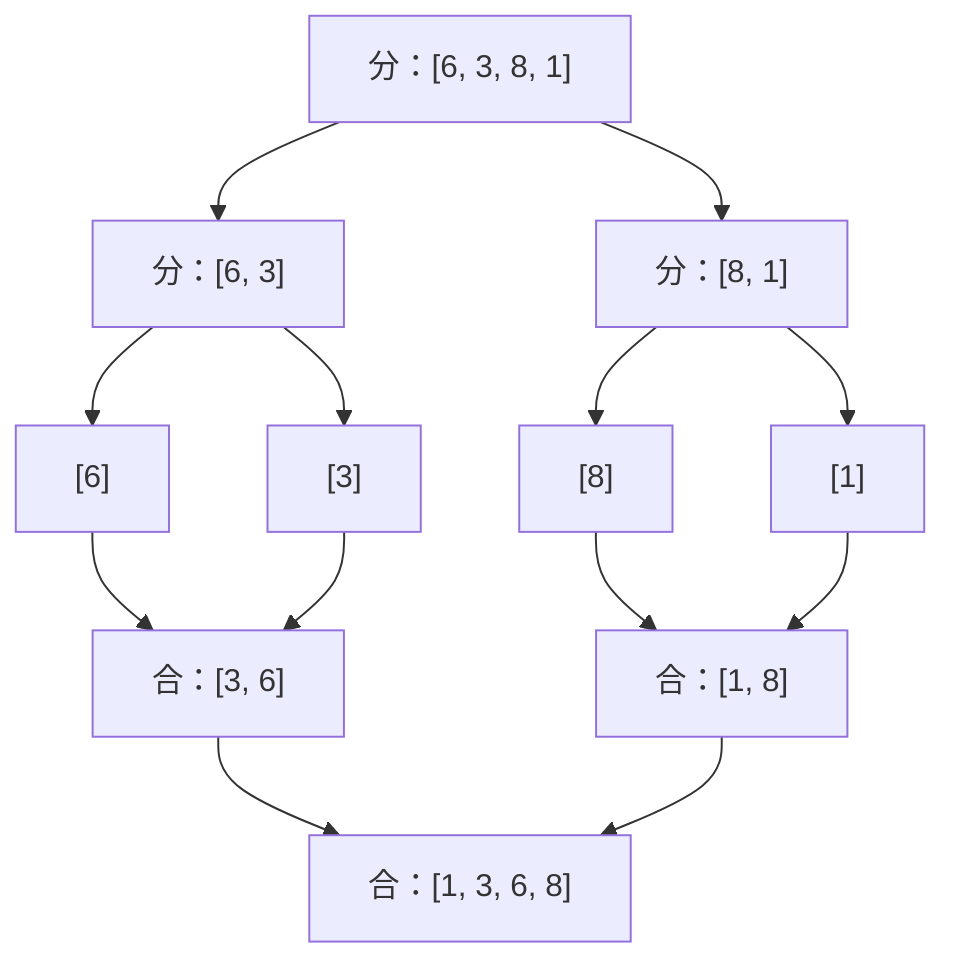
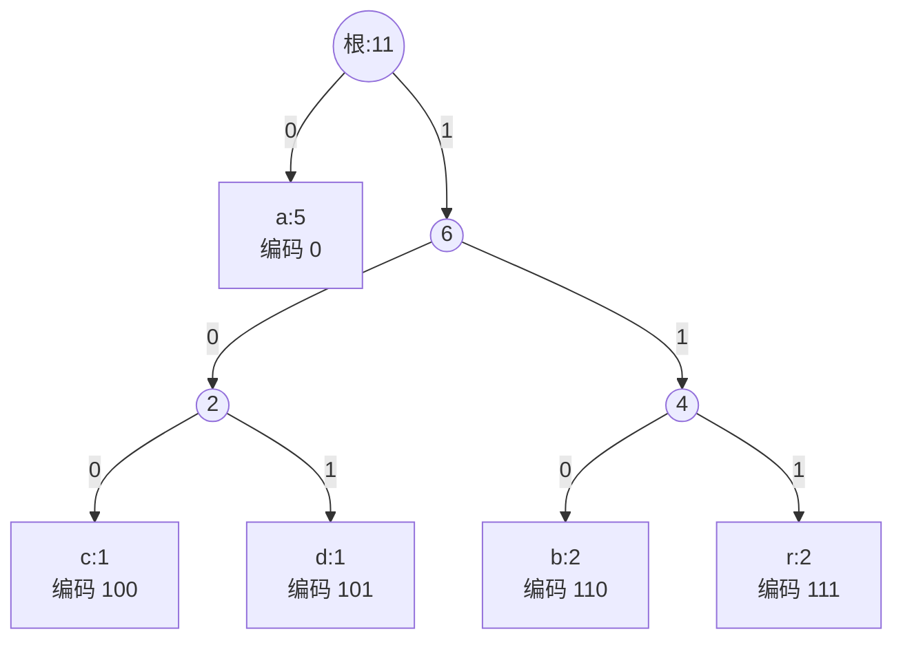
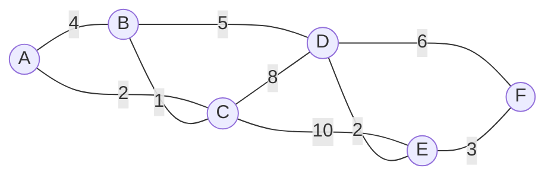
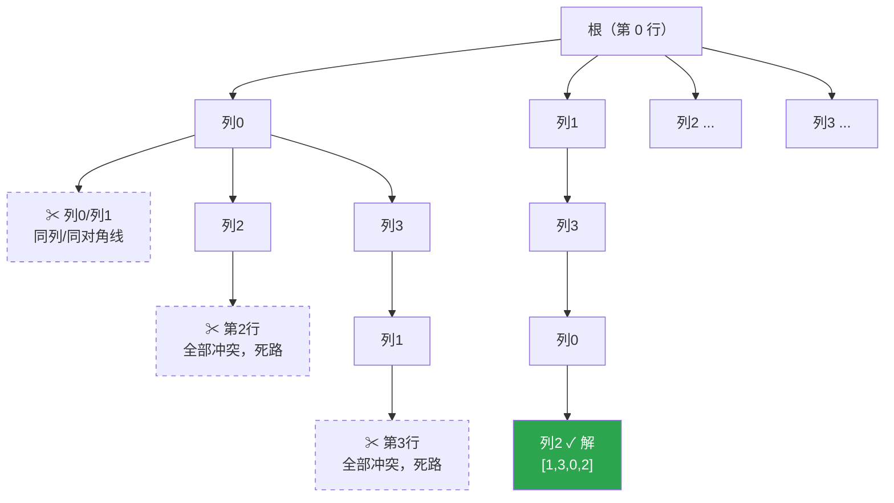
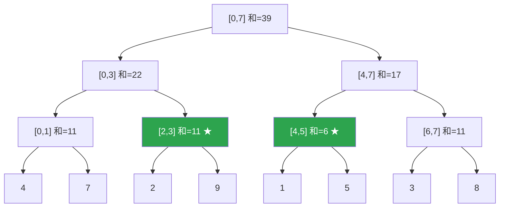
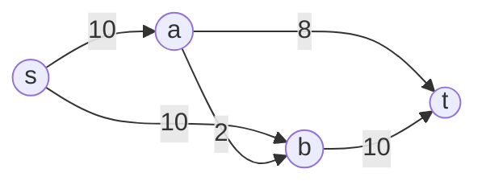
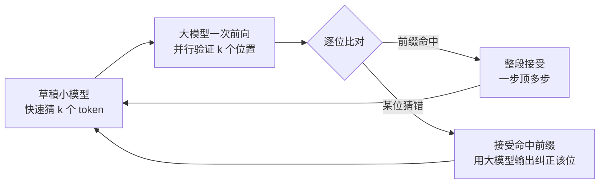

# 算法设计与分析

> 算法是把"能算出来"变成"算得起"的学问：同样的问题，不同的算法之间可能差着几个数量级的时间与金钱。

## 0. AI 时代为什么还要学算法

有同学会问：模型这么强，`sorted()` 一行搞定，我为什么还要手写快排？

第一，**调包能力的上限由算法思维决定**。AI 能写出可运行的代码，但选哪种数据结构、能不能把 `O(n^2)` 降到 `O(n log n)`、DP 状态该怎么定义，这些判断依赖你对问题结构的理解。给 AI 一个含糊的需求，它会还你一个含糊的实现；你能说清"这里应该用堆而不是每次重排序"，它才能给出正确的代码。审查 AI 生成代码的能力，本质上就是算法能力。

第二，**大模型自身就是算法的密集堆叠**。Transformer 推理里的 KV-cache 是典型的空间换时间，把每步生成从 `O(n^2)` 降到 `O(n)`；beam search 是带宽度限制的启发式搜索，本质是回溯与剪枝；采样阶段的 top-k / top-p 依赖快速选择与前缀和；向量检索的 HNSW 是分层图上的贪心近邻搜索；训练数据去重用的 MinHash + LSH 是随机化算法。不懂算法，你只能把这些当黑箱参数来调。

第三，**复杂度意识是工程直觉的底座**。数据量从一万涨到一百万，`O(n log n)` 的服务只是慢二十倍，`O(n^2)` 的服务会直接崩掉。云上按秒计费的年代，一个数量级的差距就是一个数量级的账单。算法学的不是背模板，而是"这段代码在数据规模翻十倍时会发生什么"的预判能力。

---

## 1. 算法分析基础

### 知识要点

| 概念 | 含义 | 备注 |
|------|------|------|
| 大 O：`O(f(n))` | 渐进上界 | 最常用，"最坏不会超过" |
| 大 Omega：`Ω(f(n))` | 渐进下界 | "至少需要" |
| 大 Theta：`Θ(f(n))` | 紧确界 | 上下界同阶时使用 |
| 最坏 / 平均 / 最好情况 | 三种分析视角 | 工程上关心最坏与平均 |
| 摊还分析 | 一串操作的平均代价 | 动态数组扩容摊还 `O(1)` |

复杂度按增长速度排序：`O(1) < O(log n) < O(sqrt(n)) < O(n) < O(n log n) < O(n^2) < O(n^3) < O(2^n) < O(n!)`

规模参照表（假设机器每秒执行 1 亿次基本操作）：

| n | `O(n)` | `O(n log n)` | `O(n^2)` | `O(2^n)` |
|---|--------|--------------|----------|----------|
| 1000 | 瞬间 | 瞬间 | 0.01 秒 | 天文数字 |
| 10^6 | 0.01 秒 | 0.2 秒 | 约 3 小时 | 不可能 |
| 10^9 | 10 秒 | 5 分钟 | 300 年 | 不可能 |

由此得到经验法则：时间限制 1 秒时，`n <= 10^6` 要做到 `O(n log n)`，`n <= 5000` 时 `O(n^2)` 可接受，`n <= 20` 才允许 `O(2^n)`。

下图直观展示了各复杂度随 n 增长的差距——注意 `O(2^n)` 几乎是垂直起飞，而 `O(log n)` 几乎贴地：

<svg viewBox="0 0 680 270" xmlns="http://www.w3.org/2000/svg" role="img" aria-label="常见复杂度增长曲线对比">
  <line x1="50" y1="232" x2="655" y2="232" stroke="var(--text)" stroke-width="1.5"/>
  <line x1="50" y1="232" x2="50" y2="15" stroke="var(--text)" stroke-width="1.5"/>
  <text x="640" y="250" fill="var(--text)" font-size="12">n →</text>
  <text x="14" y="26" fill="var(--text)" font-size="12">耗时 ↑</text>
  <polyline points="50,222 650,222" fill="none" stroke="var(--text)" stroke-width="1.5" stroke-dasharray="2,4"/>
  <text x="600" y="216" fill="var(--text)" font-size="12">O(1)</text>
  <polyline points="50,226 150,213 250,207 350,203 450,200 550,198 650,196" fill="none" stroke="var(--text)" stroke-width="1.5" stroke-dasharray="6,3"/>
  <text x="560" y="192" fill="var(--text)" font-size="12">O(log n)</text>
  <polyline points="50,226 650,158" fill="none" stroke="var(--text)" stroke-width="1.5"/>
  <text x="612" y="152" fill="var(--text)" font-size="12">O(n)</text>
  <polyline points="50,226 200,199 350,167 500,129 650,88" fill="none" stroke="var(--text)" stroke-width="2"/>
  <text x="572" y="94" fill="var(--text)" font-size="12">O(n log n)</text>
  <polyline points="50,226 150,214 250,190 350,154 450,106 530,58 575,24" fill="none" stroke="var(--accent)" stroke-width="2"/>
  <text x="586" y="30" fill="var(--accent)" font-size="12">O(n²)</text>
  <polyline points="50,226 120,214 180,188 230,138 268,68 288,22" fill="none" stroke="var(--accent)" stroke-width="2" stroke-dasharray="5,3"/>
  <text x="298" y="26" fill="var(--accent)" font-size="12">O(2ⁿ)</text>
  <text x="60" y="258" fill="var(--text)" font-size="11">同一坐标系下，n 稍微增大，高阶复杂度的耗时就与低阶拉开数量级差距</text>
</svg>

### 关键概念精讲

**为什么用渐进记号**。我们不关心"这段代码在我的笔记本上跑了 137 毫秒"——换台机器数字就变了。渐进分析剥离硬件常数和低阶项，只保留随规模增长的本质趋势，所以 `3n^2 + 100n + 5000` 就是 `O(n^2)`。但要记住它成立于"n 足够大"：n 很小时常数因子可能反转结论，这正是工业级排序（如 Timsort）在小区间切回插入排序的原因。

**递归式的三种求解方法**：展开法（画递归树，逐层求和）、代入法（先猜答案再用数学归纳法验证）、主定理。以 `T(n) = 2T(n/2) + n` 为例，递归树每层代价都是 `n`，树高 `log n`，故总和为 `n log n`。

**主定理**处理形如 `T(n) = a*T(n/b) + f(n)` 的递归式（`a >= 1`，`b > 1`）。记 `c = log_b(a)`：

| 情形 | 条件 | 结论 | 直观解释 |
|------|------|------|----------|
| 一 | `f(n)` 比 `n^c` 低阶 | `T(n) = Θ(n^c)` | 叶子层代价主导 |
| 二 | `f(n) = Θ(n^c)` | `T(n) = Θ(n^c * log n)` | 每层代价相同，共 `log n` 层 |
| 三 | `f(n)` 比 `n^c` 高阶且满足正则条件 | `T(n) = Θ(f(n))` | 根结点代价主导 |

| 递归式 | `c = log_b(a)` | 情形 | 结果 |
|--------|----------------|------|------|
| `T(n) = 2T(n/2) + O(n)` | 1 | 二 | `O(n log n)`（归并排序） |
| `T(n) = 2T(n/2) + O(1)` | 1 | 一 | `O(n)`（二叉树遍历） |
| `T(n) = 7T(n/2) + O(n^2)` | ≈2.807 | 一 | `O(n^2.807)`（Strassen） |

主定理不是万能的，`T(n) = 2T(n/2) + n/log n` 落在情形一与二的"间隙"里，必须用递归树。

**空间复杂度**同样要区分"额外空间"：归并排序与堆排序时间都是 `O(n log n)`，但前者额外空间 `O(n)`、后者 `O(1)`。内存受限时这个差别是决定性的。

### 案例代码：二分查找与增长率实测

```python
import time


def binary_search(a, target):
    """升序数组中查找 target。每轮把区间减半，T(n) = T(n/2) + O(1) = O(log n)。"""
    lo, hi = 0, len(a) - 1
    while lo <= hi:
        mid = (lo + hi) // 2      # Python 无溢出风险；C/Java 应写 lo + (hi-lo)//2
        if a[mid] == target:
            return mid
        elif a[mid] < target:
            lo = mid + 1          # 目标在右半区
        else:
            hi = mid - 1          # 目标在左半区
    return -1


def growth_demo():
    """实测：n 翻倍时 O(n) 耗时约翻倍，O(n^2) 耗时约翻 4 倍。"""
    prev = None
    for n in [500, 1000, 2000, 4000]:
        t0 = time.perf_counter()
        sum(i for i in range(n))                        # O(n)
        t1 = time.perf_counter()
        sum(1 for i in range(n) for j in range(n))      # O(n^2)
        t2 = time.perf_counter()
        lin, quad = (t1 - t0) * 1000, (t2 - t1) * 1000
        ratio = f"{quad / prev:.1f}x" if prev else "-"     # 与上一档相比的增长倍数
        prev = quad
        print(f"n={n:<6} O(n): {lin:7.3f}ms   O(n^2): {quad:8.3f}ms   增长 {ratio}")


if __name__ == "__main__":
    print("查找 7 :", binary_search([1, 3, 5, 7, 9, 11], 7))    # -> 3
    print("查找 4 :", binary_search([1, 3, 5, 7, 9, 11], 4))    # -> -1
    growth_demo()
```

实测中 `O(n^2)` 一列的增长比稳定在 `4.0x` 左右，与理论完全吻合——这就是复杂度分析的预测力。

---

## 2. 分治策略

### 知识要点

- 分治三步：**分**（拆成同类子问题）→ **治**（递归解决）→ **合**（合并子解）
- 适用条件：子问题相互独立、与原问题同构、可高效合并
- 与动态规划的区别：分治的子问题**不重叠**，DP 的子问题**重叠**

| 算法 | 递归式 | 复杂度 | 合并代价 |
|------|--------|--------|----------|
| 二分查找 | `T(n) = T(n/2) + O(1)` | `O(log n)` | 无 |
| 归并排序 | `T(n) = 2T(n/2) + O(n)` | `O(n log n)` | 线性归并 |
| 快速排序（平均） | `T(n) = 2T(n/2) + O(n)` | `O(n log n)` | 无（功夫在"分"） |
| 最近点对 | `T(n) = 2T(n/2) + O(n)` | `O(n log n)` | 带状区域检查 |
| Strassen 矩阵乘 | `T(n) = 7T(n/2) + O(n^2)` | `O(n^2.807)` | 矩阵加减 |

### 关键概念精讲

**归并 vs 快排：功夫下在哪一步**。归并排序"分"得随意（对半切），功夫全在"合"（线性归并）；快速排序"分"得讲究（按主元划分），"合"则什么都不用做。这是分治的一体两面。

归并排序的完整过程如下图：上半部分自顶向下不断对半"分"，到单元素为止；下半部分自底向上两两"合"，每层合并的总工作量都是 `O(n)`，共 `log n` 层，所以总复杂度 `O(n log n)`。



**最近点对为什么能做到 `O(n log n)`**。暴力枚举所有点对是 `O(n^2)`。分治思路：按 x 坐标对半分，递归求左右两半的最近距离 `d = min(d_left, d_right)`；跨越中线的点对只可能落在宽度 `2d` 的带状区域内。关键引理是：带内点按 y 排序后，每个点最多只需与后面 7 个点比较——因为一个 `d × 2d` 的矩形里最多能放 8 个两两距离不小于 `d` 的点。于是合并阶段是 `O(n)`。

**快速幂**是分治的另一个精巧应用：利用 `a^n = (a^(n/2))^2` 把 n 次乘法降到 `O(log n)` 次。这在密码学（RSA 模幂）和矩阵快速幂求线性递推中广泛使用。

### 案例代码：最近点对与快速幂

```python
import math
from itertools import combinations


def closest_pair(points):
    """分治求平面最近点对，O(n log n)。points 为 (x, y) 元组列表。"""
    px = sorted(points)                                  # 按 x 排序
    py = sorted(points, key=lambda p: p[1])              # 按 y 排序
    dist = lambda pq: math.hypot(pq[0][0] - pq[1][0], pq[0][1] - pq[1][1])

    def rec(px, py):
        n = len(px)
        if n <= 3:                                       # 小规模直接暴力
            return min(((dist(pq), pq) for pq in combinations(px, 2)),
                       default=(float("inf"), None))

        mid, midx = n // 2, px[n // 2][0]                # 分：以中位 x 为界切两半
        lx, rx = px[:mid], px[mid:]
        lset = set(map(id, lx))
        ly = [p for p in py if id(p) in lset]            # 保持 y 有序地拆分
        ry = [p for p in py if id(p) not in lset]
        d, pair = min(rec(lx, ly), rec(rx, ry), key=lambda t: t[0])    # 治

        # 合：只检查中线两侧宽度 d 的带状区域，且每点最多比后面 7 个
        strip = [p for p in py if abs(p[0] - midx) < d]
        for i in range(len(strip)):
            for j in range(i + 1, min(i + 8, len(strip))):
                if dist((strip[i], strip[j])) < d:
                    d, pair = dist((strip[i], strip[j])), (strip[i], strip[j])
        return d, pair

    return rec(px, py)


def fast_pow(a, n, mod=None):
    """快速幂：O(log n) 次乘法。n 为偶时 a^n = (a^(n/2))^2，为奇时 a^n = a * a^(n-1)。"""
    result, base = 1, a
    while n > 0:
        if n & 1:                                            # 当前二进制位为 1，累乘
            result = result * base % mod if mod else result * base
        base = base * base % mod if mod else base * base     # 底数平方，对应 n 右移一位
        n >>= 1
    return result


if __name__ == "__main__":
    pts = [(2, 3), (12, 30), (40, 50), (5, 1), (12, 10), (3, 4)]
    d, pair = closest_pair(pts)
    print(f"最近点对 = {pair}，距离 = {d:.4f}")     # ((2,3),(3,4))，1.4142
    print("3^1000 mod 1e9+7 =", fast_pow(3, 1000, 10 ** 9 + 7))
```

---

## 3. 排序算法全景

### 知识要点

| 算法 | 平均时间 | 最坏时间 | 额外空间 | 稳定性 | 类别 |
|------|----------|----------|----------|--------|------|
| 冒泡 / 选择排序 | `O(n^2)` | `O(n^2)` | `O(1)` | 冒泡稳定，选择不稳定 | 比较 |
| 插入排序 | `O(n^2)` | `O(n^2)` | `O(1)` | 稳定 | 比较 |
| 归并排序 | `O(n log n)` | `O(n log n)` | `O(n)` | 稳定 | 比较 |
| 快速排序 | `O(n log n)` | `O(n^2)` | `O(log n)` 栈 | 不稳定 | 比较 |
| 堆排序 | `O(n log n)` | `O(n log n)` | `O(1)` | 不稳定 | 比较 |
| 计数排序 | `O(n + k)` | `O(n + k)` | `O(k)` | 稳定 | 非比较 |
| 基数排序 | `O(d(n + k))` | `O(d(n + k))` | `O(n + k)` | 稳定 | 非比较 |

### 关键概念精讲

**比较类排序的理论下界是 `O(n log n)`**。任何基于比较的排序都能画成决策树：每个内部结点是一次比较（两个分支），叶子是一种可能的排列。n 个元素有 `n!` 种排列，故叶子数至少 `n!`，树高至少 `log2(n!)`；由斯特林公式 `log2(n!) = Θ(n log n)`。想突破这个下界只能不做比较——计数排序、基数排序正是利用了"元素是有限范围整数"这一额外信息。

**稳定性为什么重要**。稳定排序保证相等元素的相对次序不变。先按"部门"排序、再按"工资"排序，若第二次排序稳定，同工资的人仍按部门有序——这是多关键字排序的实现基础，也是基数排序能正确工作的前提。

**工程选择怎么做**：

- 通用场景直接用语言内置排序。Python 的 Timsort 是归并 + 插入的混合算法，对现实中常见的"部分有序"数据接近 `O(n)`；C++ 的 `std::sort` 是内省排序，快排为主、递归过深切堆排、小区间切插入排序。
- 数据量小（n < 50）用插入排序（常数最小）；内存极度受限用堆排序（`O(1)` 额外空间且最坏仍 `O(n log n)`）；需要稳定且可接受额外内存用归并排序。
- 数据放不进内存时用外部排序（多路归并）；键为小范围整数时用计数 / 基数排序突破 `O(n log n)`；只要前 k 大就别全排序，用大小为 k 的堆做到 `O(n log k)`。

**快排的最坏情况怎么避免**。当每次主元都取到最值（如对已排序数组取首元素），划分极度不平衡，退化为 `O(n^2)`。对策：随机选主元、三数取中、或递归过深时切换堆排序。三路切分（Dutch National Flag）还能高效处理大量重复元素。

下图是三路切分 partition 一趟的过程（pivot = 5）。数组被三个指针划成四段：`[lo, lt)` 小于主元、`[lt, i)` 等于主元（高亮）、`(gt, hi]` 大于主元，`[i, gt]` 是尚未检查的区域；`i` 与 `gt` 相遇时一趟结束，等于主元的整段已就位，不再参与递归：

<svg viewBox="0 0 680 250" xmlns="http://www.w3.org/2000/svg" role="img" aria-label="三路快排 partition 过程">
  <text x="10" y="30" fill="var(--text)" font-size="12">初始</text>
  <g font-size="14" text-anchor="middle">
    <rect x="60" y="14" width="52" height="30" fill="var(--panel)" stroke="var(--text)"/><text x="86" y="34" fill="var(--text)">3</text>
    <rect x="112" y="14" width="52" height="30" fill="var(--panel)" stroke="var(--text)"/><text x="138" y="34" fill="var(--text)">8</text>
    <rect x="164" y="14" width="52" height="30" fill="var(--panel)" stroke="var(--text)"/><text x="190" y="34" fill="var(--text)">5</text>
    <rect x="216" y="14" width="52" height="30" fill="var(--panel)" stroke="var(--text)"/><text x="242" y="34" fill="var(--text)">1</text>
    <rect x="268" y="14" width="52" height="30" fill="var(--panel)" stroke="var(--text)"/><text x="294" y="34" fill="var(--text)">9</text>
    <rect x="320" y="14" width="52" height="30" fill="var(--panel)" stroke="var(--text)"/><text x="346" y="34" fill="var(--text)">5</text>
    <rect x="372" y="14" width="52" height="30" fill="var(--panel)" stroke="var(--text)"/><text x="398" y="34" fill="var(--text)">2</text>
    <rect x="424" y="14" width="52" height="30" fill="var(--panel)" stroke="var(--text)"/><text x="450" y="34" fill="var(--text)">7</text>
  </g>
  <text x="60" y="60" fill="var(--text)" font-size="11">lt = i = 0，gt = 7，pivot = 5</text>
  <text x="10" y="112" fill="var(--text)" font-size="12">进行中</text>
  <g font-size="14" text-anchor="middle">
    <rect x="60" y="96" width="52" height="30" fill="var(--panel)" stroke="var(--text)"/><text x="86" y="116" fill="var(--text)">3</text>
    <rect x="112" y="96" width="52" height="30" fill="var(--panel)" stroke="var(--text)"/><text x="138" y="116" fill="var(--text)">2</text>
    <rect x="164" y="96" width="52" height="30" fill="var(--panel)" stroke="var(--text)"/><text x="190" y="116" fill="var(--text)">1</text>
    <rect x="216" y="96" width="52" height="30" fill="var(--accent)" stroke="var(--text)"/><text x="242" y="116" fill="var(--bg)">5</text>
    <rect x="268" y="96" width="52" height="30" fill="var(--panel)" stroke="var(--text)" stroke-dasharray="4,3"/><text x="294" y="116" fill="var(--text)">9</text>
    <rect x="320" y="96" width="52" height="30" fill="var(--panel)" stroke="var(--text)" stroke-dasharray="4,3"/><text x="346" y="116" fill="var(--text)">5</text>
    <rect x="372" y="96" width="52" height="30" fill="var(--panel)" stroke="var(--text)"/><text x="398" y="116" fill="var(--text)">7</text>
    <rect x="424" y="96" width="52" height="30" fill="var(--panel)" stroke="var(--text)"/><text x="450" y="116" fill="var(--text)">8</text>
  </g>
  <text x="242" y="144" fill="var(--text)" font-size="11" text-anchor="middle">↑ lt=3</text>
  <text x="294" y="144" fill="var(--text)" font-size="11" text-anchor="middle">↑ i=4</text>
  <text x="346" y="158" fill="var(--text)" font-size="11" text-anchor="middle">↑ gt=5</text>
  <text x="490" y="116" fill="var(--text)" font-size="11">虚线段 = 未检查</text>
  <text x="10" y="204" fill="var(--text)" font-size="12">结束</text>
  <g font-size="14" text-anchor="middle">
    <rect x="60" y="188" width="52" height="30" fill="var(--panel)" stroke="var(--text)"/><text x="86" y="208" fill="var(--text)">3</text>
    <rect x="112" y="188" width="52" height="30" fill="var(--panel)" stroke="var(--text)"/><text x="138" y="208" fill="var(--text)">2</text>
    <rect x="164" y="188" width="52" height="30" fill="var(--panel)" stroke="var(--text)"/><text x="190" y="208" fill="var(--text)">1</text>
    <rect x="216" y="188" width="52" height="30" fill="var(--accent)" stroke="var(--text)"/><text x="242" y="208" fill="var(--bg)">5</text>
    <rect x="268" y="188" width="52" height="30" fill="var(--accent)" stroke="var(--text)"/><text x="294" y="208" fill="var(--bg)">5</text>
    <rect x="320" y="188" width="52" height="30" fill="var(--panel)" stroke="var(--text)"/><text x="346" y="208" fill="var(--text)">9</text>
    <rect x="372" y="188" width="52" height="30" fill="var(--panel)" stroke="var(--text)"/><text x="398" y="208" fill="var(--text)">7</text>
    <rect x="424" y="188" width="52" height="30" fill="var(--panel)" stroke="var(--text)"/><text x="450" y="208" fill="var(--text)">8</text>
  </g>
  <text x="86" y="238" fill="var(--text)" font-size="11">← 递归左段 →</text>
  <text x="242" y="238" fill="var(--text)" font-size="11" text-anchor="middle">已就位</text>
  <text x="346" y="238" fill="var(--text)" font-size="11">← 递归右段 →</text>
</svg>

### 案例代码：三路快排与性能实测

```python
import random


def quick_sort(a):
    """三路切分快速排序。不变式：[lo,lt) < pivot，[lt,i) == pivot，(gt,hi] > pivot。"""
    a = a[:]
    _qs(a, 0, len(a) - 1)
    return a


def _qs(a, lo, hi):
    if lo >= hi:
        return
    pivot = a[random.randint(lo, hi)]     # 随机主元，把最坏情况变成小概率事件
    lt, i, gt = lo, lo, hi
    while i <= gt:
        if a[i] < pivot:
            a[lt], a[i] = a[i], a[lt]
            lt += 1
            i += 1
        elif a[i] > pivot:
            a[i], a[gt] = a[gt], a[i]
            gt -= 1                       # 换过来的元素还没检查，i 不前进
        else:
            i += 1
    _qs(a, lo, lt - 1)                    # 等于 pivot 的一整段已就位，不参与递归
    _qs(a, gt + 1, hi)


if __name__ == "__main__":
    random.seed(0)
    data = [random.randint(0, 20) for _ in range(15)]
    print("原始:", data, "\n排序:", quick_sort(data))
    assert quick_sort(data) == sorted(data), "排序结果错误"
```

`code/06-algorithms/sorting.py` 的实测结果（Python 3.13，随机数据，单位毫秒）：

| 算法 | n=1000 | n=4000 | n=16000 |
|------|--------|--------|---------|
| 冒泡排序 | 33.50 | 593.18 | 跳过 |
| 插入排序 | 16.65 | 292.54 | 跳过 |
| 归并排序 | 1.40 | 6.33 | 29.00 |
| 快速排序 | 1.35 | 5.39 | 26.95 |
| 堆排序 | 1.44 | 6.76 | 31.10 |
| 计数排序 | 0.32 | 0.85 | 3.68 |
| 内置 sorted | 0.15 | 0.28 | 1.46 |

三点结论：n 扩大 4 倍时 `O(n^2)` 耗时约扩大 16 倍、`O(n log n)` 约扩大 4 倍多；计数排序在小范围整数上确实更快；C 实现的内置排序常数因子碾压所有纯 Python 实现——**先想清楚复杂度，再考虑要不要自己造轮子**。

---

## 4. 贪心算法

### 知识要点

- 核心思想：每一步都做**当前看起来最优**的选择，不回头、不反悔
- 正确性依赖两个性质：**贪心选择性质**（全局最优解可由一系列局部最优选择达到）与**最优子结构**
- 贪心不一定对，必须证明。常用手法：交换论证（exchange argument）、归纳法

| 问题 | 贪心策略 | 是否最优 |
|------|----------|----------|
| 区间调度（选最多不重叠区间） | 按**结束时间**升序选 | 最优 |
| 分数背包 | 按单位价值降序装 | 最优 |
| 0-1 背包 | 按单位价值降序装 | **不最优**，需 DP |
| 找零钱（标准币值） | 每次取最大面额 | 最优 |
| 找零钱（币值 1/3/4 凑 6） | 每次取最大面额 | **不最优**，需 DP |
| 哈夫曼编码 | 每次合并频率最小的两棵树 | 最优 |
| 最小生成树 | Prim / Kruskal | 最优 |

### 关键概念精讲

**区间调度的正确性证明（交换论证）**。设贪心解为 `G = g1, g2, ...`，任一最优解为 `O = o1, o2, ...`。由于 `g1` 结束最早，必有 `end(g1) <= end(o1)`，把 `O` 中的 `o1` 换成 `g1` 后仍合法且区间数不变；对后续位置重复该交换，可把 `O` 逐步变成 `G` 而不减少区间数，故 `G` 也最优。

注意反例：按**开始时间**或**区间长度**排序都会出错。区间 `(0,6), (1,2), (3,4)` 中，按开始时间会先选 `(0,6)` 只得 1 个；按结束时间先选 `(1,2)` 再选 `(3,4)` 得 2 个。

**哈夫曼编码为什么最优**。目标是最小化 `sum(freq[c] * depth[c])`。关键引理：频率最小的两个字符一定可以放在最深一层且互为兄弟（否则交换后总代价不增）。据此把这两个字符合并成频率为二者之和的"超级字符"，问题规模减 1，递归求解。哈夫曼码是**前缀码**——没有码字是另一个码字的前缀，解码时无需分隔符。

以 `"abracadabra"`（频率 `a:5, b:2, r:2, c:1, d:1`）为例，构建过程是：先合并频率最小的 `c`、`d` 得到权 2 的结点，再合并 `b`、`r` 得到权 4，接着合并权 2 与权 4 的子树得到权 6，最后与 `a` 合并成根。左枝记 0、右枝记 1，得到的编码树如下——注意高频的 `a` 深度为 1（码长 1 位），低频的 `c`、`d` 深度为 3：



**为什么 0-1 背包不能贪心**。物品 `(重量,价值) = (10,60), (20,100), (30,120)`，容量 50。按单位价值贪心选前两个得 160，剩余容量 20 装不下第三个；而最优解是选后两个，价值 220。根源在于 0-1 背包"不可分割"，局部最优会浪费容量；分数背包允许切割，所以贪心正确。

### 案例代码：区间调度与哈夫曼编码

```python
import heapq
from collections import Counter


def interval_scheduling(intervals):
    """选出最多的互不重叠区间。贪心策略：按结束时间升序。O(n log n)"""
    chosen, last_end = [], float("-inf")
    for start, end in sorted(intervals, key=lambda x: x[1]):
        if start >= last_end:                     # 与已选区间不冲突
            chosen.append((start, end))
            last_end = end
    return chosen


def huffman(text):
    """构造哈夫曼编码表。每次取频率最小的两个结点合并。O(n log n)"""
    freq = Counter(text)
    # 堆元素 (频率, 唯一序号, 结点名)；序号用于打破平局，避免比较字符串
    heap = [(cnt, i, ch) for i, (ch, cnt) in enumerate(freq.items())]
    heapq.heapify(heap)
    nxt = len(heap)
    codes = {ch: "" for ch in freq}
    groups = {ch: [ch] for ch in freq}            # 每个结点覆盖的原始字符集

    while len(heap) > 1:
        c1, _, n1 = heapq.heappop(heap)           # 频率最小
        c2, _, n2 = heapq.heappop(heap)           # 次小
        for ch in groups[n1]:
            codes[ch] = "0" + codes[ch]           # 左子树补 0
        for ch in groups[n2]:
            codes[ch] = "1" + codes[ch]           # 右子树补 1
        groups[f"#{nxt}"] = groups[n1] + groups[n2]
        heapq.heappush(heap, (c1 + c2, nxt, f"#{nxt}"))
        nxt += 1
    return codes, freq


if __name__ == "__main__":
    ivs = [(1, 4), (3, 5), (0, 6), (5, 7), (3, 9), (5, 9),
           (6, 10), (8, 11), (8, 12), (2, 14), (12, 16)]
    print("区间调度:", interval_scheduling(ivs))   # [(1,4),(5,7),(8,11),(12,16)]

    text = "abracadabra"
    codes, freq = huffman(text)
    print("哈夫曼编码:", dict(sorted(codes.items())))
    total = sum(freq[c] * len(codes[c]) for c in freq)
    print(f"哈夫曼 {total} bit，定长(3bit/字符) {len(text) * 3} bit，"
          f"压缩到 {total / (len(text) * 3) * 100:.1f}%")
```

运行结果：`a` 出现 5 次编码为 `0`（1 位），低频的 `c`、`d` 为 3 位，总长 23 bit，比定长的 33 bit 省约 30%。这就是"高频字符用短码"的收益。

---

## 5. 动态规划

### 知识要点

- 适用条件：**最优子结构** + **重叠子问题** + **无后效性**
- 两种实现：自顶向下**记忆化搜索**（递归 + 缓存，贴近递归定义）、自底向上**递推填表**（常数更小，便于空间优化）
- 设计方法论三段式：**状态定义 → 转移方程 → 边界条件**
- 空间优化：若 `dp[i]` 只依赖 `dp[i-1]`，可用滚动数组降到一维

| 问题 | 状态定义 | 复杂度 |
|------|----------|--------|
| 0-1 背包 | `dp[i][w]` = 前 i 件、容量 w 的最大价值 | `O(nW)` |
| LCS | `dp[i][j]` = 两串前缀的最长公共子序列长度 | `O(mn)` |
| 编辑距离 | `dp[i][j]` = 前缀互相转换的最少操作数 | `O(mn)` |
| LIS | `dp[i]` = 以 `a[i]` 结尾的最长递增子序列长度 | `O(n^2)` 或 `O(n log n)` |
| 矩阵链乘 | `dp[i][j]` = 乘 `i..j` 的最少乘法次数 | `O(n^3)` |

### 关键概念精讲

**状态设计方法论**，这是 DP 最难的一步，可操作的思路有四条：（1）**先写暴力递归**——把问题写成递归形式，函数参数就是候选状态，背包的递归函数是 `f(i, remaining)`，状态就是 `(i, remaining)`；（2）**检查无后效性**——状态一旦确定，后续决策不应依赖"是怎么到达这个状态的"，若依赖说明维度不够；（3）**检查完备性**——当前状态是否包含做出下一步决策所需的全部信息，不够就加维度；（4）**确定遍历顺序**——保证计算 `dp[i]` 时它依赖的状态都已算好。

**为什么 0-1 背包的一维数组要倒序**。二维时 `dp[i][w] = max(dp[i-1][w], dp[i-1][w-wt] + val)` 依赖的是**上一行**。压缩成一维后若正序遍历 w，`dp[w-wt]` 已被本轮更新过（成了 `dp[i][w-wt]`），相当于第 i 件物品用了两次——那就变成完全背包了。倒序时 `dp[w-wt]` 还是上一轮的值，才等价于二维版本。反过来说，**完全背包的一维写法正好要正序**。

下图是容量 8、物品重量 `[2,3,4,5]`、价值 `[3,4,5,6]` 的 0-1 背包完整 DP 表。以右下角 `dp[4][8]` 为例，转移 `dp[i][j] = max(dp[i-1][j], dp[i-1][j-w] + v)` 比较两个来源：不选第 4 件（正上方 `dp[3][8] = 9`，虚线箭头）与选第 4 件（`dp[3][8-5] + 6 = 4 + 6 = 10`，实线箭头），取较大者 10：

<svg viewBox="0 0 680 260" xmlns="http://www.w3.org/2000/svg" role="img" aria-label="0-1 背包 DP 表填充示意">
  <defs>
    <marker id="arr06" markerWidth="8" markerHeight="8" refX="7" refY="4" orient="auto"><path d="M0,0 L8,4 L0,8 z" fill="var(--accent)"/></marker>
  </defs>
  <g font-size="12" text-anchor="middle" fill="var(--text)">
    <text x="128" y="30">j=0</text><text x="184" y="30">1</text><text x="240" y="30">2</text><text x="296" y="30">3</text><text x="352" y="30">4</text><text x="408" y="30">5</text><text x="464" y="30">6</text><text x="520" y="30">7</text><text x="576" y="30">8</text>
  </g>
  <g font-size="11" fill="var(--text)">
    <text x="6" y="60">i=0（不放）</text>
    <text x="6" y="96">i=1 w=2 v=3</text>
    <text x="6" y="132">i=2 w=3 v=4</text>
    <text x="6" y="168">i=3 w=4 v=5</text>
    <text x="6" y="204">i=4 w=5 v=6</text>
  </g>
  <g font-size="13" text-anchor="middle">
    <g>
      <rect x="100" y="40" width="56" height="32" fill="var(--panel)" stroke="var(--text)"/><text x="128" y="61" fill="var(--text)">0</text>
      <rect x="156" y="40" width="56" height="32" fill="var(--panel)" stroke="var(--text)"/><text x="184" y="61" fill="var(--text)">0</text>
      <rect x="212" y="40" width="56" height="32" fill="var(--panel)" stroke="var(--text)"/><text x="240" y="61" fill="var(--text)">0</text>
      <rect x="268" y="40" width="56" height="32" fill="var(--panel)" stroke="var(--text)"/><text x="296" y="61" fill="var(--text)">0</text>
      <rect x="324" y="40" width="56" height="32" fill="var(--panel)" stroke="var(--text)"/><text x="352" y="61" fill="var(--text)">0</text>
      <rect x="380" y="40" width="56" height="32" fill="var(--panel)" stroke="var(--text)"/><text x="408" y="61" fill="var(--text)">0</text>
      <rect x="436" y="40" width="56" height="32" fill="var(--panel)" stroke="var(--text)"/><text x="464" y="61" fill="var(--text)">0</text>
      <rect x="492" y="40" width="56" height="32" fill="var(--panel)" stroke="var(--text)"/><text x="520" y="61" fill="var(--text)">0</text>
      <rect x="548" y="40" width="56" height="32" fill="var(--panel)" stroke="var(--text)"/><text x="576" y="61" fill="var(--text)">0</text>
    </g>
    <g>
      <rect x="100" y="76" width="56" height="32" fill="var(--panel)" stroke="var(--text)"/><text x="128" y="97" fill="var(--text)">0</text>
      <rect x="156" y="76" width="56" height="32" fill="var(--panel)" stroke="var(--text)"/><text x="184" y="97" fill="var(--text)">0</text>
      <rect x="212" y="76" width="56" height="32" fill="var(--panel)" stroke="var(--text)"/><text x="240" y="97" fill="var(--text)">3</text>
      <rect x="268" y="76" width="56" height="32" fill="var(--panel)" stroke="var(--text)"/><text x="296" y="97" fill="var(--text)">3</text>
      <rect x="324" y="76" width="56" height="32" fill="var(--panel)" stroke="var(--text)"/><text x="352" y="97" fill="var(--text)">3</text>
      <rect x="380" y="76" width="56" height="32" fill="var(--panel)" stroke="var(--text)"/><text x="408" y="97" fill="var(--text)">3</text>
      <rect x="436" y="76" width="56" height="32" fill="var(--panel)" stroke="var(--text)"/><text x="464" y="97" fill="var(--text)">3</text>
      <rect x="492" y="76" width="56" height="32" fill="var(--panel)" stroke="var(--text)"/><text x="520" y="97" fill="var(--text)">3</text>
      <rect x="548" y="76" width="56" height="32" fill="var(--panel)" stroke="var(--text)"/><text x="576" y="97" fill="var(--text)">3</text>
    </g>
    <g>
      <rect x="100" y="112" width="56" height="32" fill="var(--panel)" stroke="var(--text)"/><text x="128" y="133" fill="var(--text)">0</text>
      <rect x="156" y="112" width="56" height="32" fill="var(--panel)" stroke="var(--text)"/><text x="184" y="133" fill="var(--text)">0</text>
      <rect x="212" y="112" width="56" height="32" fill="var(--panel)" stroke="var(--text)"/><text x="240" y="133" fill="var(--text)">3</text>
      <rect x="268" y="112" width="56" height="32" fill="var(--panel)" stroke="var(--text)"/><text x="296" y="133" fill="var(--text)">4</text>
      <rect x="324" y="112" width="56" height="32" fill="var(--panel)" stroke="var(--text)"/><text x="352" y="133" fill="var(--text)">4</text>
      <rect x="380" y="112" width="56" height="32" fill="var(--panel)" stroke="var(--text)"/><text x="408" y="133" fill="var(--text)">7</text>
      <rect x="436" y="112" width="56" height="32" fill="var(--panel)" stroke="var(--text)"/><text x="464" y="133" fill="var(--text)">7</text>
      <rect x="492" y="112" width="56" height="32" fill="var(--panel)" stroke="var(--text)"/><text x="520" y="133" fill="var(--text)">7</text>
      <rect x="548" y="112" width="56" height="32" fill="var(--panel)" stroke="var(--text)"/><text x="576" y="133" fill="var(--text)">7</text>
    </g>
    <g>
      <rect x="100" y="148" width="56" height="32" fill="var(--panel)" stroke="var(--text)"/><text x="128" y="169" fill="var(--text)">0</text>
      <rect x="156" y="148" width="56" height="32" fill="var(--panel)" stroke="var(--text)"/><text x="184" y="169" fill="var(--text)">0</text>
      <rect x="212" y="148" width="56" height="32" fill="var(--panel)" stroke="var(--text)"/><text x="240" y="169" fill="var(--text)">3</text>
      <rect x="268" y="148" width="56" height="32" fill="var(--panel)" stroke="var(--accent)" stroke-width="2.5"/><text x="296" y="169" fill="var(--text)">4</text>
      <rect x="324" y="148" width="56" height="32" fill="var(--panel)" stroke="var(--text)"/><text x="352" y="169" fill="var(--text)">5</text>
      <rect x="380" y="148" width="56" height="32" fill="var(--panel)" stroke="var(--text)"/><text x="408" y="169" fill="var(--text)">7</text>
      <rect x="436" y="148" width="56" height="32" fill="var(--panel)" stroke="var(--text)"/><text x="464" y="169" fill="var(--text)">8</text>
      <rect x="492" y="148" width="56" height="32" fill="var(--panel)" stroke="var(--text)"/><text x="520" y="169" fill="var(--text)">9</text>
      <rect x="548" y="148" width="56" height="32" fill="var(--panel)" stroke="var(--accent)" stroke-width="2.5" stroke-dasharray="5,3"/><text x="576" y="169" fill="var(--text)">9</text>
    </g>
    <g>
      <rect x="100" y="184" width="56" height="32" fill="var(--panel)" stroke="var(--text)"/><text x="128" y="205" fill="var(--text)">0</text>
      <rect x="156" y="184" width="56" height="32" fill="var(--panel)" stroke="var(--text)"/><text x="184" y="205" fill="var(--text)">0</text>
      <rect x="212" y="184" width="56" height="32" fill="var(--panel)" stroke="var(--text)"/><text x="240" y="205" fill="var(--text)">3</text>
      <rect x="268" y="184" width="56" height="32" fill="var(--panel)" stroke="var(--text)"/><text x="296" y="205" fill="var(--text)">4</text>
      <rect x="324" y="184" width="56" height="32" fill="var(--panel)" stroke="var(--text)"/><text x="352" y="205" fill="var(--text)">5</text>
      <rect x="380" y="184" width="56" height="32" fill="var(--panel)" stroke="var(--text)"/><text x="408" y="205" fill="var(--text)">7</text>
      <rect x="436" y="184" width="56" height="32" fill="var(--panel)" stroke="var(--text)"/><text x="464" y="205" fill="var(--text)">8</text>
      <rect x="492" y="184" width="56" height="32" fill="var(--panel)" stroke="var(--text)"/><text x="520" y="205" fill="var(--text)">9</text>
      <rect x="548" y="184" width="56" height="32" fill="var(--accent)" stroke="var(--text)" stroke-width="2"/><text x="576" y="205" fill="var(--bg)">10</text>
    </g>
  </g>
  <path d="M310,182 C360,215 470,220 545,205" fill="none" stroke="var(--accent)" stroke-width="2" marker-end="url(#arr06)"/>
  <text x="420" y="243" fill="var(--accent)" font-size="11" text-anchor="middle">选：dp[3][3] + 6 = 10 ✓</text>
  <path d="M576,182 L576,202" fill="none" stroke="var(--accent)" stroke-width="2" stroke-dasharray="5,3" marker-end="url(#arr06)"/>
  <text x="620" y="176" fill="var(--accent)" font-size="11">不选：9</text>
</svg>

**记忆化 vs 递推怎么选**。状态转移图复杂、不易确定拓扑序时用记忆化（如树形 DP、状态压缩 DP）；状态是规整的多维网格、需要空间优化时用递推。

**DP 与分治的区别**再强调一次：归并排序的两个子问题完全独立，不会重复计算；而斐波那契的 `f(n-1)` 与 `f(n-2)` 会大量重复调用同一子问题。`dp.py` 实测中 `fib_naive(30)` 递归了 269 万次，记忆化后只需 `O(n)` 次。

### 案例代码：编辑距离（DP 表逐行打印）

```python
def edit_distance(s1, s2, verbose=True):
    """
    状态定义：dp[i][j] = 把 s1 前 i 个字符变成 s2 前 j 个字符的最少操作数
    转移方程：s1[i-1] == s2[j-1] -> dp[i][j] = dp[i-1][j-1]
              否则 dp[i][j] = 1 + min(dp[i-1][j],     删除 s1[i-1]
                                      dp[i][j-1],     插入 s2[j-1]
                                      dp[i-1][j-1])   替换
    边界条件：dp[i][0] = i（把 s1 前 i 个字符全删掉）
              dp[0][j] = j（在空串上插入 s2 的前 j 个字符）
    复杂度：时间 O(mn)，空间 O(mn)，可用滚动数组降到 O(min(m,n))
    """
    m, n = len(s1), len(s2)
    dp = [[0] * (n + 1) for _ in range(m + 1)]
    for i in range(m + 1):
        dp[i][0] = i
    for j in range(n + 1):
        dp[0][j] = j

    if verbose:                                          # 打印表头与第 0 行
        print("       ''" + "".join(f"{c:>4}" for c in s2))
        print("   ''" + "".join(f"{v:4d}" for v in dp[0]))

    for i in range(1, m + 1):
        for j in range(1, n + 1):
            if s1[i - 1] == s2[j - 1]:
                dp[i][j] = dp[i - 1][j - 1]          # 字符相同，无需操作
            else:
                dp[i][j] = 1 + min(dp[i - 1][j],     # 删除
                                   dp[i][j - 1],     # 插入
                                   dp[i - 1][j - 1]) # 替换
        if verbose:
            print(f"   {s1[i - 1]} " + "".join(f"{v:4d}" for v in dp[i]))
    return dp[m][n]


if __name__ == "__main__":
    print("编辑距离 =", edit_distance("kitten", "sitting"))
```

输出的 DP 表：

```
       ''   s   i   t   t   i   n   g
   ''   0   1   2   3   4   5   6   7
   k    1   1   2   3   4   5   6   7
   i    2   2   1   2   3   4   5   6
   t    3   3   2   1   2   3   4   5
   t    4   4   3   2   1   2   3   4
   e    5   5   4   3   2   2   3   4
   n    6   6   5   4   3   3   2   3
编辑距离 = 3
```

三步操作：`k`→`s`（替换）、`e`→`i`（替换）、末尾插入 `g`。编辑距离是拼写检查、DNA 序列比对、代码 diff 的基础算法。

把这张 DP 表画出来并从右下角回溯（高亮路径），每一步斜向移动对应"替换或匹配"、向右对应"插入"、向下对应"删除"——路径上数值不变的斜移就是字符相同的免费匹配：

<svg viewBox="0 0 680 265" xmlns="http://www.w3.org/2000/svg" role="img" aria-label="编辑距离 DP 表与回溯路径">
  <g font-size="13" text-anchor="middle" fill="var(--text)">
    <text x="86" y="26">''</text><text x="138" y="26">s</text><text x="190" y="26">i</text><text x="242" y="26">t</text><text x="294" y="26">t</text><text x="346" y="26">i</text><text x="398" y="26">n</text><text x="450" y="26">g</text>
  </g>
  <g font-size="13" text-anchor="middle" fill="var(--text)">
    <text x="40" y="53">''</text><text x="40" y="81">k</text><text x="40" y="109">i</text><text x="40" y="137">t</text><text x="40" y="165">t</text><text x="40" y="193">e</text><text x="40" y="221">n</text>
  </g>
  <g font-size="13" text-anchor="middle">
    <rect x="60" y="34" width="52" height="28" fill="var(--accent)" stroke="var(--text)"/><text x="86" y="53" fill="var(--bg)">0</text>
    <rect x="112" y="34" width="52" height="28" fill="var(--panel)" stroke="var(--text)"/><text x="138" y="53" fill="var(--text)">1</text>
    <rect x="164" y="34" width="52" height="28" fill="var(--panel)" stroke="var(--text)"/><text x="190" y="53" fill="var(--text)">2</text>
    <rect x="216" y="34" width="52" height="28" fill="var(--panel)" stroke="var(--text)"/><text x="242" y="53" fill="var(--text)">3</text>
    <rect x="268" y="34" width="52" height="28" fill="var(--panel)" stroke="var(--text)"/><text x="294" y="53" fill="var(--text)">4</text>
    <rect x="320" y="34" width="52" height="28" fill="var(--panel)" stroke="var(--text)"/><text x="346" y="53" fill="var(--text)">5</text>
    <rect x="372" y="34" width="52" height="28" fill="var(--panel)" stroke="var(--text)"/><text x="398" y="53" fill="var(--text)">6</text>
    <rect x="424" y="34" width="52" height="28" fill="var(--panel)" stroke="var(--text)"/><text x="450" y="53" fill="var(--text)">7</text>
    <rect x="60" y="62" width="52" height="28" fill="var(--panel)" stroke="var(--text)"/><text x="86" y="81" fill="var(--text)">1</text>
    <rect x="112" y="62" width="52" height="28" fill="var(--accent)" stroke="var(--text)"/><text x="138" y="81" fill="var(--bg)">1</text>
    <rect x="164" y="62" width="52" height="28" fill="var(--panel)" stroke="var(--text)"/><text x="190" y="81" fill="var(--text)">2</text>
    <rect x="216" y="62" width="52" height="28" fill="var(--panel)" stroke="var(--text)"/><text x="242" y="81" fill="var(--text)">3</text>
    <rect x="268" y="62" width="52" height="28" fill="var(--panel)" stroke="var(--text)"/><text x="294" y="81" fill="var(--text)">4</text>
    <rect x="320" y="62" width="52" height="28" fill="var(--panel)" stroke="var(--text)"/><text x="346" y="81" fill="var(--text)">5</text>
    <rect x="372" y="62" width="52" height="28" fill="var(--panel)" stroke="var(--text)"/><text x="398" y="81" fill="var(--text)">6</text>
    <rect x="424" y="62" width="52" height="28" fill="var(--panel)" stroke="var(--text)"/><text x="450" y="81" fill="var(--text)">7</text>
    <rect x="60" y="90" width="52" height="28" fill="var(--panel)" stroke="var(--text)"/><text x="86" y="109" fill="var(--text)">2</text>
    <rect x="112" y="90" width="52" height="28" fill="var(--panel)" stroke="var(--text)"/><text x="138" y="109" fill="var(--text)">2</text>
    <rect x="164" y="90" width="52" height="28" fill="var(--accent)" stroke="var(--text)"/><text x="190" y="109" fill="var(--bg)">1</text>
    <rect x="216" y="90" width="52" height="28" fill="var(--panel)" stroke="var(--text)"/><text x="242" y="109" fill="var(--text)">2</text>
    <rect x="268" y="90" width="52" height="28" fill="var(--panel)" stroke="var(--text)"/><text x="294" y="109" fill="var(--text)">3</text>
    <rect x="320" y="90" width="52" height="28" fill="var(--panel)" stroke="var(--text)"/><text x="346" y="109" fill="var(--text)">4</text>
    <rect x="372" y="90" width="52" height="28" fill="var(--panel)" stroke="var(--text)"/><text x="398" y="109" fill="var(--text)">5</text>
    <rect x="424" y="90" width="52" height="28" fill="var(--panel)" stroke="var(--text)"/><text x="450" y="109" fill="var(--text)">6</text>
    <rect x="60" y="118" width="52" height="28" fill="var(--panel)" stroke="var(--text)"/><text x="86" y="137" fill="var(--text)">3</text>
    <rect x="112" y="118" width="52" height="28" fill="var(--panel)" stroke="var(--text)"/><text x="138" y="137" fill="var(--text)">3</text>
    <rect x="164" y="118" width="52" height="28" fill="var(--panel)" stroke="var(--text)"/><text x="190" y="137" fill="var(--text)">2</text>
    <rect x="216" y="118" width="52" height="28" fill="var(--accent)" stroke="var(--text)"/><text x="242" y="137" fill="var(--bg)">1</text>
    <rect x="268" y="118" width="52" height="28" fill="var(--panel)" stroke="var(--text)"/><text x="294" y="137" fill="var(--text)">2</text>
    <rect x="320" y="118" width="52" height="28" fill="var(--panel)" stroke="var(--text)"/><text x="346" y="137" fill="var(--text)">3</text>
    <rect x="372" y="118" width="52" height="28" fill="var(--panel)" stroke="var(--text)"/><text x="398" y="137" fill="var(--text)">4</text>
    <rect x="424" y="118" width="52" height="28" fill="var(--panel)" stroke="var(--text)"/><text x="450" y="137" fill="var(--text)">5</text>
    <rect x="60" y="146" width="52" height="28" fill="var(--panel)" stroke="var(--text)"/><text x="86" y="165" fill="var(--text)">4</text>
    <rect x="112" y="146" width="52" height="28" fill="var(--panel)" stroke="var(--text)"/><text x="138" y="165" fill="var(--text)">4</text>
    <rect x="164" y="146" width="52" height="28" fill="var(--panel)" stroke="var(--text)"/><text x="190" y="165" fill="var(--text)">3</text>
    <rect x="216" y="146" width="52" height="28" fill="var(--panel)" stroke="var(--text)"/><text x="242" y="165" fill="var(--text)">2</text>
    <rect x="268" y="146" width="52" height="28" fill="var(--accent)" stroke="var(--text)"/><text x="294" y="165" fill="var(--bg)">1</text>
    <rect x="320" y="146" width="52" height="28" fill="var(--panel)" stroke="var(--text)"/><text x="346" y="165" fill="var(--text)">2</text>
    <rect x="372" y="146" width="52" height="28" fill="var(--panel)" stroke="var(--text)"/><text x="398" y="165" fill="var(--text)">3</text>
    <rect x="424" y="146" width="52" height="28" fill="var(--panel)" stroke="var(--text)"/><text x="450" y="165" fill="var(--text)">4</text>
    <rect x="60" y="174" width="52" height="28" fill="var(--panel)" stroke="var(--text)"/><text x="86" y="193" fill="var(--text)">5</text>
    <rect x="112" y="174" width="52" height="28" fill="var(--panel)" stroke="var(--text)"/><text x="138" y="193" fill="var(--text)">5</text>
    <rect x="164" y="174" width="52" height="28" fill="var(--panel)" stroke="var(--text)"/><text x="190" y="193" fill="var(--text)">4</text>
    <rect x="216" y="174" width="52" height="28" fill="var(--panel)" stroke="var(--text)"/><text x="242" y="193" fill="var(--text)">3</text>
    <rect x="268" y="174" width="52" height="28" fill="var(--panel)" stroke="var(--text)"/><text x="294" y="193" fill="var(--text)">2</text>
    <rect x="320" y="174" width="52" height="28" fill="var(--accent)" stroke="var(--text)"/><text x="346" y="193" fill="var(--bg)">2</text>
    <rect x="372" y="174" width="52" height="28" fill="var(--panel)" stroke="var(--text)"/><text x="398" y="193" fill="var(--text)">3</text>
    <rect x="424" y="174" width="52" height="28" fill="var(--panel)" stroke="var(--text)"/><text x="450" y="193" fill="var(--text)">4</text>
    <rect x="60" y="202" width="52" height="28" fill="var(--panel)" stroke="var(--text)"/><text x="86" y="221" fill="var(--text)">6</text>
    <rect x="112" y="202" width="52" height="28" fill="var(--panel)" stroke="var(--text)"/><text x="138" y="221" fill="var(--text)">6</text>
    <rect x="164" y="202" width="52" height="28" fill="var(--panel)" stroke="var(--text)"/><text x="190" y="221" fill="var(--text)">5</text>
    <rect x="216" y="202" width="52" height="28" fill="var(--panel)" stroke="var(--text)"/><text x="242" y="221" fill="var(--text)">4</text>
    <rect x="268" y="202" width="52" height="28" fill="var(--panel)" stroke="var(--text)"/><text x="294" y="221" fill="var(--text)">3</text>
    <rect x="320" y="202" width="52" height="28" fill="var(--panel)" stroke="var(--text)"/><text x="346" y="221" fill="var(--text)">3</text>
    <rect x="372" y="202" width="52" height="28" fill="var(--accent)" stroke="var(--text)"/><text x="398" y="221" fill="var(--bg)">2</text>
    <rect x="424" y="202" width="52" height="28" fill="var(--accent)" stroke="var(--text)"/><text x="450" y="221" fill="var(--bg)">3</text>
  </g>
  <g font-size="11" fill="var(--text)">
    <text x="490" y="53">高亮 = 回溯路径</text>
    <text x="490" y="81">k→s 替换(+1)</text>
    <text x="490" y="137">i / t / t / n 匹配(+0)</text>
    <text x="490" y="193">e→i 替换(+1)</text>
    <text x="490" y="221">→ 右移 = 插入 g(+1)</text>
  </g>
  <text x="60" y="252" fill="var(--text)" font-size="11">从右下角 3 出发：斜移且值不变 = 匹配；斜移且值减 1 = 替换；左移 = 插入；上移 = 删除</text>
</svg>

`code/06-algorithms/dp.py` 中还有 0-1 背包（含完整 DP 表与方案回溯）、LCS、LIS 两种解法。其中容量 8、物品重量 `[2,3,4,5]`、价值 `[3,4,5,6]` 的背包填表结果最后一行为 `0 0 3 4 5 7 8 9 10`，即最大价值 10，回溯可知选了第 2 和第 4 件物品。

---

## 6. 图算法

### 知识要点

| 算法 | 解决问题 | 复杂度 | 限制 |
|------|----------|--------|------|
| BFS | 无权图单源最短路 | `O(V + E)` | 边权须相等 |
| DFS | 连通性、拓扑排序、环检测 | `O(V + E)` | — |
| Dijkstra | 单源最短路 | `O((V+E) log V)` | **边权非负** |
| Bellman-Ford | 单源最短路 | `O(VE)` | 允许负权，可检测负环 |
| Floyd-Warshall | 全源最短路 | `O(V^3)` | 允许负权（无负环） |
| Prim | 最小生成树 | `O(E log V)` | 适合稠密图 |
| Kruskal | 最小生成树 | `O(E log E)` | 适合稀疏图，需并查集 |
| 拓扑排序 | DAG 的线性次序 | `O(V + E)` | 必须无环 |

### 关键概念精讲

**Dijkstra 为什么要求非负边权**。算法的核心不变式是：结点出堆时距离已是最终最短距离。这依赖"路径越长距离越大"。若有负权边，一条当前看起来更长的路径可能后续遇到负边而变短，已"确定"的结点就错了，此时必须改用 Bellman-Ford。

**Bellman-Ford 为什么跑 V-1 轮**。第 k 轮松弛后，所有"最多经过 k 条边"的最短路已正确。无负环时最短路最多经过 `V-1` 条边（否则必有重复结点即成环），所以 `V-1` 轮足够；第 V 轮仍能松弛就说明存在负环。

**Floyd-Warshall 的 DP 视角**：

- 状态定义：`d[k][i][j]` = 只允许用前 k 个结点作为中转时，`i` 到 `j` 的最短距离
- 转移方程：`d[k][i][j] = min(d[k-1][i][j], d[k-1][i][k] + d[k-1][k][j])`
- 边界条件：`d[0][i][j]` = 直接边权（无边为 `INF`，`d[0][i][i] = 0`）

k 这一维可以滚动掉，故实现上只用二维数组；但三重循环里 **k 必须在最外层**，否则中转点还没算完就被使用，结果错误。

**Prim vs Kruskal**。Prim 从一个点开始"长大"，每次吸纳距离当前树最近的点，适合稠密图；Kruskal 把边排序后贪心地加不成环的边，适合稀疏图，需并查集判环。两者的正确性都依据**割性质**：对任意一个把顶点分成两部分的割，横跨该割的最小权边一定在某棵 MST 中。MST 可能不唯一，但最小总权重唯一。并查集配合路径压缩与按秩合并后，单次操作摊还复杂度是反阿克曼函数 `O(α(n))`，实际中可视为常数。

下面的案例代码在这张无向带权图上跑 Dijkstra（起点 A）。可以对照图先手算一遍：A 直达 B 是 4，但 A→C→B 只要 `2 + 1 = 3`——算法第 2 步的松弛正是发现了这条更短的路：



结点确定（出堆）的顺序是 `A(0) → C(2) → B(3) → D(8) → E(10) → F(13)`，括号内是最终最短距离——每次都贪心地取当前距离最小的未确定结点，这正是 Dijkstra 的骨架。

### 案例代码：Dijkstra 逐步松弛

```python
import heapq

INF = float("inf")

GRAPH = {                                             # 无向带权图的邻接表
    "A": [("B", 4), ("C", 2)],
    "B": [("A", 4), ("C", 1), ("D", 5)],
    "C": [("A", 2), ("B", 1), ("D", 8), ("E", 10)],
    "D": [("B", 5), ("C", 8), ("E", 2), ("F", 6)],
    "E": [("C", 10), ("D", 2), ("F", 3)],
    "F": [("D", 6), ("E", 3)]}


def dijkstra(graph, source):
    """打印每一步的松弛过程，展示「贪心选最近未确定结点」的执行轨迹。"""
    dist = {v: INF for v in graph}
    prev = {v: None for v in graph}
    dist[source] = 0
    visited, pq, step = set(), [(0, source)], 0

    print(f"{'步':<3}{'出堆':<8}{'确定距离':<10}松弛情况")
    while pq:
        d, u = heapq.heappop(pq)
        if u in visited:            # 惰性删除：堆里可能残留过期的更大距离
            continue
        visited.add(u)
        step += 1
        relaxed = []
        for v, w in graph[u]:
            if v not in visited and d + w < dist[v]:      # 松弛成功
                relaxed.append(f"{v}: {dist[v]} -> {d + w}")
                dist[v], prev[v] = d + w, u
                heapq.heappush(pq, (d + w, v))
        print(f"{step:<3}{u:<8}{d:<10}" + (", ".join(relaxed) or "（无更新）"))
    return dist, prev


if __name__ == "__main__":
    print("最终距离:", dijkstra(GRAPH, "A")[0])
```

执行轨迹：

```
步 出堆    确定距离   松弛情况
1  A       0         B: inf -> 4, C: inf -> 2
2  C       2         B: 4 -> 3, D: inf -> 10, E: inf -> 12
3  B       3         D: 10 -> 8
4  D       8         E: 12 -> 10, F: inf -> 14
5  E       10        F: 14 -> 13
6  F       13        （无更新）
最终距离: A=0, B=3, C=2, D=8, E=10, F=13
```

注意第 2 步：先前认为 `A->B` 是 4，经 C 中转后变成 3，这就是"松弛"。完整代码（含 Bellman-Ford 负环检测、Floyd 全源距离矩阵、Prim 与 Kruskal 逐边决策）见 `code/06-algorithms/dijkstra.py`。

---

## 7. 回溯与分支限界

### 知识要点

- 回溯 = **深度优先搜索 + 状态撤销**，本质是系统化的穷举。通用框架：判断是否满足结束条件（是则记录结果并返回）→ 遍历选择列表 → 违反约束就 `continue`（剪枝）→ 做出选择并递归 → **撤销选择**（回溯）
- **剪枝**是回溯的灵魂：越早发现不可行，砍掉的子树越大
- **分支限界**在回溯基础上引入"界"：用当前已知最优解与分支的乐观估计对比，无望的分支直接砍掉

| 问题 | 搜索空间 | 主要剪枝手段 |
|------|----------|--------------|
| N 皇后 | `n^n`（朴素）| 列 / 主对角线 / 副对角线冲突检测 |
| 全排列 | `n!` | used 数组 |
| 子集和 | `2^n` | 上界剪枝 + 下界剪枝 |
| 0-1 背包 | `2^n` | 分数背包松弛解作为上界 |
| 数独 | 极大 | 最少候选优先（MRV）启发式 |

（"搜索空间"是不剪枝时的规模，剪枝后实际访问的结点通常小若干个数量级。）

### 关键概念精讲

**N 皇后的剪枝设计**。两个皇后冲突当且仅当同行、同列或同对角线。逐行放置天然避免同行冲突；同列用集合记录已用列号；主对角线上所有格子的 `row - col` 相同，副对角线上 `row + col` 相同——两个集合就能 `O(1)` 判断。剪枝发生在"发现冲突就 continue"这一刻，整棵子树被跳过。

**剪枝的量化收益**（`nqueens.py` 实测）：

| n | 解的个数 | 暴力枚举工作量 | 回溯访问结点 | 节省倍数 |
|---|----------|----------------|--------------|----------|
| 4 | 2 | 256 | 17 | 15.1x |
| 5 | 10 | 3125 | 54 | 57.9x |
| 6 | 4 | 46656 | 153 | 304.9x |
| 7 | 40 | 823543 | 552 | 1491.9x |
| 8 | 92 | 16777216 | 2057 | 8000x 以上 |

规模越大，剪枝收益增长越剧烈。这正是"指数级搜索空间 + 有效剪枝 = 实际可解"的写照。

以 4 皇后为例画出决策树的一部分（每层放一行，结点标注该行皇后放的列号）。带 ✂ 的结点表示与已放皇后同列或同对角线、当场被剪掉，整棵子树不再展开；朴素枚举要看 `4^4 = 256` 种摆法，剪枝后只访问 17 个结点：



树上大量分支在第 2、3 层就"死"掉了——越早剪枝，省掉的子树越大，这就是把冲突检测做到 `O(1)` 的意义。

**分支限界与回溯的区别**。回溯的剪枝是"这个分支**不可行**"（违反约束）；分支限界的剪枝是"这个分支**不可能更好**"（乐观估计都不如当前最优）。后者需要可计算的界：最大化问题要**上界**，最小化问题要**下界**，且界必须"乐观"（不能低估潜力），否则会剪掉最优解。0-1 背包常用分数背包（允许切割）的解作为上界——它一定不小于 0-1 背包的最优解。

**与 LLM 的联系**：beam search 就是有限宽度的分支限界。它维护 k 条候选序列，每步用累积对数概率作为"界"排序，只保留最优的 k 条，其余剪掉——这是"完全搜索不可行"与"贪心解太差"之间的工程折中。

### 案例代码：N 皇后

```python
def solve_n_queens(n):
    """
    用三个集合把冲突检测降到 O(1)：
    - cols：已占用的列
    - diag1：主对角线，同一条上 row - col 相同
    - diag2：副对角线，同一条上 row + col 相同
    """
    solutions, placement = [], []
    cols, diag1, diag2 = set(), set(), set()
    nodes = [0]                                # 统计访问的搜索树结点数

    def backtrack(row):
        nodes[0] += 1
        if row == n:                           # 所有行都放好了，得到一个解
            solutions.append(placement[:])
            return
        for c in range(n):
            if c in cols or (row - c) in diag1 or (row + c) in diag2:
                continue                       # 剪枝：整棵子树跳过
            cols.add(c); diag1.add(row - c); diag2.add(row + c)
            placement.append(c)

            backtrack(row + 1)

            placement.pop()                    # 撤销选择（回溯）
            cols.remove(c); diag1.remove(row - c); diag2.remove(row + c)

    backtrack(0)
    return solutions, nodes[0]


if __name__ == "__main__":
    sols, nodes = solve_n_queens(8)
    print(f"8 皇后共 {len(sols)} 组解，访问搜索树结点 {nodes} 个")
    print("第一组解:", sols[0])
    for r in range(8):                         # 画出棋盘
        print("  " + " ".join("Q" if sols[0][r] == c else "." for c in range(8)))
```

完整版（含暴力枚举对比、子集和剪枝对比、全排列、分支限界解背包）见 `code/06-algorithms/nqueens.py`。

---

## 8. 字符串算法

### 知识要点

| 算法 | 用途 | 预处理 | 匹配 |
|------|------|--------|------|
| 朴素匹配 | 单模式串 | 无 | `O(mn)` |
| KMP | 单模式串 | `O(m)` | `O(n)` |
| Boyer-Moore | 单模式串 | `O(m + k)` | 实际最快，最坏 `O(mn)` |
| Rabin-Karp | 单/多模式串 | `O(m)` | 平均 `O(n)`，依赖滚动哈希 |
| Trie（字典树） | 前缀查询、自动补全 | `O(总长)` | 查询 `O(len)` |
| Aho-Corasick | 多模式串同时匹配 | `O(总长)` | `O(n + 匹配数)` |
| 后缀数组 / 后缀自动机 | 子串统计、最长重复子串 | `O(n log n)` / `O(n)` | 依查询而定 |

### 关键概念精讲

**KMP 的核心是 next 数组**。朴素匹配失配后，模式串指针退回起点、文本指针回退一格，浪费了已比较的信息。KMP 的洞见是：失配时，若已匹配的那段前缀中存在"相等的真前缀与真后缀"，就可以直接把模式串滑到那个位置，文本指针**永不回退**。

`next[i]` 定义为 `pattern[0..i]` 的**最长相等真前缀与真后缀的长度**。以 `pattern = "ababaca"` 为例：

| i | 0 | 1 | 2 | 3 | 4 | 5 | 6 |
|---|---|---|---|---|---|---|---|
| 字符 | a | b | a | b | a | c | a |
| next[i] | 0 | 0 | 1 | 2 | 3 | 0 | 1 |

`next[4] = 3` 表示 `"ababa"` 的前缀 `"aba"` 与后缀 `"aba"` 相等。所以在位置 5 失配时，模式串直接滑到"已匹配 3 个字符"的状态继续，不必从头再来。

**Trie 的空间与用途**。Trie 把公共前缀合并存储，查询长度为 L 的串只需 `O(L)`，与词典大小无关，代价是空间（朴素实现每个结点要存字母表大小的指针数组）。输入法候选、搜索框自动补全、IP 路由表最长前缀匹配（压缩为 Radix Tree）都用它；分词与敏感词过滤常用其加强版 Aho-Corasick 自动机。

**滚动哈希**（Rabin-Karp 的基础）在现代系统里很常见：Git 的内容分块、rsync 的差异同步、大规模文本去重的 MinHash，都基于"能在 `O(1)` 时间内从窗口 `[i, i+m)` 的哈希推出 `[i+1, i+m+1)` 的哈希"这一性质。

### 案例代码：KMP 与 Trie

```python
def build_next(pattern):
    """next[i] = pattern[:i+1] 的最长相等真前缀/真后缀长度。O(m)"""
    nxt = [0] * len(pattern)
    k = 0                                  # 当前最长相等前后缀的长度
    for i in range(1, len(pattern)):
        while k > 0 and pattern[i] != pattern[k]:
            k = nxt[k - 1]                 # 失配则回退到更短的候选前缀
        if pattern[i] == pattern[k]:
            k += 1
        nxt[i] = k
    return nxt


def kmp_search(text, pattern):
    """返回 pattern 在 text 中所有出现位置的起始下标。O(n + m)"""
    if not pattern:
        return [0]
    nxt = build_next(pattern)
    res, k = [], 0                         # k = 当前已匹配的模式串长度
    for i, ch in enumerate(text):
        while k > 0 and ch != pattern[k]:
            k = nxt[k - 1]                 # 关键：i 从不回退，只调整 k
        if ch == pattern[k]:
            k += 1
        if k == len(pattern):
            res.append(i - k + 1)
            k = nxt[k - 1]                 # 继续找下一个（允许重叠匹配）
    return res


class Trie:
    """字典树：用嵌套 dict 实现，END 标记一个完整单词的结尾。"""

    END = "__end__"

    def __init__(self):
        self.root = {}

    def insert(self, word):
        node = self.root
        for ch in word:
            node = node.setdefault(ch, {})
        node[self.END] = True

    def _walk(self, s):
        """沿着 s 的字符往下走，走不通返回 None。"""
        node = self.root
        for ch in s:
            if ch not in node:
                return None
            node = node[ch]
        return node

    def search(self, word):
        node = self._walk(word)
        return node is not None and self.END in node   # 必须是完整单词，不能只是前缀

    def _collect(self, node, path):
        """递归收集子树中的所有单词。"""
        words = [path] if self.END in node else []
        for ch, child in node.items():
            if ch != self.END:
                words += self._collect(child, path + ch)
        return words

    def starts_with(self, prefix):
        """返回所有以 prefix 开头的单词——自动补全的核心操作。"""
        node = self._walk(prefix)
        return sorted(self._collect(node, prefix)) if node else []


if __name__ == "__main__":
    print("next 数组:", build_next("ababaca"))                 # [0,0,1,2,3,0,1]
    print("匹配位置:", kmp_search("abababacaba", "ababaca"))   # [2]

    t = Trie()
    for w in ["apple", "app", "apex", "banana", "band"]:
        t.insert(w)
    print(t.search("app"), t.search("ap"))       # True False（后者只是前缀）
    print("补全 'ap':", t.starts_with("ap"))     # ['apex', 'app', 'apple']
```

---

## 9. NP 完全性与近似算法

### 知识要点

| 概念 | 定义 |
|------|------|
| P | 存在多项式时间**求解**算法的判定问题类 |
| NP | 存在多项式时间**验证**答案的判定问题类 |
| NP-hard | 所有 NP 问题都能多项式归约到它（不必属于 NP） |
| NP-complete | 既属于 NP 又是 NP-hard，是 NP 中"最难"的一批 |

常见 NP 完全 / NP 难问题：SAT / 3-SAT（第一个被证明的 NPC 问题，Cook-Levin 定理）、旅行商 TSP、0-1 背包判定版、图着色、顶点覆盖、集合覆盖、哈密顿回路、子集和、团问题、装箱问题。

### 关键概念精讲

**P vs NP 到底在问什么**。"验证一个答案容易"是否意味着"找到这个答案也容易"？给你一份数独填法，你几秒就能验证对错；但从空盘找出解，目前只能靠搜索。`P = NP` 意味着两者等价。这是克雷数学研究所七大千禧年难题之一，悬赏一百万美元，主流猜测是 `P != NP`，但至今无人证明。

**NP 完全的实际含义**。如果你的问题被证明是 NP 完全的，那就不要再指望多项式时间的精确算法（除非你能顺手解决 P vs NP）。这不是坏消息而是好消息——它把你从"我是不是太笨"的自我怀疑中解放出来，转而寻找现实路线：

1. **精确但指数**：n 小时直接搜索（分支限界、状态压缩 DP）。TSP 的 Held-Karp 是 `O(n^2 * 2^n)`，n 在 20 左右仍可跑。
2. **近似算法**：牺牲最优性换多项式时间，但给出**可证明的**质量保证。
3. **启发式与元启发式**：模拟退火、遗传算法、蚁群、大邻域搜索，没有理论保证但工程效果往往很好。
4. **参数化算法**：找到某个"小参数" k，做到 `O(f(k) * poly(n))`；或**限制输入结构**——一般图的顶点覆盖是 NPC，但树上的顶点覆盖有多项式解法。

**近似比**。对最小化问题，算法输出 `ALG`、最优解 `OPT`，近似比为 `ALG / OPT`。2-近似意味着结果不超过最优解的 2 倍。

| 算法 | 问题 | 近似比 |
|------|------|--------|
| 极大匹配法 | 顶点覆盖 | 2 |
| 贪心 | 集合覆盖 | `ln(n) + 1` |
| MST 双倍法 | 度量 TSP | 2 |
| Christofides | 度量 TSP | 1.5 |
| 首次适配递减 | 装箱问题 | `11/9 * OPT + 1` |

有些问题连近似都很难：一般 TSP（不满足三角不等式）不存在任何常数近似比的多项式算法，除非 `P = NP`。

**顶点覆盖 2-近似的证明**。算法：反复取一条未被覆盖的边 `(u,v)`，把两个端点都加入覆盖集。这些被选中的边两两不共享顶点（构成极大匹配），设有 m 条，则算法输出 `2m` 个顶点；而任何合法覆盖必须为这 m 条边各选至少一个端点，故 `OPT >= m`，因此 `ALG = 2m <= 2 * OPT`。

### 案例代码：TSP 启发式与顶点覆盖近似

```python
from itertools import permutations


def tsp_nearest_neighbor(dist):
    """最近邻启发式：从 0 号城市出发，每次去最近的未访问城市。O(n^2)。
    无近似比保证（最坏可差 log n 倍），但简单快速，常作为其他算法的初始解。
    """
    n = len(dist)
    unvisited = set(range(1, n))
    tour, total = [0], 0
    while unvisited:
        cur = tour[-1]
        nxt = min(unvisited, key=lambda v: dist[cur][v])   # 贪心：走最近的
        total += dist[cur][nxt]
        tour.append(nxt)
        unvisited.remove(nxt)
    return tour + [0], total + dist[tour[-1]][0]           # 回到起点


def tsp_bruteforce(dist):
    """暴力枚举 (n-1)! 种回路求精确解，只在 n 很小时可行，用于校验启发式的差距。"""
    n = len(dist)
    routes = ((0,) + p + (0,) for p in permutations(range(1, n)))
    return min((sum(dist[r[i]][r[i + 1]] for i in range(n)), r) for r in routes)


def vertex_cover_2approx(edges):
    """顶点覆盖 2-近似：每遇到一条未覆盖的边，就把两个端点都放进覆盖集。
    这些边构成极大匹配（两两不共点），设 m 条，则 OPT >= m 而 ALG = 2m <= 2*OPT。
    """
    cover = set()
    for u, v in edges:
        if u not in cover and v not in cover:
            cover.add(u)
            cover.add(v)
    return cover


if __name__ == "__main__":
    dist = [[0, 10, 15, 20], [10, 0, 35, 25], [15, 35, 0, 30], [20, 25, 30, 0]]
    tour_h, cost_h = tsp_nearest_neighbor(dist)
    cost_o, tour_o = tsp_bruteforce(dist)
    print(f"最近邻启发式: 路线 {tour_h}，代价 {cost_h}")
    print(f"暴力最优解  : 路线 {list(tour_o)}，代价 {cost_o}，"
          f"近似比 = {cost_h / cost_o:.3f}")

    cover = vertex_cover_2approx([(1, 2), (2, 3), (3, 4), (4, 5), (1, 5)])
    print(f"顶点覆盖(2-近似) = {sorted(cover)}，规模 {len(cover)}；最优规模为 3")
```

---

## 扩展知识点

以下内容不在课程要求内，供有余力的同学深入。先给方向清单，其中三个方向（**线段树**、**网络流**、**LLM 推理中的算法**）在本节下文展开为正式小节。

**随机化算法**。随机快排、快速选择（期望 `O(n)` 找第 k 小）、跳表、Miller-Rabin 素性检验；蒙特卡洛与拉斯维加斯算法的区别在于前者答案可能错但时间确定，后者答案一定对但时间是随机变量。随机化的价值在于把"最坏情况"变成"极小概率事件"。

**高级数据结构**。树状数组（比线段树轻量的区间求和结构）、平衡树（红黑树、Treap、Splay）、跳表、可持久化数据结构（函数式的"版本回溯"）。竞赛与数据库索引里高频出现。线段树见下文展开。

**在线算法与竞争比**。数据逐个到来、必须立即决策且不能反悔的场景，如页面置换（LRU 的竞争比分析）、租用滑雪板问题、在线装箱。评价指标是竞争比 = 在线算法代价 / 离线最优代价。

**摊还分析的三种方法**：聚合分析、记账法、势能法。理解动态数组扩容为何摊还 `O(1)`、并查集为何近似常数，都需要这套工具。

**并行与分布式算法**。MapReduce 范式、并行前缀和（scan）、PRAM 模型、一致性哈希、Raft / Paxos 共识算法。

**算法与机器学习的交叉**。梯度下降是连续优化、DP 是离散优化，两者共享"最优子结构"思想（贝尔曼方程 → 强化学习的价值迭代）；决策树训练本质是贪心（每步选信息增益最大的特征分裂）；注意力的 `O(n^2)` 复杂度催生了 FlashAttention（分块 + 重计算的 IO 感知设计）、稀疏注意力等优化；近似最近邻搜索（LSH、IVF、HNSW）是向量数据库与 RAG 的核心；大模型推理的 continuous batching 与 PagedAttention（借鉴操作系统虚拟内存分页）都是经典算法思想在新场景的复用；Pointer Network 与图神经网络求解 TSP，则代表"用神经网络学习组合优化算法"的新方向。

### 线段树与区间查询

**要解决的问题**：一个长度为 n 的数组，既要频繁查询任意区间的聚合值（和、最大、最小），又要频繁修改单个元素。两种朴素方案各瘸一条腿：前缀和数组查询 `O(1)` 但每次修改要重建，修改 `O(n)`；直接用原数组修改 `O(1)` 但查询要逐个累加，查询 `O(n)`。线段树把两者都做到 `O(log n)`——数据库的区间统计、K 线图的区间最值、竞赛里的区间问题，几乎都靠它。

**结构**：线段树是一棵二叉树，根结点管辖整个区间 `[0, n-1]`，每个内部结点把管辖区间对半分给两个孩子，叶子管辖单个元素；结点存储其管辖区间的聚合值（下例为区间和）。树高 `O(log n)`。以数组 `[4, 7, 2, 9, 1, 5, 3, 8]` 为例：



**两种操作的原理**：

- **查询 `sum(2, 5)`**：从根往下走，目标区间 `[2,5]` 恰好被 `[2,3]` 和 `[4,5]` 两个结点（图中 ★）完整覆盖，直接取 `11 + 6 = 17`，不必碰任何叶子。可以证明任意区间最多拆成 `O(log n)` 个结点区间。
- **修改 `data[3] = 9 -> 0`**：只有从叶子 `9` 到根的一条链上的结点（`[2,3]`、`[0,3]`、根）管辖着下标 3，沿链把它们各减 9 即可，链长即树高 `O(log n)`。

**实现**。下面是自底向上的迭代实现（把叶子放在 `tree[n..2n)`，内部结点 `i` 的孩子是 `2i` 和 `2i+1`），比递归版短且常数小：

```python
import random


class SegmentTree:
    """线段树（区间和 + 单点修改）。build O(n)，query / update O(log n)。"""

    def __init__(self, data):
        self.n = len(data)
        self.tree = [0] * (2 * self.n)
        for i, v in enumerate(data):            # 叶子存放在 tree[n .. 2n)
            self.tree[self.n + i] = v
        for i in range(self.n - 1, 0, -1):      # 自底向上算内部结点
            self.tree[i] = self.tree[2 * i] + self.tree[2 * i + 1]

    def update(self, i, value):
        """把 data[i] 改成 value：改叶子，然后沿父链一路更新到根。"""
        i += self.n
        self.tree[i] = value
        while i > 1:
            i //= 2                             # 父结点下标是孩子的一半
            self.tree[i] = self.tree[2 * i] + self.tree[2 * i + 1]

    def query(self, lo, hi):
        """区间和 sum(data[lo:hi])，左闭右开。两个指针从叶子层向上收缩。"""
        s = 0
        lo += self.n
        hi += self.n
        while lo < hi:
            if lo & 1:                          # lo 是右孩子：它单独贡献，取完后跳过
                s += self.tree[lo]
                lo += 1
            if hi & 1:                          # hi 是右边界（开区间）：左移一格取值
                hi -= 1
                s += self.tree[hi]
            lo //= 2
            hi //= 2
        return s


if __name__ == "__main__":
    data = [4, 7, 2, 9, 1, 5, 3, 8]
    st = SegmentTree(data)
    print("sum[2,5] =", st.query(2, 6))          # 2+9+1+5 = 17
    st.update(3, 0)                              # data[3]: 9 -> 0
    print("修改后 sum[2,5] =", st.query(2, 6))   # 17 - 9 = 8

    # 与暴力求和随机对拍 1000 次，验证正确性
    random.seed(42)
    arr = [random.randint(-100, 100) for _ in range(97)]     # 特意用非 2 的幂长度
    st2 = SegmentTree(arr)
    for _ in range(1000):
        if random.random() < 0.5:
            i = random.randrange(len(arr))
            arr[i] = random.randint(-100, 100)
            st2.update(i, arr[i])
        else:
            lo = random.randrange(len(arr))
            hi = random.randint(lo + 1, len(arr))
            assert st2.query(lo, hi) == sum(arr[lo:hi])
    print("1000 次随机对拍通过")
```

**延伸**：若还要支持**区间修改**（如"把 `[l, r]` 内每个数都加 5"），逐点更新退化为 `O(n log n)`，需要引入**懒标记**（lazy propagation）——修改只打到能完整覆盖的结点上并挂一个"欠账"标记，等后续查询路过时再把标记下推，区间修改也降到 `O(log n)`。把结点聚合值换成最大/最小值、最大子段和甚至矩阵，线段树同样成立——只要聚合运算满足结合律。

### 网络流：最大流与最小割

**问题模型**：一张有向图，每条边有**容量**上限；从源点 `s` 向汇点 `t` "灌水"，每条边的流量不能超过容量、除 `s` 和 `t` 外每个点流入等于流出，问最多能灌多少。任务分配、资源调度、图像分割（graph cut）、二分图匹配都能建模成这个问题。



上图的最大流是 18：`s→a→t` 走 8、`s→b→t` 走 10；`a→b` 那条边一滴都用不上，因为 `b→t` 已被占满。瓶颈在哪里？把结点集切成 `{s, a, b}` 与 `{t}` 两半，横跨的正向边 `a→t`（8）与 `b→t`（10）容量之和恰好是 18——这不是巧合。

**最大流最小割定理**：最大流的值 = 最小割的容量（割 = 一组把 s 与 t 分开的边，容量 = 这些边的容量和）。直觉是"水管网络的吞吐量由最窄的横截面决定"。这个定理是网络流一切应用的理论根基。

**求解思路（Ford-Fulkerson 方法）**：反复在**残量网络**里找一条从 s 到 t 还有剩余容量的**增广路**，沿路灌入瓶颈流量，直到找不到为止。关键技巧是**反向边**：每灌 `f` 单位正向流量，就给反向边加 `f` 的容量——它是"后悔药"，允许后来的增广路把先前不优的流量"退回来"改道，这是算法能收敛到全局最优的原因。Edmonds-Karp 规定用 BFS 找**最短**增广路，可证明总复杂度 `O(V * E^2)`；更快的 Dinic 算法（分层图 + 阻塞流）是 `O(V^2 * E)`，在二分图上更是只要 `O(E * sqrt(V))`。

```python
from collections import deque, defaultdict


def edmonds_karp(cap, s, t):
    """Edmonds-Karp 最大流。cap: {u: {v: 容量}}。返回 (最大流, 残量图)。O(V*E^2)"""
    residual = defaultdict(dict)                     # 残量网络（含反向边）
    for u in cap:
        for v, c in cap[u].items():
            residual[u][v] = residual[u].get(v, 0) + c
            residual[v].setdefault(u, 0)             # 反向边初始容量 0
    flow = 0
    while True:
        parent = {s: None}                           # BFS 找最短增广路
        q = deque([s])
        while q and t not in parent:
            u = q.popleft()
            for v, c in residual[u].items():
                if c > 0 and v not in parent:
                    parent[v] = u
                    q.append(v)
        if t not in parent:                          # 找不到增广路，结束
            return flow, residual
        bottleneck, v = float("inf"), t              # 回溯求路径瓶颈
        while parent[v] is not None:
            bottleneck = min(bottleneck, residual[parent[v]][v])
            v = parent[v]
        v = t
        while parent[v] is not None:                 # 沿路更新残量：正向减、反向加
            u = parent[v]
            residual[u][v] -= bottleneck
            residual[v][u] += bottleneck             # 反向边 = 允许"反悔"
            v = u
        flow += bottleneck


def min_cut(residual, s):
    """最大流跑完后，残量网络里从 s 还能到达的点集就是最小割的 S 侧。"""
    side, q = {s}, deque([s])
    while q:
        u = q.popleft()
        for v, c in residual[u].items():
            if c > 0 and v not in side:
                side.add(v)
                q.append(v)
    return side


if __name__ == "__main__":
    cap = {"s": {"a": 10, "b": 10}, "a": {"b": 2, "t": 8}, "b": {"t": 10}}
    flow, residual = edmonds_karp(cap, "s", "t")
    s_side = min_cut(residual, "s")
    cut_edges = [(u, v, c) for u in cap for v, c in cap[u].items()
                 if u in s_side and v not in s_side]
    print("最大流 =", flow)                                    # 18
    print("最小割 S 侧 =", sorted(s_side), " 割边 =", cut_edges)
    print("割容量 =", sum(c for _, _, c in cut_edges))          # 也是 18

    # 应用：二分图最大匹配。左侧 3 名学生、右侧 3 个课题，边表示"愿意做"
    likes = {"甲": ["图像", "NLP"], "乙": ["图像"], "丙": ["NLP", "系统"]}
    cap2 = {"s": {stu: 1 for stu in likes}, "t": {}}
    for stu, tops in likes.items():
        cap2[stu] = {f"题:{tp}": 1 for tp in tops}
        for tp in tops:
            cap2.setdefault(f"题:{tp}", {})["t"] = 1
    print("最大匹配数 =", edmonds_karp(cap2, "s", "t")[0])      # 3
```

**二分图匹配为什么是网络流**：源点向每个左部点连容量 1 的边，右部点向汇点连容量 1 的边，中间是"愿意"关系。容量 1 保证每人最多配一个课题、每个课题最多被一人选中，最大流的值恰好等于最大匹配数。上例中甲让出"图像"给乙、自己去做 NLP，丙做系统，3 人全部匹配——这种"让出"正是反向边发挥了作用。

### 算法在 LLM 推理中的应用：KV-Cache、Beam Search 与投机解码

第 0 节说过"大模型自身就是算法的密集堆叠"，这里展开三个最典型的例子——它们分别对应本章讲过的**空间换时间**、**分支限界**、**乐观执行与验证**三种思想。

**KV-Cache：教科书级的空间换时间**。自回归生成是逐 token 进行的：生成第 `t` 个 token 时，注意力机制需要当前 token 与**前面全部** `t-1` 个 token 的 Key/Value 做运算。若每一步都从头重算整个前缀的 K、V，第 `t` 步的代价是 `O(t^2)`，生成 n 个 token 总代价 `O(n^3)`；把算过的 K、V 缓存下来，每步只需计算新 token 的 K、V 并与缓存做一次注意力，代价降为 `O(t)`，总代价 `O(n^2)`。代价是显存：缓存大小 = `层数 × 序列长 × 隐藏维 × 2`，长上下文对话中 KV-Cache 往往比模型权重还占显存——vLLM 的 PagedAttention 借鉴操作系统的分页思想来管理这块内存，正是第 3 章操作系统知识的复用。

```python
def attention_ops(n, cached):
    """统计生成 n 个 token 的注意力运算次数（按与历史 token 的交互次数计）。"""
    if cached:
        return sum(t for t in range(1, n + 1))            # 每步 O(t)
    return sum(t * t for t in range(1, n + 1))            # 每步重算前缀 O(t^2)


for n in [100, 1000, 4000]:
    no, yes = attention_ops(n, False), attention_ops(n, True)
    print(f"n={n:<6} 无缓存 {no:>16,}  有缓存 {yes:>12,}  节省 {no / yes:,.0f} 倍")
```

n = 4000 时无缓存要 213 亿次交互、有缓存只要 800 万次，差 2600 多倍——这就是为什么所有推理框架都默认开启 KV-Cache。

**Beam Search：带宽度限制的分支限界**。贪心解码每步选概率最高的词，但"当前最优"不等于"整句最优"——和贪心算法一节讲的完全是同一个坑。穷举所有序列是 `O(V^n)`（V 是词表大小）不可行，beam search 折中：每步只保留累计对数概率最高的 k 条候选序列（k = beam width），其余全部剪掉。它就是第 7 节的分支限界，只是"界"换成了固定的候选条数：

```python
import math


# 玩具二元语法模型：model[前一个词] = {下一个词: 概率}
MODEL = {
    "<s>":  {"深度": 0.6, "机器": 0.4},
    "深度": {"睡眠": 0.55, "学习": 0.45},
    "机器": {"学习": 0.9, "翻译": 0.1},
    "睡眠": {"</s>": 1.0},
    "学习": {"很": 1.0},
    "很":   {"有效": 1.0},
    "有效": {"</s>": 1.0},
    "翻译": {"</s>": 1.0},
}


def greedy_decode(model):
    """贪心：每步取条件概率最大的词。"""
    seq, logp = ["<s>"], 0.0
    while seq[-1] != "</s>":
        word, p = max(model[seq[-1]].items(), key=lambda kv: kv[1])
        seq.append(word)
        logp += math.log(p)
    return seq[1:-1], logp


def beam_search(model, k=2):
    """beam search：维护 k 条累计对数概率最高的候选序列。"""
    beams = [(0.0, ["<s>"])]                     # (累计 log 概率, 序列)
    finished = []
    while beams:
        candidates = []
        for logp, seq in beams:
            for word, p in model[seq[-1]].items():
                item = (logp + math.log(p), seq + [word])
                (finished if word == "</s>" else candidates).append(item)
        # 剪枝：只保留最优的 k 条，其余分支全部丢弃
        beams = sorted(candidates, reverse=True)[:k]
    best = max(finished)
    return best[1][1:-1], best[0]


seq_g, lp_g = greedy_decode(MODEL)
seq_b, lp_b = beam_search(MODEL, k=2)
print(f"贪心:        {''.join(seq_g)}  概率 {math.exp(lp_g):.3f}")
print(f"beam(k=2):   {''.join(seq_b)}  概率 {math.exp(lp_b):.3f}")
```

贪心先抓住 `深度`（0.6）结果被带进 `深度睡眠`（整句概率 0.33）；beam search 同时保留 `机器` 这条初始概率较低的路，最终找到整句概率 0.36 的 `机器学习很有效`。注意 beam search 也**不保证**全局最优（k 有限就有漏网之鱼），它是效果与代价的工程折中；k 越大越接近穷举、越慢，实践中 k 取 4 左右居多。

**投机解码（speculative decoding）：乐观执行 + 验证**。大模型一步只能生成一个 token，且每步都要过一遍全部权重，昂贵而串行。投机解码用一个小得多的"草稿模型"快速猜出后续 k 个 token，再让大模型**一次并行前向**验证这 k 个猜测：命中的前缀全部接受，第一个猜错的位置由大模型的输出纠正，然后继续下一轮。



妙处在于**数学上无损**：配合正确的接受-拒绝采样规则，最终输出的分布与大模型逐 token 生成完全一致，纯赚吞吐。小模型猜得越准（日常文本的"下一个词"往往很好猜），加速比越高，典型收益 2-3 倍。这套"便宜的乐观执行 + 昂贵的批量验证"思路与 CPU 的分支预测、数据库的乐观锁一脉相承——算法思想总在不同尺度的系统里反复出现。

---

## 练习与思考题

**1. 复杂度分析**
用递归树或主定理求解下列递归式，并说明用的是主定理哪种情形：
（a）`T(n) = 3T(n/2) + O(n)`　（b）`T(n) = 4T(n/2) + O(n^2)`　（c）`T(n) = T(n-1) + O(n)`　（d）`T(n) = 2T(n/2) + O(n log n)`（提示：主定理不直接适用，用递归树）

<details markdown="1">
<summary>参考答案</summary>

**（a）** `a=3, b=2`，`c = log_2(3) ≈ 1.585`。`f(n) = n` 比 `n^1.585` 低阶，属主定理**情形一**（叶子层主导）：`T(n) = Θ(n^1.585)`。

**（b）** `a=4, b=2`，`c = log_2(4) = 2`。`f(n) = Θ(n^2)` 与 `n^c` 同阶，属**情形二**：`T(n) = Θ(n^2 log n)`。

**（c）** 不满足主定理形式（不是按比例缩小）。直接展开：`T(n) = n + (n-1) + (n-2) + ... + 1 = n(n+1)/2`，故 `T(n) = Θ(n^2)`。这正是"最坏情况快排"的递归式。

**（d）** `c = log_2(2) = 1`，`f(n) = n log n` 比 `n` 高阶，但只高一个 `log` 因子、**不是多项式意义上的高阶**（不存在 `ε > 0` 使 `n log n = Ω(n^(1+ε))`），落在情形二与三的间隙里，主定理失效。用递归树：第 i 层共 `2^i` 个子问题，每个代价 `(n/2^i) * log(n/2^i)`，该层总代价 `n * (log n - i)`；对 `i = 0 .. log n` 求和得 `n * (log n + (log n - 1) + ... + 1) ≈ n * (log n)^2 / 2`，故 `T(n) = Θ(n log^2 n)`。

</details>

**2. 排序的选择**
以下四个场景分别应选哪种排序算法？说明理由。
（a）对 1 亿条日志按时间戳排序，内存只有 1GB；（b）对 30 个学生成绩排序，成绩为 0-100 整数；（c）实时系统要求排序耗时的**最坏情况**必须可预测；（d）先按班级排序、再按分数排序，且要求同分数的学生仍按班级有序。

<details markdown="1">
<summary>参考答案</summary>

**（a）外部排序（多路归并）**。1 亿条日志放不进 1GB 内存，必须分块处理：每次读入内存能装下的一块，用内置排序排好写回磁盘，得到若干有序块；再用一个小顶堆对所有块做 k 路归并。归并阶段每条记录只读写一次，磁盘 IO 是瓶颈而不是比较次数。

**（b）计数排序**（或者说怎么排都行）。成绩范围 `k = 101` 很小，计数排序 `O(n + k)` 最直观；但 n = 30 太小，实际上插入排序、内置排序的耗时都可忽略——**规模小时复杂度不重要，写得简单不出错才重要**。

**（c）堆排序或归并排序**。两者最坏情况都是稳定的 `O(n log n)`，耗时可预测；快速排序最坏 `O(n^2)`，实时系统不能接受"偶尔特别慢"。内存紧张选堆排序（额外空间 `O(1)`），需要稳定性选归并。

**（d）稳定排序，且只需两趟**：先按班级排一趟，再用**稳定**算法（归并排序 / Timsort）按分数排一趟——稳定性保证同分数的记录保持第一趟排出的班级次序。Python 中 `sort()` 正是稳定的，可以直接 `students.sort(key=班级)` 再 `students.sort(key=分数)`；或者一趟完成：`sort(key=lambda s: (s.分数, s.班级))`。若第二趟用了不稳定的快排/堆排，同分数学生的班级次序会被打乱。

</details>

**3. 贪心的反例构造**
找零钱问题中，若币值为 `[1, 5, 11]`、目标金额 15，贪心算法（每次取最大面额）会给出什么答案？最优答案是什么？请说明贪心失效的原因，并写出正确的 DP 状态定义与转移方程。

<details markdown="1">
<summary>参考答案</summary>

**贪心答案**：先取 11（剩 4），只能再取 4 个 1，共 `11 + 1 + 1 + 1 + 1`，**5 枚**。
**最优答案**：`5 + 5 + 5`，**3 枚**。

**失效原因**：贪心选 11 后剩下的 4 无法被 5 整除，只能用一堆 1 填——取最大面额这一步"锁死"了后续的选择空间，局部最优破坏了全局最优。标准币值（如 1/5/10/50）经过精心设计恰好满足贪心选择性质，而 `[1, 5, 11]` 不满足；贪心是否正确取决于币制本身，必须逐一证明。

**DP 三段式**：

- 状态定义：`dp[x]` = 凑出金额 x 所需的最少硬币数
- 转移方程：`dp[x] = min(dp[x - c] + 1)`，对每种面额 `c <= x` 取最小
- 边界条件：`dp[0] = 0`；凑不出的金额记为无穷大

按 x 从 1 递推到 15：`dp[15] = min(dp[14]+1, dp[10]+1, dp[4]+1) = min(5, 2+1, 4+1) = 3`。时间复杂度 `O(金额 × 币种数)`。

</details>

**4. 动态规划状态设计**
"打家劫舍 II"：n 间房屋**围成一圈**，相邻两间不能同时偷，求能偷到的最大金额。请给出完整的"状态定义 → 转移方程 → 边界条件"三段式设计。提示：环形结构如何转化为两个线性子问题？

<details markdown="1">
<summary>参考答案</summary>

**环形的处理**：环上唯一的新约束是"第 0 间和第 n-1 间相邻"。分类讨论——要么不偷第 0 间，要么不偷第 n-1 间（两者也可以都不偷，已被覆盖）。于是环形问题拆成两个**线性**子问题：在 `a[1..n-1]` 上求线性最优（放弃第 0 间），在 `a[0..n-2]` 上求线性最优（放弃第 n-1 间），答案取两者较大值。`n = 1` 时特判直接返回 `a[0]`。

**线性版本的三段式**：

- 状态定义：`dp[i]` = 只考虑前 i+1 间房（下标 0..i）能偷到的最大金额
- 转移方程：`dp[i] = max(dp[i-1], dp[i-2] + a[i])`——不偷第 i 间则继承 `dp[i-1]`；偷第 i 间则第 i-1 间必须跳过，从 `dp[i-2]` 转移
- 边界条件：`dp[0] = a[0]`，`dp[1] = max(a[0], a[1])`

由于 `dp[i]` 只依赖前两项，可用两个变量滚动，空间 `O(1)`，时间 `O(n)`。

**验证**：`a = [2, 3, 2]`（环形）。去掉第 0 间：`[3, 2]` 最优 3；去掉最后一间：`[2, 3]` 最优 3；答案 3。若错误地按线性做会得到 `2 + 2 = 4`，但这两间在环上相邻，方案非法。

</details>

**5. 图算法辨析**
（a）为什么 Dijkstra 不能处理负权边？请构造一个 3 结点带负权边的具体例子，说明它会得到错误答案；（b）若一张图的所有边权都相同，用 BFS 和用 Dijkstra 分别是什么复杂度？该选哪个；（c）Floyd-Warshall 的三重循环中，为什么 k 必须在最外层？放到最内层会得到什么错误结果？

<details markdown="1">
<summary>参考答案</summary>

**（a）** 反例：边 `A→B` 权 1，`A→C` 权 2，`C→B` 权 `-2`。Dijkstra 从 A 出发，先确定距离最小的 B（距离 1）并"盖章"不再修改；但真正的最短路是 `A→C→B = 2 + (-2) = 0`。错误的根源是 Dijkstra 的贪心不变式——"出堆的结点距离已最终确定"——依赖"走更多的边距离只会更大"，负权边破坏了这个单调性。此时应改用 Bellman-Ford（`O(VE)`，还能检测负环）。

**（b）** 边权全相同时，最短路只取决于边数，BFS 按层扩展天然按边数递增访问结点，`O(V + E)` 即正确；Dijkstra 也正确但要维护堆，`O((V+E) log V)`。**选 BFS**——它就是"边权相等"这一特殊场景下的 Dijkstra，堆退化成了普通队列。

**（c）** k 在最外层是 DP 的**阶段**：第 k 轮结束时 `d[i][j]` 表示"只允许经过前 k 个结点中转"的最短距离，阶段逐步放宽限制，最终收敛到无限制的最短路。若把 k 放到最内层，计算 `d[i][j]` 时用到的 `d[i][k]`、`d[k][j]` 只完成了少数中转点的松弛（还不是"允许前 k 个点中转"的正确值），需要多次中转的路径会被遗漏，得到的距离**偏大**（漏掉更短的多跳路径），且不同 (i,j) 的遍历顺序还会导致结果不一致。

</details>

**6. 复杂度的理论边界**
（a）为什么基于比较的排序无法突破 `O(n log n)`？用决策树模型简述证明。（b）计数排序是 `O(n + k)`，这是否与上述下界矛盾？为什么？（c）要排序 100 万个 64 位随机整数，计数排序合适吗？

<details markdown="1">
<summary>参考答案</summary>

**（a）** 任何比较排序都对应一棵决策树：内部结点是一次"a 与 b 谁大"的比较（两个分支），每个叶子对应一种输入排列的最终结果。n 个元素有 `n!` 种排列，算法必须能区分它们，故叶子至少 `n!` 个；二叉树高度至少 `log2(n!)`，而由斯特林公式 `log2(n!) = n log2(n) - n log2(e) + O(log n) = Θ(n log n)`。树高就是最坏情况的比较次数，因此任何比较排序最坏至少 `Ω(n log n)` 次比较。

**（b）** 不矛盾。下界的前提是"只能通过两两比较获取信息"；计数排序根本不做比较，它利用了"键是 `[0, k)` 内的整数"这一**额外结构信息**，直接把元素投递到对应的桶里。跳出比较模型，下界自然不适用——这提醒我们：突破下界的方法不是更聪明的比较，而是利用问题的额外结构。

**（c）** 不合适。计数排序需要开长度为 k 的计数数组，64 位整数的 `k = 2^64 ≈ 1.8 * 10^19`，内存完全不可行，而且 `O(n + k)` 中的 k 项也远大于 n。正确做法：用**基数排序**按字节分 8 轮处理（每轮 `k = 256`，复杂度 `O(8 * (n + 256)) = O(n)`），或者干脆用内置的比较排序——100 万个数 `O(n log n)` 也只是毫秒级。

</details>

**7. 编程题：矩阵链乘法（区间 DP）**
给定 n 个矩阵的维度序列 `p[0..n]`（第 i 个矩阵规模为 `p[i-1] × p[i]`），求最少的标量乘法次数以及最优的加括号方案。要求：写出"状态定义 → 转移方程 → 边界条件"三段式说明；实现 `O(n^3)` 的区间 DP；打印 DP 表和最优括号化方案（形如 `((A1(A2A3))A4)`）。用 `p = [30, 35, 15, 5, 10, 20, 25]` 测试，正确答案是 15125 次。

<details markdown="1">
<summary>参考答案</summary>

**三段式**：

- 状态定义：`dp[i][j]` = 计算矩阵 `Ai * A(i+1) * ... * Aj` 所需的最少标量乘法次数
- 转移方程：`dp[i][j] = min(dp[i][k] + dp[k+1][j] + p[i-1]*p[k]*p[j])`，k 取 `i .. j-1`——枚举"最后一次乘法"把链切成两半的位置，左右两半各自最优（最优子结构），再加上把两个结果矩阵（`p[i-1]×p[k]` 与 `p[k]×p[j]`）乘起来的代价
- 边界条件：`dp[i][i] = 0`（单个矩阵不需要乘法）

这是典型的**区间 DP**：按区间长度从小到大填表，保证转移时左右子区间都已算好。三层循环（长度、起点、分割点）共 `O(n^3)`，空间 `O(n^2)`。

```python
def matrix_chain(p):
    """区间 DP 求矩阵链乘最优加括号。p 为维度序列，第 i 个矩阵是 p[i-1] x p[i]。"""
    n = len(p) - 1
    dp = [[0] * (n + 1) for _ in range(n + 1)]
    split = [[0] * (n + 1) for _ in range(n + 1)]     # 记录最优分割点，用于还原方案

    for length in range(2, n + 1):                    # 按区间长度从小到大
        for i in range(1, n - length + 2):
            j = i + length - 1
            dp[i][j] = float("inf")
            for k in range(i, j):                     # 枚举最后一次乘法的位置
                cost = dp[i][k] + dp[k + 1][j] + p[i - 1] * p[k] * p[j]
                if cost < dp[i][j]:
                    dp[i][j], split[i][j] = cost, k

    def paren(i, j):                                  # 递归还原括号方案
        if i == j:
            return f"A{i}"
        k = split[i][j]
        return f"({paren(i, k)}{paren(k + 1, j)})"

    return dp, paren(1, n)


if __name__ == "__main__":
    p = [30, 35, 15, 5, 10, 20, 25]
    dp, plan = matrix_chain(p)
    n = len(p) - 1
    print("DP 表（dp[i][j] = 乘 Ai..Aj 的最少乘法次数）：")
    print("      " + "".join(f"j={j:<7}" for j in range(1, n + 1)))
    for i in range(1, n + 1):
        print(f"i={i}  " + "".join(f"{dp[i][j]:<9}" for j in range(1, n + 1)))
    print(f"\n最少乘法次数 = {dp[1][n]}")               # 15125
    print(f"最优加括号   = {plan}")                     # ((A1(A2A3))((A4A5)A6))
```

运行结果：最少 **15125** 次乘法，最优方案 `((A1(A2A3))((A4A5)A6))`。对比一下：按从左到右的顺序硬乘是 `15750 + 2250 + 1500 + 6000 + 15000 = 40500` 次——好的结合顺序能省约 63% 的计算量，矩阵越大差距越悬殊。

</details>

**8. 编程题：单词接龙（BFS 最短路）**
给定 `beginWord`、`endWord` 和词典 `wordList`，每次只能改变一个字母且改变后的单词必须在词典中，求最短转换序列的长度。要求：用 BFS 实现并解释为什么不用 DFS；实现双向 BFS 优化并对比两者访问的结点数；分析复杂度（设单词长度 L、词典大小 N）。测试用例 `beginWord = "hit"`、`endWord = "cog"`、`wordList = ["hot","dot","dog","lot","log","cog"]`，答案为 5。

<details markdown="1">
<summary>参考答案</summary>

**为什么用 BFS 不用 DFS**：把每个单词看成结点、"只差一个字母"看成边，问题就是无权图上的单源最短路。BFS 按层扩展，第一次到达终点时走过的层数必然最少；DFS 会一头扎进某条深路径，找到的第一个解通常不是最短的，要找最短就得穷举所有路径，指数级代价。

**双向 BFS 的思路**：从起点和终点同时扩展，每轮扩展规模较小的一侧，两侧"会师"即得答案。单向 BFS 访问约 `b^d` 个结点（b 为分支因子、d 为距离），双向只需约 `2 * b^(d/2)`——指数减半。

**复杂度**（单词长 L、词典大小 N）：每个单词生成邻居要试 `L × 26` 种变形，每种变形做一次哈希查询 `O(L)`，故整体 `O(N * L^2 * 26)`；空间 `O(N * L)`。

```python
from collections import deque
from string import ascii_lowercase


def neighbors(word):
    """生成与 word 恰好相差一个字母的所有单词。L*26 种候选。"""
    for i in range(len(word)):
        for c in ascii_lowercase:
            if c != word[i]:
                yield word[:i] + c + word[i + 1:]


def ladder_bfs(begin, end, word_list):
    """单向 BFS。返回 (最短序列长度, 出队结点数)。"""
    words = set(word_list)
    if end not in words:
        return 0, 0
    q, visited, popped = deque([(begin, 1)]), {begin}, 0
    while q:
        word, depth = q.popleft()
        popped += 1
        if word == end:
            return depth, popped
        for nw in neighbors(word):
            if nw in words and nw not in visited:
                visited.add(nw)
                q.append((nw, depth + 1))
    return 0, popped


def ladder_bibfs(begin, end, word_list):
    """双向 BFS：每轮扩展较小的一侧，两侧相遇即返回。"""
    words = set(word_list)
    if end not in words:
        return 0, 0
    front, back = {begin}, {end}
    visited, depth, expanded = {begin, end}, 1, 0
    while front and back:
        if len(front) > len(back):        # 始终扩展结点少的一侧
            front, back = back, front
        nxt = set()
        for word in front:
            expanded += 1
            for nw in neighbors(word):
                if nw in back:            # 与另一侧会师
                    return depth + 1, expanded
                if nw in words and nw not in visited:
                    visited.add(nw)
                    nxt.add(nw)
        front, depth = nxt, depth + 1
    return 0, expanded


if __name__ == "__main__":
    words = ["hot", "dot", "dog", "lot", "log", "cog"]
    d1, n1 = ladder_bfs("hit", "cog", words)
    d2, n2 = ladder_bibfs("hit", "cog", words)
    print(f"单向 BFS: 长度 {d1}，处理结点 {n1} 个")     # 长度 5
    print(f"双向 BFS: 长度 {d2}，处理结点 {n2} 个")     # 长度 5，结点更少
```

两种方法都得到最短序列长度 **5**（`hit → hot → dot → dog → cog`）。这个小词典上双向 BFS 处理的结点已经更少；词典越大、路径越长，双向的优势越明显。

</details>

---

## 参考资料

**教材**：Cormen 等《算法导论》（4th ed.，标准参考书，建议精读第 1-4、15-17、22-26、34-35 章）；Kleinberg, Tardos《算法设计》（问题驱动，贪心与网络流章节尤其精彩）；Sedgewick, Wayne《算法》第 4 版（配 Java 代码与可视化，工程视角友好）；刘汝佳《算法竞赛入门经典》（中文，实战导向，适合配合 OJ 练习）。

**在线课程**：MIT 6.006 / 6.046（OCW 免费）、Stanford CS161、Princeton Algorithms Part I & II（Coursera，Sedgewick 主讲）。**练习平台**：LeetCode（分类清晰，面试导向）、Codeforces / AtCoder（竞赛，锻炼思维强度）、洛谷（中文，题解质量高）、Project Euler（数学与算法结合）。

**工具与可视化**：VisuAlgo（visualgo.net，排序/图算法/数据结构的交互式动画）；Algorithm Visualizer（algorithm-visualizer.org，代码与动画同步）；Python `timeit` / `cProfile` 模块（实测性能，验证复杂度分析）。

**本章配套代码**（均只依赖标准库，可直接 `python 文件名.py` 运行）

- `code/06-algorithms/sorting.py`：6 种排序实现 + 稳定性演示 + 性能实测对比表
- `code/06-algorithms/dp.py`：斐波那契、0-1 背包、LCS、编辑距离、LIS，含 DP 表打印
- `code/06-algorithms/dijkstra.py`：Dijkstra 逐步松弛、Bellman-Ford 负环检测、Floyd、Prim、Kruskal
- `code/06-algorithms/nqueens.py`：N 皇后、子集和、全排列、分支限界背包，含剪枝效果对比
