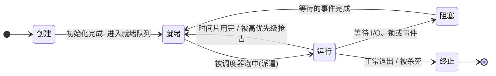
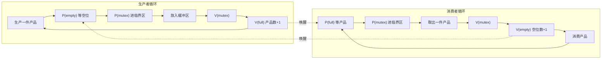
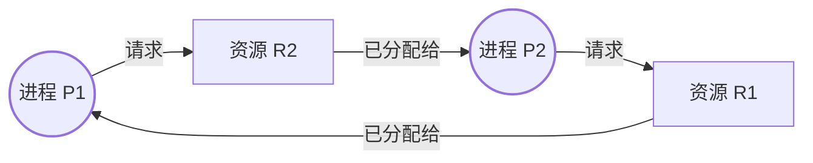
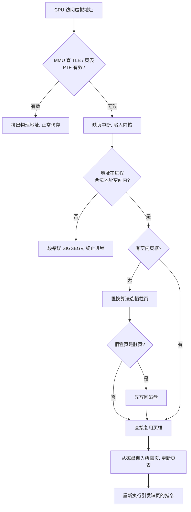
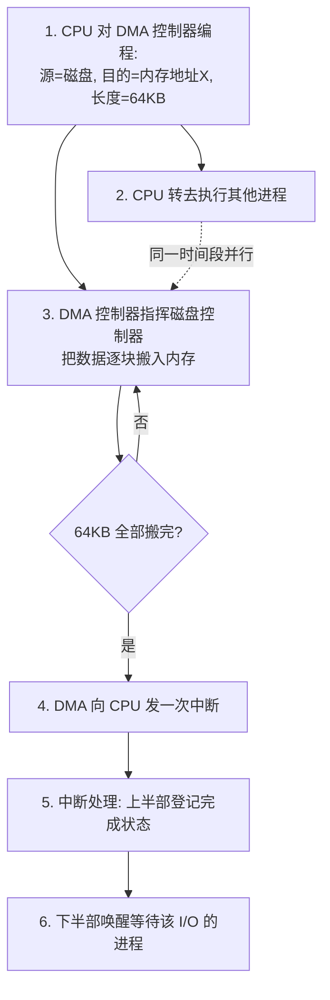

# 操作系统

> 操作系统是硬件与应用之间的"总管家"：它把一块裸机抽象成进程、地址空间和文件，让成百上千个程序安全地共享同一套 CPU、内存和磁盘。

## 0. AI 时代为什么还要学操作系统

有同学会问：我写的是 PyTorch，跑的是云上容器，为什么还要学几十年前的操作系统理论？

第一，**大模型工程的瓶颈大都是操作系统问题**。GPU 显存不够用，本质是内存管理问题——vLLM 的 PagedAttention 直接照搬了虚拟内存分页的思想，把 KV-cache 切成固定大小的块按需分配，显存利用率从约 40% 提到 90% 以上；千卡集群训练大模型，调度器要决定哪个任务上哪块卡、怎么抢占、怎么容错，这就是 CPU 调度理论在数据中心尺度的放大；CUDA stream 的异步执行、计算与通信重叠，背后是 I/O 并发与缓冲的经典套路。

第二，**容器化部署就是操作系统机制的直接应用**。Docker 不是虚拟机，它靠 Linux 的 namespace 做隔离、cgroups 做资源限额、联合文件系统做镜像分层——不懂进程、文件系统和内存配额，排查"容器里 OOM 被杀"这类问题时只能干瞪眼。

第三，**性能调优的语言是操作系统的语言**。上下文切换太频繁、缺页率飙升、锁竞争激烈、磁盘 I/O 打满——性能分析工具吐出的每一个指标，都对应本课的一章。AI 能帮你写代码，但"这个服务为什么 p99 延迟抖动"的判断，依赖你对进程、内存、I/O 全链路的理解。操作系统是所有上层软件共同的地基。

---

## 1. 操作系统概述

### 知识要点

| 概念 | 含义 | 备注 |
|------|------|------|
| 操作系统 | 管理硬件资源、为应用提供服务的系统软件 | 资源管理器 + 扩展机器 |
| 内核态 / 用户态 | CPU 的两种特权级别 | 内核态可执行特权指令 |
| 系统调用 | 用户程序请求内核服务的唯一入口 | `read` / `write` / `fork` 等 |
| 中断 / 异常 | 打断当前执行流的事件 | 中断来自外设，异常来自指令本身 |
| 宏内核 / 微内核 | 内核功能的组织方式 | Linux 是宏内核，QNX 是微内核 |

操作系统发展脉络（每一步都由"资源利用率"驱动）：

- **手工操作**（1940s）：程序员独占机器，插纸带、拨开关，CPU 大量空转
- **批处理**（1950s）：作业成批装入，监控程序自动串行运行，但 I/O 时 CPU 仍空等
- **多道程序**（1960s）：内存同时驻留多个作业，一个等 I/O 时切换到另一个，CPU 利用率大幅提升——这是现代操作系统的起点
- **分时系统**（1970s）：按时间片轮流服务多个终端用户，响应时间成为新指标（UNIX 诞生）
- **现代**：个人机（Windows/macOS）、移动（Android/iOS）、服务器与云（Linux 一统天下）、实时与嵌入式（车控、机器人）

### 关键概念精讲

**为什么要区分内核态与用户态**。如果任何程序都能直接操作页表、访问任意物理内存、屏蔽中断，那么一个 bug 或一段恶意代码就能让整台机器崩溃。CPU 硬件提供特权级（x86 的 Ring 0 / Ring 3，RISC-V 的 M/S/U 模式），把"危险指令"限制在内核态执行。用户程序想读文件、创建进程，必须通过**系统调用**这扇受控的门进入内核：执行陷入指令（x86 的 `syscall`）→ CPU 切到内核态并跳到固定入口 → 内核按系统调用号查表分发 → 执行服务例程 → 恢复现场返回用户态。一次系统调用的代价（微秒级）远高于普通函数调用（纳秒级），这就是高性能程序要"减少系统调用次数"（如用缓冲把多次小写合并成一次大写）的原因。

**库函数与系统调用的关系**。`printf` 是 C 库函数，它在用户态拼好字符串、写入缓冲区，最终调用系统调用 `write` 才真正进入内核。Python 的 `open()`、`os.read()` 同理——语言运行库是壳，系统调用是核。

**宏内核 vs 微内核**。宏内核把进程管理、内存管理、文件系统、驱动全部放进内核态，模块间函数直呼、性能高，但一个驱动崩溃可能拖垮整个内核（Linux、传统 UNIX）。微内核只保留最基本的 IPC、调度和内存管理，文件系统与驱动作为用户态服务进程运行，靠消息传递通信，隔离性好但通信开销大（Mach、QNX、鸿蒙微内核）。工程现实是混合路线：Windows NT 与 macOS 的 XNU 都是"宏内核骨架 + 微内核思想"。

下图展示了用户态程序经系统调用陷入内核的完整路径：特权级切换发生在陷入指令处，内核完成服务后原路返回。

<svg viewBox="0 0 680 260" width="100%" role="img" aria-label="系统调用的用户态内核态切换路径">
  <text x="10" y="20" fill="var(--text)" font-size="14" font-weight="bold">系统调用路径：用户态 → 内核态 → 用户态</text>
  <rect x="20" y="40" width="640" height="80" fill="var(--panel)" stroke="var(--text)" stroke-width="1.5" rx="6"/>
  <text x="30" y="60" fill="var(--muted)" font-size="12">用户态（Ring 3）</text>
  <rect x="20" y="150" width="640" height="80" fill="var(--panel)" stroke="var(--text)" stroke-width="1.5" rx="6"/>
  <text x="30" y="170" fill="var(--muted)" font-size="12">内核态（Ring 0）</text>
  <rect x="50" y="70" width="130" height="36" fill="var(--accent)" rx="4"/>
  <text x="115" y="93" fill="#fff" font-size="12" text-anchor="middle">应用: print(...)</text>
  <rect x="230" y="70" width="150" height="36" fill="var(--panel)" stroke="var(--text)" rx="4"/>
  <text x="305" y="88" fill="var(--text)" font-size="12" text-anchor="middle">库函数 write()</text>
  <text x="305" y="101" fill="var(--muted)" font-size="10" text-anchor="middle">装入调用号, 执行 syscall</text>
  <rect x="230" y="180" width="150" height="36" fill="var(--panel)" stroke="var(--text)" rx="4"/>
  <text x="305" y="198" fill="var(--text)" font-size="12" text-anchor="middle">陷入处理入口</text>
  <text x="305" y="211" fill="var(--muted)" font-size="10" text-anchor="middle">保存现场, 查系统调用表</text>
  <rect x="440" y="180" width="150" height="36" fill="var(--accent)" rx="4"/>
  <text x="515" y="198" fill="#fff" font-size="12" text-anchor="middle">sys_write 服务例程</text>
  <text x="515" y="211" fill="#fff" font-size="10" text-anchor="middle">真正操作设备/缓冲</text>
  <rect x="440" y="70" width="150" height="36" fill="var(--panel)" stroke="var(--text)" rx="4"/>
  <text x="515" y="93" fill="var(--text)" font-size="12" text-anchor="middle">返回用户程序继续执行</text>
  <g stroke="var(--text)" stroke-width="1.6" fill="none">
    <line x1="180" y1="88" x2="228" y2="88"/>
    <line x1="305" y1="106" x2="305" y2="178"/>
    <line x1="380" y1="198" x2="438" y2="198"/>
    <line x1="515" y1="178" x2="515" y2="108"/>
  </g>
  <g fill="var(--text)">
    <polygon points="228,88 220,84 220,92"/>
    <polygon points="305,178 301,170 309,170"/>
    <polygon points="438,198 430,194 430,202"/>
    <polygon points="515,108 511,116 519,116"/>
  </g>
  <text x="315" y="145" fill="var(--accent)" font-size="11">陷入(trap): 切到内核态</text>
  <text x="525" y="145" fill="var(--accent)" font-size="11">iret: 切回用户态</text>
</svg>

### 案例代码：观察系统调用与切换开销

```python
import os
import time


def syscall_demo():
    """os 模块的函数大多直接对应系统调用。"""
    pid = os.getpid()                       # 系统调用 getpid
    print(f"当前进程 PID = {pid}")
    fd = os.open("tmp_syscall.txt", os.O_CREAT | os.O_WRONLY | os.O_TRUNC)
    os.write(fd, b"written by raw syscall\n")   # 系统调用 write：无用户态缓冲
    os.close(fd)
    with open("tmp_syscall.txt") as f:      # open/read 也是系统调用的封装
        print("读回内容:", f.read().strip())
    os.remove("tmp_syscall.txt")


def overhead_demo():
    """实测：系统调用（哪怕最轻的 getpid）比普通函数调用慢一个数量级以上。"""
    N = 100_000

    def plain():                            # 普通用户态函数
        return 42

    t0 = time.perf_counter()
    for _ in range(N):
        plain()
    t1 = time.perf_counter()
    for _ in range(N):
        os.getpid()                         # 每次都要陷入内核再返回
    t2 = time.perf_counter()
    print(f"{N} 次普通函数调用: {(t1 - t0) * 1000:8.2f} ms")
    print(f"{N} 次 getpid 系统调用: {(t2 - t1) * 1000:6.2f} ms  "
          f"(约 {(t2 - t1) / (t1 - t0):.0f} 倍)")


if __name__ == "__main__":
    syscall_demo()
    overhead_demo()
```

运行可见系统调用显著慢于普通函数调用——理解这个开销，就理解了"为什么标准库要做用户态缓冲""为什么高并发框架要用批量系统调用（如 `io_uring`）"。

---

## 2. 进程与线程

### 知识要点

| 概念 | 含义 | 备注 |
|------|------|------|
| 进程 | 程序的一次运行实例，资源分配的基本单位 | 独立地址空间 |
| 线程 | 进程内的执行流，CPU 调度的基本单位 | 共享进程地址空间 |
| PCB | 进程控制块，内核中描述进程的数据结构 | PID、状态、寄存器、页表指针等 |
| 上下文切换 | 保存旧进程现场、装入新进程现场 | 微秒级开销 + 缓存/TLB 失效 |
| 协程 | 用户态自行调度的轻量执行流 | 切换纳秒级，不需内核参与 |

进程五状态模型：**创建 → 就绪 ⇄ 运行 → 终止**，运行中等待事件则进入**阻塞**，事件完成回到就绪。三条关键转换：就绪→运行（被调度选中）、运行→就绪（时间片用完或被抢占）、运行→阻塞（主动等待 I/O 或锁）。注意：阻塞不能直接变运行，必须先回就绪队列排队。

| 对比项 | 进程 | 线程 |
|--------|------|------|
| 地址空间 | 独立 | 同进程内共享 |
| 通信方式 | 管道 / 消息队列 / 共享内存 / socket | 直接读写共享变量（需同步） |
| 创建与切换开销 | 大（复制页表等） | 小（只换寄存器和栈） |
| 一个崩溃的影响 | 不影响其他进程 | 整个进程一起崩 |
| 典型应用 | 浏览器每个标签页一个进程 | Web 服务器一个连接一个线程 |

### 关键概念精讲

**PCB 是进程存在的唯一标志**。内核为每个进程维护一个 PCB（Linux 中是 `task_struct`），存放：标识信息（PID、父进程、用户）、现场信息（通用寄存器、程序计数器、栈指针）、控制信息（状态、优先级、已用 CPU 时间）、资源清单（页表基址、打开文件表、信号处理表）。所谓"上下文切换"，就是把 CPU 寄存器当前值存进旧进程 PCB、再从新进程 PCB 装入——进程本身对此毫无感知，这正是"每个进程都以为自己独占 CPU"这一抽象的实现手法。

**上下文切换的真实代价**不止保存恢复寄存器那几微秒：切换后 CPU 高速缓存里是别人的数据（冷缓存）、TLB 里是别人的页表项（需重填）、分支预测器也要重新训练。因此高性能服务会用 CPU 亲和性把线程钉在固定核上，减少无谓迁移。

**线程为什么轻**。同进程的线程共享代码段、数据段、堆和打开的文件，只有栈和寄存器私有。切换线程不需要换页表（地址空间不变），TLB 不用刷，开销只有进程切换的几分之一。

**协程再轻一个数量级**。协程的调度完全在用户态完成——本质上只是"换一下栈指针和几个寄存器"的函数跳转，纳秒级。Python 的 `async/await`、Go 的 goroutine 都是协程：单线程可以跑几十万个协程，靠"遇到 I/O 主动让出"实现并发。代价是协程内不能执行阻塞式系统调用（会卡住整个线程），所以配套需要异步 I/O。

**Python 的 GIL**。CPython 的全局解释器锁保证同一时刻只有一个线程执行字节码，所以 Python 多线程对 CPU 密集任务没有加速（甚至更慢），但 I/O 密集任务仍然有效——线程在等 I/O 时会释放 GIL。CPU 密集要并行，用 `multiprocessing` 多进程绕开 GIL。

下图展示了进程五状态转换：只有三条边与调度器直接相关（派遣、时间片到、等待事件），阻塞态必须经过就绪态才能再次运行。



### 案例代码：GIL 下线程对 CPU 密集与 I/O 密集任务的差异

```python
import threading
import time


def cpu_task(n=2_000_00):
    """CPU 密集：纯计算，全程握着 GIL。"""
    s = 0
    for i in range(n):
        s += i * i
    return s


def io_task():
    """I/O 密集：sleep 模拟等待网络/磁盘，等待期间释放 GIL。"""
    time.sleep(0.1)


def bench(task, n_threads, label):
    t0 = time.perf_counter()
    threads = [threading.Thread(target=task) for _ in range(n_threads)]
    for t in threads:
        t.start()
    for t in threads:
        t.join()
    print(f"{label}: {(time.perf_counter() - t0) * 1000:7.1f} ms")


if __name__ == "__main__":
    print("--- CPU 密集任务 x4 ---")
    t0 = time.perf_counter()
    for _ in range(4):
        cpu_task()
    print(f"单线程顺序执行: {(time.perf_counter() - t0) * 1000:7.1f} ms")
    bench(cpu_task, 4, "4 线程并发执行")     # GIL 限制，不会更快

    print("--- I/O 密集任务 x4 ---")
    t0 = time.perf_counter()
    for _ in range(4):
        io_task()
    print(f"单线程顺序执行: {(time.perf_counter() - t0) * 1000:7.1f} ms")
    bench(io_task, 4, "4 线程并发执行")      # 等待重叠，约缩短为 1/4
```

实测结论：CPU 密集任务 4 线程与单线程耗时相当（GIL 串行化），I/O 密集任务 4 线程约为单线程的四分之一（等待时间重叠）。这就是"Python 多线程适合 I/O 密集、多进程适合 CPU 密集"的实验依据。

---

## 3. CPU 调度

### 知识要点

调度发生的时机：进程从运行→阻塞（主动让出）、运行→终止、运行→就绪（抢占）、阻塞→就绪（可能触发抢占）。只在前两种时机调度的叫**非抢占式**，四种都调度的叫**抢占式**。

评价指标（对同一批进程）：

- `周转时间 = 完成时间 - 到达时间`（作业从提交到完成的总耗时）
- `等待时间 = 周转时间 - 运行时间`（在就绪队列里干等的时间）
- `响应时间 = 首次上 CPU 时间 - 到达时间`（交互系统最关心）
- 吞吐量：单位时间完成的进程数；CPU 利用率：CPU 忙的时间占比

| 算法 | 策略 | 优点 | 缺点 |
|------|------|------|------|
| FCFS | 按到达顺序 | 简单公平 | 短作业被长作业拖累（护航效应） |
| SJF | 选运行时间最短 | 平均等待时间理论最优 | 需预知运行时间；长作业饥饿 |
| SRTF | SJF 的抢占版 | 平均周转更优 | 切换开销大；同样饥饿 |
| RR | 按时间片轮转 | 响应快、公平 | 时间片难选：太大退化为 FCFS，太小切换开销占比过高 |
| 优先级 | 选优先级最高 | 区分轻重缓急 | 低优先级饥饿（解法：老化 aging） |
| MLFQ | 多级队列 + 降级反馈 | 兼顾响应与周转，无需预知运行时间 | 参数多，可被"耍时间片"策略欺骗 |

### 关键概念精讲

**SJF 为什么最优**。把短作业排在长作业前面，会减少后面所有作业的等待，总等待时间必然下降——交换论证可以严格证明非抢占场景下 SJF 平均等待时间最小。工程问题是运行时间未知，实际系统用**指数平均**预测：`预测值 = a * 上次实际值 + (1 - a) * 上次预测值`，这也是 TCP 估计 RTT 的公式。

**RR 的时间片怎么选**。经验值 10~100ms：要保证约 80% 的 CPU 突发能在一个时间片内跑完，同时切换开销（约几微秒）占比可忽略。时间片 4ms、切换 1ms，则 20% 的 CPU 时间浪费在切换上——不可接受。

**MLFQ 是通用操作系统的现实答案**。规则：新进程进最高优先级队列（时间片最短）；用完整个时间片说明是 CPU 密集型，降一级（时间片翻倍）；在时间片内主动阻塞说明是交互型，留在原级。效果：交互进程始终在高优先级队列享受快速响应，批处理进程沉到底层队列用长时间片减少切换。再加上定期"全部提升回顶层"防饥饿。Windows 与 Linux 的 CFS 之前的 O(1) 调度器都是这个思路的变体。

**实时调度**用于"迟到即错误"的场景（刹车控制、音频采样）。速率单调（RM）：周期越短优先级越高，静态分配；最早截止期优先（EDF）：动态选截止期最近的任务，可以把 CPU 利用率用到 100%，但超载时行为不可控。

下图展示了 4 个进程在 RR（时间片 q=2）下的执行时序甘特图，进程条上的数字为起止时刻。P1 被切成四段，响应时间很短（0 时刻即上 CPU），但完成时间被拖到最后——这是 RR "牺牲周转换响应"的直观体现。

<svg viewBox="0 0 680 250" width="100%" role="img" aria-label="RR时间片轮转调度甘特图">
  <text x="10" y="20" fill="var(--text)" font-size="14" font-weight="bold">RR (q=2) 调度甘特图：P1(0,7) P2(2,4) P3(4,1) P4(5,4)</text>
  <g font-size="12" fill="var(--muted)" text-anchor="end">
    <text x="58" y="64">P1</text><text x="58" y="104">P2</text>
    <text x="58" y="144">P3</text><text x="58" y="184">P4</text>
  </g>
  <g stroke="var(--border)" stroke-width="1" stroke-dasharray="2 4">
    <line x1="70" y1="40" x2="70" y2="195"/><line x1="145" y1="40" x2="145" y2="195"/>
    <line x1="220" y1="40" x2="220" y2="195"/><line x1="295" y1="40" x2="295" y2="195"/>
    <line x1="370" y1="40" x2="370" y2="195"/><line x1="445" y1="40" x2="445" y2="195"/>
    <line x1="520" y1="40" x2="520" y2="195"/><line x1="595" y1="40" x2="595" y2="195"/>
    <line x1="670" y1="40" x2="670" y2="195"/>
  </g>
  <g font-size="11" fill="var(--muted)" text-anchor="middle">
    <text x="70" y="212">0</text><text x="145" y="212">2</text><text x="220" y="212">4</text>
    <text x="295" y="212">6</text><text x="370" y="212">8</text><text x="445" y="212">10</text>
    <text x="520" y="212">12</text><text x="595" y="212">14</text><text x="670" y="212">16</text>
  </g>
  <g>
    <rect x="70" y="48" width="75" height="22" fill="var(--accent)" rx="3"/>
    <rect x="220" y="48" width="75" height="22" fill="var(--accent)" rx="3"/>
    <rect x="482" y="48" width="75" height="22" fill="var(--accent)" rx="3"/>
    <rect x="632" y="48" width="38" height="22" fill="var(--accent)" rx="3"/>
    <rect x="145" y="88" width="75" height="22" fill="var(--panel)" stroke="var(--text)" rx="3"/>
    <rect x="332" y="88" width="75" height="22" fill="var(--panel)" stroke="var(--text)" rx="3"/>
    <rect x="295" y="128" width="37" height="22" fill="var(--panel)" stroke="var(--text)" rx="3"/>
    <rect x="407" y="168" width="75" height="22" fill="var(--panel)" stroke="var(--text)" rx="3"/>
    <rect x="557" y="168" width="75" height="22" fill="var(--panel)" stroke="var(--text)" rx="3"/>
  </g>
  <g font-size="10" fill="var(--text)" text-anchor="middle">
    <text x="107" y="63" fill="#fff">0-2</text><text x="257" y="63" fill="#fff">4-6</text>
    <text x="519" y="63" fill="#fff">11-13</text><text x="651" y="63" fill="#fff">15-16</text>
    <text x="182" y="103">2-4</text><text x="369" y="103">7-9</text>
    <text x="313" y="143">6-7</text>
    <text x="444" y="183">9-11</text><text x="594" y="183">13-15</text>
  </g>
  <text x="70" y="235" fill="var(--muted)" font-size="11">P3 只需 1 个单位，6 时刻上车 7 时刻完成；P1 最长，四段拼完拖到 16。</text>
</svg>

### 案例代码：FCFS / SJF / RR 三种调度的周转与等待时间对比

```python
from collections import deque

# 进程: (名字, 到达时间, 运行时间)
PROCS = [("P1", 0, 7), ("P2", 2, 4), ("P3", 4, 1), ("P4", 5, 4)]


def fcfs(procs):
    """先来先服务。返回 {进程名: 完成时间}。"""
    t, finish = 0, {}
    for name, arrive, burst in sorted(procs, key=lambda p: p[1]):
        t = max(t, arrive) + burst
        finish[name] = t
    return finish


def sjf(procs):
    """非抢占短作业优先。"""
    pending = sorted(procs, key=lambda p: p[1])
    t, finish, ready = 0, {}, []
    while pending or ready:
        while pending and pending[0][1] <= t:
            ready.append(pending.pop(0))
        if not ready:
            t = pending[0][1]
            continue
        ready.sort(key=lambda p: p[2])          # 选运行时间最短者
        name, arrive, burst = ready.pop(0)
        t += burst
        finish[name] = t
    return finish


def rr(procs, q=2):
    """时间片轮转，时间片 q。"""
    pending = sorted(procs, key=lambda p: p[1])
    remain = {name: burst for name, _, burst in procs}
    t, finish, queue = 0, {}, deque()
    while pending or queue:
        while pending and pending[0][1] <= t:
            queue.append(pending.pop(0)[0])
        if not queue:
            t = pending[0][1]
            continue
        name = queue.popleft()
        run = min(q, remain[name])
        t += run
        remain[name] -= run
        while pending and pending[0][1] <= t:   # 新到者先入队，再放回当前进程
            queue.append(pending.pop(0)[0])
        if remain[name]:
            queue.append(name)
        else:
            finish[name] = t
    return finish


def report(title, finish):
    info = {name: (a, b) for name, a, b in PROCS}
    tat_sum = wait_sum = 0
    rows = []
    for name in sorted(finish):
        arrive, burst = info[name]
        tat = finish[name] - arrive             # 周转时间 = 完成 - 到达
        wait = tat - burst                      # 等待时间 = 周转 - 运行
        tat_sum += tat
        wait_sum += wait
        rows.append(f"  {name}: 完成{finish[name]:>3} 周转{tat:>3} 等待{wait:>3}")
    print(f"[{title}]")
    print("\n".join(rows))
    n = len(finish)
    print(f"  平均周转 {tat_sum / n:.2f}  平均等待 {wait_sum / n:.2f}")


if __name__ == "__main__":
    report("FCFS", fcfs(PROCS))
    report("SJF ", sjf(PROCS))
    report("RR q=2", rr(PROCS))
```

输出显示同一组进程：SJF 平均等待 4.00 最优，FCFS 4.75，RR 5.00 但 P3 这样的短交互任务响应最快。完整的五算法版本（含优先级与多级反馈队列）见配套代码 `code/07-os/scheduler.py`。

---
## 4. 进程同步与互斥

### 知识要点

| 概念 | 含义 | 备注 |
|------|------|------|
| 竞争条件 | 结果依赖多个执行流的交错顺序 | `count += 1` 不是原子操作 |
| 临界区 | 访问共享资源的代码段 | 同一时刻至多一个执行流进入 |
| 互斥锁 | 提供互斥的最基本原语 | `acquire` / `release` |
| 信号量 | 带计数的同步原语，P（减）/ V（加） | 计数为 0 时 P 操作阻塞 |
| 管程 | 把共享数据和操作封装在一起，自动互斥 | 条件变量 wait / signal |

临界区解决方案必须满足四条：**互斥**（至多一个进入）、**前进**（无人在临界区时申请者不能被无限拖延）、**有限等待**（不能饿死）、**让权等待**（等不到就让出 CPU，避免忙等——纯软件自旋方案不满足这条）。

信号量的两种用法：

- **互斥**：初值 1，进临界区 P、出临界区 V（就是锁）
- **同步/资源计数**：初值 = 资源数量，P 申请一个资源、V 归还一个资源；初值 0 可实现"事件等待"（A 做完 V 一下，B 先 P 等着）

### 关键概念精讲

**为什么 `count += 1` 会出错**。这一行编译成三条指令：读 count 到寄存器、寄存器加一、写回内存。两个线程同时执行时可能都读到旧值 5，各自加一后都写回 6——丢失一次更新。解决思路只有一个：把"读-改-写"变成不可分割的**原子操作**，要么靠硬件原子指令（`test-and-set`、`compare-and-swap`），要么靠锁把整段包起来。

**生产者-消费者**（有界缓冲）是同步问题的原型：缓冲区容量 N，生产者放、消费者取。需要三个信号量：`mutex = 1` 保护缓冲区本身，`empty = N` 数空位，`full = 0` 数产品。生产者 `P(empty) → P(mutex) → 放入 → V(mutex) → V(full)`；消费者 `P(full) → P(mutex) → 取出 → V(mutex) → V(empty)`。**顺序不能颠倒**：若先 `P(mutex)` 再 `P(empty)`，生产者可能抱着锁等空位，消费者拿不到锁无法腾空位——死锁。

**读者-写者**：允许多个读者同时读，写者必须独占。读者优先方案用 `read_count` 计数，第一个读者替所有读者锁住写者、最后一个读者放行，代价是写者可能饿死；写者优先与公平方案（按到达顺序）是它的修正。数据库的共享锁/排他锁、Go 的 `sync.RWMutex` 都是这个模型。

**哲学家就餐**：五人围坐、五只叉子，每人要拿左右两只才能吃。若都先拿左手叉子，可能五人各持一只互等——死锁。可行解法：至多允许 4 人同时伸手（信号量初值 4）；奇数号先拿左、偶数号先拿右（打破对称）；**资源分级**——给叉子编号，永远先拿编号小的（普适的死锁预防手段，见第 5 章）。

**管程**把"数据 + 操作 + 互斥"打包：任一时刻只有一个线程能执行管程内的过程，条件不满足时在**条件变量**上 `wait`（释放管程并睡眠），别人改变条件后 `signal` 唤醒。Java 的 `synchronized` + `wait/notify`、Python 的 `threading.Condition` 都是管程思想。比裸信号量安全：互斥是自动的，程序员只操心条件。

下图展示了生产者与消费者通过三个信号量协作的流程，注意 P 操作的先后次序。



### 案例代码：竞争条件复现与加锁修复

```python
import threading


def race_demo(use_lock):
    """两个线程各对共享计数器自增 100000 次。
    不加锁时结果通常小于 200000（丢失更新）。"""
    counter = {"v": 0}
    lock = threading.Lock()
    N = 100_000

    def worker():
        for _ in range(N):
            if use_lock:
                with lock:
                    counter["v"] += 1        # 临界区：读-改-写被锁保护
            else:
                v = counter["v"]             # 故意拆开读与写，放大交错窗口
                counter["v"] = v + 1

    ts = [threading.Thread(target=worker) for _ in range(2)]
    for t in ts:
        t.start()
    for t in ts:
        t.join()
    tag = "加锁" if use_lock else "不加锁"
    ok = "正确" if counter["v"] == 2 * N else "丢失更新!"
    print(f"{tag}: counter = {counter['v']:>7}（期望 {2 * N}）-> {ok}")


if __name__ == "__main__":
    race_demo(use_lock=False)
    race_demo(use_lock=True)
```

生产者-消费者、读者-写者、哲学家就餐三个经典问题的完整可运行实现见配套代码 `code/07-os/sync_demo.py`——其中哲学家用"资源分级"保证永不死锁且能自动结束。

---

## 5. 死锁

### 知识要点

死锁：一组进程互相等待对方持有的资源，谁都无法前进。四个**必要条件**（缺一不可）：

| 条件 | 含义 | 破坏它的办法 |
|------|------|--------------|
| 互斥 | 资源一次只能给一个进程 | 资源本性，一般无法破坏 |
| 持有并等待 | 拿着已有资源等新资源 | 一次性申请全部资源 |
| 不可抢占 | 资源不能被强行夺走 | 申请失败就释放已持有资源 |
| 循环等待 | 存在进程-资源的环形等待链 | 资源统一编号，按序申请 |

处理策略从严到松：**预防**（破坏必要条件，代价是资源利用率低）→ **避免**（分配前算一算会不会进入不安全状态——银行家算法）→ **检测与恢复**（放任发生，定期检测，杀进程或回滚）→ **鸵鸟策略**（假装不存在，重启解决——大多数通用操作系统的现实选择）。

### 关键概念精讲

**资源分配图**：进程为圆、资源为方，分配边（资源→进程）与请求边（进程→资源）。每类资源只有一个实例时，**有环 ⇔ 死锁**；多实例时有环只是死锁的必要条件，需进一步做可完成性归约（能找到可完成的进程就删掉它的边，最后删不动且还有边残留才是死锁）。

**安全状态与银行家算法**。安全状态：存在一个进程序列，按序让每个进程拿到最大需求、跑完、归还，所有人都能完成。银行家算法在每次资源请求时做"试探分配 + 安全性检查"：

1. 若 `请求 > Need`（超过声明上限）→ 拒绝
2. 若 `请求 > Available` → 让它等
3. 试探性分配，跑安全性算法：`Work = Available`，反复找一个 `Need <= Work` 的未完成进程，令 `Work += 它的 Allocation` 并标记完成；若全部能完成则安全、正式分配，否则回滚拒绝

注意**不安全状态不等于必然死锁**——它只是"存在一种运气不好的执行顺序会死锁"；银行家算法保守地拒绝进入任何不安全状态。它的工程局限：要求进程预先声明最大需求、进程数与资源数固定，所以真实通用系统很少用，但在数据库事务与集群资源配额里思想常在。

**死锁检测与恢复**：对多实例资源跑与安全性算法同构的检测算法，找出无法完成的进程集合。恢复手段：按代价挑受害者杀进程（数据库选回滚代价最小的事务）、资源抢占、回滚到检查点。数据库死锁检测器就是典型实现——MySQL InnoDB 检测到死锁会主动回滚其中一个事务并报错 `Deadlock found`。

下图展示了一个最小死锁：P1 持有 R1 等 R2，P2 持有 R2 等 R1，分配边与请求边构成环。



### 案例代码：银行家算法安全性检查（精简版）

```python
def safety_check(available, alloc, need):
    """银行家算法安全性检查：返回 (是否安全, 安全序列)。"""
    n = len(alloc)
    work = available[:]
    finish = [False] * n
    seq = []
    changed = True
    while changed:
        changed = False
        for i in range(n):
            if not finish[i] and all(need[i][j] <= work[j] for j in range(len(work))):
                work = [work[j] + alloc[i][j] for j in range(len(work))]
                finish[i] = True                 # 进程 i 能跑完并归还资源
                seq.append(f"P{i}")
                changed = True
    return all(finish), seq


if __name__ == "__main__":
    # 经典例子：3 类资源，5 个进程
    available = [3, 3, 2]
    alloc = [[0, 1, 0], [2, 0, 0], [3, 0, 2], [2, 1, 1], [0, 0, 2]]
    max_ = [[7, 5, 3], [3, 2, 2], [9, 0, 2], [2, 2, 2], [4, 3, 3]]
    need = [[max_[i][j] - alloc[i][j] for j in range(3)] for i in range(5)]

    safe, seq = safety_check(available, alloc, need)
    print("安全" if safe else "不安全", "安全序列:", " -> ".join(seq))

    # P0 直接拿走 (0,2,0) 后再查：进入不安全状态
    available2 = [3, 1, 2]
    alloc2 = [row[:] for row in alloc]
    alloc2[0] = [0, 3, 0]
    need2 = [[max_[i][j] - alloc2[i][j] for j in range(3)] for i in range(5)]
    safe2, seq2 = safety_check(available2, alloc2, need2)
    print("若批准 P0 请求 (0,2,0):", "安全" if safe2 else "不安全，应拒绝并回滚")
```

含"请求判定 + 试探分配 + 回滚"完整流程的版本见配套代码 `code/07-os/banker.py`。

---

## 6. 内存管理

### 知识要点

内存管理的演进，每一步都在解决前一步的碎片问题：

| 方案 | 思路 | 碎片问题 |
|------|------|----------|
| 单一连续分配 | 整块内存给一个程序 | 浪费严重，无多道 |
| 固定分区 | 预先切成几个分区 | 内部碎片（分区装不满） |
| 动态分区 | 按需切分（首次/最佳/最坏适应） | 外部碎片（空闲块零碎不连续） |
| 分页 | 内存切成等大页框，程序切成等大页 | 只剩每进程最后一页的少量内部碎片 |
| 分段 | 按逻辑单元（代码/数据/栈）分段 | 有外部碎片，但便于共享与保护 |
| 段页式 | 先分段、段内再分页 | 结合两者优点，两次查表 |

分页的核心公式（页大小 4KB = 2^12 为例，32 位地址）：

- `虚拟地址 = 页号(20位) + 页内偏移(12位)`
- `页号 = 虚拟地址 / 页大小`，`偏移 = 虚拟地址 % 页大小`
- `物理地址 = 页表[页号].页框号 * 页大小 + 偏移`

### 关键概念精讲

**为什么分页能消灭外部碎片**。动态分区的痛点是：空闲内存总量够，但被切得零零碎碎、没有一块连续的够大——外部碎片。分页把"连续"这个要求本身取消了：程序的第 0 页和第 1 页可以放在物理内存中任意两个不相邻的页框里，靠页表记住映射。任何一个空闲页框都能用，外部碎片归零；代价是每个进程要维护页表，以及平均每进程半页的内部碎片。

**地址翻译由 MMU 硬件完成**。CPU 每发出一个虚拟地址，MMU 取高位做页号、查页表得页框号、拼上低位偏移得到物理地址——每条访存指令都要经历这个过程，所以必须是硬件速度。页表项（PTE）除页框号外还带标志位：有效位（这页在不在内存）、读/写/执行权限位、脏位（写过没有）、访问位（最近用过没有）——后两位是页面置换算法的原料。

**TLB 是页表的高速缓存**。页表放在内存里，直接查表意味着每次访存变成两次访存（先读 PTE 再读数据）——性能减半。TLB（快表）用几十到几百项的全相联缓存存最近用过的"页号→页框号"映射，命中约 1ns 内完成。`有效访问时间 = 命中率 * (TLB时间 + 访存) + 缺失率 * (TLB时间 + 2 * 访存)`。程序局部性使 TLB 命中率通常在 99% 以上；大模型推理这类内存密集负载常用 2MB/1GB **大页**减少 TLB 缺失。

**多级页表解决页表太大**。32 位地址、4KB 页，单级页表要 2^20 项 x 4B = 4MB / 进程，且必须连续常驻。二级页表把页号再拆成"页目录号 + 页表号"，未用到的区域整棵子树不分配——稀疏地址空间只花很少内存。x86-64 用四级（48 位虚拟地址：9+9+9+9+12）。代价是一次翻译最多多次访存，全靠 TLB 兜底。

下图展示了 32 位虚拟地址经页表翻译成物理地址的全过程：高 20 位页号查页表换成页框号，低 12 位偏移原样拼接。

<svg viewBox="0 0 680 300" width="100%" role="img" aria-label="虚拟地址经页表翻译为物理地址">
  <text x="10" y="20" fill="var(--text)" font-size="14" font-weight="bold">分页地址翻译（4KB 页，32 位地址）</text>
  <rect x="40" y="40" width="300" height="34" fill="var(--panel)" stroke="var(--text)" stroke-width="1.5"/>
  <line x1="240" y1="40" x2="240" y2="74" stroke="var(--text)" stroke-width="1.5"/>
  <text x="140" y="61" fill="var(--text)" font-size="12" text-anchor="middle">页号 VPN = 0x00123（20 位）</text>
  <text x="290" y="61" fill="var(--text)" font-size="12" text-anchor="middle">偏移 0xABC</text>
  <text x="40" y="90" fill="var(--muted)" font-size="11">虚拟地址 0x00123ABC</text>
  <rect x="80" y="120" width="200" height="130" fill="var(--panel)" stroke="var(--text)" stroke-width="1.5" rx="4"/>
  <text x="180" y="138" fill="var(--muted)" font-size="12" text-anchor="middle">页表（每进程一张）</text>
  <g font-size="11" fill="var(--text)">
    <text x="95" y="158">VPN 0x00121 → 帧 0x0A0  有效</text>
    <text x="95" y="178">VPN 0x00122 → 磁盘上   无效</text>
    <text x="95" y="218">VPN 0x00124 → 帧 0x1F3  有效</text>
  </g>
  <rect x="88" y="186" width="184" height="20" fill="var(--accent)" rx="3"/>
  <text x="95" y="200" fill="#fff" font-size="11">VPN 0x00123 → 帧 0x2C7  有效</text>
  <g stroke="var(--text)" stroke-width="1.6" fill="none">
    <path d="M 140 74 L 140 100 L 80 100 L 80 118" />
    <path d="M 272 196 L 420 196 L 420 216" />
    <path d="M 290 74 L 290 100 L 560 100 L 560 216" />
  </g>
  <g fill="var(--text)">
    <polygon points="80,118 76,110 84,110"/>
    <polygon points="420,216 416,208 424,208"/>
    <polygon points="560,216 556,208 564,208"/>
  </g>
  <text x="300" y="188" fill="var(--accent)" font-size="11">页框号 0x2C7</text>
  <text x="452" y="110" fill="var(--muted)" font-size="11">偏移直接拼接（不翻译）</text>
  <rect x="360" y="220" width="240" height="34" fill="var(--panel)" stroke="var(--text)" stroke-width="1.5"/>
  <line x1="500" y1="220" x2="500" y2="254" stroke="var(--text)" stroke-width="1.5"/>
  <text x="430" y="241" fill="var(--text)" font-size="12" text-anchor="middle">页框号 0x2C7</text>
  <text x="550" y="241" fill="var(--text)" font-size="12" text-anchor="middle">偏移 0xABC</text>
  <text x="360" y="275" fill="var(--muted)" font-size="11">物理地址 0x2C7ABC（TLB 命中时跳过查表，1ns 内完成）</text>
</svg>

### 案例代码：分页地址翻译模拟（含 TLB）

```python
PAGE_SIZE = 4096          # 4KB 页
TLB_CAP = 4               # TLB 容量 4 项（真实硬件为几十到几百项）

page_table = {0x00121: 0x0A0, 0x00123: 0x2C7, 0x00124: 0x1F3, 0x00200: 0x055}
tlb = {}                  # 页号 -> 页框号（FIFO 淘汰，简化）
stats = {"tlb_hit": 0, "tlb_miss": 0}


def translate(vaddr):
    vpn, offset = divmod(vaddr, PAGE_SIZE)      # 拆成页号 + 页内偏移
    if vpn in tlb:
        stats["tlb_hit"] += 1
        frame, how = tlb[vpn], "TLB命中"
    else:
        stats["tlb_miss"] += 1
        if vpn not in page_table:
            print(f"0x{vaddr:08X}: 页 0x{vpn:05X} 无效 -> 缺页中断/段错误")
            return None
        frame, how = page_table[vpn], "TLB缺失,查页表"
        if len(tlb) >= TLB_CAP:                 # TLB 满则淘汰最早项
            tlb.pop(next(iter(tlb)))
        tlb[vpn] = frame
    paddr = frame * PAGE_SIZE + offset          # 物理地址 = 页框基址 + 偏移
    print(f"0x{vaddr:08X} -> 0x{paddr:06X}  (页 0x{vpn:05X} -> 帧 0x{frame:03X}, {how})")
    return paddr


if __name__ == "__main__":
    for va in [0x00123ABC, 0x00123FFF,        # 同一页：第二次 TLB 命中
               0x00124000, 0x00121123,
               0x00123000,                     # 再访问，仍命中
               0x00999000]:                    # 无效页
        translate(va)
    total = stats["tlb_hit"] + stats["tlb_miss"]
    print(f"TLB 命中 {stats['tlb_hit']}/{total} —— 局部性越好命中率越高")
```

---

## 7. 虚拟内存与页面置换

### 知识要点

虚拟内存 = 分页 + 按需调入 + 页面置换：进程的页不必全部在内存，访问到不在内存的页时触发**缺页中断**，由操作系统把页从磁盘调入；内存满了就按置换算法挑一页换出。支撑它的是**局部性原理**——程序在一段时间内只集中访问一小部分页（工作集）。

缺页处理流程：MMU 发现 PTE 无效 → 陷入内核 → 检查是合法缺页还是非法访问（段错误）→ 找空闲页框（没有则运行置换算法，被换出页若是脏页先写回磁盘）→ 从磁盘读入所需页 → 更新页表 → 重新执行引发缺页的那条指令。

| 算法 | 淘汰对象 | 特点 |
|------|----------|------|
| OPT | 将来最晚被访问的页 | 理论最优，不可实现（要预知未来），用作评价基准 |
| FIFO | 驻留最久的页 | 简单；有 Belady 异常（页框增多缺页反而变多） |
| LRU | 最近最久未使用的页 | 接近 OPT；精确实现代价高（每次访存都要更新） |
| Clock | 环形扫描给"二次机会" | LRU 的低成本近似，真实系统的主流选择 |

`缺页率 = 缺页次数 / 访问次数`；`有效访问时间 = (1 - p) * 访存时间 + p * 缺页处理时间`。访存 100ns、缺页处理 8ms 时，哪怕缺页率只有 0.1%，有效访问时间也会膨胀到 8 微秒——慢 80 倍。虚拟内存的可用性完全押注在极低的缺页率上。

### 关键概念精讲

**LRU 为什么难精确实现**。理想 LRU 要求每次访存都把该页移到"最近"端——硬件不可能为每次访存维护链表。真实系统用 PTE 里的**访问位**近似：Clock 算法把页框排成环，指针扫描，访问位为 1 就清零放过（二次机会），为 0 就淘汰。增强版（NRU）再加脏位，优先淘汰"没访问过且干净"的页，省一次写回。

**Belady 异常**。直觉上页框越多缺页越少，但 FIFO 在访问串 `1 2 3 4 1 2 5 1 2 3 4 5` 上，3 个页框缺页 9 次、4 个页框反而 10 次。原因是 FIFO 淘汰的"最老页"可能马上又要用。LRU 和 OPT 是**栈式算法**（n 个页框的驻留集恒为 n+1 个页框驻留集的子集），数学上保证无此异常。

**工作集与抖动**。工作集 `W(t, Δ)`：最近 Δ 次访问中触及的页集合，是进程"此刻真正需要"的内存量。若系统里所有进程的工作集之和超过物理内存，就会**抖动**（thrashing）：每个进程都在互相挤兑页框，CPU 大部分时间在等换页，利用率骤降。对策：按工作集大小控制多道程序度、挂起部分进程。云主机上"内存超卖 + 突发负载 = 集体变慢"就是这个机制。

**写时复制（COW）**是虚拟内存最优雅的应用：`fork` 子进程时不复制内存，父子共享所有页并标记只读；任一方写入时触发保护异常，内核此刻才复制那一页。`fork + exec` 启动新程序因此几乎零拷贝。同理还有内存映射文件（`mmap`）、共享库的代码段共享。

下图展示了缺页中断的完整处理流程，注意"合法缺页"与"非法访问"的分叉。



### 案例代码：FIFO 与 LRU 缺页对比 + Belady 异常复现

```python
from collections import OrderedDict, deque


def fifo(pages, frames):
    mem, q, faults = set(), deque(), 0
    for p in pages:
        if p not in mem:
            faults += 1
            if len(mem) == frames:
                mem.remove(q.popleft())        # 淘汰驻留最久的页
            mem.add(p)
            q.append(p)
    return faults


def lru(pages, frames):
    mem, faults = OrderedDict(), 0
    for p in pages:
        if p in mem:
            mem.move_to_end(p)                 # 命中：挪到"最近"端
        else:
            faults += 1
            if len(mem) == frames:
                mem.popitem(last=False)        # 淘汰最久未使用
            mem[p] = True
    return faults


if __name__ == "__main__":
    seq = [7, 0, 1, 2, 0, 3, 0, 4, 2, 3, 0, 3, 2, 1, 2, 0, 1, 7, 0, 1]
    print("常规访问串, 3 页框:  FIFO", fifo(seq, 3), "缺,  LRU", lru(seq, 3), "缺")

    belady = [1, 2, 3, 4, 1, 2, 5, 1, 2, 3, 4, 5]
    print("Belady 串 FIFO: 3 页框", fifo(belady, 3), "缺, 4 页框",
          fifo(belady, 4), "缺  <- 页框变多缺页反增!")
    print("Belady 串 LRU : 3 页框", lru(belady, 3), "缺, 4 页框",
          lru(belady, 4), "缺  <- 栈式算法单调改善")
```

含 OPT 与 Clock、多页框规模对比表的完整版本见配套代码 `code/07-os/page_replace.py`。

---
## 8. 文件系统

### 知识要点

文件系统解决三件事：**怎么命名**（目录结构）、**怎么记录一个文件占了哪些块**（分配方式）、**怎么保证掉电不坏**（一致性）。

| 分配方式 | 思路 | 优缺点 |
|----------|------|--------|
| 连续分配 | 文件占据连续的块 | 顺序读快；但难增长、有外部碎片（CD-ROM 用） |
| 链接分配（FAT） | 每块尾部存下一块指针，FAT 表集中存链 | 无外部碎片；随机访问要顺链走，FAT 表可缓存 |
| 索引分配（inode） | 每文件一个索引结点集中存块号 | 随机访问快；多级索引支持大文件（UNIX 系主流） |

- 目录本质是特殊文件，内容为"文件名 → inode 号"的映射表；树形目录 + 硬链接构成有向无环图
- inode 存元数据（类型、权限、大小、时间戳、块指针），**不存文件名**——文件名在目录里，这就是硬链接（多个名字指向同一 inode）的原理
- 经典 UNIX inode：12 个直接指针 + 一级 / 二级 / 三级间接指针。4KB 块、4B 指针时，单文件上限约 `12*4KB + 1024*4KB + 1024^2*4KB + 1024^3*4KB ≈ 4TB`
- **日志文件系统**（ext4/NTFS/XFS）：先把修改意图写进日志再改数据，崩溃后重放日志恢复一致性，把 fsck 扫全盘变成秒级恢复
- 磁盘调度（机械盘寻道优化）：FCFS、SSTF（最短寻道优先，会饿死边缘请求）、SCAN（电梯：单方向扫到头再折返）、C-SCAN（只单向服务，回程不停，响应更均匀）。SSD 无寻道，此类算法意义消失，优化点转向并行通道与写放大

### 关键概念精讲

**从路径名到数据块**。打开 `/home/ana/note.txt` 的过程：读根目录 inode（编号固定，如 2）→ 在根目录数据块里找 `home` 得其 inode 号 → 读 `home` 的 inode 与数据块找 `ana` → 再找 `note.txt` 的 inode 号 → 读它的 inode，块指针在手，才能读数据。一次路径解析要多次磁盘访问，所以内核用 dentry 缓存（目录项缓存）加速——热路径解析全程不碰磁盘。

**FAT vs inode**。FAT（File Allocation Table）把所有链接指针集中放进一张表：`FAT[i] = 文件中块 i 的下一块块号`，表常驻内存后随机访问只是查内存。它结构简单、兼容性无敌（U 盘、SD 卡至今在用），弱点是元数据能力弱（无权限）、FAT 表本身是单点。inode 方案每文件自带索引，配合多级间接指针既服务小文件（多数文件只用直接指针，一次寻址）又支持超大文件。

**崩溃一致性**。"先写数据还是先写元数据"在掉电时刻会产生不一致（inode 指向没写入的垃圾块，或块已写但 inode 未更新而丢失）。三代方案：fsck 全盘扫描修复（慢）；日志（journaling）——把一组修改先原子地写入日志区再落盘，ext4 默认只给元数据记日志；写时复制（COW）——从不原地改，新数据写新位置、最后原子切换根指针，Btrfs / ZFS / APFS 采用，天然支持快照。

下图展示了经典 UNIX inode 的指针结构：直接指针一步到数据，间接指针先到"指针块"再到数据，层级越深能表示的文件越大。

<svg viewBox="0 0 680 320" width="100%" role="img" aria-label="inode 多级指针结构">
  <text x="10" y="20" fill="var(--text)" font-size="14" font-weight="bold">inode 结构：直接指针 + 多级间接指针（4KB 块示例）</text>
  <rect x="30" y="40" width="170" height="250" fill="var(--panel)" stroke="var(--text)" stroke-width="1.5" rx="6"/>
  <text x="115" y="60" fill="var(--text)" font-size="12" text-anchor="middle" font-weight="bold">inode #128</text>
  <g font-size="11" fill="var(--muted)">
    <text x="45" y="80">类型/权限 rw-r--r--</text>
    <text x="45" y="96">属主/大小/时间戳</text>
  </g>
  <g font-size="11" fill="var(--text)">
    <text x="45" y="122">直接指针 0 → 块 517</text>
    <text x="45" y="142">直接指针 1 → 块 902</text>
    <text x="45" y="162">……共 12 个直接指针</text>
    <text x="45" y="192">一级间接 → 块 331</text>
    <text x="45" y="222">二级间接 → 块 415</text>
    <text x="45" y="252">三级间接 → (未用)</text>
  </g>
  <g>
    <rect x="290" y="100" width="72" height="30" fill="var(--accent)" rx="4"/>
    <rect x="290" y="140" width="72" height="30" fill="var(--accent)" rx="4"/>
    <rect x="290" y="180" width="90" height="52" fill="var(--panel)" stroke="var(--text)" stroke-width="1.5" rx="4"/>
    <rect x="470" y="180" width="72" height="30" fill="var(--accent)" rx="4"/>
    <rect x="290" y="248" width="90" height="52" fill="var(--panel)" stroke="var(--text)" stroke-width="1.5" rx="4"/>
    <rect x="440" y="248" width="90" height="40" fill="var(--panel)" stroke="var(--text)" stroke-width="1.5" rx="4"/>
    <rect x="580" y="253" width="72" height="30" fill="var(--accent)" rx="4"/>
  </g>
  <g font-size="11" text-anchor="middle">
    <text x="326" y="119" fill="#fff">数据块 517</text>
    <text x="326" y="159" fill="#fff">数据块 902</text>
    <text x="335" y="200" fill="var(--text)">指针块 331</text>
    <text x="335" y="216" fill="var(--muted)">1024 个块号</text>
    <text x="506" y="199" fill="#fff">数据块 ...</text>
    <text x="335" y="268" fill="var(--text)">指针块 415</text>
    <text x="335" y="284" fill="var(--muted)">1024 个一级指针</text>
    <text x="485" y="264" fill="var(--text)">指针块 ...</text>
    <text x="485" y="280" fill="var(--muted)">再 1024 块号</text>
    <text x="616" y="272" fill="#fff">数据块 ...</text>
  </g>
  <g stroke="var(--text)" stroke-width="1.5" fill="none">
    <line x1="200" y1="118" x2="288" y2="115"/>
    <line x1="200" y1="138" x2="288" y2="155"/>
    <line x1="200" y1="188" x2="288" y2="200"/>
    <line x1="380" y1="200" x2="468" y2="195"/>
    <line x1="200" y1="218" x2="288" y2="270"/>
    <line x1="380" y1="274" x2="438" y2="268"/>
    <line x1="530" y1="268" x2="578" y2="268"/>
  </g>
  <text x="395" y="315" fill="var(--muted)" font-size="11">容量：12x4KB 直接 + 4MB 一级 + 4GB 二级 + 4TB 三级</text>
</svg>

### 案例代码：磁盘调度 FCFS / SSTF / SCAN 寻道距离对比

```python
def fcfs(reqs, head):
    """按请求到达顺序服务。返回 (服务顺序, 总寻道距离)。"""
    total, order, pos = 0, [], head
    for r in reqs:
        total += abs(r - pos)
        pos = r
        order.append(r)
    return order, total


def sstf(reqs, head):
    """最短寻道时间优先：每次挑离磁头最近的请求。"""
    left, total, order, pos = list(reqs), 0, [], head
    while left:
        r = min(left, key=lambda x: abs(x - pos))
        left.remove(r)
        total += abs(r - pos)
        pos = r
        order.append(r)
    return order, total


def scan(reqs, head, direction=1, max_cyl=199):
    """电梯算法：先沿 direction 方向扫到头，再折返服务剩余请求。"""
    up = sorted(r for r in reqs if r >= head)
    down = sorted((r for r in reqs if r < head), reverse=True)
    if direction == 1:
        order = up + ([max_cyl] if down else []) + down   # 扫到边界再折返
    else:
        order = down + ([0] if up else []) + up
    total, pos = 0, head
    for r in order:
        total += abs(r - pos)
        pos = r
    return [r for r in order if r in reqs], total


if __name__ == "__main__":
    reqs = [98, 183, 37, 122, 14, 124, 65, 67]   # 教科书经典请求串
    head = 53
    for name, fn in [("FCFS", fcfs), ("SSTF", sstf), ("SCAN", scan)]:
        order, total = fn(reqs, head)
        print(f"{name}: 总寻道 {total:>4} 磁道   顺序 {order}")
    print("结论：SSTF 大幅优于 FCFS 但可能饿死远端请求；SCAN 均衡且总量接近 SSTF。")
```

一个演示 inode 与数据块分配回收全过程（创建 / 写入 / 触发间接块 / 覆盖写 / 删除）的迷你文件系统见配套代码 `code/07-os/filesystem_sim.py`。

---

## 9. I/O 与设备管理

### 知识要点

| 概念 | 含义 | 备注 |
|------|------|------|
| 轮询 | CPU 循环查询设备状态 | 简单但烧 CPU，适合极快设备 |
| 中断 | 设备就绪时主动打断 CPU | 每次传输一次中断，适合字符设备 |
| DMA | 专用控制器直接搬运内存↔设备 | 整块传完才中断一次，适合磁盘/网卡 |
| 设备驱动 | 内核中操控具体设备的模块 | 向上提供统一接口，向下适配硬件 |
| 缓冲 | 内存中转区弥合速度差 | 单缓冲/双缓冲/循环缓冲/缓冲池 |

I/O 软件分层（自上而下）：用户程序 → 设备无关软件（统一命名、缓冲、错误报告）→ 设备驱动 → 中断处理程序 → 硬件。上层不关心"是哪家的网卡"，这就是"一切皆文件"抽象的支撑。

### 关键概念精讲

**从轮询到 DMA 是 CPU 逐步"脱手"的过程**。轮询：CPU 亲自搬每个字节还要空转等待；中断驱动：设备就绪才打断 CPU，但每个字节/字仍要 CPU 搬运，磁盘这种一次几 MB 的传输会把 CPU 打成筛子；DMA：CPU 只下达"把这 64KB 从磁盘读到内存地址 X"的指令，DMA 控制器接管总线自己搬，完成后一次中断收尾。现代高速网卡更进一步（RDMA），数据直达远端内存，两边 CPU 都不参与。

**中断处理为什么分上下半**。中断处理程序运行时通常屏蔽同类中断，必须极快返回。Linux 把工作拆成：上半部（top half）只做紧急事——应答硬件、把数据从设备寄存器抢救到内存、登记待办；下半部（softirq / tasklet / 工作队列）稍后在开中断环境下慢慢处理协议栈解析等重活。这个"快速登记 + 延后处理"的模式在高并发服务设计里被反复借用。

**缓冲的四种形态**。单缓冲：设备写缓冲区、CPU 处理，两者串行部分重叠；双缓冲：一块在填、一块在算，流水起来；循环缓冲：生产者消费者速率抖动更大时用环形队列平滑；缓冲池：全系统共享一池缓冲区按需取用。深度学习数据加载 `DataLoader` 的 `prefetch`（GPU 算当前 batch、CPU 预取下一 batch）就是双缓冲；`printf` 不立刻出现在屏幕上，是因为标准库在用户态做了行缓冲——`fflush` 就是手动冲刷。

下图展示了 DMA 一次磁盘读取的完整流程：CPU 只出现在首尾两步。



### 案例代码：用户态缓冲的威力——缓冲写 vs 直通系统调用写

```python
import os
import time

N, CHUNK = 2000, b"x" * 100          # 写 2000 次、每次 100 字节


def unbuffered_write(path):
    """buffering=0：每次 write 都是一次真正的系统调用。"""
    f = open(path, "wb", buffering=0)
    t0 = time.perf_counter()
    for _ in range(N):
        f.write(CHUNK)
    f.close()
    return (time.perf_counter() - t0) * 1000


def buffered_write(path):
    """默认缓冲：小写先攒在用户态缓冲区，攒满才发一次系统调用。"""
    f = open(path, "wb")             # 默认缓冲区通常为几十 KB
    t0 = time.perf_counter()
    for _ in range(N):
        f.write(CHUNK)
    f.close()
    return (time.perf_counter() - t0) * 1000


if __name__ == "__main__":
    t_raw = unbuffered_write("tmp_raw.bin")
    t_buf = buffered_write("tmp_buf.bin")
    same = os.path.getsize("tmp_raw.bin") == os.path.getsize("tmp_buf.bin")
    print(f"无缓冲(每次都陷入内核): {t_raw:8.2f} ms")
    print(f"用户态缓冲(合并系统调用): {t_buf:6.2f} ms   加速约 {t_raw / t_buf:.0f} 倍")
    print("两文件大小一致:", same)
    os.remove("tmp_raw.bin")
    os.remove("tmp_buf.bin")
```

同样写 200KB，缓冲版本把约 2000 次系统调用合并成几次，通常快一个数量级——这是第 1 章"系统调用开销"最直接的工程回报。

---

## 扩展知识点

### 容器与命名空间、cgroups

Docker/K8s 的隔离不是虚拟机，而是 Linux 内核两套机制的组合。**namespace** 负责"看不见"：PID namespace 让容器里的进程以为自己是 1 号进程，mount namespace 给它独立的文件系统视图，network namespace 给它独立的网卡与端口空间，还有 UTS（主机名）、IPC、user 共六大类——同一内核上，每个容器看到一个裁剪过的世界。**cgroups** 负责"用不多"：按控制组限制 CPU 份额、内存上限、块设备带宽，容器内存超限时触发的 OOM killer 正是内核内存管理的机制。理解了这两点就能解释容器的一切特性：启动快（没有 Guest OS，只是普通进程）、密度高（共享内核）、隔离弱于虚拟机（内核漏洞可穿透）。K8s 的 `requests/limits`、Java 容器内存参数要感知 cgroup 上限等工程问题，根源都在这里。

### GPU 显存管理与统一内存

GPU 显存是大模型时代最贵的"内存"，它的管理完整复刻了本课内存管理的问题谱系。显存分配同样有碎片问题：PyTorch 的 caching allocator 申请显存后不还给驱动，自己维护空闲块池按 size-class 复用——这是用户态的动态分区管理，`torch.cuda.empty_cache()` 就是手动碎片整理；分配失败报 `CUDA out of memory` 时，reserved 与 allocated 的差值就是碎片。CUDA **统一内存**（Unified Memory）把 CPU 内存和 GPU 显存映射进同一虚拟地址空间，GPU 访问不在显存的页时触发**GPU 缺页中断**，驱动自动在 PCIe 上迁移页面——就是虚拟内存按需调页的异构版，超额订阅（显存放不下的模型也能跑）靠它实现，代价同样是"缺页风暴导致性能骤降"。训练框架的 ZeRO-Offload / 梯度检查点，本质都是"显存不够，用更慢的层级（内存/NVMe/重算）换容量"——存储层次思想的再现。

### PagedAttention 与 vLLM 的分页思想

LLM 推理时每个请求要维护 KV-cache，长度随生成推进而增长且无法预知上限。朴素做法按最大长度预留连续显存，实测有 60%~80% 的显存被预留但未使用——这正是"连续分配 + 内部碎片"的老问题。vLLM 的 **PagedAttention** 照抄操作系统答案：把 KV-cache 切成固定大小的块（如 16 个 token 一块），逻辑上连续、物理上任意散布，每个请求维护一张"块表"（页表）按需逐块分配；注意力核函数改造成能通过块表间接寻址。效果与分页消灭外部碎片如出一辙：显存浪费降到 4% 以下，吞吐提升数倍。连高级玩法都同源：多个请求共享相同前缀（system prompt）的 KV 块 = 共享内存页；beam search 分叉时块的复制 = 写时复制（COW）。这是"把操作系统课学明白直接产生顶会论文"的当代实例。

其余值得关注的方向（自行检索）：

- **微内核复兴与形式化验证**：seL4 用数学证明内核无 bug，车规与航天场景刚需
- **eBPF**：不改内核、不加模块，把沙箱程序注入内核观测点，可观测性与网络加速的新基建
- **io_uring**：Linux 新一代异步 I/O 接口，用户态与内核共享环形队列，系统调用次数趋近于零
- **NUMA 架构**：多路服务器上"访问本地内存快、跨节点慢"，数据库与推理服务要做 NUMA 亲和
- **实时操作系统（RTOS）**：FreeRTOS / Zephyr，可预测性优先于吞吐，自动驾驶与机器人底层
- **崩溃一致性研究**：日志、COW、软更新之外，持久内存（PMEM）带来的新编程模型
- **单内核（unikernel）与库操作系统**：应用与内核链接成单一镜像，冷启动毫秒级，serverless 底座候选

---

## 练习与思考题

**1. 内核态与用户态**
下列操作哪些必须陷入内核态完成？说明理由：（a）两个局部变量相加；（b）读取磁盘文件的一个块；（c）修改页表基址寄存器；（d）`malloc` 从已有堆空闲块中切一块返回；（e）向屏幕输出字符串；（f）关闭中断。

<details markdown="1">
<summary>参考答案</summary>

必须内核态：**(b)(c)(e)(f)**。
（a）纯寄存器/内存运算，用户态完成。（b）访问磁盘设备必须经系统调用 `read` 进内核，由驱动操作硬件。（c）页表基址寄存器（x86 的 CR3）是特权寄存器，用户态改它就能访问任意物理内存，必须特权指令。（d）`malloc` 在用户态管理堆空闲链表，多数调用不进内核；只有空闲块不够、需要 `brk`/`mmap` 扩堆时才陷入内核——所以说"malloc 不一定是系统调用"。（e）最终要 `write` 到终端设备。（f）开关中断是特权指令，用户程序若能关中断即可独占 CPU，破坏调度。

</details>

**2. 进程、线程与状态转换**
（a）判断下列状态转换哪些不可能发生，并说明原因：阻塞→运行；就绪→阻塞；阻塞→就绪；运行→就绪。
（b）浏览器为什么用"每个标签页一个进程"而不是"每个标签页一个线程"？Web 服务器为什么常用线程（或协程）而不是进程处理每个连接？

<details markdown="1">
<summary>参考答案</summary>

（a）**阻塞→运行不可能**：事件完成后必须先回就绪队列，由调度器统一挑选，否则绕过了调度策略。**就绪→阻塞不可能**：阻塞是"运行中主动等待事件"的结果，就绪进程没在执行任何代码，无从发起等待。阻塞→就绪（事件完成）与运行→就绪（时间片到/被抢占）都是正常转换。
（b）标签页用进程图的是**隔离**：一个页面崩溃或被攻破，独立地址空间保证不殃及其他页面（Chrome 站点隔离还防 Spectre 类攻击），代价是内存占用高。服务器连接数以万计，图的是**开销**：线程共享地址空间，创建与切换便宜，连接间本就要共享缓存与连接池；协程更进一步，把切换降到用户态函数跳转级别，单机十万并发连接可行。隔离需求低、数量巨大 → 选轻量执行流。

</details>

**3. 调度算法计算**
进程 P1(到达 0，运行 8)、P2(1, 4)、P3(2, 9)、P4(3, 5)。分别计算 FCFS、非抢占 SJF、RR（时间片 q=2）下每个进程的周转时间与等待时间，以及平均值。给出各算法的执行顺序（甘特图文字版）。

<details markdown="1">
<summary>参考答案</summary>

**FCFS**：甘特图 `| P1:0-8 | P2:8-12 | P3:12-21 | P4:21-26 |`
周转 = 完成 - 到达：P1 = 8-0 = 8，P2 = 12-1 = 11，P3 = 21-2 = 19，P4 = 26-3 = 23；平均周转 = (8+11+19+23)/4 = **15.25**
等待 = 周转 - 运行：P1 = 0，P2 = 7，P3 = 10，P4 = 18；平均等待 = (0+7+10+18)/4 = **8.75**

**SJF（非抢占）**：0 时刻只有 P1，先跑完；8 时刻就绪队列 {P2:4, P3:9, P4:5}，按短到长：
甘特图 `| P1:0-8 | P2:8-12 | P4:12-17 | P3:17-26 |`
周转：P1 = 8，P2 = 11，P4 = 17-3 = 14，P3 = 26-2 = 24；平均周转 = (8+11+14+24)/4 = **14.25**
等待：P1 = 0，P2 = 7，P4 = 9，P3 = 15；平均等待 = (0+7+9+15)/4 = **7.75**

**RR（q=2）**：甘特图 `| P1:0-2 | P2:2-4 | P3:4-6 | P1:6-8 | P4:8-10 | P2:10-12 | P3:12-14 | P1:14-16 | P4:16-18 | P3:18-20 | P1:20-22 | P4:22-23 | P3:23-26 |`
完成时间：P1 = 22，P2 = 12，P3 = 26，P4 = 23
周转：P1 = 22，P2 = 11，P3 = 24，P4 = 20；平均周转 = (22+11+24+20)/4 = **19.25**
等待：P1 = 22-8 = 14，P2 = 7，P3 = 15，P4 = 15；平均等待 = (14+7+15+15)/4 = **12.75**

结论与理论一致：SJF 平均值最优，RR 平均周转最差但每个进程都能很快首次上 CPU（响应好）。

</details>

**4. 信号量应用**
（a）三个进程 A、B、C 必须严格按 A → B → C 的顺序执行各自的关键步骤，用信号量写出同步方案（给出信号量初值与每个进程的 P/V 操作）。
（b）生产者-消费者问题中，若把生产者的 `P(empty); P(mutex)` 写反成 `P(mutex); P(empty)`，会发生什么？给出一个具体的死锁场景推演。

<details markdown="1">
<summary>参考答案</summary>

（a）设信号量 `Sb = 0`、`Sc = 0`：

```text
A: 执行A的步骤; V(Sb)
B: P(Sb); 执行B的步骤; V(Sc)
C: P(Sc); 执行C的步骤
```

B 在 A 完成前被 `P(Sb)` 挡住，C 同理被 `P(Sc)` 挡住，且信号量初值 0 保证"先 V 后 P 也不丢事件"。

（b）死锁推演：设缓冲区已满（`empty = 0`）。生产者执行 `P(mutex)` 成功拿到锁，接着 `P(empty)` 因无空位而**抱着锁阻塞**；消费者想取产品，先要 `P(mutex)`，但锁在生产者手里，消费者也阻塞——没有人能消费出空位，生产者永远等不到 `empty`。两个进程互相等待对方持有的资源（锁 与 空位），构成死锁。教训：**永远先申请可能长时间等待的资源信号量，最后才拿互斥锁**，并尽快释放。

</details>

**5. 银行家算法**
系统有 A、B、C 三类资源，当前 `Available = (1, 1, 2)`。四个进程的 Max 与 Allocation 如下：

| 进程 | Max | Allocation |
|------|-----|------------|
| P0 | (3,2,2) | (1,0,0) |
| P1 | (6,1,3) | (5,1,1) |
| P2 | (3,1,4) | (2,1,1) |
| P3 | (4,2,2) | (0,0,2) |

（a）求 Need 矩阵；（b）判断当前状态是否安全，若安全给出安全序列（写出 Work 向量的演变过程）；（c）此时 P2 请求 (1,0,1)，能否批准？

<details markdown="1">
<summary>参考答案</summary>

（a）`Need = Max - Allocation`：P0 = (2,2,2)，P1 = (1,0,2)，P2 = (1,0,3)，P3 = (4,2,0)。

（b）安全。`Work = (1,1,2)` 起步：
- P1 的 Need (1,0,2) <= (1,1,2)，P1 完成归还 (5,1,1)，`Work = (6,2,3)`
- P0 的 Need (2,2,2) <= (6,2,3)，P0 完成归还 (1,0,0)，`Work = (7,2,3)`
- P2 的 Need (1,0,3) <= (7,2,3)，P2 完成归还 (2,1,1)，`Work = (9,3,4)`
- P3 的 Need (4,2,0) <= (9,3,4)，P3 完成归还 (0,0,2)，`Work = (9,3,6)`

安全序列：**P1 → P0 → P2 → P3**（不唯一）。

（c）**不能批准**。请求 (1,0,1) 既不超 Need(P2) = (1,0,3) 也不超 Available = (1,1,2)，于是试探分配：`Available = (0,1,1)`，P2 的 Allocation 变 (3,1,2)、Need 变 (0,0,2)。做安全性检查：`Work = (0,1,1)`，逐一检查——P0 需 (2,2,2) 不满足、P1 需 (1,0,2) 不满足（A 类 1 > 0）、P2 需 (0,0,2) 不满足（C 类 2 > 1）、P3 需 (4,2,0) 不满足。无任何进程能完成，系统进入不安全状态，**回滚试探分配，拒绝（推迟）该请求**。

</details>

**6. 地址翻译与页表**
32 位系统，页大小 4KB。（a）虚拟地址 `0x12345678` 的页号和页内偏移各是多少？若页表给出该页映射到页框 `0x00ABC`，物理地址是多少？（b）访问内存 100ns、访问 TLB 20ns、TLB 命中率 98%，缺失时需额外访问一次内存中的页表，求有效访问时间。（c）某进程只使用两段地址空间共 12MB。单级页表和二级页表（10+10+12 位划分）各需要多少页表内存？

<details markdown="1">
<summary>参考答案</summary>

（a）页大小 4KB = 2^12，低 12 位是偏移：`页号 = 0x12345678 >> 12 = 0x12345`，`偏移 = 0x678`。物理地址 = `页框号 << 12 | 偏移` = `0x00ABC << 12 | 0x678` = **0x00ABC678**。

（b）`有效访问时间 = 命中率 * (TLB + 访存) + 缺失率 * (TLB + 页表访存 + 数据访存)`
= `0.98 * (20 + 100) + 0.02 * (20 + 100 + 100)` = `0.98 * 120 + 0.02 * 220` = `117.6 + 4.4` = **122ns**。仅比理想的 120ns 慢 2ns——这就是 98% 命中率的价值。

（c）单级页表：不管进程用多少内存，2^20 项 x 4B = **4MB**，且必须连续。二级页表：12MB / 4KB = 3072 个页 → 3072 个 PTE，每张二级页表 1024 项，需 `ceil(3072/1024) = 3` 张二级页表（假设两段地址各自对齐落在最少的目录项内，最坏 4 张），加 1 张页目录：`(1 + 3) x 4KB = 16KB`。**16KB vs 4MB，二级页表按需分配的优势一目了然**。

</details>

**7. 编程题：实现 LFU 页面置换**
先手算：访问串 `1 2 3 4 1 2 5 1 2 3 4 5`、3 个页框，分别求 FIFO 与 LRU 的缺页次数。再编程实现 **LFU**（最不经常使用：淘汰访问次数最少的页，次数相同淘汰更早进入的）并与 FIFO、LRU 在同一访问串上对比。

<details markdown="1">
<summary>参考答案</summary>

手算：FIFO = **9 次**（1,2,3 各缺；4 换 1；1 换 2；2 换 3；5 换 4；3 换 5 前 1、2 命中……逐步模拟可得 9），LRU = **10 次**（该串对 LRU 恰好不友好，验证"LRU 不总是赢"）。

LFU 实现与对比（可直接运行）：

```python
from collections import OrderedDict, deque


def fifo(pages, frames):
    mem, q, faults = set(), deque(), 0
    for p in pages:
        if p not in mem:
            faults += 1
            if len(mem) == frames:
                mem.remove(q.popleft())
            mem.add(p)
            q.append(p)
    return faults


def lru(pages, frames):
    mem, faults = OrderedDict(), 0
    for p in pages:
        if p in mem:
            mem.move_to_end(p)
        else:
            faults += 1
            if len(mem) == frames:
                mem.popitem(last=False)
            mem[p] = True
    return faults


def lfu(pages, frames):
    mem = {}            # 页 -> [访问次数, 进入序号]
    faults, tick = 0, 0
    for p in pages:
        tick += 1
        if p in mem:
            mem[p][0] += 1                      # 命中：次数 +1
        else:
            faults += 1
            if len(mem) == frames:
                # 淘汰次数最少者，并列时淘汰进入更早的
                victim = min(mem, key=lambda k: (mem[k][0], mem[k][1]))
                del mem[victim]
            mem[p] = [1, tick]
    return faults


if __name__ == "__main__":
    seq = [1, 2, 3, 4, 1, 2, 5, 1, 2, 3, 4, 5]
    for name, fn in [("FIFO", fifo), ("LRU", lru), ("LFU", lfu)]:
        print(f"{name}: {fn(seq, 3)} 次缺页")
```

输出：FIFO 9 次、LRU 10 次、LFU 10 次——这个访问串对 LRU 和 LFU 都不友好，再次说明"没有对所有访问模式都最优的在线置换算法"。LFU 还有"历史包袱"缺陷：早期被频繁访问、之后再也不用的页会赖着不走，所以实际系统更常用带衰减的近似（如老化计数）。

</details>

**8. 编程题：抢占式最短剩余时间优先（SRTF）**
实现 SRTF 调度：每当有新进程到达或当前进程结束时重新决策，总是运行剩余时间最短的进程。用第 3 题的进程集 P1(0,8)、P2(1,4)、P3(2,9)、P4(3,5) 测试，输出甘特图（文字版）、每个进程的周转/等待时间与平均值，并与你在第 3 题算出的非抢占 SJF 结果对比，解释差异来源。

<details markdown="1">
<summary>参考答案</summary>

完整实现（逐个时间单位模拟，可直接运行）：

```python
def srtf(procs):
    """procs: [(名字, 到达, 运行)]。逐时间单位模拟抢占式最短剩余时间优先。"""
    remain = {name: burst for name, _, burst in procs}
    arrive = {name: a for name, a, _ in procs}
    finish, gantt = {}, []
    t, done = 0, 0
    while done < len(procs):
        ready = [n for n in remain if arrive[n] <= t and remain[n] > 0]
        if not ready:                            # CPU 空闲，快进
            t += 1
            continue
        cur = min(ready, key=lambda n: (remain[n], arrive[n]))
        if gantt and gantt[-1][0] == cur and gantt[-1][2] == t:
            gantt[-1] = (cur, gantt[-1][1], t + 1)   # 延长当前段
        else:
            gantt.append((cur, t, t + 1))
        remain[cur] -= 1
        t += 1
        if remain[cur] == 0:
            finish[cur] = t
            done += 1
    return gantt, finish


if __name__ == "__main__":
    procs = [("P1", 0, 8), ("P2", 1, 4), ("P3", 2, 9), ("P4", 3, 5)]
    gantt, fin = srtf(procs)
    print("甘特图: |", " | ".join(f"{n}:{s}-{e}" for n, s, e in gantt), "|")
    tot_t = tot_w = 0
    for name, a, b in procs:
        tat = fin[name] - a
        wait = tat - b
        tot_t += tat
        tot_w += wait
        print(f"{name}: 完成 {fin[name]:>2}  周转 {tat:>2}  等待 {wait:>2}")
    print(f"平均周转 {tot_t / 4:.2f}  平均等待 {tot_w / 4:.2f}")
```

运行结果：甘特图 `| P1:0-1 | P2:1-5 | P4:5-10 | P1:10-17 | P3:17-26 |`——P2 在 1 时刻到达时剩余 4 < P1 剩余 7，立即抢占。
周转：P1 = 17，P2 = 4，P3 = 24，P4 = 7；平均周转 = 52/4 = **13.00**
等待：P1 = 9，P2 = 0，P3 = 15，P4 = 2；平均等待 = 26/4 = **6.50**

对比非抢占 SJF（平均周转 14.25、平均等待 7.75）：SRTF 的抢占让短进程 P2、P4 到达后不必等长进程跑完，平均指标进一步改善——代价是 P1 被打断产生额外上下文切换，且若短任务源源不断，长任务 P3 类会长期饥饿。

</details>

---

## 参考资料

**教材**：Silberschatz 等《操作系统概念》（第 10 版，"恐龙书"，本讲义章节体系的母本）；Remzi 夫妇《Operating Systems: Three Easy Pieces》（OSTEP，免费开放 ostep.org，虚拟化/并发/持久化三条主线极其清晰，强烈推荐）；Tanenbaum《现代操作系统》（第 4 版，MINIX 作者，微内核视角）；《操作系统真象还原》（中文，从 0 写 boot 到内核，动手派）。

**在线课程**：MIT 6.S081（配 xv6 教学内核，用 RISC-V，实验质量顶级）、UC Berkeley CS162、清华 rCore 教程（用 Rust 从零写操作系统，中文文档完善）、南京大学蒋炎岩操作系统课（B 站公开，状态机视角别开生面）。

**动手实验**：xv6-riscv（MIT 教学内核，六千行代码读得完）；rCore / uCore（清华教学内核）；自己写一个：《30 天自制操作系统》。**工具**：Linux 下 `strace`（跟踪系统调用）、`top` / `htop` / `vmstat`（观察调度与内存）、`perf`（上下文切换与缺页计数）、`lsof`（打开文件表）——把课本概念在真机上看见。

**本章配套代码**（均只依赖标准库，可直接 `python 文件名.py` 运行）

- `code/07-os/scheduler.py`：FCFS / SJF / RR / 优先级 / 多级反馈队列五种调度模拟，输出甘特图与周转/等待对比表
- `code/07-os/page_replace.py`：FIFO / LRU / OPT / Clock 页面置换对比，含 Belady 异常复现
- `code/07-os/sync_demo.py`：生产者-消费者、读者-写者、哲学家就餐三大同步问题（保证无死锁自动结束）
- `code/07-os/banker.py`：银行家算法安全性检查与资源请求判定（含试探分配与回滚）
- `code/07-os/filesystem_sim.py`：迷你 inode 文件系统，演示创建/写入/间接块/覆盖写/删除全过程
